# AI Complete Notes — From Foundations to Modern Agentic Systems

> A single, sequenced reference covering every important AI concept, terminology, engineering discipline, and modern tooling (LLMs, GenAI, Agents, Agentic AI, MCP, Skills, Hooks, Commands, Scripts, Prompt / Context / LLM Engineering, RAG, Evals, Guardrails, and more).
>
> Structure per concept: **Definition → Details → Use Cases → Example → Diagram (if useful)**.

---

## Table of Contents

1. [Foundations of AI](#1-foundations-of-ai)
2. [Machine Learning (ML)](#2-machine-learning-ml)
3. [Deep Learning (DL)](#3-deep-learning-dl)
4. [Neural Networks & Transformers](#4-neural-networks--transformers)
5. [Natural Language Processing (NLP)](#5-natural-language-processing-nlp)
6. [Large Language Models (LLMs)](#6-large-language-models-llms)
7. [Foundation Models & Multimodal Models](#7-foundation-models--multimodal-models)
8. [Generative AI (GenAI)](#8-generative-ai-genai)
9. [Tokens, Embeddings & Vector Databases](#9-tokens-embeddings--vector-databases)
10. [Prompt Engineering](#10-prompt-engineering)
11. [Context Engineering](#11-context-engineering)
12. [LLM Engineering / LLMOps](#12-llm-engineering--llmops)
13. [RAG — Retrieval Augmented Generation](#13-rag--retrieval-augmented-generation)
14. [Fine-tuning, LoRA, PEFT, RLHF, DPO](#14-fine-tuning-lora-peft-rlhf-dpo)
15. [Function Calling / Tool Use](#15-function-calling--tool-use)
16. [AI Agents](#16-ai-agents)
17. [Agentic AI](#17-agentic-ai)
18. [Multi-Agent Systems](#18-multi-agent-systems)
19. [MCP — Model Context Protocol](#19-mcp--model-context-protocol)
20. [Skills](#20-skills)
21. [Hooks](#21-hooks)
22. [Commands (Slash Commands)](#22-commands-slash-commands)
23. [Scripts](#23-scripts)
24. [Docs / Instructions / Rules Files](#24-docs--instructions--rules-files)
25. [Memory Systems](#25-memory-systems)
26. [Guardrails, Safety & Alignment](#26-guardrails-safety--alignment)
27. [Evaluation (Evals) & Observability](#27-evaluation-evals--observability)
28. [Copilots vs Agents vs Assistants](#28-copilots-vs-agents-vs-assistants)
29. [AI Workflow Orchestration](#29-ai-workflow-orchestration)
30. [Emerging & Miscellaneous Terminology](#30-emerging--miscellaneous-terminology)
31. [Master Timeline / Evolution](#31-master-timeline--evolution)

---

## 1. Foundations of AI

### Artificial Intelligence (AI)

- **Definition:** The science of building machines that can perform tasks normally requiring human intelligence — reasoning, learning, perception, decision-making, and language.
- **Details:** AI is an umbrella term. It contains ML → DL → GenAI → Agentic AI as progressively narrower and more capable subsets.
- **Use Cases:** Search ranking, fraud detection, translation, self-driving cars, chatbots, code generation.
- **Example:** Google Search predicting your query, Netflix recommending shows.

### Types of AI

| Type | Meaning | Status |
|------|---------|--------|
| **ANI** (Narrow AI) | Solves one specific task | Everything today |
| **AGI** (General AI) | Human-level reasoning across any task | Not achieved |
| **ASI** (Super AI) | Exceeds human intelligence | Theoretical |

### Symbolic AI vs Statistical AI

- **Symbolic AI:** Rule-based (`if X then Y`), expert systems (1950s–1980s).
- **Statistical AI:** Learns patterns from data (modern ML / DL).

### Diagram — The AI Hierarchy

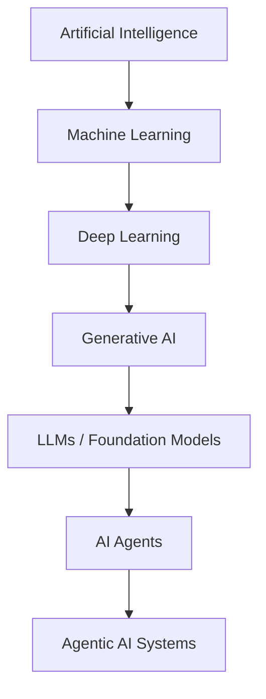

---

## 2. Machine Learning (ML)

- **Definition:** A subfield of AI where systems learn patterns from data instead of being explicitly programmed.
- **Details:** Three paradigms:
  1. **Supervised Learning** — labeled data (spam vs not-spam).
  2. **Unsupervised Learning** — no labels (customer clustering).
  3. **Reinforcement Learning (RL)** — reward-based (game agents).
- **Use Cases:** Credit scoring, recommendation engines, demand forecasting.
- **Example:** A linear regression model predicting house price from square footage.

### Key ML Terms

| Term | Meaning |
|------|---------|
| **Feature** | Input variable |
| **Label** | Output the model predicts |
| **Training** | Learning weights from data |
| **Inference** | Using the trained model to predict |
| **Overfitting** | Memorizing training data, failing on new data |
| **Underfitting** | Model too simple to capture patterns |
| **Bias / Variance** | Systematic error / sensitivity to data |
| **Epoch / Batch** | Full pass / subset of data during training |

---

## 3. Deep Learning (DL)

- **Definition:** ML using multi-layer neural networks that automatically learn hierarchical features.
- **Details:** Dominant since ~2012 (AlexNet). Requires GPUs, large datasets, and backpropagation.
- **Use Cases:** Image recognition, speech-to-text, language translation.
- **Example:** CNN classifying an X-ray as pneumonia vs normal.

### Common Architectures

| Architecture | Best For |
|--------------|----------|
| **CNN** (Convolutional NN) | Images, vision |
| **RNN / LSTM / GRU** | Sequences, time-series |
| **Transformer** | Language, multimodal (dominant today) |
| **GAN** | Generating realistic images |
| **Diffusion Models** | Image / video generation (Stable Diffusion, Sora) |
| **Autoencoder** | Compression, anomaly detection |

---

## 4. Neural Networks & Transformers

### Neural Network

- **Definition:** Layers of neurons (weights + activation functions) that transform input into output.
- **Diagram:**

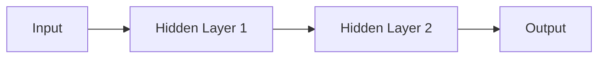

### Transformer (2017 — "Attention Is All You Need")

- **Definition:** Neural architecture based on **self-attention** that processes tokens in parallel.
- **Why it matters:** Foundation of every modern LLM (GPT, Claude, Gemini, LLaMA).
- **Key Concepts:**
  - **Attention** — Each token weighs relevance of every other token.
  - **Multi-Head Attention** — Multiple attention "views" in parallel.
  - **Positional Encoding** — Injects word order.
  - **Encoder / Decoder** — Encoder reads, decoder generates.

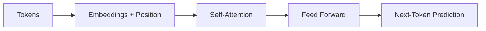

---

## 5. Natural Language Processing (NLP)

- **Definition:** Field of AI that lets computers understand, interpret, and generate human language.
- **Classic tasks:** Tokenization, POS tagging, NER, sentiment analysis, translation, summarization, QA.
- **Modern shift:** Since 2020, LLMs handle nearly all NLP tasks in a single unified model.
- **Example:** ChatGPT summarizing a legal document.

---

## 6. Large Language Models (LLMs)

- **Definition:** Transformer-based models trained on massive text corpora that predict the next token given a context.
- **Details:**
  - Scale: **billions to trillions of parameters**.
  - Emergent abilities: reasoning, coding, translation — without task-specific training.
  - Examples: GPT-4/5, Claude 3.5/4, Gemini 2.x, LLaMA 3, Mistral, DeepSeek, Qwen.
- **Use Cases:** Chatbots, code generation, summarization, agents, semantic search.
- **Example:** Prompt → "Write a Node.js server" → LLM outputs working code.

### Core Inference Parameters

| Parameter | Effect |
|-----------|--------|
| **Temperature** | Randomness (0 = deterministic) |
| **Top-p / Top-k** | Sampling filters |
| **Max Tokens** | Output length limit |
| **Stop Sequences** | End-of-generation markers |
| **Frequency / Presence Penalty** | Reduce repetition |

---

## 7. Foundation Models & Multimodal Models

- **Foundation Model:** A large model pre-trained on broad data, adaptable to many downstream tasks (LLMs, vision models, etc.).
- **Multimodal Model:** Handles text + image + audio + video (GPT-4o, Gemini, Claude 3.5+).
- **Use Cases:** Image + text Q&A, video summarization, voice assistants, robotics perception.
- **Example:** Upload a whiteboard photo → model extracts and refactors the diagram into code.

---

## 8. Generative AI (GenAI)

- **Definition:** AI that **creates new content** — text, images, audio, video, code, 3D — rather than only classifying or predicting.
- **Details:** Powered by LLMs (text/code), diffusion models (images/video), and multimodal transformers.
- **Use Cases:**
  - Text: writing, summarizing, coding
  - Image: Midjourney, DALL·E, Stable Diffusion
  - Audio: ElevenLabs, Suno
  - Video: Sora, Veo, Runway
  - Code: Copilot, Cursor, Claude Code
- **Example:** "Generate a landing page hero section in React + Tailwind" → complete JSX output.

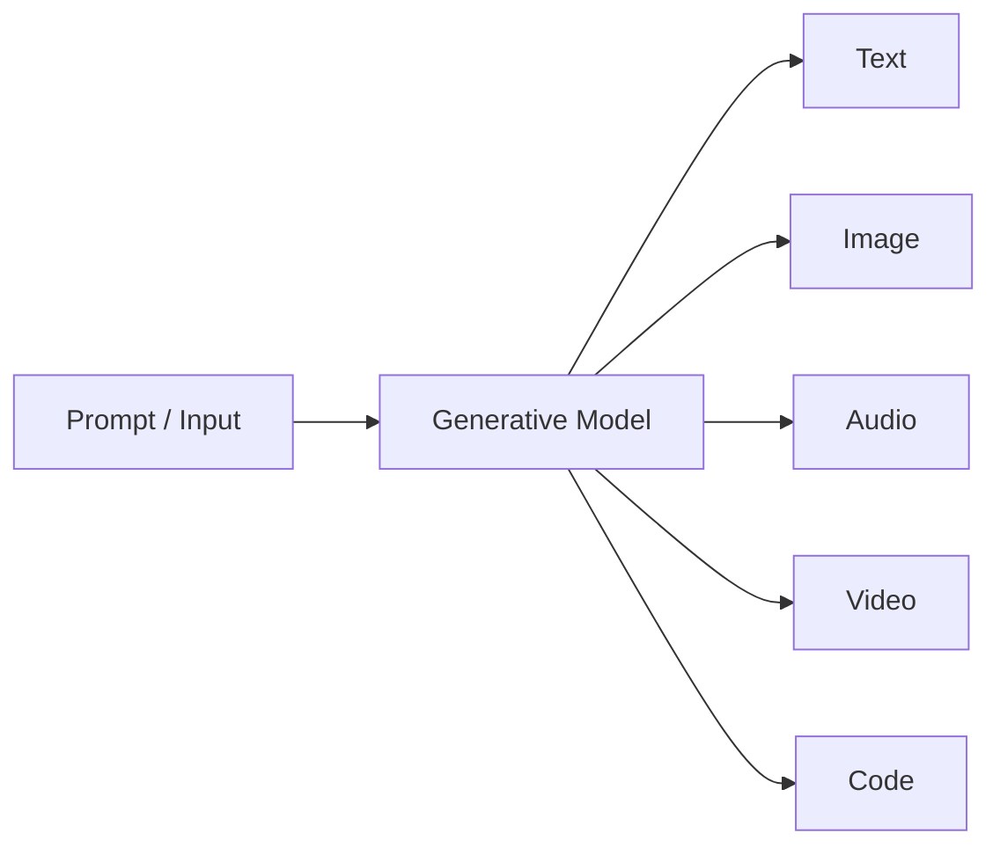

---

## 9. Tokens, Embeddings & Vector Databases

### Token

- Smallest unit an LLM reads/writes (roughly ~4 chars in English). Pricing and context windows are token-based.

### Embedding

- **Definition:** A numerical vector representation of text/image capturing semantic meaning.
- **Example:** "king" − "man" + "woman" ≈ "queen".
- **Use:** Semantic search, clustering, recommendations, RAG.

### Vector Database

- **Definition:** Database optimized to store and search embeddings using similarity (cosine, dot product).
- **Examples:** Pinecone, Weaviate, Milvus, Qdrant, pgvector, Chroma.

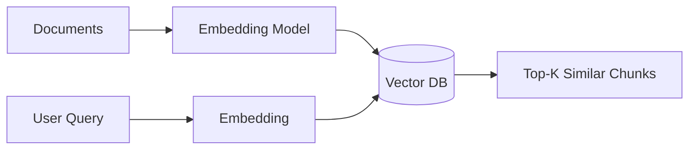

---

## 10. Prompt Engineering

- **Definition:** The craft of writing instructions to reliably steer an LLM toward the desired output.
- **Details:** Prompts include role, task, constraints, examples, and output format.
- **Techniques:**
  - **Zero-shot** — just ask.
  - **Few-shot** — include examples.
  - **Chain-of-Thought (CoT)** — "think step by step".
  - **ReAct** — Reason + Act (agents).
  - **Self-Consistency** — sample multiple CoT paths, vote.
  - **Tree-of-Thoughts (ToT)** — explore reasoning branches.
  - **Role Prompting** — "You are a senior backend engineer…".
- **Example:**

```text
You are a code reviewer. Review the JS function below.
Return JSON: { issues: string[], severity: "low|med|high" }.

Function:
function add(a,b){return a-b}
```

---

## 11. Context Engineering

- **Definition:** The discipline of **designing what goes into the model's context window** — system prompt, user prompt, retrieved docs, tools, memory, examples — to produce reliable output at scale.
- **Why it matters:** Prompt engineering is *how you write*; context engineering is *what you include and how you structure it*.
- **Core levers:**
  1. **System prompt / persona**
  2. **Retrieved knowledge (RAG chunks)**
  3. **Tool schemas & tool results**
  4. **Session memory / long-term memory**
  5. **User instructions & preferences**
  6. **Structured output schemas**
  7. **Compression / summarization to fit context window**
- **Use Cases:** Enterprise assistants, coding agents (Cursor, Copilot, Claude Code), customer-support bots.
- **Example architecture:**

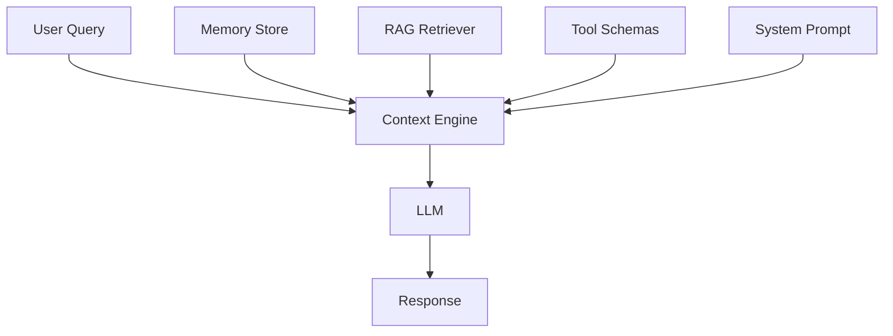

---

## 12. LLM Engineering / LLMOps

- **Definition:** End-to-end engineering discipline of building, deploying, monitoring, and improving LLM-powered products.
- **Scope includes:**
  - Model selection (open vs closed, size vs cost)
  - Prompt + context engineering
  - RAG pipelines
  - Fine-tuning / adapters
  - Evaluation (evals)
  - Guardrails & safety
  - Observability (tracing, logging, cost)
  - Latency / caching / streaming
  - CI/CD for prompts and models
- **Tools:** LangChain, LlamaIndex, LangGraph, LangSmith, Langfuse, Vercel AI SDK, Weights & Biases.

---

## 13. RAG — Retrieval Augmented Generation

- **Definition:** Fetch relevant external knowledge at query-time, inject into the LLM prompt so the model answers with grounded, up-to-date info.
- **Why:** LLMs have stale training data & no private knowledge. RAG fixes both.
- **Flow:**

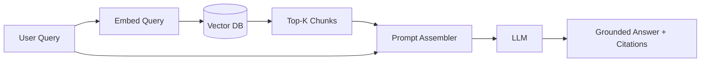

- **Variants:**
  - **Naive RAG** — embed + retrieve + stuff.
  - **Advanced RAG** — hybrid search (BM25 + vector), reranking, query rewriting.
  - **Agentic RAG** — agent decides *when* and *what* to retrieve.
  - **GraphRAG** — retrieval over knowledge graphs.
- **Use Cases:** Internal docs Q&A, legal search, medical assistants, product support.

---

## 14. Fine-tuning, LoRA, PEFT, RLHF, DPO

| Term | Meaning |
|------|---------|
| **Fine-tuning** | Continue training a base model on your data to specialize it. |
| **PEFT** | Parameter-Efficient Fine-Tuning — freeze base weights, train small adapters. |
| **LoRA / QLoRA** | Popular PEFT: inject low-rank matrices; QLoRA adds 4-bit quantization. |
| **Instruction Tuning** | Train model to follow instructions (Alpaca-style). |
| **RLHF** | Reinforcement Learning from Human Feedback — align model to human preference (used by ChatGPT). |
| **DPO** | Direct Preference Optimization — simpler alternative to RLHF. |
| **Distillation** | Train a small model to mimic a big one. |
| **Quantization** | Reduce weight precision (fp16 → int4) to shrink and speed up models. |

**When to fine-tune vs RAG:** RAG for *knowledge*, fine-tuning for *behavior/style/format*.

---

## 15. Function Calling / Tool Use

- **Definition:** LLM returns structured JSON indicating a function to call (with args). The host runs the function and feeds the result back.
- **Why:** Turns LLMs from text generators into **actors** that can query DBs, hit APIs, run code.
- **Example:**

```json
{
  "tool": "get_weather",
  "args": { "city": "Bengaluru" }
}
```

- **Use Cases:** Booking flights, DB queries, sending emails, running shell commands.
- **Foundation of every AI agent.**

---

## 16. AI Agents

- **Definition:** An LLM-powered system that **perceives, reasons, plans, and acts** using tools to achieve a goal, often in multiple steps.
- **Anatomy of an agent:**
  1. **LLM** — the "brain"
  2. **Tools** — APIs, functions, MCP servers
  3. **Memory** — short/long-term
  4. **Planner** — decomposes tasks
  5. **Executor / Loop** — iterates until goal is met
- **Reasoning pattern (ReAct):** *Thought → Action → Observation → Thought → …*
- **Use Cases:** GitHub Copilot Agent, Cursor Agent, Claude Code, Devin, customer-support agents.
- **Example loop:**

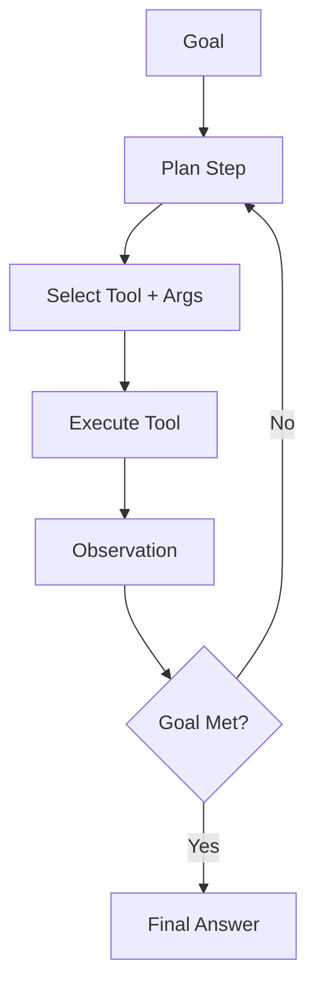

---

## 17. Agentic AI

- **Definition:** A broader paradigm where AI systems exhibit **autonomy, goal-directedness, and long-horizon decision-making** across many tools, environments, and time.
- **Difference from "AI Agent":** An AI agent is a single instance; **Agentic AI** is the *design philosophy* and *system class* — often multi-agent, self-improving, with memory, planning, and initiative.
- **Traits:**
  - Autonomy (acts without step-by-step human prompts)
  - Goal orientation
  - Environment awareness
  - Adaptivity / self-correction
  - Multi-step planning
- **Use Cases:** Autonomous DevOps, research agents, autonomous coding pipelines, agentic RAG, workflow automation.
- **Example:** An agentic system that opens a Jira ticket, writes the code, runs tests, opens a PR, and responds to review comments.

---

## 18. Multi-Agent Systems

- **Definition:** Multiple specialized agents collaborate — planner, coder, reviewer, tester — passing messages to solve complex tasks.
- **Frameworks:** LangGraph, CrewAI, AutoGen, OpenAI Swarm, Semantic Kernel.
- **Patterns:**
  - **Supervisor / Worker** — one orchestrator delegates.
  - **Debate** — agents argue to improve reasoning.
  - **Pipeline** — sequential specialists.
  - **Marketplace** — agents bid for tasks.

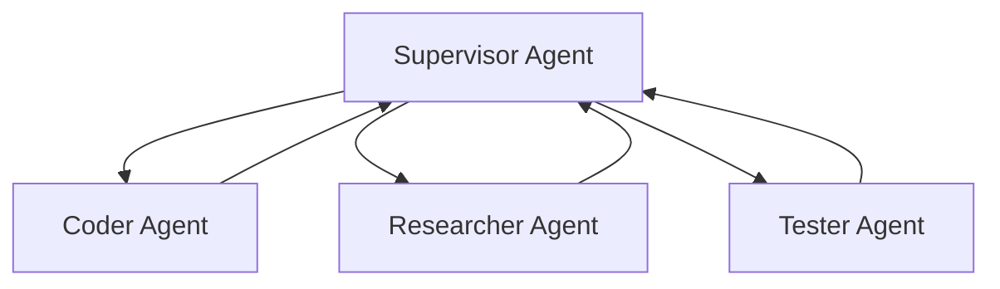

---

## 19. MCP — Model Context Protocol

- **Definition:** An **open protocol** (introduced by Anthropic, 2024) that standardizes how AI apps connect to external tools, data sources, and prompts. Think **"USB-C for AI tools."**
- **Why it matters:** Before MCP, every app built custom tool integrations. MCP makes tools portable across Claude, Copilot, Cursor, etc.
- **Architecture:**
  - **MCP Host** — the AI app (Claude Desktop, VS Code, Cursor)
  - **MCP Client** — lives inside host, talks to servers
  - **MCP Server** — exposes tools/resources/prompts (e.g., GitHub, Postgres, filesystem, medical-equipment-advisor)
- **Primitives exposed by a server:**
  - **Tools** — callable functions
  - **Resources** — readable data (files, DB rows)
  - **Prompts** — reusable prompt templates
- **Transport:** stdio or HTTP+SSE.
- **Use Cases:** Give any LLM secure access to your DB, filesystem, Jira, Slack, custom domain APIs.
- **Example:** A `medical-equipment-advisor` MCP server exposes `search_equipment`, `get_specs`, `compare_models` — Claude Desktop can call them.

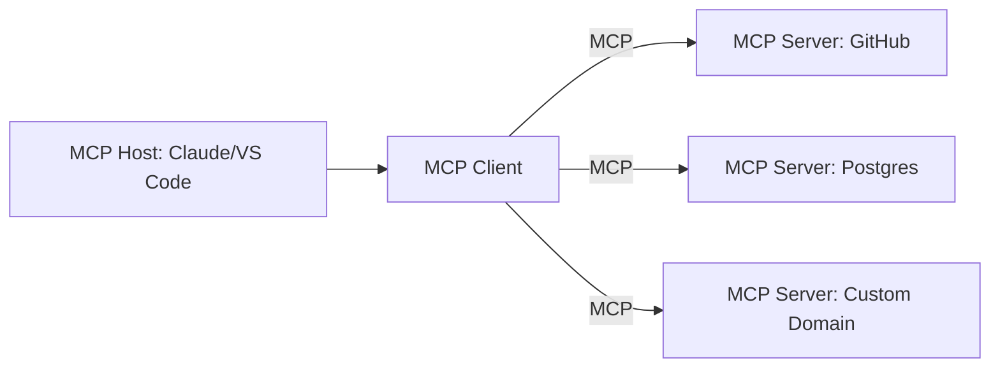

---

## 20. Skills

- **Definition:** Packaged, **domain-specific knowledge + workflows** that an AI agent can invoke on demand. A Skill teaches the agent *how* to do a particular class of task.
- **Details:** A skill typically contains:
  - `SKILL.md` — description, when to use, when *not* to use
  - Steps / heuristics
  - Optional scripts or templates
  - References to tools it needs
- **Difference vs Tool:** A tool is a single callable function; a **skill is a reusable procedure / playbook** that may use many tools.
- **Use Cases (from this workspace):** `agent-customization`, `chronicle`, `project-setup-info-local`, `get-search-view-results`.
- **Example:**

```md
---
name: create-node-service
description: Scaffold a new Node + TS + Express service.
when-to-use: User asks to create a new microservice.
---
Steps:
1. Copy user-services template.
2. Rename package, update env, register routes.
3. Wire Prisma + Redis singletons.
```

---

## 21. Hooks

- **Definition:** Event-driven callbacks that fire at specific lifecycle points in an AI workflow (before/after prompt, before/after tool call, on session start/end, on file edit, etc.).
- **Why:** Let you inject logging, guardrails, telemetry, safety checks, or context enrichment without changing the agent core.
- **Use Cases:**
  - `pre-tool-call` — validate args, block dangerous commands.
  - `post-response` — auto-format, redact PII.
  - `on-session-start` — load memory, prime context.
  - `on-file-change` — auto-run tests.
- **Example (Claude Code style):**

```json
{
  "hooks": {
    "PreToolUse": "scripts/validate-command.sh",
    "PostToolUse": "scripts/log-tool.sh"
  }
}
```

---

## 22. Commands (Slash Commands)

- **Definition:** User-defined shortcuts (`/deploy`, `/review`, `/standup`) that expand into a preconfigured prompt or workflow.
- **Details:** Encapsulate common tasks; may take arguments; often chained with tools/skills.
- **Use Cases:** `/chronicle standup`, `/review pr`, `/scaffold service`, `/fix-lint`.
- **Example:**

```md
---
name: standup
description: Generate daily standup from session history.
---
Read yesterday's sessions and produce: Done / Doing / Blockers.
```

---

## 23. Scripts

- **Definition:** Executable files (shell, Node, Python) invoked by agents, hooks, or commands to perform deterministic work.
- **Why:** Some tasks are more reliable as code than as LLM reasoning (running tests, formatting, git ops, DB migrations).
- **Use Cases:** Pre-commit checks, code generation, deploy scripts, data seeders.
- **Example:** A `scripts/run-tests.mjs` invoked by a `post-edit` hook.

---

## 24. Docs / Instructions / Rules Files

Files that shape agent behavior in a repo. Modern AI IDEs (VS Code Copilot, Cursor, Claude Code) read them automatically.

| File | Purpose |
|------|---------|
| `AGENTS.md` | High-level agent guidance for a repo. |
| `CLAUDE.md` | Claude-specific instructions. |
| `copilot-instructions.md` | GitHub Copilot repo rules. |
| `.instructions.md` (with `applyTo`) | Scoped rules per folder / glob. |
| `.prompt.md` | Reusable prompt templates. |
| `.agent.md` | Custom agent definition. |
| `SKILL.md` | A Skill package. |
| `.cursorrules` | Cursor-specific rules. |

- **Use Case:** Encode conventions once → every AI session follows them automatically.
- **Example:** `nama-yatra.instructions.md` applies to `Node/project/nama-yatra/**` and enforces ESM, Prisma 7, Redis singleton conventions.

---

## 25. Memory Systems

- **Definition:** Mechanisms letting agents remember info across turns and sessions.
- **Types:**
  1. **Short-term / Context** — inside the current context window.
  2. **Session memory** — scoped to the current conversation.
  3. **Long-term / User memory** — persists across sessions (preferences, patterns).
  4. **Repository memory** — codebase-specific facts.
  5. **Episodic memory** — past experiences.
  6. **Semantic memory** — general facts (often via vector DB).
- **Example (this environment):** `/memories/`, `/memories/session/`, `/memories/repo/`.
- **Use Cases:** Personalization, project conventions, avoiding repeated mistakes.

---

## 26. Guardrails, Safety & Alignment

- **Guardrails:** Programmatic checks that constrain LLM I/O (block PII, jailbreaks, unsafe tool calls, off-topic answers).
- **Alignment:** Training/tuning models to follow human values and instructions (RLHF, DPO, Constitutional AI).
- **Common risks:**
  - **Hallucination** — confident wrong answers.
  - **Prompt Injection** — malicious input hijacks the model.
  - **Data Leakage** — model reveals private data.
  - **Jailbreaks** — bypassing safety.
  - **Bias / Toxicity.**
- **Tools:** Guardrails AI, NeMo Guardrails, Llama Guard, OpenAI Moderation, Azure Content Safety.

---

## 27. Evaluation (Evals) & Observability

- **Evals:** Systematic tests measuring LLM/agent quality (accuracy, factuality, format compliance, tool-use success, latency, cost).
- **Types:**
  - **Reference-based** — compare to ground truth.
  - **LLM-as-Judge** — another LLM scores output.
  - **Human-in-the-loop.**
  - **Trajectory evals** — for agents (was the tool sequence correct?).
- **Observability:** Tracing every prompt, tool call, token usage, latency, and error.
- **Tools:** LangSmith, Langfuse, Braintrust, Arize Phoenix, Helicone, Weights & Biases.

---

## 28. Copilots vs Agents vs Assistants

| Term | Role | Autonomy |
|------|------|----------|
| **Chatbot** | Q&A within a conversation | None |
| **Assistant** | Helps with tasks, may use tools | Low |
| **Copilot** | Suggests/edits in your workflow (code, docs) | Medium — human accepts |
| **Agent** | Plans & executes multi-step tasks autonomously | High |
| **Agentic System** | Multiple agents, long horizon, self-directed | Very High |

---

## 29. AI Workflow Orchestration

- **Definition:** Frameworks that let you compose LLM calls, tools, retrievers, and agents into reliable graphs / pipelines.
- **Popular frameworks:**
  - **LangChain** — general LLM app framework.
  - **LangGraph** — stateful graph-based agent orchestration.
  - **LlamaIndex** — data/RAG-focused.
  - **CrewAI / AutoGen** — multi-agent.
  - **Semantic Kernel** (Microsoft) — plugins + planners.
  - **Vercel AI SDK** — streaming UIs, tool calling.
  - **n8n / Zapier AI** — no-code AI workflows.
- **Use Cases:** Enterprise pipelines, agentic apps, RAG chatbots.

---

## 30. Emerging & Miscellaneous Terminology

| Term | Meaning |
|------|---------|
| **Context Window** | Max tokens the model can read+write at once. |
| **Grounding** | Anchoring answers in retrieved / verified facts. |
| **Hallucination** | Model fabricates plausible-sounding wrong info. |
| **Zero-shot / Few-shot** | Learning tasks from 0 or few examples in prompt. |
| **Chain-of-Thought (CoT)** | Step-by-step reasoning. |
| **ReAct** | Reason + Act loop for agents. |
| **Reflexion** | Agent critiques and revises its own output. |
| **Self-Refine** | Iterative self-improvement. |
| **Toolformer** | Model that learns when to call tools. |
| **World Model** | Internal simulation of environment. |
| **Reasoning Model** | LLM tuned for long CoT (o1, o3, DeepSeek-R1, Claude Thinking). |
| **Mixture of Experts (MoE)** | Only a subset of parameters activate per token (Mixtral, DeepSeek). |
| **Speculative Decoding** | Speedup: small model drafts, big model verifies. |
| **KV Cache** | Cached attention keys/values for faster generation. |
| **Streaming** | Tokens sent to client as they're generated. |
| **Structured Output** | JSON / schema-constrained generation. |
| **JSON Mode / Function Calling** | Guaranteed structured responses. |
| **Guardrails** | Runtime safety constraints. |
| **Sandbox** | Isolated env where agent tools run safely. |
| **Human-in-the-Loop (HITL)** | Human approves critical steps. |
| **Prompt Injection** | Attack via untrusted input. |
| **Jailbreak** | Bypass safety instructions. |
| **Red Teaming** | Adversarial testing of AI systems. |
| **Alignment** | Making AI follow human intent/values. |
| **Constitutional AI** | Anthropic's method: model critiques itself using a "constitution." |
| **Emergent Abilities** | Capabilities that appear only at scale. |
| **Scaling Laws** | Performance ~ predictable function of data/params/compute. |
| **Distillation** | Small model learns from big teacher. |
| **Quantization** | Lower-precision weights for efficiency. |
| **Inference Server** | Runtime that serves models (vLLM, TGI, Ollama, LM Studio). |
| **Edge AI / On-device AI** | Running models locally (phone, browser). |
| **Federated Learning** | Training across devices without centralizing data. |
| **Synthetic Data** | Model-generated training data. |
| **Data Flywheel** | Product usage → data → better model → better product. |
| **AutoML** | Automated model selection & tuning. |
| **Explainable AI (XAI)** | Making model decisions interpretable. |
| **Responsible AI** | Fairness, accountability, transparency, privacy. |
| **AI Governance** | Policies and controls over AI usage. |
| **Model Card** | Doc describing a model's intended use, limits, risks. |
| **System Card** | Doc describing a deployed AI system. |
| **Foundation Model** | Broadly-trained adaptable model (LLMs, vision, multimodal). |
| **SLM (Small Language Model)** | Compact model (Phi, Gemma) for edge/private use. |
| **VLM (Vision-Language Model)** | Handles image + text (GPT-4o, Gemini, Claude). |
| **VLA (Vision-Language-Action)** | Robotics: perceive + reason + act. |
| **Diffusion Model** | Generative model that denoises noise into data (images/video). |
| **Latent Space** | Compressed vector space where models operate. |
| **Rerankers** | Re-score retrieved chunks for better RAG. |
| **Hybrid Search** | Combine keyword (BM25) + vector search. |
| **GraphRAG** | RAG over a knowledge graph. |
| **Agentic RAG** | Agent decides when/what to retrieve. |
| **Long-Context Model** | Handles 200k–2M+ token contexts (Gemini, Claude). |
| **RAG-Fusion** | Multi-query retrieval + fusion of results. |
| **Chunking** | Splitting docs before embedding. |
| **Semantic Cache** | Cache LLM responses keyed by embedding similarity. |
| **Prompt Cache** | Reuse KV cache of repeated prompt prefixes. |
| **Tokenization** | Splitting text into tokens (BPE, SentencePiece). |
| **BPE / WordPiece** | Common tokenizer algorithms. |
| **Attention** | Weighted focus over context. |
| **Self-Attention** | Tokens attend to other tokens in same sequence. |
| **Cross-Attention** | Decoder attends to encoder outputs. |
| **Positional Encoding** | Adds order info to tokens. |
| **Rotary Embeddings (RoPE)** | Modern positional scheme (LLaMA, GPT-NeoX). |
| **Flash Attention** | Faster memory-efficient attention. |
| **Backpropagation** | Gradient-based training algorithm. |
| **Loss Function** | Measures prediction error. |
| **Gradient Descent / Adam** | Optimizers. |
| **Overfitting / Regularization / Dropout** | Generalization techniques. |
| **Transfer Learning** | Reuse pre-trained weights for new tasks. |
| **Continual Learning** | Learn new tasks without forgetting old ones. |
| **Reinforcement Learning (RL)** | Learn via rewards. |
| **RLAIF** | RL from AI feedback. |
| **DPO / ORPO / KTO** | Preference-optimization alternatives to RLHF. |

---

## 31. Master Timeline / Evolution

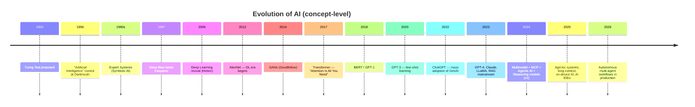

---

## Quick Mental Model — How It All Fits

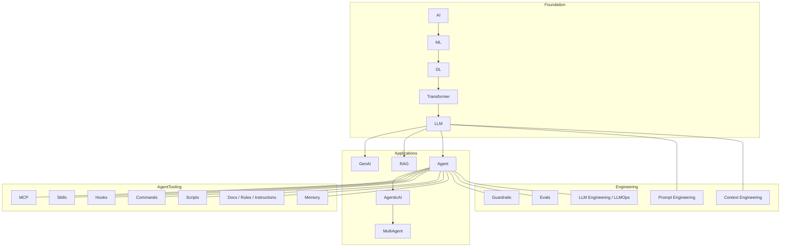

---

### TL;DR

- **AI → ML → DL → Transformers → LLMs → GenAI → Agents → Agentic AI** is the capability ladder.
- **Prompt Engineering** = how you ask. **Context Engineering** = what you put in the window. **LLM Engineering** = productionizing it all.
- **RAG** grounds answers, **Fine-tuning** shapes behavior, **Function Calling** enables action.
- **MCP** standardizes tool access. **Skills** package know-how. **Hooks / Commands / Scripts / Docs** shape agent behavior in your repo.
- **Guardrails + Evals + Observability** are what turn a demo into a product.
