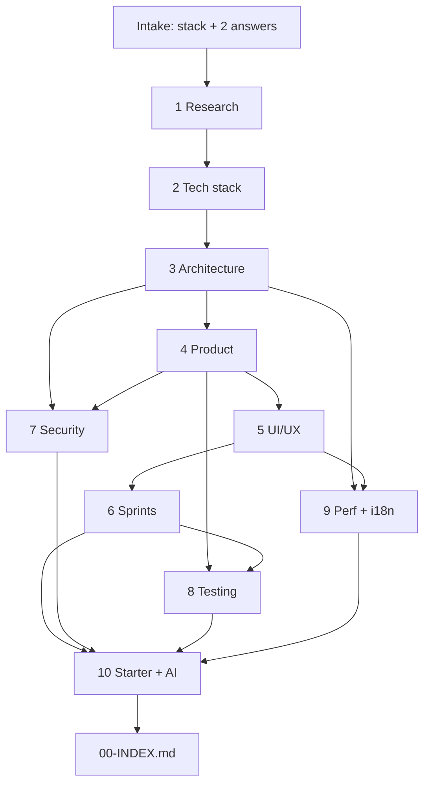

# FrontendForge — Pipeline

> The 10-phase pipeline: inputs, the agent + skill used, the deliverable produced, and the gate that must pass before moving on.

---

## Phase table

| # | Phase | Agent | Skill | Depends on | Deliverable | Gate |
|---|-------|-------|-------|------------|-------------|------|
| 0 | Intake | `00-orchestrator` | — | user input | inputs + scaffold | 2 questions answered |
| 1 | Research | `02-project-researcher` | frontend-architecture | intake | `01-Project-Research.md` | concept matrix covers basic→advanced |
| 2 | Tech stack | `01-techstack-architect` | frontend-architecture | 1 | `02-Tech-Stack.md` | no excluded/unnamed framework |
| 3 | Architecture | `03-architecture-designer` | frontend-architecture | 1,2 | `03-Architecture.md` | ≥3 diagrams + folder tree |
| 4 | Product | `04-product-planner` | ui-ux-design-system | 1,3 | `04-Product-Spec.md` | sitemap + ≥3 flows |
| 5 | UI/UX | `05-uiux-designer` | ui-ux-design-system | 4 | `05-UIUX-Design.md` | token block + a11y checklist |
| 6 | Sprints | `06-agile-sprint-planner` | agile-breakdown | 3,4,5 | `06-Delivery-Plan.md` | tasks ≤ 5h + worked LLD |
| 7 | Security | `07-security-auth-architect` | security-auth | 3,4 | `07-Security-Auth.md` | auth diagram + CSP |
| 8 | Testing | `08-testing-strategist` | testing-strategy | 4,6 | `08-Testing-Strategy.md` | ≥90% threshold config |
| 9 | Perf + i18n | `09-performance-i18n-engineer` | web-performance-i18n | 3,5 | `09-Performance.md`, `10-Internationalization.md` | CWV budget + locale plan |
| 10 | Starter + AI | `10-starter-template-generator` | ai-streaming-features | all | `11-Coding-Standards.md`, `12-Starter-Template.md`, `13-AI-Features.md` | working steps + SSE diagram |

---

## Flow

---

## Gate enforcement
Each phase is wrapped by the hooks in [../Hooks/hooks.md](../Hooks/hooks.md):
`pre-phase/load-context` → phase writes doc → `post-phase/validate-doc`.
After Phase 10: `post-run/consistency-check` → `post-run/validate-plan`.

## Requirement traceability

| User requirement | Covered by |
|------------------|-----------|
| 1. Deep research → project | Phase 1 |
| 2. Frameworks + packages | Phase 2 |
| 3. Architecture + diagram | Phase 3 |
| 4. Project details + workflow | Phase 4 |
| 5. UI/UX (color, font…) | Phase 5 |
| 6. Sprint breakdown (5h/day) | Phase 6 |
| 7. Security + auth | Phase 7 |
| 8. 90%+ unit + E2E | Phase 8 |
| 9. Core Web Vitals | Phase 9 |
| 10. Multi-language | Phase 9 (i18n) |
| 11. Coding standards | Phase 10 |
| 12. Starter template steps | Phase 10 |
| 13. All info in MD files | Output rules |
| 14. Plan properly | Whole pipeline |
| 15. No default Next.js | Tech-stack constraint |
| 16. AI streaming events | Phase 10 |
