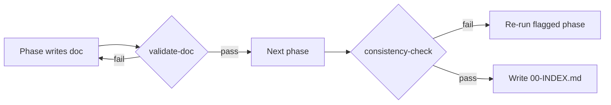

# FrontendForge — Lifecycle Hooks

> Hooks are quality gates the orchestrator runs around each pipeline phase. They keep deliverables consistent and complete. Each hook lists its trigger, action, and pass condition.

---

## Pre-run

### `pre-run/collect-inputs`
- **Trigger:** before Phase 1.
- **Action:** confirm tech stack; ask the 2 questions (architecture, exclusions); derive `<ProjectName>`.
- **Pass when:** stack, architecture, exclusions, and project name are all set.

### `pre-run/scaffold`
- **Trigger:** after inputs collected.
- **Action:** run `Scripts/scaffold-output.ps1 -ProjectName <name>`.
- **Pass when:** output folder + 14 empty deliverable files exist.

---

## Per-phase

### `pre-phase/load-context`
- **Trigger:** before each phase.
- **Action:** load the phase agent + its skill + the prior deliverables it depends on (see `Docs/PIPELINE.md` dependency graph).
- **Pass when:** all declared dependency files exist and are non-empty.

### `post-phase/validate-doc`
- **Trigger:** after each phase writes its file.
- **Action:** verify the file follows `Docs/OUTPUT-TEMPLATE.md` (title, TOC if needed, Mermaid diagrams, checklist, next-pointer) and references the finalized stack.
- **Pass when:** structure valid, non-empty, no excluded framework mentioned.
- **On fail:** re-run the phase with the specific gap noted.

---

## Post-run

### `post-run/consistency-check`
- **Trigger:** after Phase 10.
- **Action:** cross-check stack/terminology consistency across all files; confirm coverage ≥ 90% target, CWV budget, i18n, security diagram, AI streaming diagram, tasks ≤ 5h.
- **Pass when:** all completeness gates in `Rules/output-structure.instructions.md` are true.

### `post-run/validate-plan`
- **Trigger:** final.
- **Action:** run `Scripts/validate-plan.ps1`; write `00-INDEX.md`.
- **Pass when:** 14/14 deliverables present and non-empty.

---

## Gate summary

