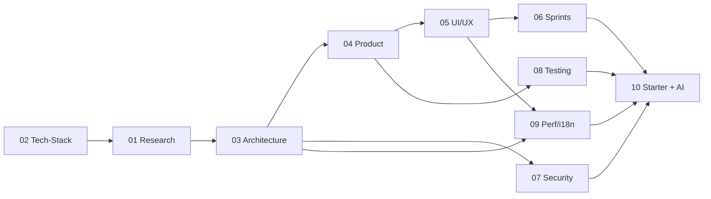

# FrontendForge — MANIFEST (Component Index)

> Complete index of every component in the system and how they connect. Load this first when you need to understand or extend the system.

---

## 1. Agents (`Agents/`)

| File | Role | Consumes (Skills) | Produces |
|------|------|-------------------|----------|
| `00-orchestrator.agent.md` | Entry point. Collects stack, asks 2 questions, runs the pipeline, writes `00-INDEX.md`. | all | orchestration |
| `01-techstack-architect.agent.md` | Recommends latest industry-standard frameworks/packages + proposes architectures. | frontend-architecture | `02-Tech-Stack.md` |
| `02-project-researcher.agent.md` | Deep research to pick a project that covers basic→advanced concepts. | frontend-architecture | `01-Project-Research.md` |
| `03-architecture-designer.agent.md` | System/module/data-flow diagrams. | frontend-architecture | `03-Architecture.md` |
| `04-product-planner.agent.md` | **PO + Product Planner.** PO brief (vision, OKRs, personas, MoSCoW, roadmap, pricing, glossary) + features, pages, flows, requirements. | product-management, ui-ux-design-system | `04-Product-Spec.md` |
| `05-uiux-designer.agent.md` | IA, color, typography, spacing, tokens, components. | ui-ux-design-system | `05-UIUX-Design.md` |
| `05b-uiux-static-reference.agent.md` | Auto-generates a static HTML/Tailwind reference site (`<Project>/UIUX/`) from the tokens + screens. | static-ui-reference | `<Project>/UIUX/` folder |
| `06-agile-sprint-planner.agent.md` | Epic→Feature→Story→Task, LLD, 5 hrs/day cadence. | agile-breakdown | `06-Delivery-Plan.md` |
| `07-security-auth-architect.agent.md` | AuthN/AuthZ, OWASP, session/token strategy. | security-auth | `07-Security-Auth.md` |
| `08-testing-strategist.agent.md` | Unit + integration + E2E, 90%+ coverage plan. | testing-strategy | `08-Testing-Strategy.md` |
| `09-performance-i18n-engineer.agent.md` | Core Web Vitals budget + multi-language plan. | web-performance-i18n | `09-Performance.md`, `10-Internationalization.md` |
| `10-starter-template-generator.agent.md` | Step-by-step starter template + AI streaming feature. | ai-streaming-features | `11-Coding-Standards.md`, `12-Starter-Template.md`, `13-AI-Features.md` |

---

## 2. Skills (`Skills/`)

| Skill | Purpose |
|-------|---------|
| `frontend-architecture/SKILL.md` | Full pattern ladder (Static Page, MVC, SPA, BFF, Modular Monolith, MFE), rendering strategies, platform context (API Gateway, Load Balancing, Docker/K8s, CDN, Monorepo), cross-MFE concerns, state topology. |
| `product-management/SKILL.md` | PO brief: vision, problem, market, OKRs/KPIs, personas (JTBD), business rules, MoSCoW, roadmap, risks, pricing, glossary. |
| `ui-ux-design-system/SKILL.md` | Design tokens, color systems, type scales, spacing, accessibility, component taxonomy, **Design-to-Code & MCP**. |
| `static-ui-reference/SKILL.md` | Framework-free static reference site (plain HTML + Tailwind CDN + shared CSS tokens + shared JS). |
| `agile-breakdown/SKILL.md` | Epic/Feature/Story/Task decomposition, estimation, INVEST, 5-hr/day slicing. |
| `security-auth/SKILL.md` | OWASP Top 10 (frontend), auth flows (OIDC/OAuth2/JWT/session), token storage, CSP. |
| `testing-strategy/SKILL.md` | Test pyramid, coverage strategy, unit/integration/E2E tooling, mocking, CI gates. |
| `web-performance-i18n/SKILL.md` | Core Web Vitals, CRP, critical CSS, HTTP caching, content negotiation, windowing, code splitting, and i18n/l10n patterns. |
| `ai-streaming-features/SKILL.md` | SSE/WebSocket streaming, generative UI, **MCP UI**, token streaming UX, guardrails. |

---

## 3. Commands (`Commands/`) — slash prompts

| Command | Runs |
|---------|------|
| `/forge-init` | Full pipeline from a tech-stack input. |
| `/forge-research` | Phase 1 only — project research. |
| `/forge-techstack` | Phase 2 only — frameworks + packages. |
| `/forge-architecture` | Phase 3 only — architecture + diagrams. |
| `/forge-product` | Phase 4 only — product spec. |
| `/forge-uiux` | Phase 5 only — UI/UX. |
| `/forge-uiux-static` | Phase 5b only — generate the `<Project>/UIUX/` static reference site. |
| `/forge-sprints` | Phase 6 only — sprint breakdown. |
| `/forge-security` | Phase 7 only — security & auth. |
| `/forge-testing` | Phase 8 only — testing strategy. |
| `/forge-perf-i18n` | Phase 9 only — performance + i18n. |
| `/forge-starter` | Phase 10 only — starter template + AI features. |

---

## 4. Rules (`Rules/`) — instructions

| File | applyTo |
|------|---------|
| `coding-standards.instructions.md` | Generated project source files. |
| `output-structure.instructions.md` | The generated Markdown deliverables. |

---

## 5. Hooks (`Hooks/`)

| Hook | Trigger |
|------|---------|
| `hooks.md` | Defines pre-phase and post-phase lifecycle events (validation, gate checks). |

---

## 6. Scripts (`Scripts/`)

| Script | Purpose |
|--------|---------|
| `scaffold-output.ps1` | Creates the output folder + empty deliverable files for a new project run. |
| `validate-plan.ps1` | Verifies all 14 deliverables exist and are non-empty; reports coverage gaps. |

---

## 7. Docs (`Docs/`)

| Doc | Purpose |
|-----|---------|
| `ACTIVATION-GUIDE.md` | Step-by-step activation and worked example. |
| `PIPELINE.md` | Detailed phase-by-phase pipeline with inputs/outputs and gates. |
| `OUTPUT-TEMPLATE.md` | The canonical structure every generated deliverable must follow. |

---

## Pipeline dependency graph

