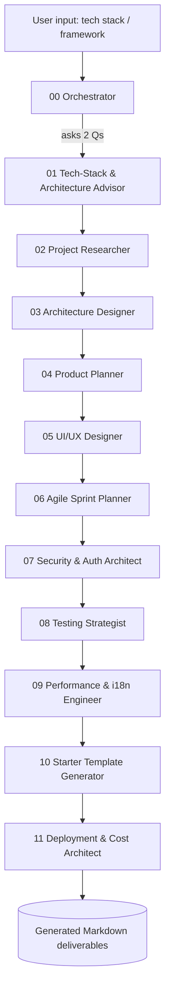

# FrontendForge — Production-Grade Frontend Project Builder (AI Agent System)

> An orchestrated set of **AI Agents, Skills, Commands, Rules, Hooks, Scripts, and Docs** that turns a single input (**your tech stack / framework**) into a complete, production-grade frontend project plan and starter template.
>
> **You provide:** a tech stack or major framework (e.g., *"React + TypeScript + Micro-Frontend"*).
> **The system provides:** everything else — after asking you only about the **architecture** you want (and which frameworks to avoid).

---

## 🎯 What this system produces

For any tech stack you give it, FrontendForge generates a full documentation set (all in Markdown, minimal chat noise):

| # | Deliverable | Output file(s) |
|---|-------------|----------------|
| 1 | Deep research → chosen project (basic → advanced coverage) | `01-Project-Research.md` |
| 2 | Finalized frameworks + packages | `02-Tech-Stack.md` |
| 3 | Architecture + diagrams | `03-Architecture.md` |
| 4 | Project description, features, pages, workflow, diagrams | `04-Product-Spec.md` |
| 5 | UI/UX — information architecture, color, typography, tokens | `05-UIUX-Design.md` |
| 5b | **Static UI/UX reference site** (browsable HTML/Tailwind/CSS/JS prototype) | `<Project>/UIUX/` folder |
| 6 | Sprint breakdown — Epic → Feature → Story → Task (5 hrs/day) | `06-Delivery-Plan.md` |
| 7 | Security & Auth | `07-Security-Auth.md` |
| 8 | Testing strategy (90%+ unit + E2E) | `08-Testing-Strategy.md` |
| 9 | Core Web Vitals & performance budget | `09-Performance.md` |
| 10 | Multi-language / i18n | `10-Internationalization.md` |
| 11 | Coding standards | `11-Coding-Standards.md` |
| 12 | Starter template steps | `12-Starter-Template.md` |
| 13 | AI features (streaming events, generative UI) | `13-AI-Features.md` |
| 14 | Cost-optimized production deployment guide | `14-Production-Deployment.md` |
| — | Master index of the generated project | `00-INDEX.md` |

> **Rule 16 honored:** AI features (e.g., streaming events / SSE) are baked into every generated plan.
> **Rule 15 honored:** No default assumption of Next.js — the tech stack is always driven by *your* input.

---

## 🧩 System Layout

```
AI/FrontendForge/
├── README.md                     ← you are here
├── MANIFEST.md                   ← index of every component + pipeline map
├── Agents/                       ← 1 orchestrator + 11 specialist agents
├── Skills/                       ← reusable domain knowledge packs
├── Commands/                     ← slash-command prompts to run each phase
├── Rules/                        ← coding standards + output structure (instructions)
├── Hooks/                        ← lifecycle hooks (pre/post phase validation)
├── Scripts/                      ← PowerShell helpers to scaffold + validate output
└── Docs/                         ← activation guide, pipeline, output templates
```

---

## 🚀 How to Activate (30-second version)

1. In chat, run the init command with your stack (the `/forge-*` commands are wired into `.github/prompts/`):

   ```
   /forge-init React + TypeScript + Micro-Frontend
   ```

   …or pick the **FrontendForge** agent from the agent picker (wired into `.github/agents/`).
2. The orchestrator asks you **2 questions only**:
   - Which **architecture** do you want? (it proposes options)
   - Which **frameworks/tools should it NOT use**?
3. It then runs the full pipeline (research → tech → architecture → spec → UI/UX → sprints → security → testing → performance → i18n → standards → starter → AI features → production deployment) and writes all Markdown deliverables.

Full details: [Docs/ACTIVATION-GUIDE.md](Docs/ACTIVATION-GUIDE.md).

### Discovery layer (`.github/`) vs canonical package (`AI/FrontendForge/`)

| Location | Contains | Role |
|----------|----------|------|
| `.github/prompts/forge-*.prompt.md` | 12 thin pointer prompts | Make `/forge-*` slash commands discoverable |
| `.github/agents/frontendforge.agent.md` | 1 orchestrator pointer | Makes the agent selectable in the picker |
| `AI/FrontendForge/**` | agents, skills, rules, hooks, scripts, docs | **Canonical source — edit here** |

The `.github/` files only *point at* this package, so there is no meaningful drift: change behavior by editing `AI/FrontendForge/`. `Rules/` stays **opt-in** (not copied into `.github/instructions/`) so it never auto-applies to unrelated files in this workspace.

---

## ⚙️ Execution model & limitations (read once)

- The `Agents/*.agent.md` files are **personas the model adopts per phase**, plus the skills/rules it loads — not a self-running daemon. Chaining happens because the orchestrator runs phases in order (or dispatches them as subagents when a subagent tool is available).
- The files in `Rules/` are **opt-in**. VS Code only auto-applies instruction files placed in `.github/instructions/`; here they are referenced deliberately by the agents. Copy them into `.github/instructions/` only if you want them enforced automatically.
- `Hooks/hooks.md` describes **agent-executed quality gates** (checks the model performs), not OS/git hooks.
- The `Scripts/*.ps1` are the only truly executable pieces (scaffold + validate).

---

## 🔄 Pipeline at a glance



---

## 👤 Intended user

A **senior frontend developer (6+ years)** who wants to build a **full production-grade web application** covering every concept from basic to advanced, planned down to **5-hour daily tasks**, with **90%+ test coverage**, strong **security/auth**, **Core Web Vitals** budgets, **i18n**, industry **coding standards**, and **AI streaming features**.

See [MANIFEST.md](MANIFEST.md) for the complete component index.
