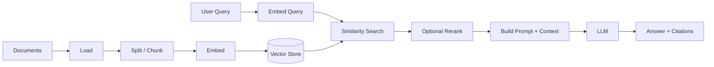
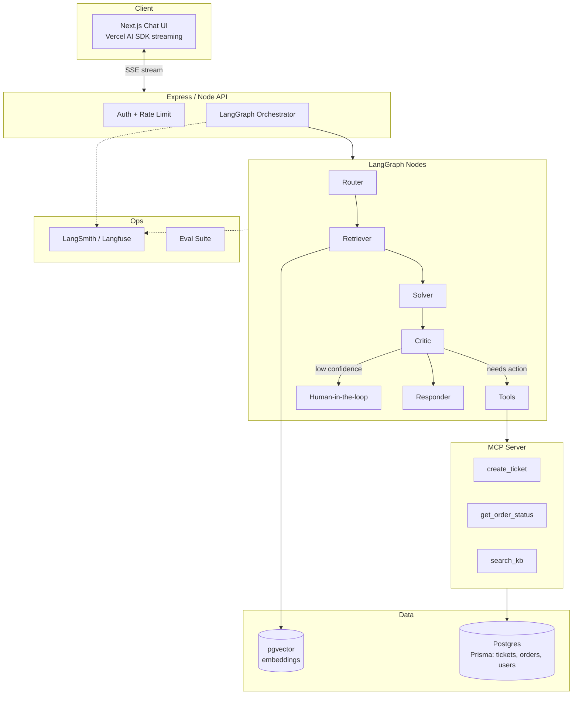

# Generative AI & Agentic AI with JavaScript — Complete Roadmap & Production Project Guide

> **Goal:** Become a job-ready **Full-Stack AI Engineer** who can design, build, and ship **real-world AI agents** using **JavaScript / TypeScript, Node.js, Express, LangChain, LangGraph, RAG, and MCP servers**.
>
> **Who this is for:** Web full-stack developers (React/Next.js + Node) who want to transition into the highest-paying, fastest-growing niche in 2026 — **Agentic AI Engineering**.
>
> **Format:** A phased roadmap (fundamentals → advanced → production) plus a **capstone production-grade project** you can put on your resume and demo in interviews.

---

## Table of Contents

1. [Why This Path (Career & Market Context)](#1-why-this-path)
2. [Prerequisites & Skill Baseline](#2-prerequisites)
3. [Core Mental Models You Must Understand](#3-core-mental-models)
4. [The Full Roadmap (Phase 0 → Phase 8)](#4-the-full-roadmap)
5. [Deep Dive: LangChain.js](#5-deep-dive-langchainjs)
6. [Deep Dive: RAG (Retrieval-Augmented Generation)](#6-deep-dive-rag)
7. [Deep Dive: LangGraph.js (Agentic Orchestration)](#7-deep-dive-langgraphjs)
8. [Deep Dive: MCP (Model Context Protocol) Servers](#8-deep-dive-mcp-servers)
9. [Capstone: Production-Grade Project — "InsightDesk AI"](#9-capstone-project-insightdesk-ai)
10. [Production Concerns (Security, Cost, Observability, Eval)](#10-production-concerns)
11. [Interview Preparation & Portfolio](#11-interview-prep--portfolio)
12. [Curated Resources](#12-curated-resources)
13. [12-Week Study Plan (Actionable)](#13-12-week-study-plan)

---

## 1. Why This Path

**Agentic AI** is the biggest shift in software since mobile. Companies no longer just want "ChatGPT wrappers" — they want engineers who can build **autonomous, tool-using, memory-having agents** that plug into real business systems.

### Market reality (2026)
- **Demand > Supply:** Most AI courses are Python-first. JS/TS full-stack engineers who can also do AI agents are rare and command premium salaries.
- **You already have leverage:** As a web dev you know APIs, auth, databases, deployment, and UI — the exact skills needed to ship AI products, not just notebooks.
- **The stack is converging:** `LangChain.js`, `LangGraph.js`, `Vercel AI SDK`, and **MCP** (an open standard from Anthropic, now adopted industry-wide) are all JavaScript/TypeScript-first.

### Job titles this unlocks
- AI Engineer / Applied AI Engineer
- Full-Stack AI Engineer
- Agentic AI Engineer
- LLM Application Developer
- Forward-Deployed AI Engineer

---

## 2. Prerequisites

You should be comfortable with these before starting. If not, close the gap first.

| Area | Minimum Level | Where in this repo |
|------|--------------|--------------------|
| JavaScript (ES6+, async/await, promises) | Strong | `JavaScript/` |
| TypeScript (generics, types, interfaces) | Intermediate | `TypeScript/TypeScript-Complete-Guide.md` |
| Node.js + Express | Intermediate | `Node/NodeJS-Production-Backend-Guide.md` |
| REST APIs & HTTP | Strong | — |
| Databases (SQL + a vector DB concept) | Basic → Intermediate | `DateBase/` |
| React / Next.js (for the UI) | Intermediate | `Next/`, `React/` |
| Git & basic DevOps (Docker) | Basic | `Docker/` |

**Non-negotiable:** Understand `async` streaming, error handling, and environment variable/secret management. LLM apps are I/O-heavy and streaming-heavy.

---

## 3. Core Mental Models

Before touching frameworks, internalize these concepts. Frameworks change; concepts don't.

### 3.1 The LLM is a stateless function
```
output_text = LLM(prompt, params)
```
It has **no memory**, **no tools**, and **no knowledge past its training cutoff** unless *you* provide them. Everything else (memory, RAG, tools, agents) is engineering *around* this stateless function.

### 3.2 Tokens, context window, and cost
- Input + output are measured in **tokens** (~4 chars ≈ 1 token).
- The **context window** is the max tokens per call. Bigger context ≠ free — you pay per token and latency grows.
- **Golden rule:** Put *only the relevant* context in the prompt. This is why RAG exists.

### 3.3 Prompt → Completion → Structured Output
Modern apps rarely want free text. You want **structured JSON** you can trust. Learn:
- System vs. User vs. Assistant vs. Tool messages
- **Structured output / function calling / tool calling**
- Schema validation with **Zod** (the TS-native way)

### 3.4 The Agent Loop
An **agent** is an LLM in a loop that can decide to call **tools**:
```
while not done:
    thought   = LLM decides what to do
    action    = call a tool (search, DB query, API, code)
    observation = tool result
    feed observation back into LLM
```
This loop is what **LangGraph** helps you orchestrate reliably.

### 3.5 RAG in one sentence
> Retrieve relevant chunks of *your* data from a vector store, stuff them into the prompt, and let the LLM answer grounded in facts (reducing hallucination).

---

## 4. The Full Roadmap

Each phase has: **what to learn**, **what to build**, and **done-when** criteria.

### Phase 0 — Environment & First API Call
- **Learn:** Node + TS project setup, `dotenv`, calling an LLM provider (OpenAI / Anthropic / Google / local via Ollama).
- **Build:** A CLI script that sends a prompt and streams the response to the terminal.
- **Done when:** You can stream tokens and handle API errors/retries.

### Phase 1 — Prompting & Structured Output
- **Learn:** System prompts, few-shot prompting, temperature, **Zod schemas**, tool/function calling, JSON mode.
- **Build:** A "resume → structured JSON" extractor that always returns valid schema.
- **Done when:** Output is 100% schema-valid via Zod parsing + retries.

### Phase 2 — LangChain.js Fundamentals
- **Learn:** `ChatModels`, `PromptTemplates`, `OutputParsers`, **LCEL** (LangChain Expression Language / `.pipe()`), Runnables, streaming.
- **Build:** A composable summarization + translation chain.
- **Done when:** You can compose 3+ steps with LCEL and stream the final output.

### Phase 3 — Embeddings & Vector Stores
- **Learn:** Embeddings, similarity search, chunking strategies, vector DBs (**pgvector**, Pinecone, Qdrant, Chroma).
- **Build:** Ingest a PDF/markdown folder → embed → store → semantic search CLI.
- **Done when:** You can query "what does the doc say about X?" and get relevant chunks.

### Phase 4 — RAG Pipeline
- **Learn:** Full RAG: load → split → embed → retrieve → rerank → generate with citations.
- **Build:** "Chat with your docs" over this very `StudyNote` repo.
- **Done when:** Answers cite sources and refuse when context is missing.

### Phase 5 — Tools & Single Agents
- **Learn:** Tool definitions (Zod), tool calling, ReAct pattern, LangChain agents.
- **Build:** An agent with tools: web search, calculator, and a custom DB-query tool.
- **Done when:** The agent correctly chooses and chains tools.

### Phase 6 — LangGraph.js (Multi-Step / Multi-Agent)
- **Learn:** Graphs, nodes, edges, **state**, conditional edges, cycles, **human-in-the-loop**, checkpointing/persistence, streaming graph events.
- **Build:** A supervisor agent routing to specialist sub-agents (researcher, writer, critic).
- **Done when:** The graph handles branching, retries, and persists state between runs.

### Phase 7 — MCP Servers
- **Learn:** Model Context Protocol — building **MCP servers** (tools/resources/prompts) and **MCP clients**; transport (stdio, HTTP/SSE).
- **Build:** An MCP server exposing your app's tools (e.g., ticket system) that any MCP client (Claude Desktop, VS Code, your agent) can use.
- **Done when:** Your agent consumes tools from your MCP server over a standard interface.

### Phase 8 — Production & Full-Stack Integration
- **Learn:** Streaming to the browser (Vercel AI SDK / SSE), auth, rate limiting, cost controls, caching, observability (**LangSmith / Langfuse**), evals, guardrails, deployment.
- **Build:** The **capstone** (Section 9).
- **Done when:** It's deployed, monitored, evaluated, and secured.

---

## 5. Deep Dive: LangChain.js

**What it is:** A framework of composable building blocks for LLM apps in TypeScript.

### Key packages
```bash
npm i langchain @langchain/core @langchain/openai @langchain/community zod
```

### The 5 primitives you'll use daily
1. **Chat Models** — `ChatOpenAI`, `ChatAnthropic`, `ChatGoogleGenerativeAI`.
2. **Prompt Templates** — reusable, variable-injected prompts.
3. **Output Parsers** — structured output, often with Zod (`withStructuredOutput`).
4. **Runnables + LCEL** — the `.pipe()` composition model.
5. **Retrievers** — the "R" in RAG.

### Minimal LCEL example
```ts
import { ChatOpenAI } from "@langchain/openai";
import { ChatPromptTemplate } from "@langchain/core/prompts";
import { StringOutputParser } from "@langchain/core/output_parsers";

const model = new ChatOpenAI({ model: "gpt-4o-mini", temperature: 0 });

const prompt = ChatPromptTemplate.fromMessages([
  ["system", "You are a concise technical writer."],
  ["human", "Summarize this in 3 bullets:\n\n{text}"],
]);

const chain = prompt.pipe(model).pipe(new StringOutputParser());

const stream = await chain.stream({ text: "..." });
for await (const chunk of stream) process.stdout.write(chunk);
```

### Structured output with Zod (production-critical)
```ts
import { z } from "zod";

const Ticket = z.object({
  category: z.enum(["bug", "billing", "feature", "other"]),
  priority: z.enum(["low", "medium", "high", "urgent"]),
  summary: z.string(),
});

const classifier = model.withStructuredOutput(Ticket);
const result = await classifier.invoke("My payment failed twice today!");
// result is fully typed & validated
```

> **Mentor tip:** Prefer **Zod-validated structured output** over prompt-parsing free text everywhere. It's the difference between a demo and production.

---

## 6. Deep Dive: RAG

RAG is how you make an LLM answer questions about **your** data (docs, DB, tickets) without fine-tuning.

### The pipeline


### Chunking strategies (this matters more than the model)
- **Fixed-size with overlap** — simple baseline (e.g., 1000 chars, 150 overlap).
- **Recursive character splitting** — respects paragraphs/sentences (default choice).
- **Semantic / structure-aware** — split by markdown headings, code blocks, tables.
- **Metadata is king:** store `source`, `heading`, `page`, `chunk_id` for citations & filtering.

### Vector store choices for JS devs
| Store | When to use |
|-------|-------------|
| **pgvector** (Postgres) | You already use Postgres/Prisma — best default for production |
| **Qdrant** | High-performance, self-hostable, great filtering |
| **Pinecone** | Fully managed, fast to start |
| **Chroma** | Local dev / prototyping |

### RAG quality upgrades (interview gold)
1. **Query rewriting / expansion** — turn vague queries into better retrieval queries.
2. **Hybrid search** — combine keyword (BM25) + vector for precision.
3. **Reranking** — use a cross-encoder/reranker to reorder top-k.
4. **Citations & grounding** — force the model to cite chunk IDs; refuse if not found.
5. **Evaluation** — measure retrieval hit-rate and answer faithfulness (see Section 10).

### Prompt template for grounded answers
```
You are a support assistant. Answer ONLY using the context below.
If the answer is not in the context, say "I don't have that information."
Always cite sources as [source: <id>].

Context:
{context}

Question: {question}
```

---

## 7. Deep Dive: LangGraph.js

**What it is:** A library for building **stateful, multi-step, cyclical** agent workflows as a **graph**. Where LangChain chains are linear, LangGraph handles **branching, loops, retries, and human-in-the-loop**.

```bash
npm i @langchain/langgraph @langchain/core
```

### Core concepts
- **State** — a shared, typed object (often with Zod/annotations) passed between nodes.
- **Nodes** — functions that read state and return partial state updates.
- **Edges** — connections; **conditional edges** decide the next node dynamically.
- **Cycles** — nodes can loop (the agent loop!).
- **Checkpointer** — persistence so runs can pause/resume (enables memory & HITL).

### When to reach for LangGraph vs. LangChain
| Use LangChain (LCEL) | Use LangGraph |
|----------------------|---------------|
| Linear pipelines | Branching / decision logic |
| Simple RAG | Multi-agent / supervisor patterns |
| One-shot transforms | Loops, retries, self-correction |
| No persistence needed | Human-in-the-loop, durable state |

### Minimal graph skeleton
```ts
import { StateGraph, Annotation, START, END } from "@langchain/langgraph";

const State = Annotation.Root({
  question: Annotation<string>(),
  context: Annotation<string>(),
  answer: Annotation<string>(),
});

const retrieve = async (s: typeof State.State) => ({ context: await search(s.question) });
const generate = async (s: typeof State.State) => ({ answer: await llmAnswer(s) });

const graph = new StateGraph(State)
  .addNode("retrieve", retrieve)
  .addNode("generate", generate)
  .addEdge(START, "retrieve")
  .addEdge("retrieve", "generate")
  .addEdge("generate", END)
  .compile();

const out = await graph.invoke({ question: "How do I reset billing?" });
```

### Patterns to master (resume-worthy)
- **Supervisor / Router** — one agent routes work to specialists.
- **Reflection / Self-critique** — a critic node reviews and requests revisions in a loop.
- **Human-in-the-loop** — pause the graph, wait for approval, resume.
- **Tool-calling agent (ReAct)** — LangGraph's prebuilt `createReactAgent`.

---

## 8. Deep Dive: MCP Servers

**MCP (Model Context Protocol)** is an open standard (originating from Anthropic, now widely adopted incl. VS Code, OpenAI, and others) that standardizes **how AI apps connect to tools, data, and prompts**. Think of it as **"USB-C for AI tools."**

### Why it matters for your career
- Write a tool **once** as an MCP server → any MCP-compatible client (Claude Desktop, VS Code Copilot, your own agent) can use it.
- It's the **integration layer** of agentic systems — highly in demand and JS/TS-friendly.

### MCP building blocks
- **Tools** — functions the model can call (e.g., `createTicket`, `queryOrders`).
- **Resources** — read-only data the model can load (files, DB rows, docs).
- **Prompts** — reusable prompt templates the server exposes.
- **Transports** — `stdio` (local) or **Streamable HTTP / SSE** (remote).

### Minimal MCP server (TypeScript)
```bash
npm i @modelcontextprotocol/sdk zod
```
```ts
import { McpServer } from "@modelcontextprotocol/sdk/server/mcp.js";
import { StdioServerTransport } from "@modelcontextprotocol/sdk/server/stdio.js";
import { z } from "zod";

const server = new McpServer({ name: "insightdesk-tools", version: "1.0.0" });

server.tool(
  "create_ticket",
  { subject: z.string(), priority: z.enum(["low", "high", "urgent"]) },
  async ({ subject, priority }) => {
    const ticket = await db.ticket.create({ data: { subject, priority } });
    return { content: [{ type: "text", text: `Created ticket #${ticket.id}` }] };
  }
);

await server.connect(new StdioServerTransport());
```

### How your agent consumes MCP tools
Your LangGraph agent acts as an **MCP client**, discovers the server's tools at runtime, and can call them exactly like native tools — no hardcoding. This is the **decoupled, production architecture** interviewers love.

---

## 9. Capstone Project: "InsightDesk AI"

> A **production-grade, resume-ready** AI Support & Knowledge platform that showcases **every** skill above.

### The pitch
**InsightDesk AI** is an intelligent customer-support platform. Businesses upload their docs/knowledge base; end-users chat with an AI agent that:
- Answers questions grounded in the company's docs (**RAG**),
- Takes actions like creating/updating tickets and checking order status (**tools via MCP**),
- Escalates to a human when unsure (**human-in-the-loop**),
- Uses a multi-agent workflow: **Router → Retriever → Solver → Critic → Responder** (**LangGraph**),
- Is fully observable, evaluated, secured, and streamed to a **Next.js** UI.

### Why this project wins interviews
- It's **not a toy chatbot** — it has retrieval, actions, orchestration, memory, and guardrails.
- It demonstrates **full-stack + AI** end to end.
- Every buzzword (RAG, agents, LangGraph, MCP, evals, streaming) maps to a real feature you can explain.

### Architecture


### Recommended tech stack
| Layer | Choice |
|-------|--------|
| Language | **TypeScript** everywhere |
| Backend | **Node.js + Express** |
| Orchestration | **LangGraph.js** + **LangChain.js** |
| LLM provider | OpenAI / Anthropic / Google (make it swappable) |
| Embeddings | `text-embedding-3-small` or open-source |
| Vector DB | **pgvector** (Postgres) via **Prisma** |
| Tools integration | **MCP server** (`@modelcontextprotocol/sdk`) |
| Frontend | **Next.js + Vercel AI SDK** (streaming chat) |
| Auth | JWT / Clerk / Auth.js |
| Observability | **LangSmith** or **Langfuse** |
| Eval | Custom eval set + LLM-as-judge |
| Deploy | Docker + Fly.io / Railway / Render / AWS |

### Suggested monorepo structure
```
insightdesk-ai/
├── apps/
│   ├── web/                # Next.js chat UI (streaming)
│   └── api/                # Express API + LangGraph orchestrator
├── packages/
│   ├── agents/             # LangGraph nodes, prompts, state
│   ├── rag/                # loaders, chunkers, embed, retrievers
│   ├── mcp-server/         # MCP tools (tickets, orders, kb search)
│   ├── db/                 # Prisma schema + pgvector
│   └── evals/              # eval datasets + runners
├── docker-compose.yml      # postgres+pgvector, api, web
└── README.md
```

### Build it in milestones (ship each one)
1. **M1 — Ingestion:** Upload docs → chunk → embed → store in pgvector. CLI + admin route.
2. **M2 — RAG chat:** Grounded Q&A with citations + "I don't know" fallback. Stream to Next.js.
3. **M3 — Tools via MCP:** Build MCP server (`create_ticket`, `get_order_status`, `search_kb`). Agent consumes them.
4. **M4 — LangGraph orchestration:** Router → Retriever → Solver → Critic → Responder with conditional edges.
5. **M5 — Human-in-the-loop:** Pause on low confidence; agent waits for human approval; resume via checkpointer.
6. **M6 — Memory:** Per-user conversation memory + summarization for long chats.
7. **M7 — Observability & Eval:** Wire LangSmith/Langfuse; build an eval set (faithfulness, retrieval hit-rate).
8. **M8 — Hardening & Deploy:** Auth, rate limiting, cost caps, prompt-injection guardrails, Docker deploy.

### Stretch features (to stand out)
- **Multi-tenant** (each business isolated by `orgId`, row-level filtering in retrieval).
- **Feedback loop** (thumbs up/down → stored → improves eval set).
- **Analytics dashboard** (deflection rate, cost per conversation, escalation rate).
- **Voice mode** or **Slack/WhatsApp channel**.

---

## 10. Production Concerns

These separate a "course project" from an "engineer who ships." Interviewers probe hard here.

### 10.1 Security (critical)
- **Prompt injection:** Treat retrieved/tool content as **untrusted**. Never let it override system instructions. Use allow-lists, output constraints, and separate "data" from "instructions."
- **Secrets:** Never expose API keys to the client. Proxy all LLM calls through your backend.
- **Tool safety:** Validate every tool input with Zod. Enforce authorization *inside* the tool (the LLM must not be the only gatekeeper).
- **PII & data governance:** Redact/mask sensitive data before sending to third-party LLMs.
- **OWASP LLM Top 10:** Learn it — it's now a common interview topic.

### 10.2 Cost & performance
- Use **smaller models** for routing/classification, **bigger models** only for hard steps.
- **Cache** embeddings and frequent answers.
- **Stream** responses to reduce perceived latency.
- Set **max token** limits and **budgets per request/user**.

### 10.3 Reliability
- **Retries with backoff** on API errors and schema-parse failures.
- **Timeouts** on tool calls and LLM calls.
- **Fallbacks** (secondary model/provider) when primary fails.

### 10.4 Observability
- Trace every run (**LangSmith / Langfuse**): inputs, prompts, tool calls, tokens, cost, latency.
- Log **why** the agent chose an action — essential for debugging non-determinism.

### 10.5 Evaluation (the skill most JS devs lack)
- Build a **golden dataset** of Q→expected behaviors.
- Metrics: **retrieval hit-rate**, **answer faithfulness/groundedness**, **tool-call correctness**, **refusal accuracy**.
- Use **LLM-as-a-judge** + human spot-checks. Run evals in CI on every prompt/model change.

### 10.6 Guardrails
- Input validation, output schema validation (Zod), content moderation, and **refusal when context is missing**.

---

## 11. Interview Prep & Portfolio

### Concepts you must explain fluently
- Difference between **RAG vs. fine-tuning vs. long context** — and when to use each.
- **Chunking** trade-offs and why metadata matters.
- **Agent loop / ReAct**, and when an agent is overkill (just use a chain).
- **LangChain vs. LangGraph** — linear vs. stateful/cyclical.
- **What MCP solves** and how it decouples tools from agents.
- **Hallucination mitigation:** grounding, citations, refusal, evals.
- **Prompt injection** defenses.
- **Cost/latency** optimization strategies.

### Portfolio checklist
- ✅ Deployed capstone with a **live demo link**.
- ✅ Clean **README** with architecture diagram + "why" decisions.
- ✅ A short **write-up/blog** explaining one hard problem you solved (e.g., "How I stopped my agent from hallucinating refunds").
- ✅ Public **MCP server** repo (easy to showcase, trendy).
- ✅ An **eval report** with real numbers.

### Talking points that impress
> "I route cheap classification to `gpt-4o-mini` and only escalate to a larger model in the Solver node when the Critic flags low confidence — cutting cost ~60% with no quality drop, measured via my eval set."

---

## 12. Curated Resources

> Verify versions as you go — this space moves fast. Prefer official docs.

### Official docs (primary sources)
- **LangChain.js** — `js.langchain.com`
- **LangGraph.js** — `langchain-ai.github.io/langgraphjs`
- **LangSmith** (tracing/eval) — `docs.smith.langchain.com`
- **Model Context Protocol** — `modelcontextprotocol.io`
- **Vercel AI SDK** — `ai-sdk.dev`
- **OpenAI / Anthropic / Google AI** — provider docs for models, tool calling, pricing
- **pgvector** — `github.com/pgvector/pgvector`
- **Prisma** — `prisma.io/docs`

### Concepts to search & study
- "OWASP Top 10 for LLM Applications"
- "ReAct: Reasoning + Acting in LLMs" (the paper)
- "Retrieval-Augmented Generation" original concept
- "LLM-as-a-judge evaluation"

### In this repo (reinforce fundamentals)
- Node/backend: `Node/NodeJS-TypeScript-Production-Backend.md`
- TypeScript: `TypeScript/TypeScript-Complete-Guide.md`
- Next.js: `Next/NextJS-Advanced-Guide.md`
- Databases: `DateBase/PostgreSQL-Prisma-Interview-Questions-for-NodeJS-Backend-Developers.md`
- System design: `SystemDesign/System-Design-Advanced-Concepts.md`

---

## 13. 12-Week Study Plan

A realistic ~10 hrs/week plan. Adjust to your pace; **ship something every week**.

| Week | Focus | Deliverable |
|------|-------|-------------|
| 1 | Phase 0–1: setup, streaming, Zod structured output | CLI extractor with valid schema |
| 2 | Phase 2: LangChain LCEL, prompts, parsers | Composable summarize+translate chain |
| 3 | Phase 3: embeddings, chunking, pgvector | Semantic search over the repo |
| 4 | Phase 4: full RAG + citations + refusal | "Chat with docs" MVP |
| 5 | Phase 5: tools + single agent (ReAct) | Agent with 3 tools |
| 6 | Phase 6a: LangGraph basics (state, nodes, edges) | Graph-based RAG |
| 7 | Phase 6b: conditional edges, cycles, critic loop | Router→Solver→Critic graph |
| 8 | Phase 7: build an MCP server + client | Public MCP tools repo |
| 9 | Capstone M1–M3: ingestion, RAG chat, MCP tools | Deployed API + Next.js chat |
| 10 | Capstone M4–M5: orchestration + human-in-the-loop | Full agent graph w/ HITL |
| 11 | Capstone M6–M7: memory, observability, evals | Eval report + traces |
| 12 | Capstone M8: security, cost caps, deploy, README | **Live demo + portfolio write-up** |

---

## Final Mentor Notes

1. **Build in public.** Ship each milestone, write short posts, push to GitHub. Momentum compounds.
2. **Concepts > frameworks.** LangChain APIs will change; the agent loop, RAG, and eval mindset won't.
3. **Evals are your superpower.** Anyone can wire an LLM; few can *prove* it works. That's your edge.
4. **Security & cost = seniority.** Talking about prompt injection defenses and cost routing makes you sound like an engineer, not a hobbyist.
5. **One strong capstone beats ten tutorials.** Go deep on **InsightDesk AI**, know every line, and you'll interview with confidence.

> You already have the hardest half — full-stack web engineering. Layer these AI skills on top, ship the capstone, and you're positioned for the most in-demand roles of 2026 and beyond. 🚀
