# Medical Equipment Advisor — Design & Architecture

A deep-dive into **how** the `medical-equipment-advisor` MCP server was built, **why** each layer exists, and **how** requests flow end-to-end.

> Companion to the [README](README.md) — this document focuses on internal design, not usage.

---

## 1. High-Level Architecture

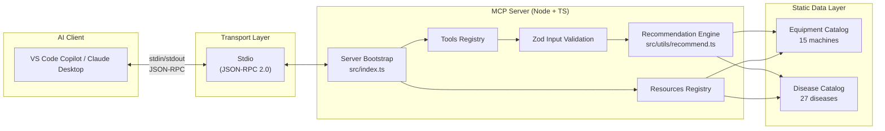

**Key idea:** The server is a *pure function of static data* — no DB, no network, no state. This makes it fast, deterministic, and easy to test.

---

## 2. Folder Structure & Responsibilities

```
medical-equipment-advisor/
├── package.json           → ESM module, node ≥ 20, deps: @modelcontextprotocol/sdk + zod
├── tsconfig.json          → NodeNext + strict mode → catches errors at compile time
├── src/
│   ├── index.ts           → ENTRY POINT: transport, tool registry, request handlers
│   ├── types/index.ts     → Shared TS types (single source of truth for shapes)
│   ├── data/
│   │   ├── equipment.ts   → 15 medical machines (price, capacity, diseases…)
│   │   └── diseases.ts    → 27 conditions → required/optional equipment mapping
│   └── utils/recommend.ts → PURE LOGIC: recommend(), compareEquipment(), estimateRoi()
└── dist/                  → Compiled JS (what the AI client actually runs)
```

### Why this layering?

| Layer | Purpose | Analogy |
|---|---|---|
| `index.ts` | Protocol boundary — speaks JSON-RPC | Controller |
| `utils/recommend.ts` | Business logic — pure functions | Service |
| `data/*.ts` | Domain knowledge | Repository (in-memory) |
| `types/` | Contracts | DTOs |

Swap `data/` for a Prisma-backed repo tomorrow → nothing else changes.

---

## 3. Request Lifecycle (End-to-End)

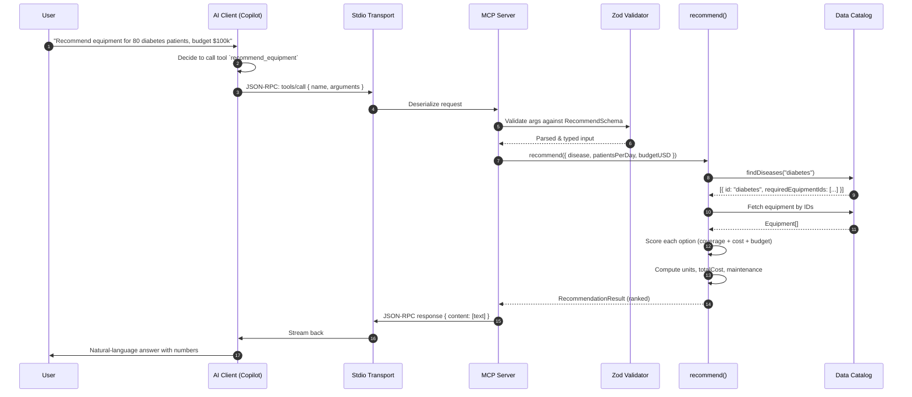

**Total round-trip:** ~5–20 ms for typical queries (all in-memory).

---

## 4. The MCP Protocol Layer

### Why JSON-RPC over stdio?

- **stdio** = simplest transport, zero networking config
- **JSON-RPC 2.0** = standard request/response envelope with `id`, `method`, `params`, `result` / `error`
- The `@modelcontextprotocol/sdk` handles framing, correlation, and error formatting

### What the SDK gives us

```ts
new Server(
  { name: "medical-equipment-advisor", version: "1.0.0" },
  { capabilities: { tools: {}, resources: {} } }
);
```

Declaring `capabilities` tells the client *what* the server supports so it advertises the right features.

### The four handlers we register

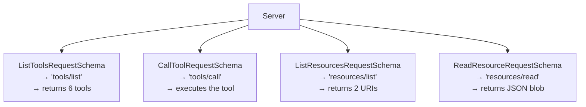

---

## 5. Tools — What & Why

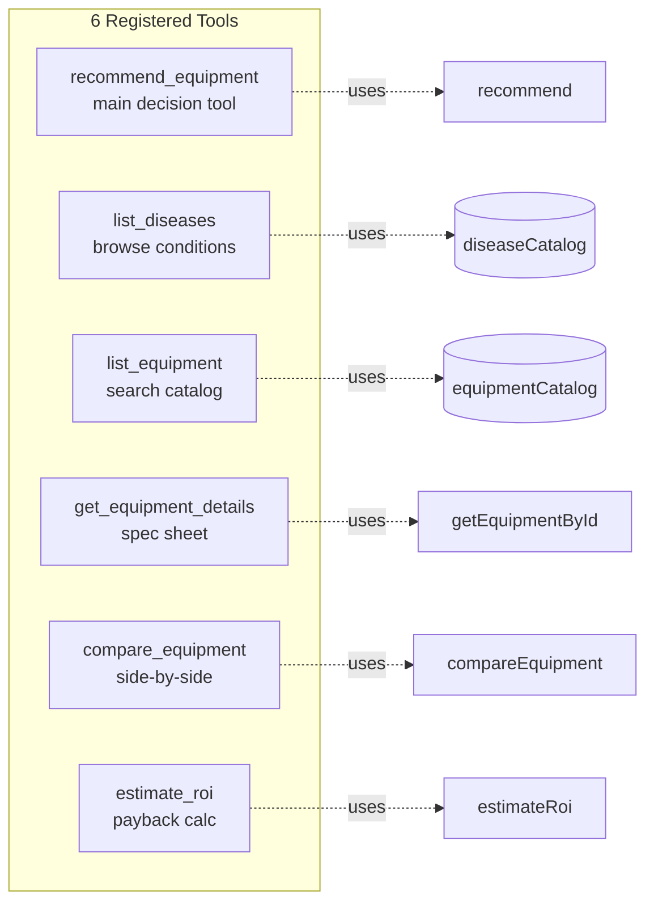

Each tool declares:
1. **`name`** — the AI's function handle
2. **`description`** — helps the AI decide *when* to call it
3. **`inputSchema`** — JSON Schema (generated from Zod via `toJsonSchema()`)

### Why Zod → JSON Schema?

We author schemas in **Zod** because it gives us:
- ✅ Runtime validation
- ✅ TypeScript inference (`z.infer<typeof RecommendSchema>`)
- ✅ Single source of truth

Then we convert to JSON Schema at boot time (`toJsonSchema()`) because MCP requires JSON Schema for `inputSchema`. One authored form, two consumers.

---

## 6. Data Model

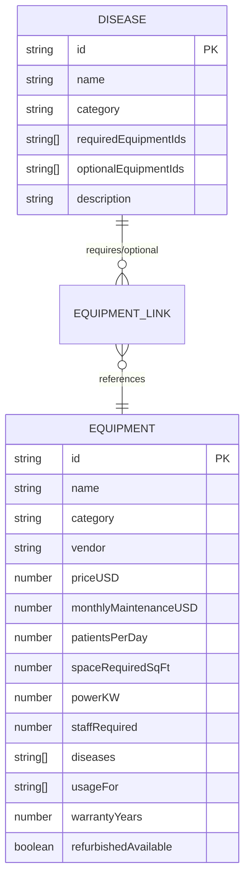

**Bidirectional linking:** each disease lists its equipment IDs, and each equipment lists the diseases it treats. This allows lookups in either direction with no join tables.

---

## 7. The Recommendation Algorithm

This is the heart of the server. Given `{ disease, patientsPerDay, budgetUSD, prioritize }`:

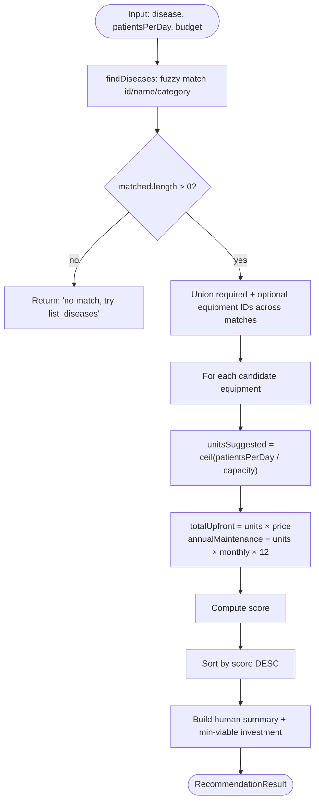

### Scoring formula

```
score = baseScore(required=50 | optional=15)
      + capacityFit  (0..30)   ← how well N units cover demand
      + costEfficiency (0..25) ← inverse log of cost per patient/day
      - budgetPenalty (30)     ← if over budget
      + priorityBonus (0..15)  ← cost | capacity | coverage weight
```

**Why log-scale for cost?** A machine that costs \$5,000 vs \$50,000 matters far more than \$3M vs \$3.5M — logarithm compresses the tail so cheap machines aren't crushed by absolute-dollar dominance.

### Why `ceil()` for unit count?

You can't buy 0.7 of an MRI scanner. If demand is 80 patients/day and one unit does 60/day → you need `ceil(80/60) = 2` units. The result reports `capacityGapPerDay = 40` (residual under 2 units × 60 = 120, so gap = 0).

---

## 8. Resources — Passive Data Exposure

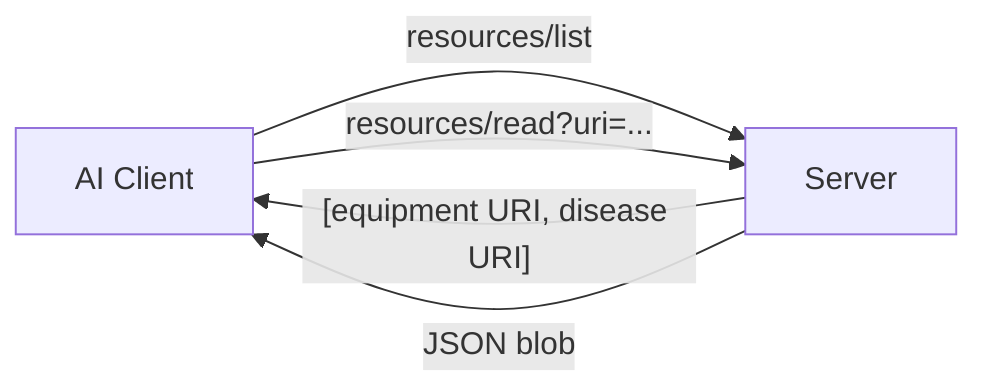

Resources let the AI **browse the raw catalog** without calling a tool — useful for open-ended exploration ("show me everything you have"). URIs:

- `medadvisor://catalog/equipment`
- `medadvisor://catalog/diseases`

Custom scheme (`medadvisor://`) makes them self-identifying and never collides with `file://` / `http://`.

---

## 9. Boot Sequence

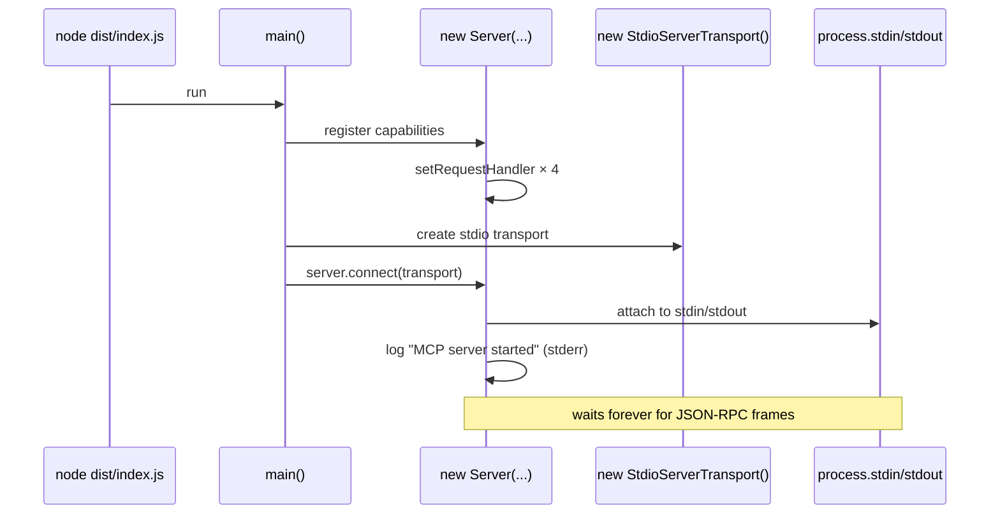

**Critical detail:** all logs go to **stderr** (`console.error`), never stdout. Stdout is reserved for JSON-RPC framing — a stray `console.log` would corrupt the protocol.

---

## 10. Build & Deployment Pipeline

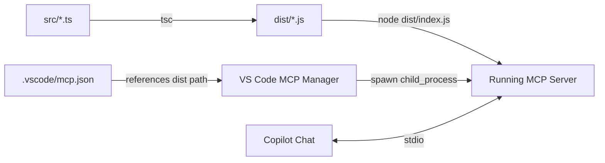

**Why compile ahead of time?**
- Faster startup (no TS transform on every spawn)
- Same shipping artifact works for Claude Desktop, Cursor, VS Code, CI
- `tsx` is only for local dev (`npm run dev`)

---

## 11. How the Client Discovers the Server

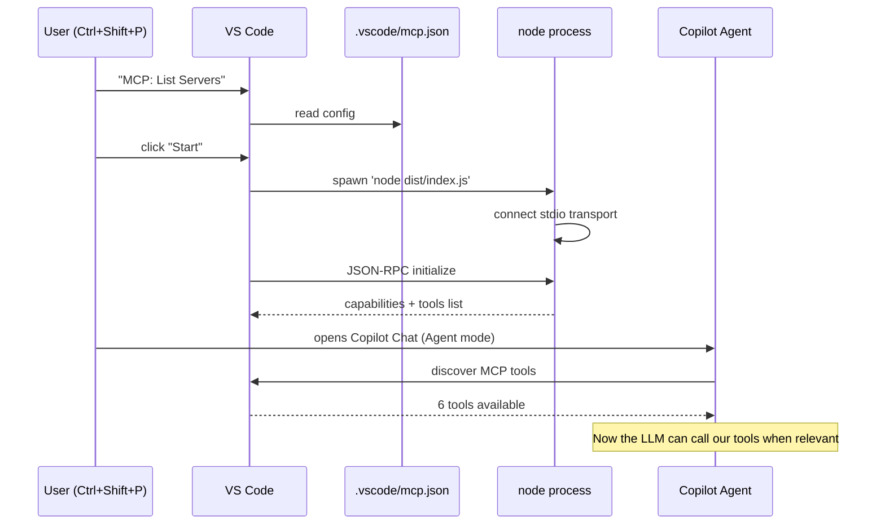

---

## 12. Design Trade-offs & Decisions

| Decision | Chosen | Alternative | Why |
|---|---|---|---|
| Transport | stdio | HTTP/SSE | Simplest for local dev; no port conflicts |
| Language | Node + TS | Python | User asked for it + strong MCP SDK |
| Data | Static TS arrays | Postgres/Prisma | Zero setup; swappable later |
| Validation | Zod | Manual checks | Runtime + compile-time in one schema |
| Module system | ESM (`type: module`) | CommonJS | MCP SDK is ESM-only |
| Scoring | Weighted heuristic | ML model | Explainable, no training data needed |
| Response format | Pretty JSON in `text` block | Structured content | Universal — every LLM can parse it |

---

## 13. Extension Points

Want to grow this into a real product? Here's where to plug in:

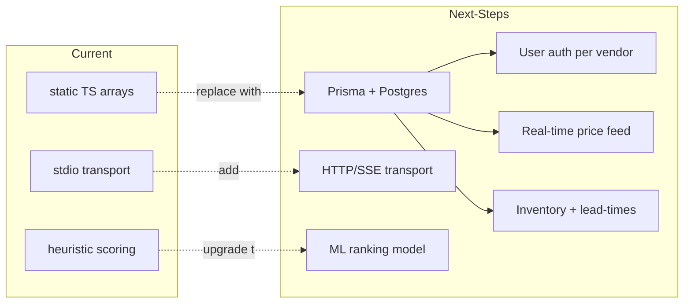

Concrete first steps:

1. **DB-backed catalog** — move `data/*.ts` behind a `Repository` interface, swap impl for Prisma.
2. **Vendor auth** — introduce a `vendorId` context, filter equipment by vendor.
3. **Live pricing** — scheduled job pulls latest prices from vendor APIs; recommendation always uses freshest.
4. **Prompts capability** — add MCP `prompts/list` handler with templates like *"Draft a purchase justification for the CFO"*.

---

## 14. Testing Strategy (Recommended)

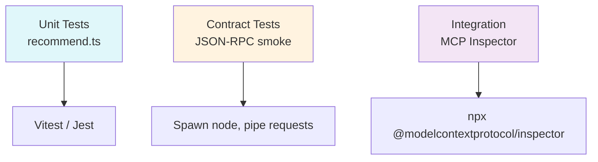

Recommended split:
- **Unit** — `recommend()`, `estimateRoi()`, `compareEquipment()` are pure → easy to test
- **Contract** — spawn `dist/index.js`, send `tools/list`, assert 6 tools
- **Manual** — MCP Inspector gives you a GUI to poke every tool

---

## 15. Summary — Why This Design Scales

1. **Pure functions** at the core → trivial to test and reason about
2. **Zod schemas** → one authoring point for validation + types + JSON Schema
3. **Static data → Repository pattern-ready** → tomorrow's DB swap is 1 file
4. **Stdio transport** → runs anywhere Node runs, no ports to manage
5. **Explainable scoring** → users (and auditors) can trust the recommendation
6. **Clean protocol boundary** → `index.ts` is the only file that knows about MCP

The whole server is <500 LOC and does something a hospital planner would otherwise do in a spreadsheet — with the added bonus that an LLM can now *reason over it* in natural language.
