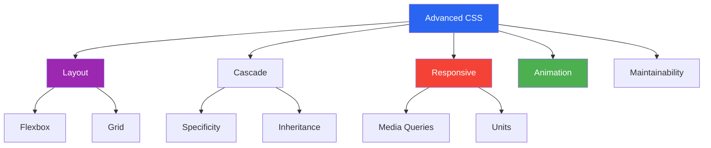
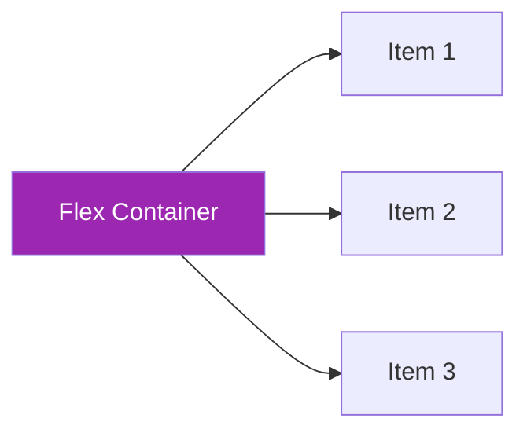
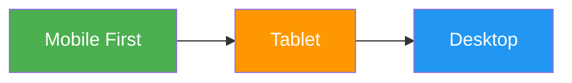

# CSS — Advanced Concepts Guide

> This file covers advanced CSS concepts used in modern frontend development, interview preparation, and real-world responsive UI design.

---

## 📚 Table of Contents

1. [Advanced Selectors and Combinators](#1-advanced-selectors-and-combinators)
2. [Pseudo-classes vs Pseudo-elements](#2-pseudo-classes-vs-pseudo-elements)
3. [CSS Specificity, Cascade, and Inheritance](#3-css-specificity-cascade-and-inheritance)
4. [Flexbox in Detail](#4-flexbox-in-detail)
5. [CSS Grid](#5-css-grid)
6. [Responsive Design Strategy](#6-responsive-design-strategy)
7. [Media Queries in Detail](#7-media-queries-in-detail)
8. [Modern CSS Units and Functions](#8-modern-css-units-and-functions)
9. [Positioning, Stacking Context, and z-index](#9-positioning-stacking-context-and-z-index)
10. [Transitions, Transforms, and Animations](#10-transitions-transforms-and-animations)
11. [CSS Variables (Custom Properties)](#11-css-variables-custom-properties)
12. [Box Model, box-sizing, and Layout Stability](#12-box-model-box-sizing-and-layout-stability)
13. [Responsive Images and Aspect Ratio](#13-responsive-images-and-aspect-ratio)
14. [BEM, Naming, and Maintainable CSS](#14-bem-naming-and-maintainable-css)
15. [Important Missing Advanced Topics](#15-important-missing-advanced-topics)

---



---

# 1. Advanced Selectors and Combinators

> Advanced selectors make CSS more precise and powerful.

| Selector | Example | Meaning |
|---|---|---|
| Descendant | `.card p` | Any `p` inside `.card` |
| Child | `.card > p` | Direct `p` child only |
| Adjacent sibling | `h2 + p` | First `p` after `h2` |
| General sibling | `h2 ~ p` | All `p` after `h2` |
| Attribute | `input[required]` | Required inputs |
| Attribute value | `a[target="_blank"]` | Links opening in new tab |

```css
.card > h2 {
    margin-bottom: 10px;
}

h2 + p {
    color: #666;
}

input[required] {
    border-left: 4px solid green;
}
```

---

# 2. Pseudo-classes vs Pseudo-elements

## Pseudo-class

> Selects an element in a special state.

Examples:
- `:hover`
- `:focus`
- `:active`
- `:checked`
- `:disabled`
- `:nth-child()`

## Pseudo-element

> Selects a specific part of an element.

Examples:
- `::before`
- `::after`
- `::first-letter`
- `::first-line`
- `::placeholder`

```css
a:hover {
    color: crimson;
}

p::first-letter {
    font-size: 2rem;
    font-weight: bold;
}
```

---

# 3. CSS Specificity, Cascade, and Inheritance

## Cascade

> CSS means **Cascading** Style Sheets because multiple rules can apply to the same element, and the browser chooses the final one.

The browser decides based on:
1. Importance (`!important`)
2. Specificity
3. Source order

## Specificity order

| Selector Type | Weight |
|---|---|
| Inline style | Highest |
| ID | High |
| Class / attribute / pseudo-class | Medium |
| Element / pseudo-element | Low |

```css
p {
    color: green;
}

.text {
    color: blue;
}

#intro {
    color: red;
}
```

If all target the same element, `#intro` wins.

## Inheritance

Properties commonly inherited:
- `color`
- `font-family`
- `font-size`
- `line-height`

---

# 4. Flexbox in Detail

> Flexbox is ideal for aligning items along one axis.

## Container properties

```css
.container {
    display: flex;
    flex-direction: row;
    justify-content: space-between;
    align-items: center;
    flex-wrap: wrap;
    gap: 16px;
}
```

## Item properties

```css
.item {
    flex: 1 1 200px;
}

.item.special {
    order: 1;
    align-self: flex-start;
}
```



## When to use

- Navbar
- Card rows
- Button groups
- Horizontal alignment
- Vertical centering

---

# 5. CSS Grid

> CSS Grid is a two-dimensional layout system for rows and columns.

```css
.grid {
    display: grid;
    grid-template-columns: repeat(3, 1fr);
    gap: 20px;
}
```

## Example

```css
.layout {
    display: grid;
    grid-template-columns: 250px 1fr;
    min-height: 100vh;
}

@media (max-width: 768px) {
    .layout {
        grid-template-columns: 1fr;
    }
}
```

## Flexbox vs Grid

| Feature | Flexbox | Grid |
|---|---|---|
| Direction | One-dimensional | Two-dimensional |
| Best for | Alignment in row/column | Full page or section layout |

---

# 6. Responsive Design Strategy

> Responsive design means the UI adapts smoothly to different screens.

## Good strategy

- Start mobile-first
- Use relative units
- Use flexible layouts
- Avoid fixed heights unless needed
- Test on multiple viewport sizes



---

# 7. Media Queries in Detail

```css
/* mobile first */
.card {
    padding: 12px;
}

@media (min-width: 768px) {
    .card {
        padding: 20px;
    }
}

@media (min-width: 1024px) {
    .card {
        padding: 24px;
    }
}
```

## Common query types

- `min-width`
- `max-width`
- `orientation`
- `hover`
- `prefers-reduced-motion`
- `prefers-color-scheme`

```css
@media (prefers-reduced-motion: reduce) {
    * {
        animation: none;
        transition: none;
    }
}
```

---

# 8. Modern CSS Units and Functions

## Useful units

- `rem`
- `vw`
- `vh`
- `fr`
- `%`
- `ch`
- `clamp()`
- `min()`
- `max()`

```css
h1 {
    font-size: clamp(1.5rem, 4vw, 3rem);
}

.container {
    width: min(90%, 1200px);
}

.sidebar {
    width: max(220px, 20vw);
}
```

> `clamp(min, preferred, max)` is excellent for fluid typography.

---

# 9. Positioning, Stacking Context, and z-index

> `z-index` works only in the context of stacking order, often with positioned elements.

```css
.modal {
    position: fixed;
    inset: 0;
    z-index: 1000;
}

.tooltip {
    position: absolute;
    z-index: 2000;
}
```

## Common issue

If a parent creates a new stacking context, a child cannot rise above elements outside that context even with a larger `z-index`.

---

# 10. Transitions, Transforms, and Animations

## Transition

```css
.button {
    transition: background 0.3s ease, transform 0.3s ease;
}

.button:hover {
    background: black;
    color: white;
    transform: translateY(-2px);
}
```

## Transform

```css
.card:hover {
    transform: scale(1.05) rotate(1deg);
}
```

## Animation

```css
@keyframes fadeIn {
    from {
        opacity: 0;
        transform: translateY(10px);
    }
    to {
        opacity: 1;
        transform: translateY(0);
    }
}

.box {
    animation: fadeIn 0.6s ease-out;
}
```

---

# 11. CSS Variables (Custom Properties)

> CSS variables improve maintainability and theme support.

```css
:root {
    --primary: #2965f1;
    --text: #222;
    --radius: 12px;
}

.card {
    color: var(--text);
    border-radius: var(--radius);
    border: 1px solid var(--primary);
}
```

## Benefits

- Easier theme management
- Reusable values
- Cleaner code

---

# 12. Box Model, box-sizing, and Layout Stability

> `box-sizing: border-box` is the preferred layout model because it makes element sizing predictable.

```css
*, *::before, *::after {
    box-sizing: border-box;
}
```

## Why it helps

- Prevents accidental overflow
- Makes columns easier to size
- Keeps layouts consistent

---

# 13. Responsive Images and Aspect Ratio

```css
img {
    max-width: 100%;
    height: auto;
    display: block;
}

.video {
    aspect-ratio: 16 / 9;
    width: 100%;
}
```

## Example

```css
.card-image {
    aspect-ratio: 4 / 3;
    object-fit: cover;
    width: 100%;
}
```

---

# 14. BEM, Naming, and Maintainable CSS

> BEM stands for **Block Element Modifier**.

## Example

```css
.card {}
.card__title {}
.card__button {}
.card--featured {}
```

## Benefits

- Predictable naming
- Easier maintenance
- Better team collaboration

---

# 15. Important Missing Advanced Topics

## Overflow and text handling

```css
.text {
    overflow: hidden;
    text-overflow: ellipsis;
    white-space: nowrap;
}
```

## Object fit

```css
.avatar {
    width: 120px;
    height: 120px;
    object-fit: cover;
}
```

## Sticky layouts

```css
.sidebar {
    position: sticky;
    top: 20px;
}
```

## Container queries

```css
.card-container {
    container-type: inline-size;
}

@container (min-width: 500px) {
    .card {
        display: flex;
    }
}
```

## Accessibility-related CSS

```css
.button:focus-visible {
    outline: 3px solid #2965f1;
    outline-offset: 2px;
}
```

---

## Quick Revision Table

| Topic | Summary |
|---|---|
| Advanced selectors | More precise targeting |
| Specificity | Decides which rule wins |
| Flexbox | One-axis layout |
| Grid | Two-axis layout |
| Media queries | Responsive styling rules |
| Modern units | `rem`, `fr`, `clamp()` improve flexibility |
| Position + z-index | Controls placement and stacking |
| Animations | Add motion and interaction |
| CSS variables | Reusable design values |
| BEM | Cleaner naming convention |
| Container queries | Component-level responsiveness |

---

*Notes based on modern CSS best practices and interview-focused frontend concepts.*