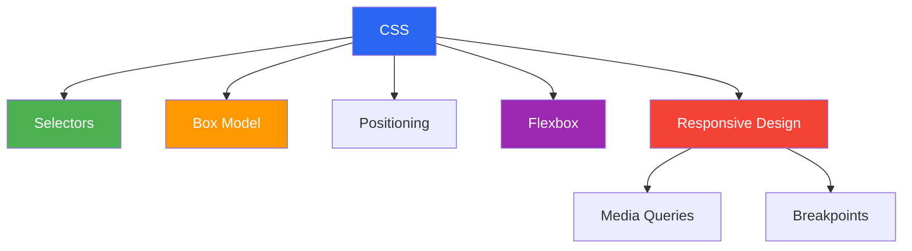
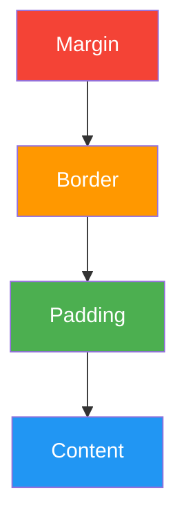
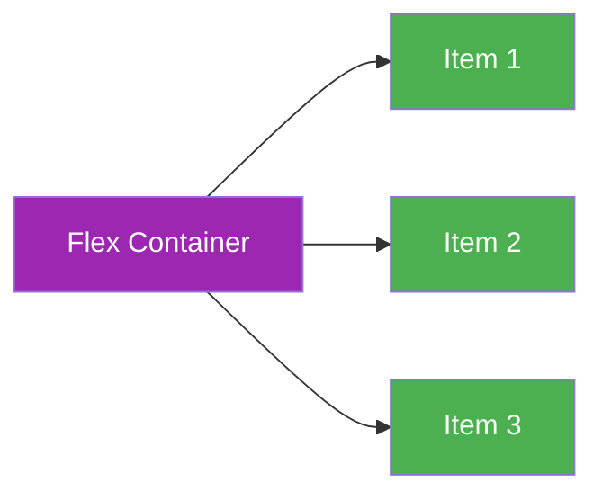

# CSS — Beginner Guide

> CSS stands for **Cascading Style Sheets**. It is used to style HTML elements and control layout, colors, spacing, typography, and responsiveness.

---

## 📚 Table of Contents

1. [What is CSS?](#1-what-is-css)
2. [Difference Between CSS and CSS3](#2-difference-between-css-and-css3)
3. [How to Add CSS](#3-how-to-add-css)
4. [What are Selectors in CSS?](#4-what-are-selectors-in-css)
5. [Pseudo Selectors](#5-pseudo-selectors)
6. [CSS Units — px, %, em, rem, vw, vh](#6-css-units--px--em-rem-vw-vh)
7. [The CSS Box Model](#7-the-css-box-model)
8. [Why We Use box-sizing](#8-why-we-use-box-sizing)
9. [Different Position Values in CSS](#9-different-position-values-in-css)
10. [Flexbox Basics](#10-flexbox-basics)
11. [Media Queries](#11-media-queries)
12. [How to Make a Website Responsive](#12-how-to-make-a-website-responsive)
13. [Common Responsive Breakpoints](#13-common-responsive-breakpoints)
14. [Important Missing Basics](#14-important-missing-basics)

---



---

# 1. What is CSS?

> CSS is used to control the **presentation** of a web page. HTML gives structure, and CSS gives style.

## Example

```html
<p class="title">Hello CSS</p>
```

```css
.title {
    color: blue;
    font-size: 24px;
    font-weight: bold;
}
```

---

# 2. Difference Between CSS and CSS3

> CSS3 is not a completely different language. It is the modern evolution of CSS with new modules and features.

| Feature | CSS | CSS3 |
|---|---|---|
| Version style | Older monolithic spec | Modular specification |
| Animations | Not available | `@keyframes`, transitions, animations |
| Layout | Basic layout tools | Flexbox, Grid |
| Media queries | Not available in older CSS | Available |
| Rounded corners | Not available | `border-radius` |
| Shadows | Not available | `box-shadow`, `text-shadow` |
| Gradients | Not available | Supported |

## Example

```css
.card {
    border-radius: 12px;
    box-shadow: 0 4px 12px rgba(0,0,0,0.15);
    transition: transform 0.3s ease;
}

.card:hover {
    transform: translateY(-4px);
}
```

---

# 3. How to Add CSS

## Inline CSS

```html
<p style="color: red;">Inline style</p>
```

## Internal CSS

```html
<style>
    p {
        color: green;
    }
</style>
```

## External CSS

```html
<link rel="stylesheet" href="styles.css" />
```

> External CSS is best for real projects because it is reusable and clean.

---

# 4. What are Selectors in CSS?

> Selectors target HTML elements so styles can be applied.

## Common selectors

| Selector | Example | Meaning |
|---|---|---|
| Universal | `*` | Select all elements |
| Element | `p` | Select all `<p>` tags |
| Class | `.card` | Select elements with class |
| ID | `#header` | Select element with id |
| Group | `h1, h2` | Select multiple elements |
| Descendant | `.card p` | Select `p` inside `.card` |
| Child | `.menu > li` | Direct child only |
| Adjacent sibling | `h1 + p` | First `p` after `h1` |
| General sibling | `h1 ~ p` | All `p` after `h1` |
| Attribute | `input[type="text"]` | Select by attribute |

## Example

```css
* {
    box-sizing: border-box;
}

p {
    color: #333;
}

.card {
    background: #f5f5f5;
}

#header {
    padding: 20px;
}

nav a {
    text-decoration: none;
}

input[type="email"] {
    border: 1px solid #999;
}
```

---

# 5. Pseudo Selectors

> Pseudo selectors target a special state of an element or a specific part of it.

## Pseudo-classes

| Selector | Meaning |
|---|---|
| `:hover` | When mouse is over element |
| `:focus` | When input is focused |
| `:active` | While clicking |
| `:first-child` | First child element |
| `:last-child` | Last child element |
| `:nth-child(n)` | Specific child index |
| `:not()` | Exclude matching elements |
| `:checked` | Checked checkbox/radio |

## Pseudo-elements

| Selector | Meaning |
|---|---|
| `::before` | Insert content before element |
| `::after` | Insert content after element |
| `::first-letter` | First letter |
| `::first-line` | First line |
| `::selection` | Selected text |

## Example

```css
button:hover {
    background: black;
    color: white;
}

input:focus {
    outline: 2px solid blue;
}

li:nth-child(odd) {
    background: #f2f2f2;
}

.title::after {
    content: " 🚀";
}
```

---

# 6. CSS Units — px, %, em, rem, vw, vh

> CSS units define size, spacing, width, height, and typography.

| Unit | Meaning | Relative To |
|---|---|---|
| `px` | Fixed pixel unit | Screen pixel |
| `%` | Percentage | Parent element |
| `em` | Relative unit | Parent font-size |
| `rem` | Root em | Root (`html`) font-size |
| `vw` | Viewport width | Browser width |
| `vh` | Viewport height | Browser height |

## `em` vs `rem`

- `em` depends on the parent's font-size
- `rem` depends on the root font-size
- `rem` is usually easier for consistent scaling

## Example

```css
html {
    font-size: 16px;
}

.box {
    width: 300px;      /* fixed */
    padding: 2em;      /* based on parent font-size */
    margin: 1.5rem;    /* based on root font-size */
    min-height: 50vh;  /* 50% of viewport height */
    font-size: 1.25rem;
}
```

---

# 7. The CSS Box Model

> The CSS box model describes how the size of every element is calculated.

Each element has:
- **Content**
- **Padding**
- **Border**
- **Margin**



## Example

```css
.box {
    width: 200px;
    padding: 20px;
    border: 5px solid black;
    margin: 10px;
}
```

> If `box-sizing: content-box`, actual width becomes $200 + 40 + 10 = 250px$ excluding margins.

---

# 8. Why We Use box-sizing

> `box-sizing` controls how width and height are calculated.

## Values

| Value | Meaning |
|---|---|
| `content-box` | Width includes content only |
| `border-box` | Width includes content + padding + border |

## Example

```css
/* Recommended global reset */
* {
    box-sizing: border-box;
}

.card {
    width: 300px;
    padding: 20px;
    border: 2px solid #000;
}
```

> With `border-box`, the final visible width stays 300px. This makes layout easier and avoids overflow bugs.

---

# 9. Different Position Values in CSS

> The `position` property controls how an element is placed on the page.

| Value | Meaning |
|---|---|
| `static` | Default position |
| `relative` | Moves relative to its original position |
| `absolute` | Positioned relative to nearest positioned ancestor |
| `fixed` | Positioned relative to viewport |
| `sticky` | Acts relative until scroll threshold, then sticks |

## Example

```css
.relative-box {
    position: relative;
    top: 10px;
    left: 20px;
}

.parent {
    position: relative;
}

.absolute-box {
    position: absolute;
    top: 0;
    right: 0;
}

.fixed-button {
    position: fixed;
    bottom: 20px;
    right: 20px;
}

.sticky-header {
    position: sticky;
    top: 0;
}
```

---

# 10. Flexbox Basics

> Flexbox is a one-dimensional layout system used to align items in a row or column.

## Important properties

### On container
- `display: flex`
- `flex-direction`
- `justify-content`
- `align-items`
- `gap`
- `flex-wrap`

### On item
- `flex`
- `align-self`
- `order`



## Example

```css
.container {
    display: flex;
    justify-content: space-between;
    align-items: center;
    gap: 16px;
    flex-wrap: wrap;
}

.item {
    flex: 1;
    min-width: 150px;
}
```

---

# 11. Media Queries

> Media queries apply CSS based on screen size, device features, or conditions.

## Syntax

```css
@media (max-width: 768px) {
    .container {
        flex-direction: column;
    }
}
```

## Common use cases

- Change layout for mobile
- Reduce font sizes
- Hide or show elements
- Stack columns vertically

---

# 12. How to Make a Website Responsive

> A responsive website adapts to different screen sizes and devices.

## Key practices

1. Use viewport meta tag
2. Use relative units like `%`, `rem`, `vw`
3. Use Flexbox or Grid
4. Add media queries
5. Make images responsive
6. Avoid fixed widths everywhere

## Example

```html
<meta name="viewport" content="width=device-width, initial-scale=1.0" />
```

```css
img {
    max-width: 100%;
    height: auto;
}

.layout {
    display: flex;
    gap: 20px;
}

@media (max-width: 768px) {
    .layout {
        flex-direction: column;
    }
}
```

---

# 13. Common Responsive Breakpoints

> Breakpoints are widths where the layout changes.

| Device Type | Common Width |
|---|---|
| Small mobile | `max-width: 480px` |
| Mobile | `max-width: 767px` |
| Tablet | `768px - 1023px` |
| Laptop | `1024px - 1279px` |
| Desktop | `1280px and above` |

## Example

```css
@media (max-width: 480px) {
    body {
        font-size: 14px;
    }
}

@media (min-width: 768px) and (max-width: 1023px) {
    .grid {
        grid-template-columns: repeat(2, 1fr);
    }
}

@media (min-width: 1280px) {
    .container {
        max-width: 1200px;
        margin: 0 auto;
    }
}
```

---

# 14. Important Missing Basics

## Specificity

> Specificity decides which CSS rule wins.

Order of strength:
- Inline style
- ID selector
- Class / attribute / pseudo-class
- Element selector

```css
#title {
    color: red;
}

.title {
    color: blue;
}

h1 {
    color: green;
}
```

The `#title` rule wins.

## Inheritance

Some properties like `color`, `font-family`, and `line-height` are inherited by children.

## Display property

Important values:
- `block`
- `inline`
- `inline-block`
- `none`
- `flex`
- `grid`

## Overflow

```css
.box {
    overflow: auto;
}
```

## z-index

Used with positioned elements to control stacking order.

```css
.modal {
    position: fixed;
    z-index: 1000;
}
```

---

## Quick Revision Table

| Topic | One-line Summary |
|---|---|
| CSS vs CSS3 | CSS3 adds modern modules and features |
| Selectors | Used to target elements |
| Media query | Apply CSS based on screen conditions |
| Position | Controls how elements are placed |
| Box model | Content, padding, border, margin |
| px / em / rem / % | Different sizing units |
| Flexbox | One-dimensional layout system |
| Pseudo selectors | Style states and parts of elements |
| Responsive design | Make layouts adapt to screens |
| Breakpoints | Width points where layout changes |
| box-sizing | Easier width and height calculation |

---

*Notes based on practical CSS interview topics and modern CSS usage.*