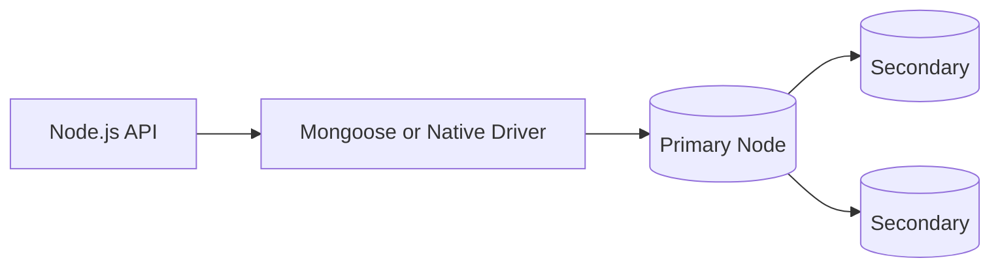
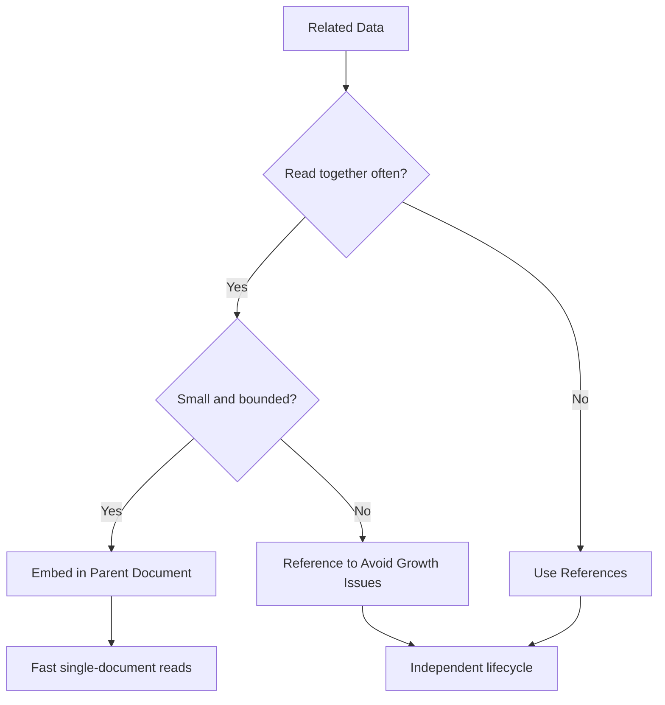

# MongoDB Interview Questions for Node.js Backend Developers

This guide focuses on the MongoDB topics that matter most in backend interviews: document modeling, indexing, aggregation, replication, sharding, and trade-offs against relational systems.

## MongoDB Data Flow Diagram

## 1. What is MongoDB?

MongoDB is a NoSQL document database that stores data in flexible JSON-like BSON documents. It is commonly used when schema flexibility, rapid iteration, and document-oriented access patterns are important.

Example: a Node.js ecommerce service might store a product document with embedded tags, images, and inventory summary in one JSON-like record instead of spreading that data across many relational tables.

## 2. When would you choose MongoDB over PostgreSQL?

MongoDB is a good fit when:

- The data shape changes frequently.
- The application naturally works with document-style objects.
- Embedded documents simplify reads.
- Horizontal scaling and high-write use cases matter.

PostgreSQL is usually better when strong relational integrity, complex joins, and transactional consistency are the priority.

Example: choose MongoDB for a content-management platform where article metadata changes often, but choose PostgreSQL for a payment ledger where strict relational consistency matters more.

## 3. What is BSON?

BSON is the binary representation used by MongoDB to store documents. It extends JSON with additional data types such as `ObjectId`, dates, and binary data.

Example: a user document can store `createdAt` as a BSON date and `_id` as an `ObjectId`, which is more expressive than plain JSON strings.

## 4. What is an `ObjectId`?

`ObjectId` is MongoDB’s default unique identifier type. It is compact, unique across many contexts, and includes timestamp-related characteristics.

Example: when a client requests `/users/6848f1f7d6ab1321a7c91234`, that value is typically parsed as a MongoDB `ObjectId` before querying the collection.

## 5. What is the difference between embedded documents and references?

- Embedded documents store related data inside the same document.
- References store related data in separate collections and connect them logically.

Embed when data is tightly related and read together. Reference when data grows independently or is reused across entities.

This is one of the most important MongoDB interview questions because it tests whether you understand document modeling. Embedding reduces read complexity and can improve performance when the child data is small and naturally owned by the parent. Referencing is better when the related data is large, updated independently, shared by many parents, or queried on its own.

Example: embed a shipping address inside an order document, but reference a `category` collection from thousands of products because categories are shared and updated independently.

## 6. What are collections in MongoDB?

Collections are similar to tables in relational databases. They store documents of a similar type, though the schema can vary between documents.

Example: a backend might have `users`, `orders`, and `products` collections, each containing documents with fields tailored to that domain.

## 7. Does MongoDB have a schema?

MongoDB is schema-flexible, not schema-free. Production systems should still enforce structure through application validation, ODM schemas such as Mongoose, or MongoDB validation rules.

Example: even if `users` documents are flexible, you would still require `email`, `role`, and `createdAt` through a Mongoose schema or database validation rule.

## 8. What is indexing in MongoDB?

Indexes improve query performance by helping MongoDB locate documents faster. Common indexes include single-field, compound, text, TTL, and unique indexes.

Example: if your API often loads orders by `userId`, an index on `userId` prevents repeated full collection scans.

## 9. What is a compound index?

A compound index covers multiple fields, for example `{ userId: 1, createdAt: -1 }`. It is useful when filters and sorting commonly happen on those fields together.

Example: for an endpoint that lists a user’s latest orders, `{ userId: 1, createdAt: -1 }` allows efficient filtering and sorting in one index.

## 10. What is a TTL index?

A TTL index automatically removes documents after a configured time. This is useful for sessions, OTPs, temporary tokens, and expiring logs.

Example: store password reset tokens in a collection with a TTL index so expired tokens disappear automatically after 15 minutes.

## 11. What is sharding?

Sharding distributes data across multiple machines using a shard key. It is used when one server is no longer enough for storage or throughput requirements.

The senior-level point is that shard key choice matters more than the definition of sharding itself. A poor shard key can create hot partitions, uneven storage growth, and poor query routing. In interviews, it is better to explain the operational consequence of a bad shard key than to repeat a generic scaling definition.

Example: if all writes use a monotonically increasing timestamp as the shard key, one shard may receive most new traffic and become a bottleneck.

## 12. What is replication in MongoDB?

Replication keeps copies of data across multiple nodes through replica sets. It improves availability and supports failover.

Example: if the primary database node fails during business hours, a secondary can be promoted so the API continues serving writes.

## 13. What is a replica set?

A replica set is a group of MongoDB nodes that maintain the same dataset. One node is primary for writes, and secondary nodes replicate data from it.

Example: a production cluster may run one primary and two secondaries so the system can survive a single-node failure.

## 14. What is eventual consistency in MongoDB contexts?

Depending on read preference and replication lag, some reads may not immediately reflect the latest write. Engineers should understand this when designing read-after-write-sensitive workflows.

Example: a user updates their profile and immediately refreshes a page that reads from a secondary; the old value may still appear briefly.

## 15. Does MongoDB support transactions?

Yes. MongoDB supports multi-document transactions, though they should be used carefully because they add overhead. Single-document writes are atomic by default.

That last point matters a lot. MongoDB modeling often tries to keep related state inside one document precisely so the application can rely on atomic single-document updates instead of paying the cost of cross-document transactions.

Example: if cart items live inside one cart document, adding an item can often be done atomically with a single document update instead of a multi-document transaction.

## 16. What does atomicity mean in MongoDB?

MongoDB guarantees atomicity at the single-document level. If related data can live inside one document, that often simplifies consistency.

Example: updating both `status` and `updatedAt` in the same order document happens atomically, so readers do not see a half-updated order state.

## 17. What is aggregation in MongoDB?

Aggregation is MongoDB’s framework for processing and transforming data through stages such as:

- `$match`
- `$group`
- `$project`
- `$sort`
- `$lookup`

It is heavily used for analytics and reporting endpoints.

In interviews, it helps to explain what aggregation really does: it lets you transform, filter, reshape, join, and summarize document data in stages. This makes it powerful, but also easy to misuse if the pipeline grows complex without proper indexing or if it processes far more documents than necessary.

Example: a dashboard endpoint might aggregate orders by month and total revenue using `$match`, `$group`, and `$sort` stages.

## 18. What is `$lookup`?

`$lookup` performs a join-like operation across collections. It is useful, but overusing it can indicate that the data model may not fit MongoDB’s strengths.

Example: use `$lookup` to attach customer details to an order report, but avoid relying on it for every normal request if the data could be embedded more naturally.

## 19. What is the difference between `find()` and aggregation?

- `find()` is used for straightforward retrieval.
- Aggregation is used for transformations, grouping, projections, and advanced pipeline logic.

Example: use `find({ status: 'active' })` to fetch active users, but use an aggregation pipeline when you need grouped revenue by region.

## 20. How do you optimize MongoDB performance?

- Design collections around access patterns.
- Add the right indexes.
- Avoid unbounded document growth.
- Use projection to fetch only needed fields.
- Use pagination.
- Analyze queries with `explain()`.
- Avoid hot shard keys in sharded systems.

The main principle is to model around access patterns. MongoDB performance problems often come from designing collections like relational tables instead of designing documents around how the application reads and writes data.

Example: if a mobile app always loads a profile with settings and preferences together, storing those fields in one user document is often faster than referencing several collections.

## 21. What is unbounded document growth and why is it risky?

If arrays or nested fields grow endlessly inside a single document, document size and update cost can become problematic. This affects performance and can eventually hit document size limits.

Example: storing every chat message ever sent inside one conversation document will eventually become expensive and may hit document size limits.

## 22. What is the maximum document size in MongoDB?

MongoDB documents have a size limit of 16 MB. Large data blobs should be modeled differently, for example using GridFS or external object storage depending on the use case.

Example: store video metadata in MongoDB, but place the actual large video file in object storage instead of inside one document.

## 23. How do you prevent injection-like issues in MongoDB queries?

Validate and sanitize input, avoid blindly passing user-controlled query objects into database filters, and enforce strong API-level validation.

Example: do not allow a user to send raw filter JSON like `{ "$ne": null }` directly into a login query without validating permitted fields and operators.

## 24. What is Mongoose and how does it relate to MongoDB?

Mongoose is an ODM for Node.js and MongoDB. It provides schema definitions, middleware, validation, hooks, and model APIs. MongoDB itself does not require Mongoose, but many Node.js backends use it for structure and developer convenience.

Example: in an Express app, a `User` Mongoose model can enforce required fields and validation before saving a document to MongoDB.

## 25. What are common Mongoose interview points?

- Schema vs model
- Validation
- Middleware/hooks
- Population
- Lean queries
- Index declaration
- Transactions with sessions

Example: an interviewer may ask when to use `.lean()` for faster reads or when `populate()` becomes a performance problem.

## 26. What is `.lean()` in Mongoose?

`.lean()` returns plain JavaScript objects instead of full Mongoose documents. This improves performance for read-heavy endpoints when document methods and change tracking are not needed.

Example: use `.lean()` for a public products listing endpoint where you only need JSON output and no document instance methods.

## 27. What is `populate()` and what is the trade-off?

`populate()` resolves references across collections. It improves convenience, but overuse can hurt performance and hide inefficient access patterns.

That is why senior engineers treat `populate()` as a convenience tool, not a substitute for good document design. If an endpoint needs repeated deep population to work, the model may need to be revisited.

Example: populating `author`, `comments.user`, and `comments.likes.user` on every blog request can become expensive and signal an inefficient read pattern.

## MongoDB Modeling Decision Diagram

## 28. How would you model a product catalog in MongoDB?

Keep products in a products collection, embed stable small structures where appropriate, index search and filter fields, separate large or volatile substructures when they grow independently, and design around the most common query paths.

Example: keep product title, price, tags, and thumbnail in the main document, but store inventory history or supplier sync logs in separate collections.

## 29. How do you answer “MongoDB is schema-less” in an interview?

Say that MongoDB is schema-flexible, but production systems still need strong schema control through validation at the database and application layers. Uncontrolled flexibility becomes data inconsistency.

Example: if one service stores `phoneNumber` as a string and another stores it as an object with country code, analytics and downstream APIs become harder to maintain.

## 30. When is MongoDB a poor fit?

MongoDB is a weaker choice when the application depends heavily on complex joins, strict relational integrity, or highly structured financial-style transactional workflows where relational modeling is the clearer choice.

Example: a double-entry accounting system is usually a better fit for PostgreSQL than MongoDB because correctness and relational guarantees dominate flexibility.

## Practical Senior-Level Follow-Up Questions

### How do you decide between embedding and referencing?

Use embedding when the data is read together, small, and owned by the parent document. Use referencing when the related data is large, reused, updated independently, or needs separate lifecycle management.

Example: embed a user’s notification preferences, but reference a large `orders` collection from the user instead of storing thousands of orders inside the same document.

### How do you debug a slow MongoDB endpoint?

- Capture the exact query.
- Run `explain()`.
- Check index usage.
- Review document size and projection.
- Check for excessive `populate()` or aggregation cost.
- Validate whether the schema matches the access pattern.

Example: if an orders endpoint is slow, inspect whether it is scanning too many documents, missing an index on `userId`, or overusing `populate()` for related collections.

### What should a senior backend engineer know before choosing MongoDB?

They should understand data modeling trade-offs, indexing strategy, replication, sharding, consistency implications, and how application access patterns drive document design.

Example: before choosing MongoDB for a new service, a senior engineer should be able to explain how the main read and write patterns map to document structure and indexes.

## Quick Revision Points

- MongoDB is document-oriented and schema-flexible.
- Single-document operations are atomic.
- Indexes are still critical.
- Model around access patterns, not table analogies.
- Mongoose adds validation and structure for Node.js teams.
- Use transactions only when needed.
