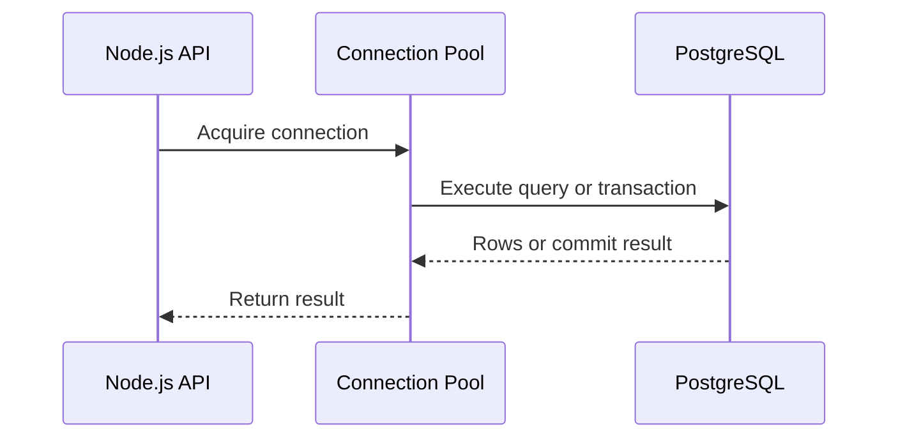
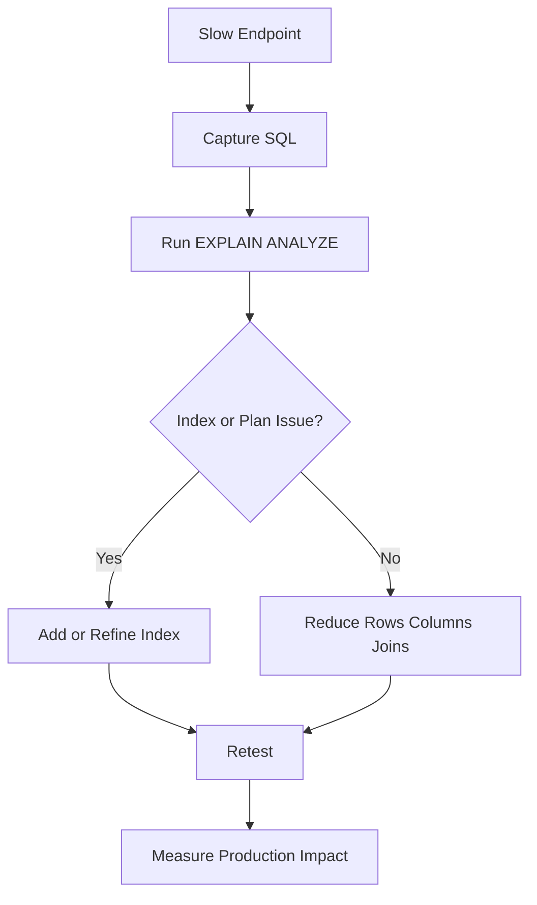

# PostgreSQL Interview Questions for Node.js Backend Developers

This guide focuses on the PostgreSQL topics that come up most often in Node.js backend interviews: schema design, indexing, transactions, performance, and production trade-offs.

## PostgreSQL Request Flow Diagram



## 1. What is PostgreSQL and why is it widely used in backend systems?

PostgreSQL is an open-source relational database known for SQL compliance, ACID transactions, extensibility, indexing support, and reliability. Backend teams use it because it handles complex queries well, supports strong data integrity, and scales for transactional systems such as ecommerce, finance, SaaS, and analytics-backed products.

What makes it especially strong for backend work is that it supports both standard relational workloads and more advanced features such as `jsonb`, window functions, full-text search, common table expressions, partitioning, and powerful indexing strategies. That means a Node.js team can usually keep both transactional and moderately complex analytical workloads in one dependable database instead of fragmenting the system too early.

Example: a SaaS billing platform can keep customers, subscriptions, invoices, payment attempts, and audit records in PostgreSQL while still running reporting queries on the same dataset.

## 2. What does ACID mean in PostgreSQL?

- Atomicity: a transaction fully succeeds or fully rolls back.
- Consistency: data remains valid according to constraints.
- Isolation: concurrent transactions do not corrupt each other.
- Durability: committed data survives crashes.

In Node.js backends, ACID matters when creating orders, payments, inventory updates, or any multi-step write flow.

Example: during checkout, the API should either create the order, reserve stock, and save the payment reference together or roll everything back.

## 3. What is the difference between `DELETE`, `TRUNCATE`, and `DROP`?

- `DELETE` removes rows and can use a `WHERE` clause.
- `TRUNCATE` removes all rows quickly and usually resets storage-related metadata.
- `DROP` removes the entire table structure itself.

Use `DELETE` for controlled row removal, `TRUNCATE` for fast cleanup, and `DROP` only when the table is no longer needed.

Example: use `DELETE FROM sessions WHERE expires_at < now()` for cleanup, `TRUNCATE temp_import_rows` for a staging table reset, and `DROP TABLE old_feature_flags` when retiring a table entirely.

## 4. What is the difference between `CHAR`, `VARCHAR`, and `TEXT`?

- `CHAR(n)` is fixed length and pads extra spaces.
- `VARCHAR(n)` is variable length with a limit.
- `TEXT` is variable length without a practical application-level limit.

In real Node.js projects, `TEXT` or `VARCHAR` is usually preferred. `CHAR` is rarely needed.

Example: `email VARCHAR(255)` and `bio TEXT` are common choices, while `CHAR(2)` may still make sense for a fixed-length country code.

## 5. What is a primary key?

A primary key uniquely identifies each row in a table. It cannot be `NULL`, and every table should have one. Common examples are `id UUID PRIMARY KEY` or `id BIGSERIAL PRIMARY KEY`.

Example: every row in an `orders` table might be identified by a unique `id UUID PRIMARY KEY`.

## 6. What is a foreign key?

A foreign key enforces a relationship between tables. For example, `orders.user_id` can reference `users.id`. This prevents orphaned records and keeps data relationships valid.

Example: PostgreSQL will reject an order insert if `user_id` points to a user that does not exist.

## 7. What is normalization?

Normalization is organizing data into related tables to reduce duplication and improve consistency. A normalized design usually separates users, orders, order_items, and products instead of storing everything in one table.

Example: instead of repeating product title and price inside every order row, keep products in one table and link order items to them.

## 8. When would you denormalize data?

Denormalization is useful when read performance matters more than strict normalization, such as dashboards, reporting tables, or cached aggregates. It should be intentional because it increases write complexity and risk of stale data.

Example: a reporting table might store daily revenue totals by region so dashboards can load quickly without recalculating every order.

## 9. What are indexes in PostgreSQL?

Indexes are data structures that speed up lookups, filtering, sorting, and joins. Common index targets are columns used in `WHERE`, `JOIN`, `ORDER BY`, and unique constraints.

In interview terms, an index is a performance optimization that trades write cost and storage for faster reads. If an endpoint frequently loads orders by `user_id` and sorts by `created_at`, the database may need an index such as `(user_id, created_at)` to avoid repeated full-table scans.

The important practical point is that indexes are only helpful when they match real query patterns. Adding indexes without understanding how the application queries data often creates write overhead without measurable benefit.

Example: if `/users/:id/orders` is slow, adding an index on `orders(user_id)` is often more useful than indexing a column that is rarely filtered.

## 10. What are the trade-offs of indexes?

Indexes improve reads but add overhead on inserts, updates, and deletes because the index must also be maintained. Too many indexes can slow writes and increase storage.

Example: an event-ingestion table receiving thousands of writes per second can become slower if every non-critical column has its own index.

## 11. What is the difference between clustered and non-clustered indexing in PostgreSQL?

PostgreSQL does not use clustered indexes in the same way some other databases do. You can run `CLUSTER` on a table using an index, but PostgreSQL does not continuously maintain that physical order. In interviews, the practical point is that PostgreSQL indexes are separate structures, and table ordering is not permanently guaranteed.

Example: clustering a large audit table by `created_at` can improve locality temporarily, but future inserts will not keep that exact physical order forever.

## 12. What is a composite index?

A composite index includes multiple columns, for example `(user_id, status)`. It is useful when queries often filter on those columns together.

Example: for a backoffice page that loads only a user’s pending orders, an index on `(user_id, status)` fits the query shape well.

## 13. What is the leftmost-prefix rule?

For a composite index like `(user_id, created_at)`, PostgreSQL can efficiently use the leading part of the index more reliably than non-leading columns alone. That is why index order should follow real query patterns.

Example: the index `(user_id, created_at)` helps `WHERE user_id = $1`, but it may not help much for a query filtering only on `created_at`.

## 14. What is `EXPLAIN` and `EXPLAIN ANALYZE`?

- `EXPLAIN` shows the query execution plan.
- `EXPLAIN ANALYZE` runs the query and shows actual timing and row counts.

This is one of the best tools for debugging slow endpoints in a Node.js API.

In a senior interview, it helps to say what you are looking for in the output: sequential scans on large tables, expensive sorts, nested loop joins over too many rows, rows removed by filters, or indexes that exist but are not being used. `EXPLAIN ANALYZE` closes the gap between what you think the query does and what PostgreSQL actually does under production-like conditions.

Example: if a query scanning millions of rows uses `Seq Scan` on `orders`, that may indicate a missing or unused index on the filter column.

## 15. What is the difference between `INNER JOIN`, `LEFT JOIN`, and `RIGHT JOIN`?

- `INNER JOIN` returns matching rows from both tables.
- `LEFT JOIN` returns all left-table rows plus matching right-table rows.
- `RIGHT JOIN` returns all right-table rows plus matching left-table rows.

`LEFT JOIN` is far more common in backend applications than `RIGHT JOIN`.

Example: use `LEFT JOIN payments` when you need all orders even if some orders do not yet have payment records.

## 16. What is a transaction?

A transaction groups multiple SQL statements into one logical unit of work. If one step fails, the whole operation can be rolled back.

Example use case: create order, reserve inventory, store payment reference, and write audit log.

In backend services, transactions matter when business correctness depends on several writes being treated as one logical action. Without a transaction, a service might create an order row but fail before reducing stock, leaving the system in a partially valid but operationally dangerous state.

Example: if payment capture fails after the order row is inserted, the transaction can roll back so no incomplete order is left behind.

## 17. Why are transactions important in Node.js backends?

Node.js can process many concurrent requests. Without transactions, partial writes can happen during failures, retries, or race conditions. Transactions keep business workflows consistent.

Example: two users trying to buy the last inventory item at the same time need a transactional flow to avoid overselling.

## 18. What is isolation level?

Isolation level defines how much one transaction can see changes from another transaction. Common levels include:

- Read Committed
- Repeatable Read
- Serializable

Higher isolation improves correctness but may reduce concurrency.

For interviews, it is useful to explain the trade-off: `Read Committed` is common because it balances safety and throughput, while `Serializable` provides stronger guarantees but can increase contention and transaction retries. The best choice depends on whether occasional anomalies are acceptable for the workload.

Example: a financial transfer flow may justify stricter isolation than a read-heavy analytics dashboard.

## 19. What is a deadlock?

A deadlock happens when two transactions wait on each other’s locks and neither can proceed. PostgreSQL detects this and aborts one transaction.

Senior-level answer: fix deadlocks by locking resources in a consistent order, reducing transaction scope, and keeping transactions short.

Example: if two transactions update `accounts` and `wallets` in different orders, standardizing the lock order can eliminate recurring deadlocks.

## 20. What are common ways to optimize PostgreSQL queries?

- Add correct indexes.
- Avoid `SELECT *`.
- Fetch only needed rows and columns.
- Use pagination.
- Inspect `EXPLAIN ANALYZE`.
- Avoid N+1 queries.
- Use proper join strategy.
- Archive old data when tables become too large.

Example: a slow admin report may improve by adding an index, selecting fewer columns, and paginating instead of loading 100,000 rows at once.

## 21. What is pagination and which approach is better?

Two common approaches:

- Offset pagination: `LIMIT 20 OFFSET 40`
- Cursor pagination: use a stable ordered column such as `id` or `created_at`

Cursor pagination is usually better for large datasets because it performs more consistently and avoids duplicate or skipped rows during concurrent updates.

Example: `WHERE created_at < $cursor ORDER BY created_at DESC LIMIT 20` is usually more stable than deep `OFFSET` pagination on large tables.

## 22. What is the N+1 query problem?

It happens when you fetch one list and then run one additional query per item. Example: fetch 100 users, then query each user’s orders separately. This causes unnecessary round trips and poor performance.

Example: instead of running 101 queries for 100 users and their orders, use one join or batch query.

## 23. How do you prevent SQL injection in Node.js with PostgreSQL?

Always use parameterized queries or a safe ORM/query builder. Never concatenate user input into raw SQL strings.

Bad example:

```sql
SELECT * FROM users WHERE email = '" + email + "'
```

Safer approach uses placeholders and bound values.

Example: `SELECT * FROM users WHERE email = $1` with a bound email parameter prevents input from changing query structure.

## 24. What is connection pooling?

Connection pooling reuses database connections instead of creating a new one for every request. This improves performance and avoids exhausting database connection limits.

In Node.js, this is essential because high traffic plus unbounded connections can crash the database.

Senior candidates should also mention that a pool needs sizing discipline. Too small and requests queue behind the database; too large and the database spends more time context-switching than doing useful work. Pool size should be chosen based on workload, query duration, and database capacity rather than guesswork.

Example: an API with short queries may work well with a modest pool, while a large unbounded pool can overwhelm PostgreSQL under burst traffic.

## Query Tuning Workflow



## 25. Why should long-running queries be avoided inside request handlers?

They increase latency, hold locks longer, reduce throughput, and can block other critical operations. Move heavy work to background jobs if it does not need to finish within the HTTP response cycle.

Example: generating a full CSV export for 2 million rows should run as a background job instead of inside a normal HTTP request.

## 26. What is a migration?

A migration is a version-controlled change to the database schema, such as creating tables, adding indexes, renaming columns, or backfilling data.

Good teams treat schema changes like code changes: reviewed, tested, reversible where possible.

Example: adding a nullable column first, backfilling data, and only later making it required is a safer migration pattern than changing everything at once.

## 27. What is the difference between `UUID` and auto-increment IDs?

- Auto-increment IDs are small, fast, and human-readable.
- UUIDs are globally unique and safer to expose publicly.

In distributed systems, UUIDs are often preferred. In smaller systems, numeric IDs may be simpler and faster.

Example: public APIs often expose UUIDs to avoid making record counts and sequences easy to infer.

## 28. What are constraints commonly used in PostgreSQL?

- `PRIMARY KEY`
- `FOREIGN KEY`
- `UNIQUE`
- `NOT NULL`
- `CHECK`

Constraints protect data quality even if bugs exist in application code.

Example: a `UNIQUE(email)` constraint stops duplicate user accounts even if two concurrent requests bypass an application-level check.

## 29. What is the difference between `json` and `jsonb`?

- `json` stores exact input text.
- `jsonb` stores parsed binary-like representation, supports indexing better, and is generally preferred for querying.

For production backend systems, `jsonb` is usually the better choice.

Example: storing flexible payment gateway metadata in a `jsonb` column lets you query nested keys and add a GIN index when needed.

## 30. What is partitioning?

Partitioning splits a large table into smaller parts based on a rule such as date range or tenant ID. This helps with large-scale data management, retention, and performance for specific query shapes.

Example: a large `events` table may be partitioned by month so old data can be archived or dropped more efficiently.

## Practical Senior-Level Follow-Up Questions

### How would you design a PostgreSQL schema for an ecommerce order service?

You would typically model users, products, orders, order_items, payments, inventory, and audit tables separately. Use foreign keys for integrity, transactions for order placement, indexes on lookup fields, and soft-delete or archival strategies where required.

Example: `orders` references `users`, `order_items` references both `orders` and `products`, and payment attempts live in a separate table for auditability.

### How do you handle zero-downtime schema changes?

- Prefer additive changes first.
- Deploy code that supports both old and new schema.
- Backfill data safely.
- Switch reads and writes gradually.
- Remove old columns only after traffic fully migrates.

Example: add `full_name` alongside old `first_name` and `last_name`, deploy code that writes both, backfill old records, then remove the old columns later.

### How do you debug a slow endpoint caused by PostgreSQL?

- Capture the exact SQL.
- Run `EXPLAIN ANALYZE`.
- Check row counts and index usage.
- Review join order and filters.
- Check if the endpoint has N+1 queries.
- Measure connection pool health.
- Consider caching or background processing if the workload is not request-critical.

Example: if an endpoint spends most of its time waiting on one expensive join, inspect the plan, add or refine indexes, and verify the improvement with another `EXPLAIN ANALYZE` run.

## Quick Revision Points

- PostgreSQL is strong for transactional systems.
- Use indexes carefully based on actual query patterns.
- Transactions matter for multi-step writes.
- Parameterized queries prevent SQL injection.
- `EXPLAIN ANALYZE` is essential for performance tuning.
- Connection pooling is mandatory in real Node.js services.
