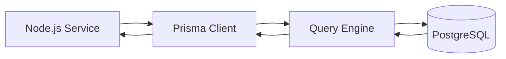
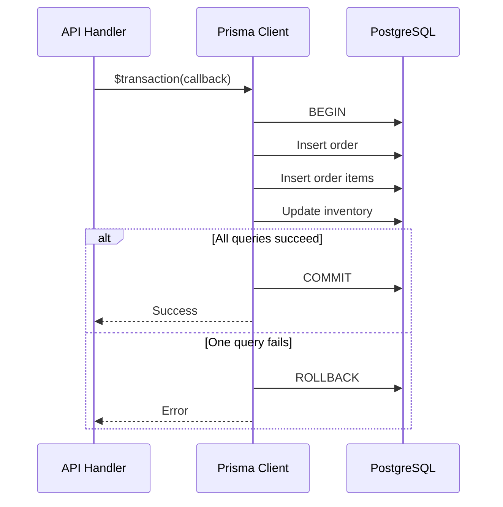

# PostgreSQL and Prisma Interview Questions for Node.js Backend Developers

This guide focuses on how Prisma behaves in real Node.js services: type-safe querying, schema design, migrations, transaction handling, and when to drop down to raw SQL.

## Prisma Request Lifecycle Diagram



## 1. What is Prisma?

Prisma is a modern TypeScript ORM and database toolkit for Node.js. It provides:

- A schema file to define models.
- Generated type-safe client queries.
- Migration support.
- Better developer experience compared to raw SQL-heavy workflows.

It is commonly used with PostgreSQL in TypeScript backend projects.

Example: a NestJS or Express TypeScript service can use Prisma Client to query `users`, `orders`, and `payments` with strongly typed APIs.

## 2. What are the main parts of Prisma?

- Prisma Schema: defines models, datasource, and generator.
- Prisma Client: generated query API used in application code.
- Prisma Migrate: handles schema migrations.
- Prisma Studio: GUI for viewing and editing data.

Example: a developer may update `schema.prisma`, run `prisma migrate dev`, and then query the new model through generated Prisma Client code.

## 3. How does Prisma map to PostgreSQL tables?

Each Prisma model usually maps to a PostgreSQL table, each field maps to a column, and relations map to foreign keys. Prisma hides much of the SQL complexity while still relying on PostgreSQL underneath.

That abstraction is useful, but it is important to remember that Prisma does not change database fundamentals. A badly indexed relation is still badly indexed. A heavy join is still heavy. Good Prisma usage means understanding both the Prisma schema and the PostgreSQL behavior it generates.

Example: if `Order` has many `OrderItem` rows, Prisma can model the relation cleanly, but you still need proper PostgreSQL indexes for fast queries.

## 4. What is the benefit of Prisma in a Node.js backend?

- Strong TypeScript support.
- Autocomplete and compile-time safety.
- Cleaner query code.
- Easier schema evolution.
- Better onboarding for teams.

The trade-off is that very advanced database-specific queries may still require raw SQL.

Example: simple CRUD on users and orders is easy in Prisma, but a specialized window-function report may still be easier in raw SQL.

## 5. What is the Prisma schema file used for?

The schema file defines models, relationships, enums, indexes, datasource config, and generation settings. It acts as a single source of truth for the database model in many Prisma-based projects.

Example: a `User` model with `@id`, `@unique`, and relation fields in `schema.prisma` will drive both generated code and database migration output.

## 6. What is `prisma generate`?

It generates the Prisma Client from the schema so the application can use type-safe database access.

Example: after adding a `status` field to an `Order` model, running `prisma generate` updates TypeScript types so `order.status` is available safely in code.

## 7. What is `prisma migrate dev`?

It creates and applies development migrations based on schema changes. It is typically used locally while building features.

Example: after adding a new `Profile` model during development, `prisma migrate dev` creates the migration files and updates the local database.

## 8. What is `prisma migrate deploy`?

It applies existing migrations in production or deployment environments. This is safer than generating new migrations in production.

Example: CI/CD can run `prisma migrate deploy` during release so staging and production receive the reviewed schema changes only.

## 9. What is Prisma Client?

Prisma Client is the generated API used inside Node.js code, for example:

```ts
const users = await prisma.user.findMany({
  where: { active: true },
  orderBy: { createdAt: 'desc' },
})
```

It returns typed results based on the schema.

Example: if `active` is not a valid field on the `User` model, TypeScript can catch that mistake during development.

## 10. What is the difference between `findUnique`, `findFirst`, and `findMany`?

- `findUnique`: fetches by unique field or unique combination.
- `findFirst`: returns the first matching record.
- `findMany`: returns multiple records.

Use `findUnique` when uniqueness is guaranteed and intended.

Example: use `findUnique({ where: { email } })` when `email` has a unique constraint, and `findMany` when you need all active users.

## 11. How are relationships handled in Prisma?

Prisma defines relations in the schema and supports nested reads and writes. Example relationships include one-to-one, one-to-many, and many-to-many.

Example: a `User` can have many `Post` records, and Prisma can load them through `include: { posts: true }`.

## 12. What is eager loading in Prisma?

Prisma uses `include` or nested `select` to load related records in one query workflow.

Example:

```ts
const user = await prisma.user.findUnique({
  where: { id: userId },
  include: { posts: true },
})
```

This helps reduce N+1 problems when used correctly.

The trade-off is over-fetching. If you use `include` too aggressively, the endpoint may load large related objects the client never needs. In interviews, it is strong to mention that `include` should be used intentionally and `select` is often better for lean read paths.

Example: a profile page may need only `user.name` and `profile.avatarUrl`, not the user’s full history of related records.

## 13. Can Prisma completely eliminate the N+1 problem?

No. Prisma helps structure queries, but developers can still create N+1 patterns by running repeated queries in loops. The engineer still needs to think about query shape and batching.

Example: looping over 100 users and calling `prisma.order.findMany()` for each user still creates 101 total queries.

## 14. How do transactions work in Prisma?

Prisma supports transactions through `$transaction`. You can pass:

- An array of queries for simple atomic execution.
- A callback for interactive transactions.

Transactions are important when multiple writes must succeed together.

For example, if a checkout flow creates an order, inserts order items, decreases stock, and creates a payment record, all of those changes should either commit together or fail together. Prisma makes this easier to express, but the engineer still needs to keep transactions short to avoid holding locks longer than necessary.

Example: if stock update fails inside the transaction, the order and payment rows should roll back too.

## 15. When would you use interactive transactions?

Use them when later operations depend on earlier query results inside the same transaction, such as balance validation, inventory checks, or conditional updates.

Example: read current stock inside the transaction, confirm availability, then decrement inventory and create the order only if the check passes.

## 16. What are the risks of long interactive transactions?

- Longer lock duration.
- Higher contention.
- Greater chance of deadlocks.
- Lower throughput under load.

Keep them short and focused.

Example: do not call an external payment API from inside a long-running Prisma transaction because it keeps the database transaction open unnecessarily.

## 17. When should you use raw SQL with Prisma?

Use raw SQL when:

- You need PostgreSQL-specific features not well represented in Prisma.
- You need a very complex reporting query.
- You need performance tuning beyond ORM abstractions.

Use Prisma raw query APIs carefully and safely with parameter binding.

This is a common senior-level interview topic because good backend engineers know that ORMs improve productivity, but they are not the right abstraction for every query. Advanced reporting, Postgres-specific features, or carefully tuned hot-path queries are valid reasons to step outside the ORM.

Example: a monthly finance report using advanced SQL aggregates may be clearer as a raw query than as deeply nested ORM calls.

## 18. What is the difference between `select` and `include`?

- `select` chooses specific fields.
- `include` loads related records.

Using `select` is often better for performance because it avoids over-fetching.

Example: use `select: { id: true, name: true }` for a dropdown list instead of loading every user field and relation.

## 19. What is over-fetching and why is it a problem?

Over-fetching means retrieving more fields or related data than the endpoint needs. It increases query cost, response payload size, and application memory usage.

Example: an orders summary endpoint may only need order ID and total, not every nested order item and payment attempt.

## 20. How does Prisma help with type safety?

It generates typed query inputs and typed results from the schema. This reduces runtime bugs such as misspelled field names or invalid query shapes.

Example: TypeScript can warn if you try to select a field that does not exist on the Prisma model.

## 21. What are migrations in Prisma and why are they important?

Prisma migrations version-control schema changes. They help teams track database evolution, review changes, and deploy them safely across environments.

Example: when a `role` column is added to `User`, the migration history records exactly when and how that schema change happened.

## 22. What is schema drift?

Schema drift happens when the real database schema no longer matches the expected migration history or Prisma schema. This usually happens when someone changes the database manually outside the migration workflow.

Example: if a production column is renamed manually in PostgreSQL without a corresponding Prisma migration, future deploys may fail or behave unexpectedly.

## 23. How would you structure Prisma in a production Node.js service?

- Create a shared singleton Prisma client.
- Avoid instantiating a new client per request.
- Add graceful shutdown hooks.
- Keep queries close to domain services or repositories.
- Use logging for slow query investigation.
- Validate incoming API input before database calls.

It is also useful to keep Prisma access behind service or repository boundaries instead of scattering raw queries across controllers. That makes business logic easier to test and prevents persistence details from leaking into every layer of the codebase.

Example: a `UserRepository` can encapsulate Prisma calls while controllers deal only with validated request and response logic.

## 24. Why is creating multiple Prisma clients a problem?

It can create too many database connections and waste resources. In long-running Node.js processes, a singleton Prisma client is the common pattern.

Example: creating a new Prisma client inside every request handler can quickly exhaust PostgreSQL connections under load.

## 25. How do you optimize Prisma queries?

- Use `select` to fetch only required fields.
- Avoid query-in-loop patterns.
- Add indexes in PostgreSQL for real query filters.
- Use pagination.
- Inspect generated SQL when debugging.
- Drop down to raw SQL when Prisma abstraction becomes inefficient.

The mature answer here is that Prisma performance work is often database performance work. If the generated query is slow, inspect the SQL, understand the execution plan, then decide whether the fix belongs in query shape, schema design, indexing, or a raw SQL escape hatch.

Example: if a Prisma query filtering by `userId` is slow, the real fix may be adding an index on `user_id` in PostgreSQL.

## Prisma Transaction Flow



## 26. Does Prisma replace database design knowledge?

No. Prisma improves developer experience, but engineers still need to understand indexing, transactions, normalization, query planning, locking, and PostgreSQL behavior.

Example: even with Prisma, you still need to know why a missing index can cause a sequential scan on a large table.

## 27. How do you handle soft deletes with Prisma?

A common approach is adding fields like `deletedAt` or `isDeleted` and filtering them in queries. You also need conventions so deleted records are consistently excluded from reads unless explicitly requested.

Example: instead of deleting a user row permanently, set `deletedAt` and update queries so active-user endpoints ignore soft-deleted rows.

## 28. How would you model a many-to-many relationship in Prisma?

Prisma supports implicit many-to-many in some cases, but explicit join tables are often better when you need metadata such as timestamps, roles, ordering, or audit fields.

Example: use an explicit `UserProject` join model when you need to store a user’s role and joined date on each project.

## 29. What is a common production concern when using Prisma with serverless environments?

Connection management. Serverless concurrency can exhaust database connections quickly. This is why teams often use connection pooling strategies, Accelerate/Data Proxy-type solutions, or an architecture that controls connection growth.

Example: a serverless API that cold-starts many concurrent Prisma clients can overwhelm PostgreSQL without connection pooling controls.

## 30. How do you answer “Prisma vs raw SQL” in an interview?

Prisma is excellent for type safety, maintainability, and common CRUD development speed. Raw SQL is still valuable for advanced tuning, analytics queries, and database-specific features. Strong backend engineers know when to use each one.

Example: use Prisma for normal user and order flows, but keep a raw SQL path for a specialized reporting query with complex joins and aggregates.

## Practical Senior-Level Follow-Up Questions

### How would you use Prisma safely in a layered Node.js backend?

Keep Prisma usage inside repository or service boundaries, validate input before queries, map database errors to domain-friendly API responses, and avoid leaking raw persistence details across the entire codebase.

Example: a service can catch Prisma unique-constraint errors and return a clean `email already exists` API response instead of leaking a low-level database message.

### How do you debug slow Prisma queries?

- Enable query logging where appropriate.
- Identify the exact query shape.
- Inspect the generated SQL.
- Run `EXPLAIN ANALYZE` in PostgreSQL.
- Check indexes and row counts.
- Simplify includes and selects.

Example: if a Prisma endpoint is slow, log the generated SQL, run it in PostgreSQL with `EXPLAIN ANALYZE`, and check whether the missing index or heavy include is the real issue.

### What are Prisma limitations a senior backend engineer should know?

- Not every advanced SQL feature is equally ergonomic.
- Some queries are clearer or faster in raw SQL.
- Migration discipline is still required.
- ORM convenience does not remove database scaling concerns.

Example: Prisma can improve developer productivity a lot, but it will not automatically solve locking, contention, or schema design problems in a busy production system.

## Quick Revision Points

- Prisma is a type-safe ORM/toolkit for Node.js and TypeScript.
- Prisma works well with PostgreSQL for most application queries.
- Use singleton client instances.
- Use `select` to avoid over-fetching.
- Use `$transaction` for atomic multi-step workflows.
- Keep raw SQL as an option for advanced cases.
