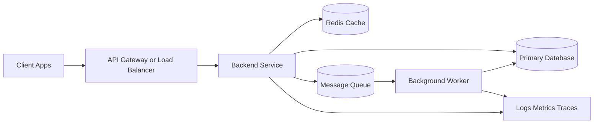
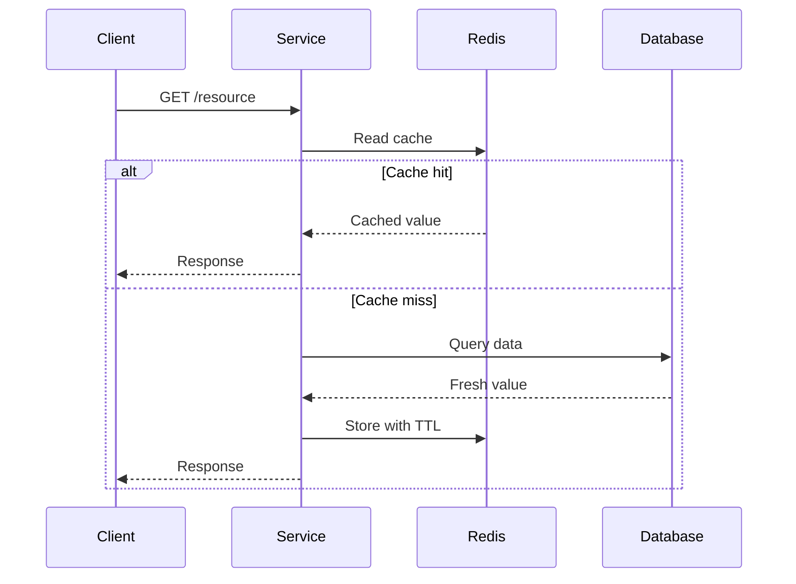
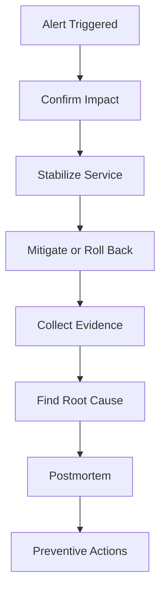

# Senior Backend Developer Generic Interview Questions

This guide is written for senior-level backend interviews where the interviewer expects trade-offs, production thinking, and system-level reasoning instead of short textbook definitions.

## Senior Backend Architecture Overview

## 1. How do you design a scalable backend service?

Start with functional requirements, then pin down scale assumptions: requests per second, peak traffic, latency targets, data growth, consistency needs, and failure tolerance. After that, define service boundaries, choose the data store based on access patterns, and decide what must happen synchronously versus asynchronously.

A senior answer should cover more than horizontal scaling. It should mention stateless compute, connection management, caching strategy, background processing, backpressure, observability, and safe deployment practices. The important part is not saying "use microservices" or "use Redis," but explaining why each piece is needed for the expected workload.

Example: an image-processing platform might keep upload requests synchronous, move thumbnail generation to workers, cache image metadata, and autoscale stateless API pods behind a load balancer.

## 2. How do you decide between monolith and microservices?

I usually start with a modular monolith unless there is a clear reason to split. A monolith is easier to deploy, debug, and maintain early in a product's life. Microservices become useful when the domain boundaries are well understood, teams need independent release cycles, or different workloads scale very differently.

The senior-level point is that microservices solve organizational and scaling problems, but they also introduce network failures, distributed tracing needs, contract management, and operational overhead. If those costs are not justified, microservices are the wrong answer.

Example: a team of four working on one product usually benefits more from a modular monolith than from ten tiny services with separate deployments.

## 3. How do you approach database design for a new product?

I begin with critical workflows rather than only entity names. For example, I want to know how users sign up, place orders, retry payments, search records, and view reporting screens. Those flows reveal the read and write patterns that should shape the schema.

Then I choose keys, constraints, indexes, audit fields, and data retention strategy. A good design supports both correctness and evolution. Senior engineers also think about migrations, zero-downtime rollout, and whether some read models or denormalized tables will be needed later.

Example: for an ecommerce system, separate tables for users, orders, order items, payments, and inventory usually reflect real workflows better than one oversized table.

## 4. What is your approach to API design?

I optimize for predictable contracts. That means consistent naming, strict validation, clear status codes, structured errors, pagination rules, idempotency on retryable writes, and enough documentation that another team can integrate without guessing behavior.

Good API design is mostly about reducing ambiguity. If clients do not know what can be retried, what fields are optional, or what error codes mean, the API will create operational issues even if the implementation is technically correct.

Example: a `POST /payments` endpoint should clearly document whether clients can retry the same idempotency key after a timeout.

## 5. What is idempotency and why is it important?

An idempotent request can be safely repeated without causing additional side effects after the first successful execution. This matters because duplicate requests are normal in real systems: clients retry after timeouts, load balancers resend requests, and webhook providers may deliver the same event multiple times.

For example, a payment endpoint should not charge a card twice because the client retried after a network timeout. The usual solution is an idempotency key stored with the result of the first successful operation.

Example: if `Idempotency-Key: abc-123` is reused, the API should return the original successful payment result instead of creating another charge.

## 6. How do you handle failures in distributed systems?

I assume every network call can fail, time out, or return partial success. The design needs timeouts, retries with backoff, idempotent handlers, circuit breakers where appropriate, dead-letter handling for asynchronous workloads, and enough telemetry to distinguish transient failures from systemic ones.

The key senior point is failure containment. A dependency outage should degrade behavior in a controlled way rather than take down the whole service.

Example: if the recommendation service is down, the checkout flow should still work and simply omit recommendations.

## 7. How do you ensure backend security?

Security starts at design time, not at release time. I focus on authentication, authorization, input validation, query parameterization, secure secret storage, least-privilege access, rate limiting, audit logging, and dependency hygiene.

For sensitive systems, I also want clear ownership of security events, good log retention, and a plan for incident response. Senior candidates are expected to explain how security fits into the delivery process, not just list OWASP terms.

Example: an admin-only endpoint should enforce role checks server-side even if the frontend already hides that action.

## 8. How do you optimize backend performance?

I begin with measurement. First determine whether the bottleneck is the database, CPU, external dependencies, serialization cost, lock contention, or queue backlog. Then optimize the actual hot path.

Common fixes include improving queries, reducing payload size, introducing safe caching, batching I/O, moving non-critical work to background jobs, and reducing cross-service chatter. Performance work without measurement usually creates complexity without meaningful gains.

Example: if an API spends 80% of its time waiting on the database, tuning the query and adding an index matters more than optimizing application string handling.

## 9. What is your caching strategy?

I use caching only where read savings clearly justify the complexity. The first question is not "where can I add Redis," but "what data is expensive enough and stable enough to cache?"

I define cache keys, TTL policy, invalidation strategy, and stale-read tolerance up front. Many production issues come from bad invalidation rather than from missing cache layers.

Example: cache a product details response for 60 seconds, but invalidate it immediately when the product price changes.

## Cache Strategy Diagram

## 10. How do you handle background jobs?

I move work out of the request path when the user does not need an immediate result. Examples include emails, media processing, notifications, exports, and analytics updates. Background job systems must be idempotent, retryable, observable, and able to quarantine poison messages.

The operational part matters: queue depth, retry patterns, dead-letter queues, worker concurrency, and duplicate-processing protection should all be explicit.

Example: sending emails after signup is a good background job because the user does not need to wait for SMTP delivery before receiving the API response.

## 11. How do you design for observability?

I design logs, metrics, and traces as product requirements for operators. The goal is that on-call engineers can answer three questions quickly: what failed, where it failed, and how many users are affected.

That means structured logs, correlation IDs, service and database latency metrics, distributed tracing for request flows, dashboards for key service health indicators, and alerts tied to user-impacting thresholds.

Example: when a request fails, a correlation ID should let you trace it across the API, worker, queue, and database logs.

## 12. What does a good code review focus on?

Correctness comes first. I review for behavioral risk, failure handling, security issues, data consistency, operational impact, and test coverage before I spend time on style or naming.

At senior level, code review is also about protecting the system from future maintenance pain. That means checking whether the change increases coupling, hides errors, or creates silent performance costs.

Example: a review should flag a loop that makes one database call per item because that can become an N+1 production issue.

## 13. How do you manage technical debt?

I separate cosmetic issues from debt that slows delivery, increases incident risk, or makes critical features expensive to change. Then I make the cost visible: slower onboarding, repeated bugs, difficult releases, or brittle code paths.

The practical approach is to tie debt reduction to delivery work or explicit platform effort. If debt is never connected to business risk, it usually remains unfixed.

Example: if every release is slowed by fragile manual deployments, investing in deployment automation is technical debt reduction with direct business value.

## 14. How do you mentor junior backend engineers?

I try to improve judgment, not only implementation speed. That means asking why a design was chosen, how it fails, how it will be observed in production, and what trade-offs were accepted.

Strong mentoring includes code review with reasoning, guided debugging, ownership with safety rails, and teaching how to think about reliability and maintainability early.

Example: instead of just fixing a junior developer’s race condition bug, explain why the transaction boundary was needed and how to spot similar issues later.

## 15. How do you approach incident handling?

The first priority is containment and recovery, not blame. I confirm impact, stabilize the service, gather enough facts to stop the bleeding, and communicate clearly with stakeholders.

After restoration, I want a blameless postmortem that identifies the root cause, missed detection opportunities, and concrete changes to reduce recurrence.

Example: after a bad deployment causes elevated 500s, first roll back, then analyze why alerts were late and why the release was not caught earlier.

## Incident Response Flow

## 16. How do you think about consistency vs availability?

This depends on the business domain. Payment authorization, inventory reservation, and user permissions often need stronger consistency. Activity feeds, analytics dashboards, and search indexes can usually tolerate delayed convergence.

Senior answers should show that this is not a philosophical choice. It is a product requirement decision shaped by the cost of stale or conflicting data.

Example: a trading system may prefer stronger consistency for balances, while an analytics dashboard can tolerate a few seconds of delay.

## 17. What makes a backend system production-ready?

A production-ready service has health checks, logging, metrics, alerts, secure configuration handling, rollback-safe deployment, database migration discipline, backup and recovery thinking, and enough test coverage for the critical user flows.

Production readiness is mostly about operability under failure, not just whether the happy path works locally.

Example: a service that works on localhost but has no alerts, no health checks, and no rollback process is not production-ready.

## 18. How do you prevent race conditions?

I first identify shared mutable state, then choose the control mechanism that matches the risk: transactions, unique constraints, optimistic locking, pessimistic locking, serialized queues, or idempotency keys.

The right answer depends on conflict frequency, correctness requirements, and latency tolerance. Senior candidates should explain why a chosen control method fits the use case.

Example: preventing duplicate coupon redemption may rely on a unique database constraint plus an idempotency key.

## 19. How do you evaluate an architecture proposal?

I check whether it satisfies the actual requirements, how it behaves under failure, how it scales operationally, how hard it will be to support, and whether the complexity is justified.

Many bad designs are technically impressive but operationally expensive. A strong architecture is not the one with the most moving parts. It is the one that solves the problem with defensible complexity.

Example: if one regional service with a queue solves the scaling need, introducing event sourcing plus five microservices may be unjustified complexity.

## 20. What differentiates a senior backend developer from a mid-level developer?

A senior backend engineer is expected to reduce ambiguity, make better trade-offs, design for production realities, and improve the technical quality of the team. The difference is not just coding speed. It is judgment under uncertainty.

Example: a senior engineer is expected to ask about failure modes, migrations, and observability before approving a new architecture direction.

## Common Senior Backend Follow-Up Questions

### How would you improve a slow API used by millions of requests per day?

I would trace the full request path, identify the dominant bottleneck, and optimize that exact layer first. That might mean query tuning, cache introduction, reducing payload size, batching dependent calls, or moving expensive side effects off the request path. Then I would verify improvement through metrics rather than intuition.

Example: if a popular endpoint spends most of its time in a slow SQL join, fix that join and measure latency again before rewriting the whole service.

### How would you break a monolith into services?

I would start from stable domain boundaries and the areas with the highest change rate or scaling pain. Then I would extract incrementally, preserve observability, and avoid creating distributed coordination problems faster than the team can manage them.

Example: separate the billing domain first if it has different scaling and release needs, instead of splitting every module at once.

### How do you handle disagreements on architecture?

I anchor the discussion in requirements, failure modes, delivery cost, and operational complexity. The strongest architecture discussion is evidence-based, not preference-based.

Example: compare two proposals by looking at expected traffic, on-call burden, deployment complexity, and consistency needs instead of arguing from personal framework preference.

## Quick Revision Points

- Senior interviews reward trade-off reasoning more than memorized definitions.
- Every design answer should mention failure handling, observability, and maintenance cost.
- Prefer clear, low-risk systems over clever but fragile ones.
- Explain why a design fits the workload, team, and operational constraints.
