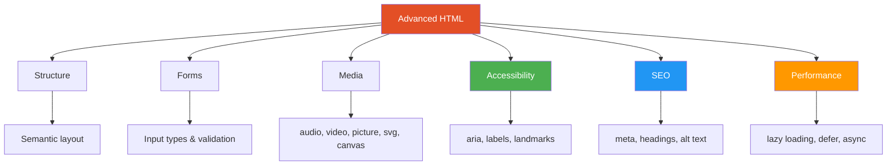
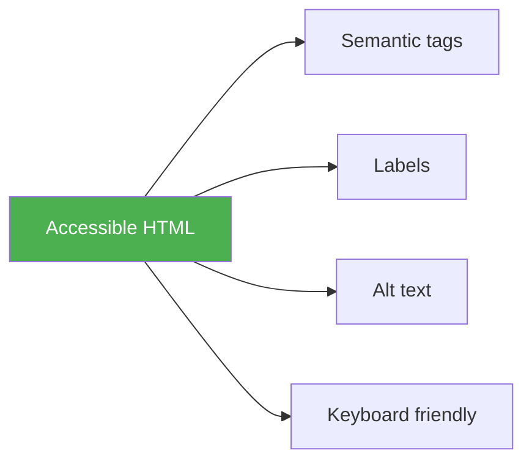
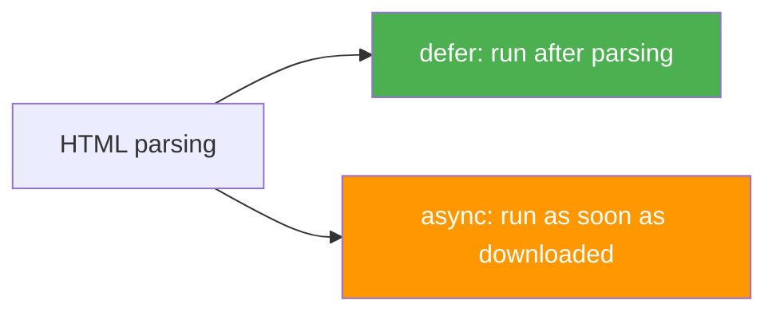

# HTML — Advanced Concepts Guide

> This file covers important advanced HTML topics that go beyond the basics and are commonly used in real projects and interviews.

---

## 📚 Table of Contents

1. [Advanced Semantic Structure](#1-advanced-semantic-structure)
2. [Forms and Modern Input Types](#2-forms-and-modern-input-types)
3. [HTML Validation Attributes](#3-html-validation-attributes)
4. [Lists, Tables, and Best Practices](#4-lists-tables-and-best-practices)
5. [Audio, Video, and Source Elements](#5-audio-video-and-source-elements)
6. [Picture, Responsive Images, and Lazy Loading](#6-picture-responsive-images-and-lazy-loading)
7. [Accessibility in HTML](#7-accessibility-in-html)
8. [SEO-Friendly HTML](#8-seo-friendly-html)
9. [Data Attributes and Custom Metadata](#9-data-attributes-and-custom-metadata)
10. [Web Storage Related HTML Usage](#10-web-storage-related-html-usage)
11. [Canvas and SVG in HTML5](#11-canvas-and-svg-in-html5)
12. [Script Loading — `defer` and `async`](#12-script-loading--defer-and-async)
13. [Embedding External Content Safely](#13-embedding-external-content-safely)
14. [HTML Best Practices](#14-html-best-practices)
15. [Interactive HTML5 Elements — `details`, `summary`, and `dialog`](#15-interactive-html5-elements--details-summary-and-dialog)
16. [Template, Slot, and Reusable Markup](#16-template-slot-and-reusable-markup)
17. [Progressive Enhancement and `noscript`](#17-progressive-enhancement-and-noscript)

---



---

# 1. Advanced Semantic Structure

> Semantic HTML improves readability, SEO, and accessibility.

## Common layout tags

- `header`
- `nav`
- `main`
- `section`
- `article`
- `aside`
- `footer`
- `figure`
- `figcaption`
- `time`
- `address`

## Example

```html
<body>
    <header>
        <h1>Tech Blog</h1>
        <nav>
            <a href="#home">Home</a>
            <a href="#articles">Articles</a>
        </nav>
    </header>

    <main>
        <article>
            <header>
                <h2>HTML5 Semantic Tags</h2>
                <p>Published on <time datetime="2026-05-11">May 11, 2026</time></p>
            </header>

            <section>
                <p>Main article content...</p>
            </section>
        </article>

        <aside>
            <h3>Related Posts</h3>
        </aside>
    </main>

    <footer>
        <address>contact@example.com</address>
    </footer>
</body>
```

---

# 2. Forms and Modern Input Types

> HTML5 introduced many useful input types for better user experience and built-in validation.

## Common HTML5 input types

- `email`
- `password`
- `number`
- `date`
- `time`
- `color`
- `range`
- `url`
- `search`
- `tel`

## Example

```html
<form>
    <label>Email</label>
    <input type="email" name="email" required />

    <label>Age</label>
    <input type="number" name="age" min="18" max="60" />

    <label>Date of Birth</label>
    <input type="date" name="dob" />

    <label>Website</label>
    <input type="url" name="website" />

    <label>Volume</label>
    <input type="range" min="0" max="100" />

    <button type="submit">Submit</button>
</form>
```

---

# 3. HTML Validation Attributes

> HTML provides built-in validation without JavaScript.

## Important validation attributes

| Attribute | Purpose |
|---|---|
| `required` | Field must be filled |
| `min` | Minimum numeric value |
| `max` | Maximum numeric value |
| `minlength` | Minimum text length |
| `maxlength` | Maximum text length |
| `pattern` | Regex pattern match |
| `step` | Numeric step value |
| `readonly` | Input cannot be changed |
| `disabled` | Input is disabled |

## Example

```html
<form>
    <input type="text" name="username" minlength="3" maxlength="15" required />
    <input type="password" name="password" minlength="8" required />
    <input type="text" name="pincode" pattern="[0-9]{6}" required />
    <button type="submit">Register</button>
</form>
```

---

# 4. Lists, Tables, and Best Practices

## Lists

```html
<ul>
    <li>HTML</li>
    <li>CSS</li>
    <li>JavaScript</li>
</ul>

<ol>
    <li>Install editor</li>
    <li>Create file</li>
    <li>Run browser</li>
</ol>
```

## Tables

> Use tables only for tabular data, not page layout.

```html
<table>
    <caption>Student Marks</caption>
    <thead>
        <tr>
            <th>Name</th>
            <th>Marks</th>
        </tr>
    </thead>
    <tbody>
        <tr>
            <td>Aman</td>
            <td>90</td>
        </tr>
    </tbody>
</table>
```

---

# 5. Audio, Video, and Source Elements

> HTML5 provides native media tags, so plugins are no longer required.

## Audio

```html
<audio controls>
    <source src="song.mp3" type="audio/mpeg" />
    Your browser does not support audio.
</audio>
```

## Video

```html
<video controls width="500" poster="poster.jpg">
    <source src="movie.mp4" type="video/mp4" />
    Your browser does not support video.
</video>
```

## Why `source` is useful

It allows multiple file formats for browser compatibility.

```html
<video controls>
    <source src="movie.mp4" type="video/mp4" />
    <source src="movie.webm" type="video/webm" />
</video>
```

---

# 6. Picture, Responsive Images, and Lazy Loading

> Modern HTML supports responsive images to improve performance.

## `img`

```html

```

## `picture`

```html
<picture>
    <source media="(max-width: 600px)" srcset="small.jpg" />
    <source media="(max-width: 1000px)" srcset="medium.jpg" />
    
</picture>
```

## Benefits

- Loads correct image for screen size
- Improves speed
- Saves bandwidth

---

# 7. Accessibility in HTML

> Accessibility means making web pages usable for everyone, including screen reader and keyboard users.

## Important practices

- Use semantic tags
- Always use `label` with form controls
- Add `alt` text to images
- Use correct heading order
- Prefer buttons for actions and links for navigation
- Use `title` on `iframe`
- Use ARIA only when needed

## Example

```html
<form>
    <label for="email">Email Address</label>
    <input id="email" type="email" name="email" required />

    <button type="submit">Submit</button>
</form>


<iframe src="https://example.com" title="Company Dashboard"></iframe>
```



---

# 8. SEO-Friendly HTML

> Search engines understand pages better when HTML is well structured.

## Best practices

- Use one clear `h1`
- Use `title` tag properly
- Use `meta description`
- Use semantic structure
- Add descriptive `alt` text
- Use meaningful link text

## Example

```html
<head>
    <title>HTML Interview Notes for Beginners</title>
    <meta name="description" content="Learn important HTML interview concepts with examples." />
</head>
<body>
    <main>
        <article>
            <h1>HTML Interview Notes</h1>
            <p>Understand HTML and HTML5 concepts with examples.</p>
            <a href="/html-guide">Read full HTML guide</a>
        </article>
    </main>
</body>
```

---

# 9. Data Attributes and Custom Metadata

> `data-*` attributes store custom data on HTML elements.

## Example

```html
<button data-user-id="101" data-role="admin">Edit User</button>
```

JavaScript can read them later.

```javascript
const button = document.querySelector('button');
console.log(button.dataset.userId); // 101
console.log(button.dataset.role);   // admin
```

---

# 10. Web Storage Related HTML Usage

> HTML5 works closely with browser storage APIs like `localStorage` and `sessionStorage`.

```html
<input type="text" id="nameInput" placeholder="Enter name" />
<button onclick="saveName()">Save</button>

<script>
function saveName() {
    const value = document.getElementById('nameInput').value;
    localStorage.setItem('username', value);
}
</script>
```

| Storage | Lifetime |
|---|---|
| `localStorage` | Until manually removed |
| `sessionStorage` | Until browser/tab closes |

---

# 11. Canvas and SVG in HTML5

## Canvas

> `canvas` is used for drawing graphics through JavaScript.

```html
<canvas id="myCanvas" width="200" height="100"></canvas>
<script>
const canvas = document.getElementById('myCanvas');
const ctx = canvas.getContext('2d');
ctx.fillStyle = 'blue';
ctx.fillRect(20, 20, 150, 50);
</script>
```

## SVG

> SVG is vector-based and remains sharp at any size.

```html
<svg width="200" height="100">
    <circle cx="50" cy="50" r="40" fill="orange" />
</svg>
```

## Canvas vs SVG

| Feature | Canvas | SVG |
|---|---|---|
| Type | Pixel-based | Vector-based |
| Best for | Games, charts, animations | Icons, logos, shapes |
| Scalable | No | Yes |

---

# 12. Script Loading — `defer` and `async`

> These attributes control how external JavaScript files load.

## `defer`

- Downloads script in parallel
- Executes after HTML parsing
- Keeps script order

## `async`

- Downloads script in parallel
- Executes immediately after download
- Order is not guaranteed

```html
<script src="app.js" defer></script>
<script src="analytics.js" async></script>
```



---

# 13. Embedding External Content Safely

> When using `iframe`, apply safety and performance practices.

## Best practices

- Use `title`
- Use `loading="lazy"`
- Use `sandbox` when possible
- Limit permissions with `allow`

## Example

```html
<iframe
    src="https://example.com"
    title="External dashboard"
    loading="lazy"
    sandbox="allow-scripts allow-same-origin"
    width="600"
    height="400"
></iframe>
```

---

# 14. HTML Best Practices

## Checklist

- Always declare `<!DOCTYPE html>`
- Use semantic tags where possible
- Keep heading order correct
- Add `lang` attribute to `html`
- Add `meta charset="UTF-8"`
- Add viewport meta tag
- Use descriptive alt text
- Use labels for inputs
- Avoid using tables for layout
- Prefer external CSS and JS
- Validate HTML regularly

## Full Example

```html
<!DOCTYPE html>
<html lang="en">
<head>
    <meta charset="UTF-8" />
    <meta name="viewport" content="width=device-width, initial-scale=1.0" />
    <title>Advanced HTML Example</title>
    <meta name="description" content="Advanced HTML structure with accessibility and media." />
    <script src="app.js" defer></script>
</head>
<body>
    <header>
        <h1>Advanced HTML</h1>
        <nav>
            <a href="#features">Features</a>
            <a href="#contact">Contact</a>
        </nav>
    </header>

    <main>
        <section id="features">
            <article>
                <h2>Responsive Media</h2>
                <picture>
                    <source media="(max-width: 600px)" srcset="small.jpg" />
                    
                </picture>
            </article>
        </section>

        <section id="contact">
            <h2>Contact Us</h2>
            <form>
                <label for="email">Email</label>
                <input id="email" type="email" required />
                <button type="submit">Send</button>
            </form>
        </section>
    </main>

    <footer>
        <p>&copy; 2026 HTML Notes</p>
    </footer>
</body>
</html>
```

---

# 15. Interactive HTML5 Elements — `details`, `summary`, and `dialog`

> HTML5 includes built-in interactive elements that reduce the need for custom JavaScript.

## `details` and `summary`

These create a native expandable/collapsible section.

```html
<details>
    <summary>What is HTML5?</summary>
    <p>HTML5 is the latest major version of HTML.</p>
</details>
```

## `dialog`

> The `dialog` element is used to create modal or popup dialogs.

```html
<dialog id="infoDialog">
    <p>This is a native HTML dialog.</p>
    <button onclick="document.getElementById('infoDialog').close()">Close</button>
</dialog>

<button onclick="document.getElementById('infoDialog').showModal()">
    Open Dialog
</button>
```

## Why they matter

- Native browser behavior
- Better accessibility support
- Less custom code required

---

# 16. Template, Slot, and Reusable Markup

## `template`

> The `template` element stores HTML that is not rendered immediately. It can be reused later with JavaScript.

```html
<template id="cardTemplate">
    <div class="card">
        <h3>Template Title</h3>
        <p>Template description</p>
    </div>
</template>
```

```javascript
const template = document.getElementById('cardTemplate');
const clone = template.content.cloneNode(true);
document.body.appendChild(clone);
```

## `slot`

> `slot` is mainly used with Web Components to insert custom content into a component.

```html
<my-card>
    <span slot="title">Profile Card</span>
    <p>User details go here.</p>
</my-card>
```

## Why it matters

- Useful in reusable UI systems
- Helpful with Web Components
- Keeps markup clean and flexible

---

# 17. Progressive Enhancement and `noscript`

> Progressive enhancement means building the basic experience first, then adding advanced behavior for capable browsers.

## `noscript`

> The `noscript` tag displays content when JavaScript is disabled or unsupported.

```html
<noscript>
    <p>This website works better with JavaScript enabled.</p>
</noscript>
```

## Example approach

```html
<form action="/search" method="get">
    <input type="search" name="q" />
    <button type="submit">Search</button>
</form>

<noscript>
    <p>Search suggestions are disabled because JavaScript is off.</p>
</noscript>
```

## Benefits

- Better accessibility
- Works on slower or restricted browsers
- Improves resilience of the page

---

## Quick Revision Table

| Topic | Summary |
|---|---|
| Semantic layout | Gives clear page meaning |
| Forms | HTML5 input types improve UX |
| Validation | Built-in constraints without JS |
| Media | `audio`, `video`, `source` are native |
| Responsive images | `picture`, `srcset`, `loading="lazy"` |
| Accessibility | Better for all users and screen readers |
| SEO | Proper headings, metadata, semantics |
| Canvas/SVG | Graphics support in HTML5 |
| `defer` / `async` | Better script loading behavior |
| Safe iframe | Use `title`, `sandbox`, `loading` |
| `details`, `summary`, `dialog` | Native interactive elements |
| `template` and `slot` | Reusable markup patterns |
| `noscript` | Fallback content when JS is disabled |

---

*Notes based on HTML5 practical concepts, interview topics, and web standards.*