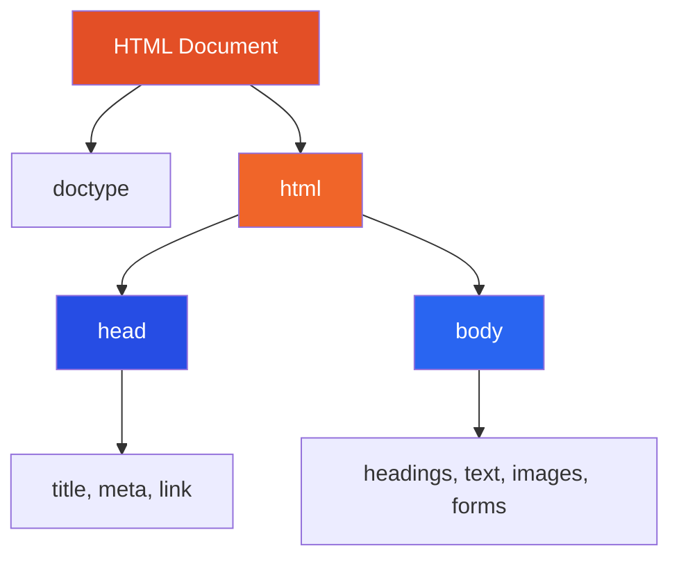
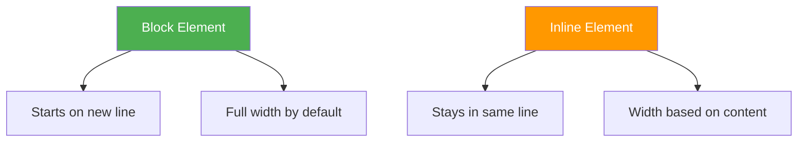
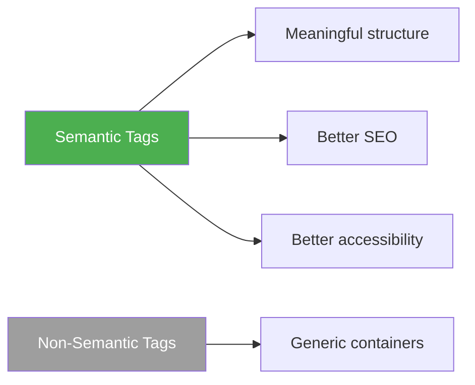

# HTML — Beginner Guide

> HTML stands for **HyperText Markup Language**. It is the standard markup language used to structure content on the web.

---

## 📚 Table of Contents

1. [What is HTML?](#1-what-is-html)
2. [What is `<!DOCTYPE html>` in HTML5?](#2-what-is-doctype-html-in-html5)
3. [Difference Between HTML and HTML5](#3-difference-between-html-and-html5)
4. [What is an Attribute in HTML?](#4-what-is-an-attribute-in-html)
5. [Block-Level and Inline Elements](#5-block-level-and-inline-elements)
6. [Difference Between `div` and `span`](#6-difference-between-div-and-span)
7. [Semantic and Non-Semantic Tags](#7-semantic-and-non-semantic-tags)
8. [Formatting Tags in HTML](#8-formatting-tags-in-html)
9. [Difference Between `b` and `strong`](#9-difference-between-b-and-strong)
10. [What is the Viewport Meta Tag?](#10-what-is-the-viewport-meta-tag)
11. [What is `iframe` in HTML5?](#11-what-is-iframe-in-html5)
12. [Basic HTML5 Page Structure](#12-basic-html5-page-structure)
13. [Headings, Paragraphs, and Comments](#13-headings-paragraphs-and-comments)
14. [Links and Images](#14-links-and-images)
15. [Lists in HTML](#15-lists-in-html)
16. [Forms — Basic Building Blocks](#16-forms--basic-building-blocks)
17. [Difference Between `id` and `class`](#17-difference-between-id-and-class)
18. [HTML Entities and Empty Elements](#18-html-entities-and-empty-elements)

---



---

# 1. What is HTML?

> HTML is used to define the **structure** of a web page. It tells the browser what is a heading, paragraph, image, link, button, table, form, and more.

## Example

```html
<!DOCTYPE html>
<html lang="en">
<head>
    <meta charset="UTF-8" />
    <title>My First Page</title>
</head>
<body>
    <h1>Hello World</h1>
    <p>This is my first HTML page.</p>
</body>
</html>
```

---

# 2. What is `<!DOCTYPE html>` in HTML5?

> `<!DOCTYPE html>` tells the browser that the document is an **HTML5 document**.
>
> It is not an HTML tag. It is a **declaration** placed at the top of the file.

## Why it is needed

- Tells browser to render in **standards mode**
- Prevents old **quirks mode** behavior
- Ensures modern HTML5 parsing rules are used

## Example

```html
<!DOCTYPE html>
<html>
<head>
    <title>HTML5 Document</title>
</head>
<body>
    <h1>Using HTML5</h1>
</body>
</html>
```

## Without doctype

The browser may guess older rules and your layout may behave unexpectedly.

---

# 3. Difference Between HTML and HTML5

> HTML5 is the latest major version of HTML. It introduced better semantics, media support, APIs, and simpler syntax.

| Feature | HTML | HTML5 |
|---|---|---|
| Doctype | Long and complex | `<!DOCTYPE html>` |
| Media | Needed plugins | Native `audio` and `video` |
| Semantic tags | Very limited | `header`, `footer`, `article`, `section`, `nav` |
| Graphics | No canvas/svg focus | `canvas`, `svg` support |
| Storage | Cookies mainly | `localStorage`, `sessionStorage` |
| Forms | Basic input types | New types like `email`, `date`, `range` |

## Example

```html
<!-- HTML5 semantic structure -->
<header>Website Header</header>
<nav>Main Navigation</nav>
<main>
    <section>
        <article>Article content</article>
    </section>
</main>
<footer>Website Footer</footer>
```

---

# 4. What is an Attribute in HTML?

> An **attribute** provides extra information about an HTML element.
>
> Attributes are written inside the opening tag as `name="value"` pairs.

## Common attributes

| Attribute | Purpose |
|---|---|
| `id` | Unique identifier |
| `class` | Group elements for CSS/JS |
| `href` | Link destination |
| `src` | Image/file source |
| `alt` | Alternative text for images |
| `title` | Tooltip text |
| `style` | Inline CSS |
| `target` | Where to open a link |

## Example

```html
<a href="https://example.com" target="_blank" title="Open website">Visit Site</a>

<p id="intro" class="highlight">Welcome</p>
```

---

# 5. Block-Level and Inline Elements

## Block-Level Elements

> Block-level elements start on a **new line** and usually take the **full available width**.

Common examples:
- `div`
- `p`
- `h1` to `h6`
- `section`
- `article`
- `header`
- `footer`
- `ul`, `ol`, `li`

## Inline Elements

> Inline elements do **not start on a new line** and only take as much width as needed.

Common examples:
- `span`
- `a`
- `strong`
- `em`
- `img`
- `label`



## Example

```html
<div>This is a block element</div>
<div>This comes on a new line</div>

<span>This is inline</span>
<span>This stays on the same line</span>
```

---

# 6. Difference Between `div` and `span`

> Both `div` and `span` are generic containers, but they behave differently.

| Feature | `div` | `span` |
|---|---|---|
| Type | Block-level | Inline |
| New line | Yes | No |
| Width | Full width | Content width |
| Use | Group large sections/layout | Style small text parts |

## Example

```html
<div class="card">
    <h2>Product Title</h2>
    <p>This whole area is grouped by div.</p>
</div>

<p>Total price: <span class="price">₹499</span></p>
```

---

# 7. Semantic and Non-Semantic Tags

## Semantic Tags

> Semantic tags clearly describe their meaning to both browser and developer.

Examples:
- `header`
- `nav`
- `main`
- `section`
- `article`
- `aside`
- `footer`
- `figure`
- `figcaption`

## Non-Semantic Tags

> Non-semantic tags do not tell anything about their content.

Examples:
- `div`
- `span`



## Example

```html
<!-- Non-semantic -->
<div class="header">My Site</div>
<div class="nav">Menu</div>
<div class="content">Article</div>

<!-- Semantic -->
<header>My Site</header>
<nav>Menu</nav>
<main>
    <article>Article</article>
</main>
```

---

# 8. Formatting Tags in HTML

> Formatting tags are used to style or emphasize text meaning.

## Common formatting tags

| Tag | Meaning |
|---|---|
| `b` | Bold text without importance |
| `strong` | Important text |
| `i` | Alternate voice / italic presentation |
| `em` | Emphasized text |
| `mark` | Highlighted text |
| `small` | Smaller text |
| `del` | Deleted text |
| `ins` | Inserted text |
| `sub` | Subscript |
| `sup` | Superscript |
| `u` | Unarticulated annotation / underline style |

## Example

```html
<p><b>Bold</b> text</p>
<p><strong>Important</strong> text</p>
<p><i>Italic</i> text</p>
<p><em>Emphasized</em> text</p>
<p><mark>Highlighted</mark> text</p>
<p>H<sub>2</sub>O</p>
<p>2<sup>5</sup> = 32</p>
<p><del>Old price</del> <ins>New price</ins></p>
```

---

# 9. Difference Between `b` and `strong`

> `b` and `strong` may look similar visually, but their meaning is different.

| Tag | Purpose | Meaning |
|---|---|---|
| `b` | Makes text bold | No extra importance |
| `strong` | Indicates strong importance | Semantic importance |

## Example

```html
<p><b>Sale</b> starts today.</p>
<p><strong>Warning:</strong> Do not turn off the system.</p>
```

> Use `strong` when the content is important. Use `b` only when you want bold styling without meaning.

---

# 10. What is the Viewport Meta Tag?

> The viewport meta tag controls how a page is displayed on mobile devices.

## Syntax

```html
<meta name="viewport" content="width=device-width, initial-scale=1.0" />
```

## Meaning

| Part | Meaning |
|---|---|
| `width=device-width` | Page width matches device width |
| `initial-scale=1.0` | Initial zoom level is 100% |

## Why it is important

- Makes pages responsive
- Prevents mobile pages from appearing zoomed out
- Required for proper CSS media query behavior

## Example

```html
<head>
    <meta charset="UTF-8" />
    <meta name="viewport" content="width=device-width, initial-scale=1.0" />
    <title>Responsive Page</title>
</head>
```

---

# 11. What is `iframe` in HTML5?

> The `iframe` tag is used to embed another HTML page or external content inside the current page.

## Common uses

- Embed YouTube videos
- Show Google Maps
- Load another web page
- Integrate dashboards/widgets

## Example

```html
<iframe
    src="https://example.com"
    width="600"
    height="300"
    title="Example Site"
></iframe>
```

## Important attributes

| Attribute | Purpose |
|---|---|
| `src` | URL to load |
| `width` | Width of frame |
| `height` | Height of frame |
| `title` | Accessibility label |
| `loading="lazy"` | Lazy-load the frame |
| `allowfullscreen` | Allow fullscreen content |

## Example with YouTube

```html
<iframe
    width="560"
    height="315"
    src="https://www.youtube.com/embed/dQw4w9WgXcQ"
    title="YouTube video player"
    allowfullscreen
></iframe>
```

---

# 12. Basic HTML5 Page Structure

```html
<!DOCTYPE html>
<html lang="en">
<head>
    <meta charset="UTF-8" />
    <meta name="viewport" content="width=device-width, initial-scale=1.0" />
    <title>HTML Beginner Page</title>
</head>
<body>
    <header>
        <h1>My Website</h1>
    </header>

    <main>
        <section>
            <h2>About</h2>
            <p>This is a semantic HTML5 page.</p>
        </section>

        <section>
            <h2>Video</h2>
            <iframe
                src="https://example.com"
                width="400"
                height="200"
                title="Embedded Example"
            ></iframe>
        </section>
    </main>

    <footer>
        <p>&copy; 2026 My Website</p>
    </footer>
</body>
</html>
```

---

# 13. Headings, Paragraphs, and Comments

> Headings and paragraphs are the most common content elements in HTML. Comments are used to leave notes in code that are not shown in the browser.

## Headings

HTML provides six heading levels: `h1` to `h6`.

- `h1` is the most important heading
- `h6` is the least important heading
- Use headings in proper order for readability and SEO

```html
<h1>Main Page Title</h1>
<h2>Section Title</h2>
<h3>Subsection Title</h3>
```

## Paragraph

```html
<p>This is a paragraph in HTML.</p>
<p>Browsers add space before and after paragraphs by default.</p>
```

## Comment

> HTML comments are ignored by the browser and are useful for notes, explanations, and temporary code markers.

```html
<!-- This is an HTML comment -->

<h1>Welcome</h1>
<!-- <p>This paragraph is temporarily hidden in code</p> -->
```

---

# 14. Links and Images

## Links

> The anchor tag `a` is used to create links.

```html
<a href="https://example.com">Visit Example</a>
<a href="about.html">About Page</a>
<a href="#contact">Go to Contact Section</a>
```

## Important link attributes

| Attribute | Purpose |
|---|---|
| `href` | Link destination |
| `target="_blank"` | Open in new tab |
| `rel="noopener noreferrer"` | Security for new tab links |

```html
<a href="https://example.com" target="_blank" rel="noopener noreferrer">
    Open Website
</a>
```

## Images

> The `img` tag is used to display images. It is an empty element.

```html

```

## Important image attributes

| Attribute | Purpose |
|---|---|
| `src` | Image source |
| `alt` | Alternative text |
| `width` | Width of image |
| `height` | Height of image |
| `loading="lazy"` | Lazy load image |

---

# 15. Lists in HTML

> HTML supports ordered, unordered, and description lists.

## Unordered List

```html
<ul>
    <li>HTML</li>
    <li>CSS</li>
    <li>JavaScript</li>
</ul>
```

## Ordered List

```html
<ol>
    <li>Open editor</li>
    <li>Create file</li>
    <li>Run browser</li>
</ol>
```

## Description List

```html
<dl>
    <dt>HTML</dt>
    <dd>Markup language for web pages</dd>

    <dt>CSS</dt>
    <dd>Style language for web pages</dd>
</dl>
```

---

# 16. Forms — Basic Building Blocks

> Forms are used to collect user input.

## Common form elements

- `form`
- `input`
- `label`
- `textarea`
- `select`
- `option`
- `button`

```html
<form action="/submit" method="post">
    <label for="name">Name</label>
    <input id="name" name="name" type="text" />

    <label for="message">Message</label>
    <textarea id="message" name="message"></textarea>

    <label for="city">City</label>
    <select id="city" name="city">
        <option value="delhi">Delhi</option>
        <option value="mumbai">Mumbai</option>
    </select>

    <button type="submit">Send</button>
</form>
```

## Why `label` is important

- Improves accessibility
- Helps screen readers
- Clicking the label focuses the input

---

# 17. Difference Between `id` and `class`

> Both `id` and `class` are attributes used to identify elements, but they are used differently.

| Feature | `id` | `class` |
|---|---|---|
| Uniqueness | Must be unique on page | Can be reused |
| Usage | One specific element | Multiple similar elements |
| CSS selector | `#header` | `.card` |
| JavaScript use | Often for a single element | Often for groups |

```html
<div id="main-header">Website Title</div>

<div class="card">Card 1</div>
<div class="card">Card 2</div>
<div class="card">Card 3</div>
```

---

# 18. HTML Entities and Empty Elements

## HTML Entities

> Entities are used to display reserved characters or special symbols in HTML.

| Entity | Output | Meaning |
|---|---|---|
| `&lt;` | < | Less than |
| `&gt;` | > | Greater than |
| `&amp;` | & | Ampersand |
| `&copy;` | © | Copyright |
| `&nbsp;` | non-breaking space | Space that does not break |

```html
<p>Use &lt;h1&gt; to create a heading.</p>
<p>&copy; 2026 My Website</p>
```

## Empty Elements

> Empty elements do not have closing tags because they do not contain content.

Common examples:

- `br`
- `hr`
- `img`
- `input`
- `meta`
- `link`

```html
<p>Hello<br />World</p>
<hr />

```

---

## Quick Revision Table

| Topic | One-line Summary |
|---|---|
| `<!DOCTYPE html>` | Declares the document as HTML5 |
| `div` vs `span` | `div` is block, `span` is inline |
| Semantic tags | Meaningful structure tags |
| HTML vs HTML5 | HTML5 adds modern features and APIs |
| `iframe` | Embeds another page/content |
| Formatting tags | Tags for emphasis and text meaning |
| `b` vs `strong` | Bold style vs semantic importance |
| Viewport | Makes page responsive on mobile |
| Attributes | Extra info inside tags |
| Block vs inline | New line/full width vs content width |
| Headings and comments | Structure content and annotate code |
| Links and images | Connect pages and show media |
| Lists | Ordered, unordered, and description lists |
| Forms | Collect user input |
| `id` vs `class` | Unique selector vs reusable group |
| Entities and empty elements | Show special symbols and self-contained tags |

---

*Notes based on HTML5 standard concepts and practical interview topics.*