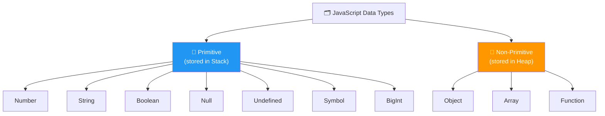
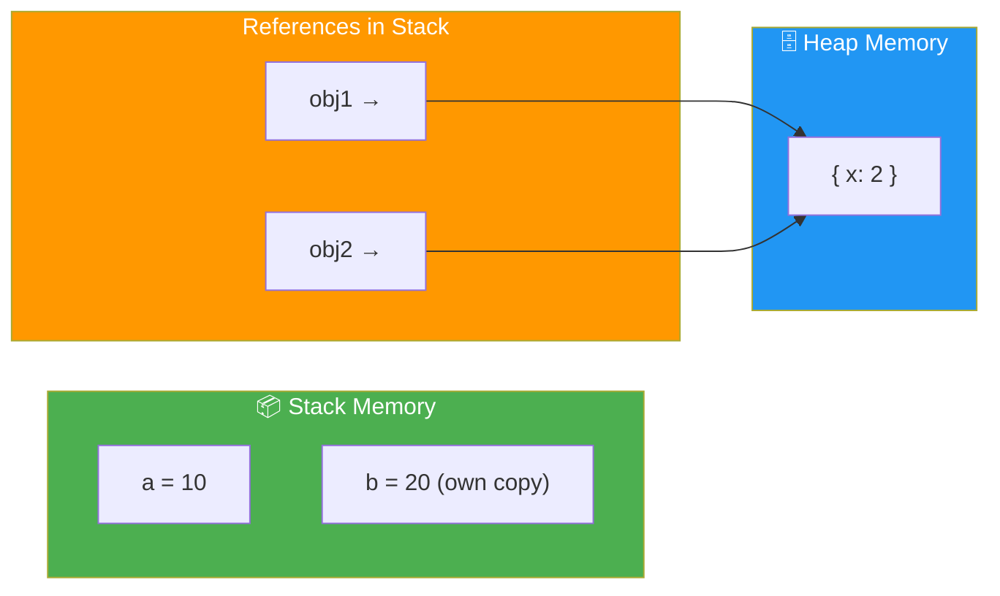
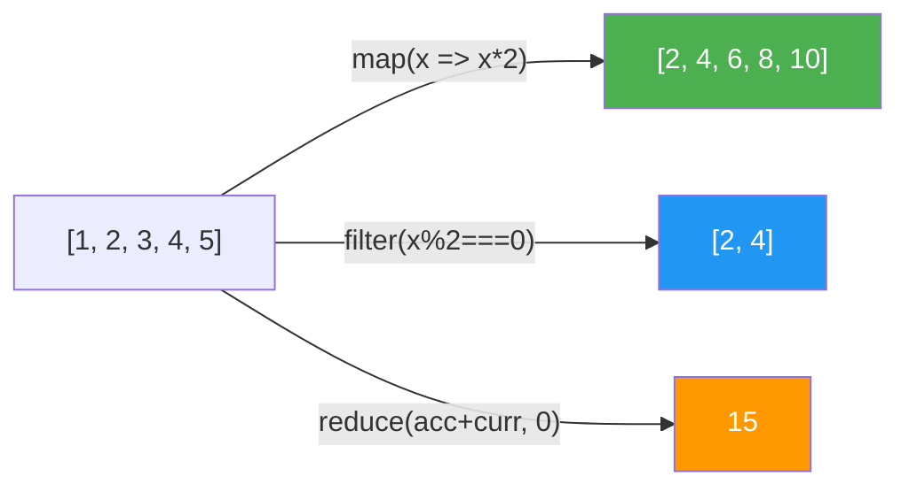
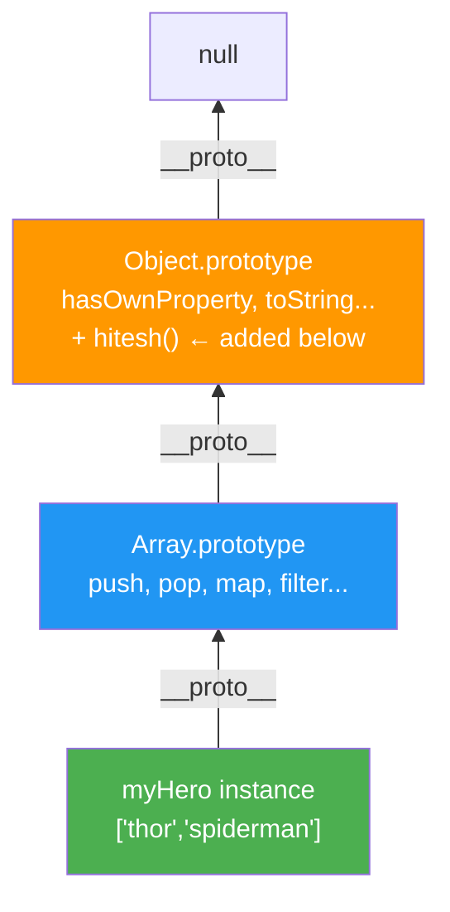
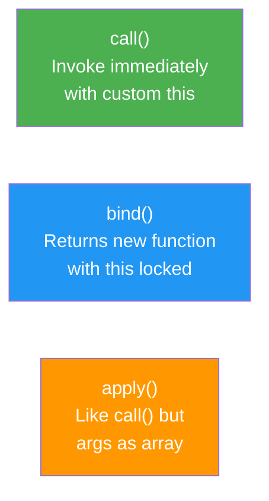

# JavaScript Notes — Structured Study Guide

## 📚 Table of Contents

1. [JavaScript Data Types](#1-javascript-data-types)
2. [Stack and Heap Memory](#2-stack-and-heap-memory)
3. [Strings in JavaScript](#3-strings-in-javascript)
4. [Numbers and Math](#4-numbers-and-math)
5. [Date and Time](#5-date-and-time)
6. [Arrays in JavaScript](#6-arrays-in-javascript)
7. [Objects in JavaScript](#7-objects-in-javascript)
8. [OOP in JavaScript](#8-object-oriented-programming)
9. [Prototypes](#9-magic-of-prototype)
10. [call(), bind(), Getters & Setters](#10-call-bind-getterssetters)

---

# 1. JavaScript Data Types



## Primitive Types

> **Primitive types** are the most basic building blocks of data in JavaScript. They are stored **directly by value** in **Stack memory**, which means when you assign a primitive to a new variable, JavaScript creates a completely independent copy of that value — changes to one variable never affect the other. Primitives are also **immutable**: you cannot change the value itself in memory; you can only replace it with a new value. There are exactly **7 primitive types** in JavaScript.

> 💡 `typeof null` returning `"object"` is a **historical bug** in JS from its very first version (1995) — `null` is NOT an object, it simply represents the intentional absence of any value. It was never fixed to avoid breaking existing web pages.

| Type | Example | `typeof` |
|---|---|---|
| Number | `42`, `3.14` | `"number"` |
| String | `"hello"` | `"string"` |
| Boolean | `true`, `false` | `"boolean"` |
| Null | `null` | `"object"` ⚠️ |
| Undefined | `undefined` | `"undefined"` |
| Symbol | `Symbol('id')` | `"symbol"` |
| BigInt | `123n` | `"bigint"` |

```javascript
let score = 100;
let name = "Hitesh";
let isLoggedIn = true;
let id = Symbol('123');
let bigNumber = 123n;

console.log(typeof score);     // "number"
console.log(typeof name);      // "string"
console.log(typeof null);      // "object" ← known JS quirk
console.log(typeof undefined); // "undefined"
```

## Non-Primitive Types

> **Non-primitive types** (also called **Reference types**) are complex data structures stored in **Heap memory** — a large, unordered memory pool. When you assign an object/array to a variable, the variable doesn't hold the object itself; it holds a **reference (memory address/pointer)** to where the object lives in the Heap. This means two variables can point to the **same object**, so modifying through one variable affects the other. Unlike primitives, non-primitives are **mutable** — their contents can be changed after creation.

```javascript
const heroes = ["Shaktiman", "Naagraj"];

const myObj = {
  name: "Hitesh",
  age: 30
};

function sayHello() {
  console.log("Hello");
}

console.log(typeof heroes);   // "object"
console.log(typeof myObj);    // "object"
console.log(typeof sayHello); // "function"
```

---

# 2. Stack and Heap Memory



## Stack Memory

- Stores **primitive** values (`number`, `string`, `boolean`, `null`, `undefined`, `symbol`, `bigint`)
- Works as a **LIFO (Last In First Out)** data structure — the most recently added item is removed first
- Memory is allocated and deallocated **automatically and instantly** when a function enters/exits scope
- **Fast access** because the size of primitives is fixed and known at compile time
- Uses **value copy** — assigning a primitive to another variable creates a completely **independent copy**; changes to one do NOT affect the other
- Limited in size — very large data shouldn't be stored here

## Heap Memory

- Stores **objects, arrays, and functions** — data structures whose size may not be known ahead of time or can grow dynamically
- Works as a **large, unstructured pool** of memory — no strict ordering like the Stack
- Memory is managed by the **Garbage Collector** — JS automatically frees Heap memory when no variable holds a reference to an object any more
- **Slower access** compared to Stack because a pointer lookup is involved
- Uses **reference copy** — assigning an object to another variable copies only the **memory address (reference)**, not the actual object. Both variables point to the **same object in Heap**, so a change through either variable is visible from both

```javascript
// Stack Example — value copy
let a = 10;
let b = a;   // b gets its OWN copy

b = 20;

console.log(a); // 10  ← unchanged
console.log(b); // 20

// Heap Example — reference copy
let obj1 = { x: 1 };
let obj2 = obj1;  // obj2 points to SAME object in heap

obj2.x = 2;

console.log(obj1.x); // 2  ← affected!
```

> ⚠️ **Key Takeaway:** Primitives → independent copies. Objects → shared reference.

---

# 3. Strings in JavaScript

> A **String** in JavaScript is a sequence of **UTF-16 encoded characters** used to represent text. Strings are a **primitive type**, which means they are **immutable** — once a string is created in memory, its characters cannot be individually changed or modified. Every string method (like `toUpperCase()`, `slice()`, `replace()`) does **not** mutate the original string; it always **returns a brand new string** with the result applied. This is why you must always capture the return value. Strings can be created with single quotes `'`, double quotes `"`, or backticks `` ` `` (template literals).

## Template Literals

```javascript
const name = "Hitesh";
const repoCount = 50;

console.log(`Hello my name is ${name} and my repo count is ${repoCount}`);
// Hello my name is Hitesh and my repo count is 50

// Expressions inside template literals
console.log(`2 + 2 = ${2 + 2}`); // 2 + 2 = 4
```

## String Methods

| Method | Description | Example Output |
|---|---|---|
| `charAt(i)` | Character at index | `'hello'.charAt(1)` → `'e'` |
| `indexOf(s)` | Find index of substring | `'hello'.indexOf('l')` → `2` |
| `substring(s,e)` | Extract substring (no negatives) | `'hello'.substring(1,3)` → `'el'` |
| `slice(s,e)` | Extract string (supports negatives) | `'hello'.slice(-3)` → `'llo'` |
| `trim()` | Remove leading/trailing spaces | `' hi '.trim()` → `'hi'` |
| `replace(a,b)` | Replace first match | `'hi hi'.replace('hi','hey')` → `'hey hi'` |
| `split(sep)` | Convert to array | `'a-b-c'.split('-')` → `['a','b','c']` |
| `includes(s)` | Check if contains string | `'hello'.includes('ell')` → `true` |
| `toUpperCase()` | Convert to uppercase | `'hello'.toUpperCase()` → `'HELLO'` |

```javascript
const gameName = new String('hitesh-hc-com');

console.log(gameName.length);          // 13
console.log(gameName.toUpperCase());   // HITESH-HC-COM
console.log(gameName.charAt(2));       // t
console.log(gameName.indexOf('t'));    // 2
console.log(gameName.split('-'));      // ['hitesh', 'hc', 'com']
console.log(gameName.slice(0, 6));     // hitesh
console.log(gameName.replace('-','.')); // hitesh.hc-com
```

---

# 4. Numbers and Math

## Number Methods

| Method | Description | Example |
|---|---|---|
| `toFixed(n)` | Fixed decimal places | `(3.14159).toFixed(2)` → `"3.14"` |
| `toPrecision(n)` | Total significant digits | `(123.8966).toPrecision(4)` → `"123.9"` |
| `toString()` | Convert to string | `(255).toString(16)` → `"ff"` (hex) |
| `parseInt()` | String to integer | `parseInt("42px")` → `42` |
| `parseFloat()` | String to float | `parseFloat("3.14abc")` → `3.14` |

```javascript
const balance = new Number(100);

console.log(balance.toFixed(2));         // "100.00"

const otherNumber = 123.8966;

console.log(otherNumber.toPrecision(4)); // "123.9"
```

## Math Methods

| Method | Description | Example |
|---|---|---|
| `Math.abs(x)` | Absolute value | `Math.abs(-4)` → `4` |
| `Math.round(x)` | Round to nearest integer | `Math.round(4.6)` → `5` |
| `Math.ceil(x)` | Round up | `Math.ceil(4.2)` → `5` |
| `Math.floor(x)` | Round down | `Math.floor(4.9)` → `4` |
| `Math.sqrt(x)` | Square root | `Math.sqrt(16)` → `4` |
| `Math.pow(x,y)` | Power | `Math.pow(2,3)` → `8` |
| `Math.max(...n)` | Maximum value | `Math.max(1,5,3)` → `5` |
| `Math.min(...n)` | Minimum value | `Math.min(1,5,3)` → `1` |
| `Math.random()` | Random 0–1 | `Math.random()` → `0.573...` |

```javascript
console.log(Math.abs(-4));    // 4
console.log(Math.round(4.6)); // 5
console.log(Math.ceil(4.2));  // 5
console.log(Math.floor(4.9)); // 4
```

## Random Number in a Range

```javascript
const min = 10;
const max = 20;

// Formula: gives a random integer between min and max (inclusive)
console.log(
  Math.floor(Math.random() * (max - min + 1)) + min
);
```

---

# 5. Date and Time

## Creating Dates

```javascript
let myDate = new Date();                  // Current date & time
let specificDate = new Date(2023, 0, 23); // Jan 23, 2023 (month is 0-indexed!)
let fromString = new Date('2023-01-23');  // From ISO string
let withTime = new Date(2023, 0, 23, 14, 30, 0); // Jan 23 2023, 14:30:00
```

## Date Methods

| Method | Description | Example Output |
|---|---|---|
| `toString()` | Full date string | `"Mon Jan 23 2023 00:00:00..."` |
| `toDateString()` | Human-readable date | `"Mon Jan 23 2023"` |
| `toLocaleString()` | Locale-formatted | `"1/23/2023, 12:00:00 AM"` |
| `toISOString()` | ISO 8601 format | `"2023-01-23T00:00:00.000Z"` |
| `getFullYear()` | Year | `2023` |
| `getMonth()` | Month (0-indexed) | `0` (= January) |
| `getDate()` | Day of month | `23` |
| `getDay()` | Day of week (0=Sun) | `1` (= Monday) |
| `getTime()` | Milliseconds since epoch | `1674432000000` |

```javascript
let myDate = new Date();

console.log(myDate.toString());      // Full string
console.log(myDate.toDateString());  // Mon Jan 23 2023
console.log(myDate.toLocaleString()); // 1/23/2023, 12:00:00 AM
console.log(myDate.toISOString());   // 2023-01-23T00:00:00.000Z
console.log(myDate.getFullYear());   // 2023
console.log(myDate.getMonth());      // 0  ← January
console.log(myDate.getDate());       // 23

let myCreatedDate = new Date(2023, 0, 23);
console.log(myCreatedDate.toDateString()); // Mon Jan 23 2023
```

> ⚠️ **Note:** `getMonth()` is **0-indexed** — January = `0`, December = `11`.

---

# 6. Arrays in JavaScript

> An **Array** in JavaScript is a special type of **object** used to store an **ordered, indexed collection** of values. Unlike many other languages, JS arrays are **dynamic** — they can grow or shrink in size at any time, and they can hold **mixed data types** (numbers, strings, objects, even other arrays) in the same array. Array elements are accessed by their **zero-based numeric index** (first element is at index `0`). Because arrays are objects internally, `typeof []` returns `"object"`. Arrays come with a rich set of built-in methods split into two categories: **mutating methods** (change the original array) and **non-mutating / higher-order methods** (return a new array or value).

```javascript
const myArr = [0, 1, 2, 3, 4, 5];
console.log(typeof myArr); // "object"
console.log(myArr[0]);     // 0
console.log(myArr.length); // 6
```

## slice() vs splice()

| Method | Returns | Mutates Original? | Use case |
|---|---|---|---|
| `slice(start, end)` | Shallow copy of portion | ❌ No | Read a sub-array |
| `splice(start, count)` | Removed elements | ✅ Yes | Modify array in place |

```javascript
const myArr = [0, 1, 2, 3, 4, 5];

const nArr1 = myArr.slice(1, 3);
console.log(nArr1);  // [1, 2]         ← original unchanged
console.log(myArr);  // [0,1,2,3,4,5]

const nArr2 = myArr.splice(1, 3);
console.log(nArr2);  // [1, 2, 3]      ← removed elements
console.log(myArr);  // [0, 4, 5]      ← original modified!
```

## Mutating Methods

| Method | Description | Example |
|---|---|---|
| `push(x)` | Add to end | `[1,2].push(3)` → `[1,2,3]` |
| `pop()` | Remove from end | `[1,2,3].pop()` → `3` |
| `unshift(x)` | Add to start | `[1,2].unshift(0)` → `[0,1,2]` |
| `shift()` | Remove from start | `[1,2,3].shift()` → `1` |
| `splice(s,n)` | Remove/insert at index | modifies in place |
| `sort()` | Sort in place | `[3,1,2].sort()` → `[1,2,3]` |
| `reverse()` | Reverse in place | `[1,2,3].reverse()` → `[3,2,1]` |

## Higher-Order Array Methods

```javascript
const nums = [1, 2, 3, 4, 5];

// map — transform each element, returns new array
const doubled = nums.map(num => num * 2);
console.log(doubled); // [2, 4, 6, 8, 10]

// filter — keep elements that pass test, returns new array
const even = nums.filter(num => num % 2 === 0);
console.log(even);    // [2, 4]

// reduce — accumulate to single value
const sum = nums.reduce((acc, curr) => acc + curr, 0);
console.log(sum);     // 15

// find — first element matching condition
const found = nums.find(n => n > 3);
console.log(found);   // 4

// forEach — iterate (no return value)
nums.forEach(n => console.log(n));
```



---

# 7. Objects in JavaScript

> An **Object** in JavaScript is an **unordered collection of key-value pairs** where each key (also called a **property**) is a string or Symbol, and its value can be anything — a number, string, boolean, array, function, or even another object. Objects are the **most fundamental data structure** in JS; nearly everything in JS is an object or behaves like one. They are stored in **Heap memory by reference**, meaning multiple variables can point to and modify the same object. Object properties can be accessed via **dot notation** (`obj.key`) or **bracket notation** (`obj["key"]`) — bracket notation is required when the key is dynamic, contains spaces, or is a Symbol.

```javascript
const mySym = Symbol("key1");

const jsUser = {
    name: "Hitesh",
    age: 18,
    [mySym]: "mykey1",    // Symbol as key
    location: "Jaipur",
    isLoggedIn: false
};

// Access
console.log(jsUser.name);        // Hitesh  (dot notation)
console.log(jsUser["location"]); // Jaipur  (bracket notation)
console.log(jsUser[mySym]);      // mykey1  (symbol key access)
```

## Object Utility Methods

| Method | Description | Example Output |
|---|---|---|
| `Object.keys(obj)` | Array of keys | `['name','age','location','isLoggedIn']` |
| `Object.values(obj)` | Array of values | `['Hitesh', 18, 'Jaipur', false]` |
| `Object.entries(obj)` | Array of `[key,value]` pairs | `[['name','Hitesh'], ...]` |
| `Object.assign(t, s)` | Merge source into target | returns merged object |
| `obj.hasOwnProperty(k)` | Check if key exists | `true` / `false` |

```javascript
console.log(Object.keys(jsUser));              // ['name', 'age', 'location', 'isLoggedIn']
console.log(Object.values(jsUser));            // ['Hitesh', 18, 'Jaipur', false]
console.log(jsUser.hasOwnProperty('isLoggedIn')); // true
```

## Destructuring & Spread

```javascript
// Destructuring
const { name, age, location = 'Unknown' } = jsUser;
console.log(name);     // Hitesh
console.log(age);      // 18

// Spread — merge objects
const extraInfo = { hobby: 'coding', country: 'India' };
const fullUser = { ...jsUser, ...extraInfo };
console.log(fullUser); // all keys from both objects

// Optional chaining — safe deep access
console.log(jsUser?.address?.city); // undefined (no error)
```

---

# 8. Object-Oriented Programming

> **Object-Oriented Programming (OOP)** in JavaScript is a programming paradigm that organises code around **objects** — bundles of data (properties) and behaviour (methods) — rather than standalone functions and variables. JavaScript uses **class-based OOP syntax** (introduced in ES6), which is actually **syntactic sugar over its existing prototype-based inheritance**. The four core pillars of OOP are:
> - **Encapsulation** — bundling data and methods that operate on that data inside a class, hiding internal details
> - **Inheritance** — a child class (`extends`) reuses and extends the properties and methods of a parent class
> - **Abstraction** — exposing only what is necessary and hiding complex implementation details
> - **Polymorphism** — child classes can override parent methods to behave differently

> 💡 In JS, `class` is syntactic sugar — under the hood it still uses **prototypes**. A class is essentially a function.
flowchart TD
    U["👤 User\nusername, email, password\nencryptPassword()"]
    AU["🔑 AdminUser extends User\nrole\ngetRole()"]
    U -->|extends| AU
    style U fill:#2196F3,color:#fff
    style AU fill:#9C27B0,color:#fff
```

## Class & Constructor

```javascript
class User {
    constructor(username, email, password) {
        this.username = username;
        this.email = email;
        this.password = password;
    }

    encryptPassword() {
        return `${this.password}abc`;
    }

    describe() {
        return `User: ${this.username} (${this.email})`;
    }
}

const chai = new User(
    "hitesh",
    "hitesh@gmail.com",
    "123"
);

console.log(chai.encryptPassword()); // 123abc
console.log(chai.describe());        // User: hitesh (hitesh@gmail.com)
```

## Inheritance with `extends` & `super`

```javascript
class AdminUser extends User {
    constructor(username, email, password, role) {
        super(username, email, password); // calls User constructor
        this.role = role;
    }

    getRole() {
        return `${this.username} is a ${this.role}`;
    }
}

const admin = new AdminUser('hitesh', 'admin@gmail.com', '456', 'admin');
console.log(admin.getRole());        // hitesh is a admin
console.log(admin.encryptPassword()); // 456abc  ← inherited from User
```

---

# 9. Magic of Prototype

> **Prototypes** are the mechanism by which JavaScript objects **inherit features from one another**. Every JavaScript object has an internal hidden property called `[[Prototype]]` (accessible via `__proto__`) that is a **link/reference to another object** — its prototype. When you try to access a property or method on an object and it's **not found on the object itself**, JavaScript automatically walks **up the prototype chain** — checking the object's prototype, then the prototype's prototype, and so on — until it either finds it or reaches `null` (the end of the chain). This is called **Prototypal Inheritance**. All built-in types (`Array`, `String`, `Number`, etc.) get their methods (`push`, `map`, `toUpperCase`, etc.) this way — those methods live on their respective prototypes, not on each individual instance.



```javascript
// Adding method to Object.prototype — available on ALL objects and arrays
Object.prototype.hitesh = function() {
    console.log(`Hitesh is present in all objects`);
};

let myHero = ["thor", "spiderman"];
myHero.hitesh();   // Hitesh is present in all objects

let obj = { a: 1 };
obj.hitesh();      // Hitesh is present in all objects
```

> ⚠️ Modifying `Object.prototype` affects **all objects** — use carefully in production code.

```javascript
// Prototype on functions (pre-class pattern)
function Person(name) {
    this.name = name;
}

Person.prototype.greet = function() {
    return `Hello, I am ${this.name}`;
};

const p = new Person('Hitesh');
console.log(p.greet()); // Hello, I am Hitesh
// p itself has no greet — it's found on Person.prototype via chain
```

---

# 10. call(), bind(), Getters/Setters

> In JavaScript, **`this`** refers to the object that is currently executing the function. The value of `this` is **not fixed** — it depends on **how** the function is called, not where it is defined. This causes problems in callbacks and event listeners where `this` unexpectedly changes to a different context (e.g., the button element instead of your class). `call()`, `bind()`, and `apply()` are three built-in methods on `Function.prototype` that let you **explicitly control what `this` refers to** when invoking a function.



## call()

> `call(thisArg, ...args)` **immediately invokes** the function and explicitly sets `this` to `thisArg`. Any additional arguments after `thisArg` are passed **individually** as regular arguments to the function. This is useful for **function borrowing** — reusing a function defined in one object/constructor inside the context of a completely different object, without having to duplicate the function code.

```javascript
function SetUsername(username) {
    this.username = username;
}

function CreateUser(username, email) {
    SetUsername.call(this, username); // borrow SetUsername, pass our 'this'
    this.email = email;
}

const newUser = {};
CreateUser.call(newUser, 'hitesh', 'hitesh@gmail.com');
console.log(newUser); // { username: 'hitesh', email: 'hitesh@gmail.com' }
```

## bind()

> `bind(thisArg)` does **not** call the function immediately. Instead, it returns a **brand new function** — a permanent copy — where `this` is **forever locked** to `thisArg`, regardless of how or where the new function is later called. This is essential in **event listeners** and **callbacks** inside classes, because when a method is passed as a callback (e.g., to `addEventListener`), JavaScript strips its original context and reassigns `this` to the element that fired the event. Using `.bind(this)` in the constructor creates a bound version that always refers back to the class instance.

```javascript
class ReactComponent {

    constructor() {
        this.server = "https://localhost:3000";

        // Without .bind(this), 'this' inside handleClick would be the button element
        document
            .querySelector('button')
            .addEventListener(
                'click',
                this.handleClick.bind(this) // locks 'this' to the class instance
            );
    }

    handleClick() {
        console.log(this.server); // https://localhost:3000
    }
}
```

## Getters & Setters

> **Getters** (`get`) and **Setters** (`set`) are special accessor methods that let you **intercept and control** how a class property is read and written, while keeping the syntax looking like a normal property access (no parentheses needed — they look like reading/writing a plain property, not calling a method). This lets you add **validation, transformation, or computed logic** transparently.
>
> A common pattern is to store the real value in a **private backing property** (by convention prefixed with `_`, e.g. `_email`) and expose it through the getter/setter. This avoids an infinite recursion loop that would occur if the getter/setter directly referenced `this.email` (which would re-trigger itself).

```javascript
class User {

    constructor(email, password) {
        this.email = email;    // triggers the setter
        this.password = password;
    }

    get email() {
        return this._email.toUpperCase(); // stored as _email, returned as uppercase
    }

    set email(value) {
        this._email = value;  // store in _email to avoid infinite loop
    }
}

const u = new User('hitesh@gmail.com', '123');
console.log(u.email);    // HITESH@GMAIL.COM  ← getter runs
u.email = 'new@test.com'; // ← setter runs
console.log(u.email);    // NEW@TEST.COM
```
