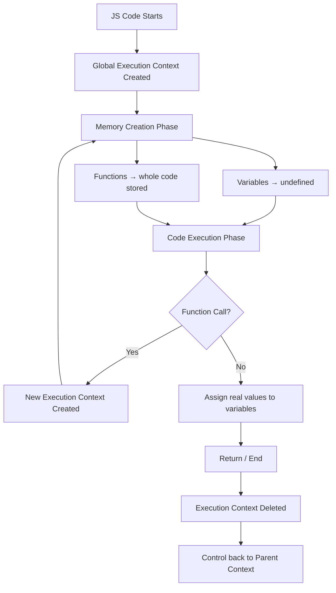
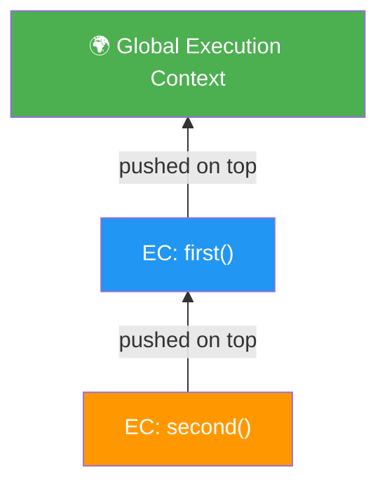
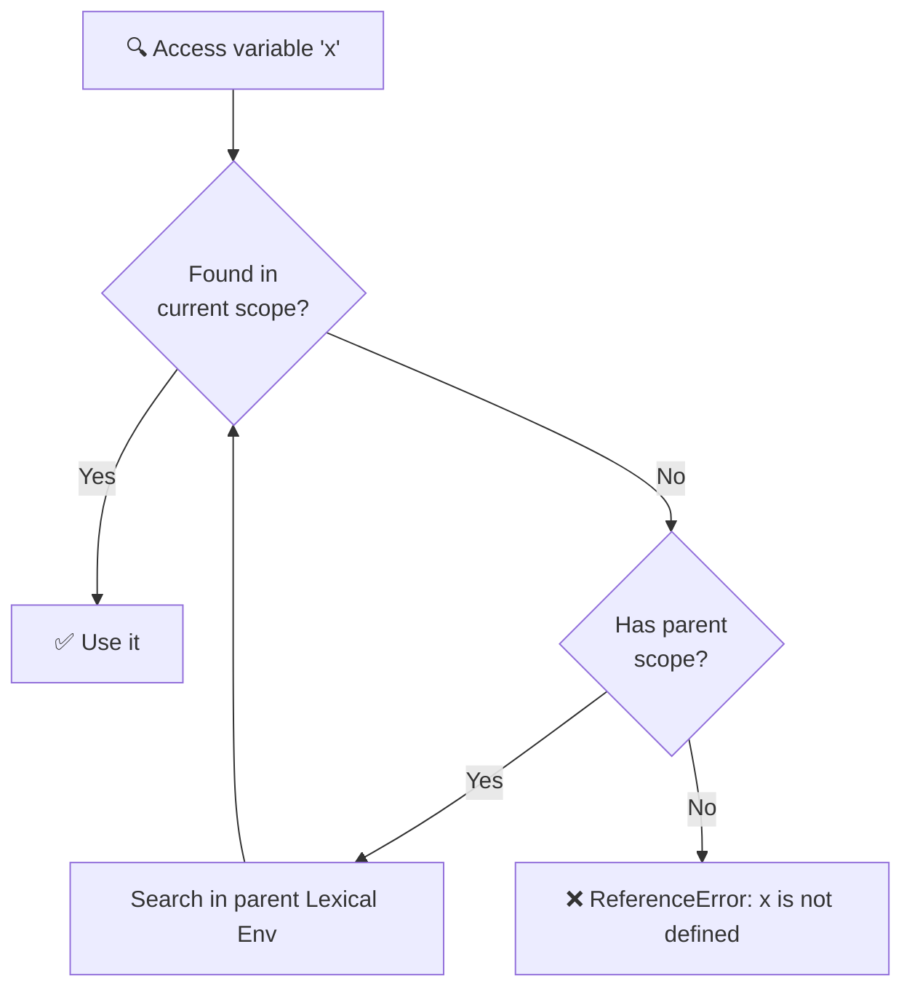
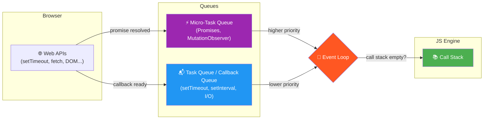
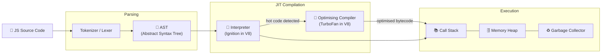

# Namaste JavaScript

---

## 📚 Table of Contents

1. [Everything in JS happens in Execution Context](#everythign-is-js-happens-in-execution-context)
2. [JavaScript is Synchronous Single Threaded](#javascript-is-synchrounous--single-threaded-language)
3. [Execution Context Creation](#execution-context-creation)
4. [Call Stack](#call-stack---)
5. [Hoisting](#hoisting---)
6. [Functions - Heart of JS](#fucntions----heart-of-js️)
7. [Shortest JS Code](#shortest-js-code---)
8. [Undefined vs Not-Defined](#undefined-vs-not-defined---)
9. [Loosely Typed / Weakly Typed](#js-is-loosely-typesweekely-typed---)
10. [Scope & Lexical Environment](#scope-in-js-lexical-environment-)
11. [Scope Chaining](#scope-chaining-)
12. [Let and Const (ES6)](#let-and-const-es6---)
13. [Reference Error vs Syntax Error vs Type Error](#reference-error-vs-syntax-error-vs-type-error---)
14. [Block Scope](#block-scope--)
15. [Shadowing](#shadowing---)
16. [Closure](#closure---)
17. [All About Functions](#all-about-fucntion---)
18. [Callback Functions](#callback-function-)
19. [Event Loop](#event-loop---)
20. [JS Engine](#js-engine--)
21. [Architecture of JS Engine](#architecture-of-js-engine-)

---

#### Everythign is JS happens in execution context.
Multiple components of Execution contect in which JS code runs . 
1. Memory component or Variable Environment - All variable and functions are kept in key value pair
2. Code component  (thread of execution )- This is where whole code is executed one line at a time .

#### JavaScript is Synchrounous  single threaded language
Can only execute one command at a time and in a specific order

#### Execution context creation
Memory creation phase -
 JS allocated memory to all variables and functions one by one going through whole code.
For variables initially it stores value undefined and for function it stores whole code of fn();
Code execution phase - 
For variables real value of it is assigned replacing undefined in the memory component.
For function it has nothing to do since they are already assigned .
For function calling statements a whole new execution context is created within the global execution context with its own memory and code component.
Return statement taked the control back to global execution context with the value returned and assign it to the variable.
And after returning the value the fucntion’s exe context will be deleted.
Once whole code is finished running the global exe context is also deleted.


> **Example:**
> ```js
> var x = 1;
> function square(num) {
>   return num * num;
> }
> var result = square(x);
> // Phase 1 (Memory): x = undefined, square = fn code, result = undefined
> // Phase 2 (Code):   x = 1, square() called → new EC → returns 1, result = 1
> ```#### Call stack - 
So JavaScript manages the nested Executon contexts using call stack that start with the the Global exe context at the bottom.
Once new Execution context is created it is added to the top of the call stack and as soon as the control is back to the parent context child exe context is deleted from the stack.
Call stack maintains the order of execution of execution contexts.
Call stack also known as with different name so don’t get confused.


> **Also known as:** Execution Stack, Program Stack, Control Stack, Runtime Stack, Machine Stack

#### Hoisting - 
You can access variables and functions in the code even before you have been initialised.
As we have seen earlier before code execution starts, Variables are defined in the variable environment  and initially given value is undefined to variable and whole function declaration for functions.
So when we access the variable before it is declared we get undefined because of its value in the variable environment.

> **Example:**
> ```js
> console.log(name);   // undefined  (hoisted, not yet assigned)
> console.log(greet);  // [Function: greet]  (full function code stored)
> // console.log(x);   // ReferenceError - let is in Temporal Dead Zone
>
> var name = 'Alice';
> let x = 42;
>
> function greet() {
>   console.log('Hello!');
> }
> ```


#### Fucntions  - Heart of JS❤️

#### Shortest JS code - 
Answer is empty JS file, even when we do not write a single line of code still js engine does a lot of work like creating call stack and global execution context.
Js creates window object (Global object) with lots of function in global execution context that we can use.
Js creates this variable which is equal to window for the global scope
With every new Execution conext this variable is created that points to that exe context .
whenever we create a variable or a function (anything in the global scope is attached to the window object) and we can access using window.variable or just variableName when we dont use the object name in front of a variable it assumes window object.


#### UNDEFINED VS NOT-DEFINED - 
When we get the value of a variable to be undefined it means the variable is defined but it is not assigned a value yet (It is like placeholder value until the value is assigned) .
Not defined is completely different it means the variable is not defined at all.
In the above picture a is undefined whereas x is not defined


#### Js is loosely types/Weekely typed - 
It does not bind its variable to certain data type If a variable is assigned string we can assign a boolean or a number  to it in the next step.

The above pic is perfectly fine js code.


#### Scope in JS (Lexical environment)-
Lexical envirnment is data structure that holds the variables and functions within a scope and reference to the outer scope and its lexical environment.
Lexical environment is created when Execution context is created
Difference between Lexical Environment and Execution context 


#### Scope chaining-
When we try to access a variable, programm first searches the variable in its current lexical env. If it is not found then it searched in its parents lexical env. And so on…..
THIS IS CALLED SCOPE CHAINING—-



> **Example:**
> ```js
> var globalVar = 'I am global';
>
> function outer() {
>   var outerVar = 'I am outer';
>
>   function inner() {
>     // inner scope → outer scope → global scope
>     console.log(globalVar); // ✅ found in global
>     console.log(outerVar);  // ✅ found in outer
>   }
>   inner();
> }
> outer();
> ```


#### Let and Const (ES6) - 
Let and const does not behave like var in JS, While var is hoisted and can be accessed before initialization with a value ‘undefined’  because it is attached to window object when variable component runs before code execution starts.
Let and const are not attached to window object when memory is allocated  but kept in separate space. And that is why even though they are hoisted and given the value undefined they cannot be accessed in the code until some value is assigned to them . This phase starting from memory allocation to value initialization to a let variable is called Temporal Dead Zone.
Const is even more strict then let . It has to be initialised in the same line as its declaration and its value cannot be overridden later in the code.


Let however gives this flexibility to change the value later but we cannot redeclare same variable e.g -                                                                      let a = 10 ; 
let a = 100;
This will throw Sytaxt error same will happen if we do not assign a value to const variable e.g.-
Const a;
a=10;

> **Example — Temporal Dead Zone (TDZ):**
> ```js
> // --- var behaviour ---
> console.log(a);  // undefined (attached to window, hoisted)
> var a = 10;
>
> // --- let behaviour ---
> // console.log(b); // ❌ ReferenceError: Cannot access 'b' before initialization
>                    //    (TDZ: memory allocated but inaccessible)
> let b = 20;
> console.log(b);  // ✅ 20
>
> // --- const behaviour ---
> // const c;      // ❌ SyntaxError: Missing initializer in const declaration
> const c = 30;
> // c = 50;       // ❌ TypeError: Assignment to constant variable
> ```

> **Var vs Let vs Const at a glance:**
>
> | Feature | `var` | `let` | `const` |
> |---|---|---|---|
> | Scope | Function | Block | Block |
> | Hoisting | ✅ (undefined) | ✅ (TDZ) | ✅ (TDZ) |
> | Re-declare | ✅ | ❌ | ❌ |
> | Re-assign | ✅ | ✅ | ❌ |
> | Attached to window | ✅ | ❌ | ❌ |


#### Reference Error vs Syntax Error vs Type Error - 

> ```js
> // ReferenceError — variable does not exist at all
> console.log(z);          // ❌ ReferenceError: z is not defined
>
> // SyntaxError — code violates JS grammar rules (caught before execution)
> let a = 10;
> let a = 20;              // ❌ SyntaxError: Identifier 'a' has already been declared
>
> // TypeError — operation performed on wrong type
> const b = 5;
> b = 10;                  // ❌ TypeError: Assignment to constant variable
> null.toString();         // ❌ TypeError: Cannot read properties of null
> ```


#### Block Scope -
A block is defined by curly braces e.g. “{}” in JS is a block 
It is also known as compound statement.
Block is used to combine multiple JS statements in one group


#### Shadowing - 
shadowing refers to the situation where a variable declared in an inner scope has the same name as a variable declared in an outer scope. This causes the inner variable to "shadow" or override the outer variable within its scope.
Illigal shadowing is when we try to override a variable originally defined with let using var keyword.


#### Closure - 
a closure is a combination of a function and the lexical environment within which that function was declared.
 The lexical environment consists of any variables, functions, or other objects that were in scope at the time the closure was created.
 In simpler terms, a closure allows a function to access and use variables from its outer (enclosing) scope even after that scope has been executed or is no longer in scope.

```js
function outerFunction() {
  let outerVariable = 'Hello';

  function innerFunction() {
    console.log(outerVariable); // Accessing outerVariable from the outer scope
  }

  return innerFunction;
}

let closure = outerFunction();
closure(); // Output: Hello
```

> **Practical use — Counter with Closure:**
> ```js
> function makeCounter() {
>   let count = 0;             // private variable
>   return function () {
>     count++;
>     return count;
>   };
> }
> const counter = makeCounter();
> console.log(counter()); // 1
> console.log(counter()); // 2
> console.log(counter()); // 3
> ```


#### All About Fucntion - 

##### Function parameters and arguments - 

> **Parameters** are the named variables in the function definition.
> **Arguments** are the actual values passed when calling the function.
> ```js
> function add(a, b) {   // a, b → parameters
>   return a + b;
> }
> add(5, 3);             // 5, 3 → arguments
>
> // Default parameters (ES6)
> function greet(name = 'World') {
>   console.log('Hello, ' + name);
> }
> greet();          // Hello, World
> greet('Alice');   // Hello, Alice
> ```

##### First class functions - 
 functions are considered "first-class citizens" or "first-class objects," which means they are treated as values and have the same capabilities as any other value, such as numbers, strings, or objects.
Functions can be assigned to variables .
Functions can be passed as arguments to other functionsl.
Functions can be returned as values from other functions.
Functions can be stored in data structures.
Functions can be defined inside other functions.
Functions can have properties and methods.

> **Example:**
> ```js
> // Assigned to a variable
> const sayHi = function() { console.log('Hi!'); };
>
> // Passed as argument
> function runIt(fn) { fn(); }
> runIt(sayHi);                // Hi!
>
> // Returned from function
> function multiplier(factor) {
>   return (num) => num * factor;
> }
> const double = multiplier(2);
> console.log(double(5));      // 10
> ```


#### Callback function-
In JavaScript, a callback function is a function that is passed as an argument to another function and is invoked within that function. 
The purpose of a callback function is to specify a piece of code that should be executed after a certain operation or task is completed.
The primary use of callback functions is to handle asynchronous operations or events, where the order of execution is not guaranteed or where some action depends on the completion of another operation. 
By passing a callback function to an asynchronous function, you can define what should happen once the asynchronous operation is finished

> **Example — Synchronous callback:**
> ```js
> function processData(data, callback) {
>   console.log('Processing:', data);
>   callback(data * 2);
> }
> processData(5, (result) => console.log('Result:', result)); // Result: 10
> ```

> **Example — Asynchronous callback:**
> ```js
> console.log('Start');
> setTimeout(function() {
>   console.log('I run after 2 seconds (callback)');
> }, 2000);
> console.log('End');
> // Output order: Start → End → I run after 2 seconds
> ```

#### Event Loop - 
Event loops main purpose is to continuously monitor the Task queue , Micro-Task queue and the call stack, and push the task from queue to the call stack based on their priority once they are ready to be executed and the call stack is empty .



> **Example — Micro-Task vs Task Queue:**
> ```js
> console.log('1 - Start');
> setTimeout(() => console.log('4 - setTimeout (Task Queue)'), 0);
> Promise.resolve().then(() => console.log('3 - Promise (Micro-Task Queue)'));
> console.log('2 - End');
> // Output: 1 → 2 → 3 → 4  (Micro-task runs before Task queue!)
> ```

##### Call Stack - 
It is present inside the JS engine and it can do only one thing at a time.
Global execution context is created and pushed into the Call stack similarly every function call when creates a new execution context it is pushed into the call stack and as soon as the work is done it is removed from the stack 
It manages the order of execution of all execution contexts.
As soon as something is pushed into the stack, The fn() is executed asap.


##### Web APIs-
These are the API that we use to access the features provided by the browser in our JS code .
Some Common APIS are - 
Settimeout()
Dom API
fetch()
localStorage()
Console
Location etc…..
We always thought that console and settimeout are part of JS but they are part of browser that we access through the window object 


##### Callback queue / Task queue-
Holds the async tasks of the JS that cannot run on the main thread coz they will block the code execution
These  are - timers , Event callbacks  , I/O callbacks

##### Micro-Task queue-	
These are priortized over Callback /Task queue tasks.
Holds the async tasks of the JS that cannot run on the main thread coz they will block the code execution
These are - Promises, MutationObserver callbacks (Asycn way to observe change in the DOM and get notified when the change occures)


#### JS engine- 
JavaScript Run-Time Environemnt  -  It is an environment with JAVASCRIPT ENGINE set of APIs and other tools such as Task queue, Micro-Task queue and Event loop. We need all of this to Run the JavaScript code. In our Browsers we have this JS environment .
Similarly Node js is also a run time environment with all of these tools to successfully run the JS code.
The APIs can be different in different Run time environment 
E.g. Browser has window.localstorage() where as node js does not has any such api 
Wheseas some apis are present in both the Environments e.g. Console, setTimeout etc.
JS Engine is the heart of the JS Environement 
Different Browsers have their own JS engine - 
Chrome has V8 is also used in Node js and Deno
Firefox uses SpiderMonkey 
Microsoft Edge has Chakra
Safari uses JavaScript core
FIRST engine created was spidermonkey which has evolved now - It was created by the creator  of js Brandon Eich
Engine is just a software written in low level languanges e.g. V8 is written in c++.

#### Architecture of JS engine-
3 Major steps are parsing , compilation and Execution 



##### Parsing-
Code is converted into AST (Abstract Syntax Tree) by syntax formatter . and then passed to compiler and interpreter.
JS uses both compilation and interpretation hand in hand to optimize the code and execute. This compilation is called JIT compilation.
These algorithms of interpreter and compiler are very different browser to browser and in every JS engine . Every one want to make their JS engine the fastest 
Right now Google’s V8 is considered to be the fastest 
It uses ignition interpreter and Turbo fan compiler

Execution is 3rd step where all the optimized code is ran step by step . 
The JS engine also has Memory heap and the call stack and Garbage collector.


