# JavaScript Notes — Advanced Concepts

---

## 📚 Table of Contents

1. [Callback Functions](#1-callback-functions)
2. [Callback Hell](#2-callback-hell)
3. [Higher-Order Functions](#3-higher-order-functions)
4. [Promises](#4-promises)
5. [Async / Await](#5-async--await)
6. [Event Loop (Deep Dive)](#6-event-loop-deep-dive)
7. [Async & Defer](#7-async--defer)
8. [Currying](#8-currying)
9. [Debounce & Throttle](#9-debounce--throttle)
10. [Event Delegation](#10-event-delegation)
11. [Polyfills](#11-polyfills)
12. [Memory Leaks](#12-memory-leaks)
13. [Generators & Iterators](#13-generators--iterators)
14. [WeakMap & WeakSet](#14-weakmap--weakset)
15. [Proxy & Reflect](#15-proxy--reflect)
16. [Symbol & Well-Known Symbols](#16-symbol--well-known-symbols)
17. [Modules — ESM vs CommonJS](#17-modules--esm-vs-commonjs)
18. [Error Handling](#18-error-handling)
19. [Functional Programming Patterns](#19-functional-programming-patterns)
20. [Design Patterns in JavaScript](#20-design-patterns-in-javascript)

---

# 1. Callback Functions

> A **Callback** is a function passed as an **argument** to another function, to be **invoked later** — either after an async operation completes, or after some internal logic runs. They are the original mechanism JavaScript used to handle non-blocking, asynchronous tasks.
>
> Because JavaScript is **single-threaded**, long-running tasks (network requests, file reads, timers) cannot block the thread. Instead, the JS engine **registers the callback** and moves on. When the task completes, the **Event Loop** pushes the callback onto the Call Stack to be executed.

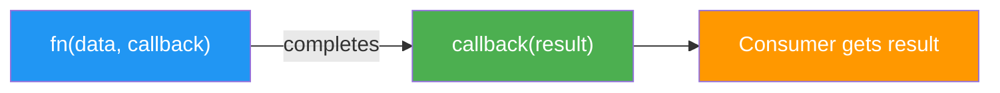

## Types of Callbacks

| Type | When Used | Example |
|---|---|---|
| **Synchronous** | Executed immediately inside the function | `Array.forEach`, `map`, `filter` |
| **Asynchronous** | Executed after a future event | `setTimeout`, `fetch`, `fs.readFile` |
| **Event-based** | Triggered by a user or system event | `addEventListener('click', fn)` |

```javascript
// Synchronous callback — runs immediately
const nums = [1, 2, 3];
nums.forEach(function(n) {
    console.log(n * 2); // 2, 4, 6
});

// Asynchronous callback — runs after 2 seconds
console.log("Before timer");
setTimeout(function() {
    console.log("Inside callback — runs after 2s");
}, 2000);
console.log("After timer"); // This runs BEFORE the callback

// Output order:
// Before timer
// After timer
// Inside callback — runs after 2s
```

```javascript
// Real-world pattern: data fetching
function fetchUser(userId, onSuccess, onError) {
    // Simulating async DB call
    setTimeout(() => {
        if (userId > 0) {
            onSuccess({ id: userId, name: "Hitesh" });
        } else {
            onError(new Error("Invalid user ID"));
        }
    }, 1000);
}

fetchUser(
    1,
    (user) => console.log("Got user:", user.name), // onSuccess
    (err)  => console.error("Error:", err.message) // onError
);
```

> ⚠️ **Problems with Callbacks:**
> - **Inversion of Control** — you hand over execution to a third-party function and trust it will call your callback correctly (once, not twice, not never).
> - **Callback Hell** — deeply nested callbacks for sequential async operations become unreadable. See Section 2.

---

# 2. Callback Hell

> **Callback Hell** (also called the **Pyramid of Doom**) describes the deeply nested, horizontally-growing code structure that emerges when multiple sequential async operations are chained together using callbacks. Each async step depends on the result of the previous one, so each must be nested inside the previous callback.
>
> The result is code that is **difficult to read, maintain, debug, and test**. Error handling requires separate `if/else` blocks at every level.

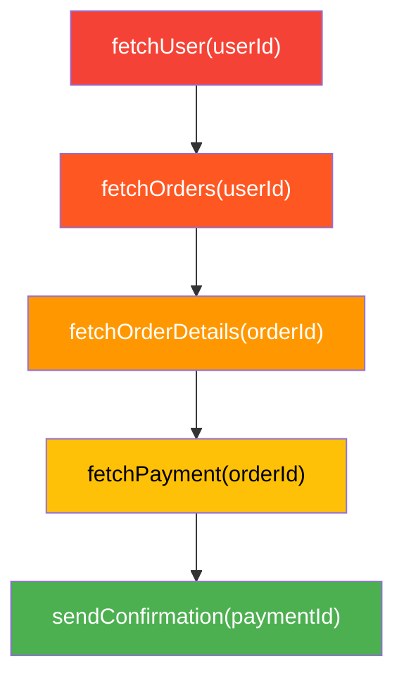

```javascript
// ❌ Callback Hell — the "Pyramid of Doom"
fetchUser(userId, function(user) {
    fetchOrders(user.id, function(orders) {
        fetchOrderDetails(orders[0].id, function(details) {
            fetchPayment(details.paymentId, function(payment) {
                sendConfirmation(payment.id, function(receipt) {
                    console.log("Done:", receipt);
                    // Error handling needed at EVERY level
                }, function(err) { console.error(err); });
            }, function(err) { console.error(err); });
        }, function(err) { console.error(err); });
    }, function(err) { console.error(err); });
}, function(err) { console.error(err); });
```

## Problems with Callback Hell

| Problem | Impact |
|---|---|
| **Inversion of Control** | You trust third-party code to call your callback |
| **Deeply nested structure** | Hard to read and reason about |
| **Error handling repetition** | Every level needs its own error branch |
| **Hard to debug** | Stack traces are confusing |
| **Hard to refactor** | Tight coupling between steps |

## Solutions

```javascript
// ✅ Solution 1: Named functions (flatten the pyramid)
function handleReceipt(receipt) { console.log("Done:", receipt); }
function handlePayment(payment) { sendConfirmation(payment.id, handleReceipt, handleError); }
function handleDetails(details) { fetchPayment(details.paymentId, handlePayment, handleError); }
function handleOrders(orders)   { fetchOrderDetails(orders[0].id, handleDetails, handleError); }
function handleUser(user)       { fetchOrders(user.id, handleOrders, handleError); }
function handleError(err)       { console.error(err); }

fetchUser(userId, handleUser, handleError);

// ✅ Solution 2: Promises (Section 4)
// ✅ Solution 3: Async/Await (Section 5)
```

---

# 3. Higher-Order Functions

> A **Higher-Order Function (HOF)** is a function that either:
> 1. **Takes one or more functions as arguments** (callbacks), OR
> 2. **Returns a function** as its result
>
> HOFs are the foundation of **functional programming** in JavaScript. They enable powerful patterns like composition, currying, and partial application. All of JS's built-in array methods (`map`, `filter`, `reduce`, `forEach`) are higher-order functions.

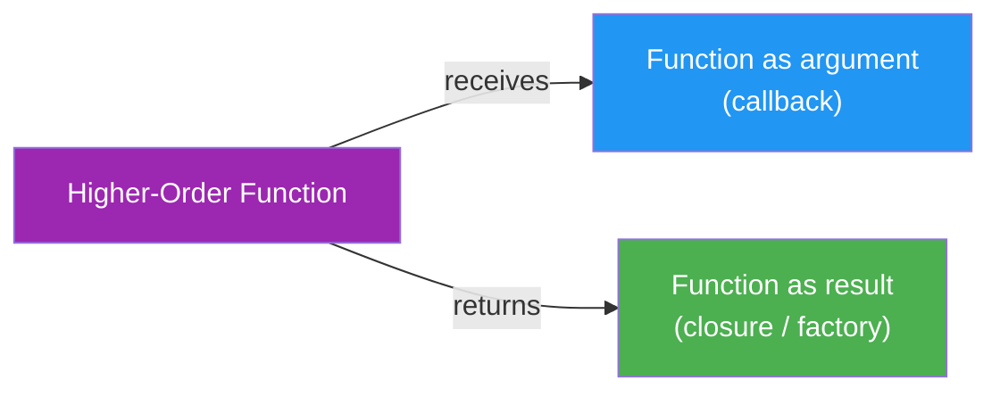

```javascript
// Pattern 1: Accepts a function as argument
function calculate(a, b, operation) {
    return operation(a, b);
}

const add      = (a, b) => a + b;
const multiply = (a, b) => a * b;

console.log(calculate(5, 3, add));      // 8
console.log(calculate(5, 3, multiply)); // 15
```

```javascript
// Pattern 2: Returns a function (function factory)
function makeMultiplier(factor) {
    return function(number) {
        return number * factor;
    };
}

const double = makeMultiplier(2);
const triple = makeMultiplier(3);

console.log(double(5)); // 10
console.log(triple(5)); // 15
```

```javascript
// Pattern 3: Building custom HOFs (mimic Array.map)
function myMap(arr, transformFn) {
    const result = [];
    for (let i = 0; i < arr.length; i++) {
        result.push(transformFn(arr[i], i, arr));
    }
    return result;
}

const prices = [100, 200, 300];
const discounted = myMap(prices, price => price * 0.9);
console.log(discounted); // [90, 180, 270]
```

```javascript
// Pattern 4: Function composition
const compose = (...fns) => x => fns.reduceRight((acc, fn) => fn(acc), x);
const pipe    = (...fns) => x => fns.reduce((acc, fn) => fn(acc), x);

const addTax    = price => price * 1.18;
const addShipping = price => price + 50;
const formatINR  = price => `₹${price.toFixed(2)}`;

const getTotal = pipe(addTax, addShipping, formatINR);
console.log(getTotal(1000)); // "₹1230.00"
```

> 💡 HOFs enable **declarative code** — you describe *what* to do, not *how* to do it step-by-step. This leads to cleaner, more testable, and more reusable code.

---

# 4. Promises

> A **Promise** is an object representing the **eventual completion or failure** of an asynchronous operation. It is a proxy for a value that may not be available yet. Promises solve the **Inversion of Control** and **nesting** problems of callbacks by returning an object you can chain `.then()` and `.catch()` handlers onto.
>
> A Promise is always in one of three states:
> - **Pending** — initial state; the operation hasn't completed yet
> - **Fulfilled** — the operation completed successfully; `.then()` is called with the result
> - **Rejected** — the operation failed; `.catch()` is called with the error

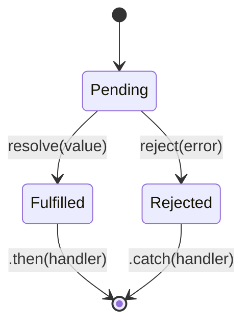

## Creating a Promise

```javascript
// Basic structure
const myPromise = new Promise(function(resolve, reject) {
    // Async work happens here
    const success = true;

    if (success) {
        resolve("Data fetched successfully!"); // triggers .then()
    } else {
        reject(new Error("Something went wrong")); // triggers .catch()
    }
});

myPromise
    .then((data) => console.log(data))           // "Data fetched successfully!"
    .catch((err) => console.error(err.message))
    .finally(() => console.log("Always runs"));   // cleanup (close DB, hide loader)
```

## Promise Chaining (Solving Callback Hell)

```javascript
// ✅ Clean sequential async — no nesting
fetchUser(userId)
    .then(user    => fetchOrders(user.id))
    .then(orders  => fetchOrderDetails(orders[0].id))
    .then(details => fetchPayment(details.paymentId))
    .then(payment => sendConfirmation(payment.id))
    .then(receipt => console.log("Done:", receipt))
    .catch(err    => console.error("Failed at some step:", err.message));
    // ONE catch handles errors from ALL steps above
```

## Promise Static Methods

| Method | Purpose | Use Case |
|---|---|---|
| `Promise.all([...])` | Waits for **all** promises; rejects if **any** rejects | Parallel independent fetches |
| `Promise.allSettled([...])` | Waits for **all**; never rejects; gives status of each | When you need all results regardless of failure |
| `Promise.race([...])` | Resolves/rejects with the **first** to settle | Timeout patterns |
| `Promise.any([...])` | Resolves with the **first** fulfilled; rejects only if **all** reject | Fastest server wins |

```javascript
const p1 = fetch('/api/user');
const p2 = fetch('/api/orders');
const p3 = fetch('/api/products');

// All succeed → get all results at once
Promise.all([p1, p2, p3])
    .then(([user, orders, products]) => {
        console.log(user, orders, products);
    })
    .catch(err => console.error("One failed:", err));

// Get status of all, regardless of failure
Promise.allSettled([p1, p2, p3])
    .then(results => {
        results.forEach(result => {
            if (result.status === "fulfilled") console.log(result.value);
            else console.error(result.reason);
        });
    });

// Timeout pattern using Promise.race
const timeout = new Promise((_, reject) =>
    setTimeout(() => reject(new Error("Request timed out")), 5000)
);
Promise.race([fetch('/api/data'), timeout])
    .then(data => console.log(data))
    .catch(err => console.error(err.message));
```

---

# 5. Async / Await

> **`async`/`await`** is syntactic sugar introduced in ES2017 that makes asynchronous, Promise-based code look and behave like synchronous code — without blocking the thread. Under the hood it is still Promises, but the syntax dramatically improves readability.
>
> - **`async`** before a function declaration makes it **always return a Promise** (the return value is automatically wrapped)
> - **`await`** can only be used inside an `async` function. It **pauses execution** of the async function and waits for the Promise to settle, then returns its resolved value. The rest of the program continues normally during this wait.

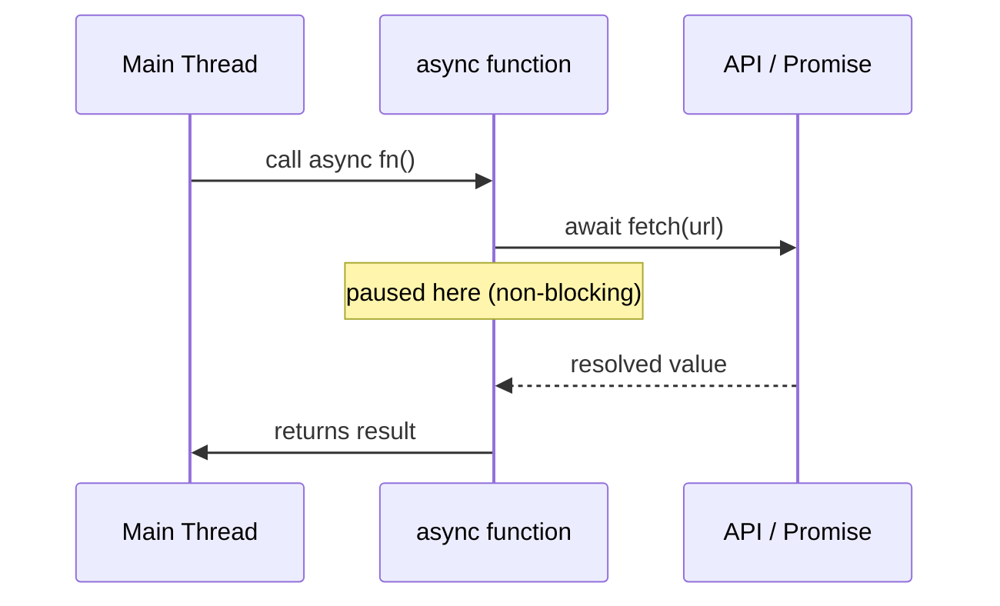

```javascript
// Same callback hell example — now with async/await
async function processOrder(userId) {
    try {
        const user    = await fetchUser(userId);
        const orders  = await fetchOrders(user.id);
        const details = await fetchOrderDetails(orders[0].id);
        const payment = await fetchPayment(details.paymentId);
        const receipt = await sendConfirmation(payment.id);
        console.log("Done:", receipt);
    } catch (err) {
        // ONE catch for ALL steps
        console.error("Error:", err.message);
    } finally {
        console.log("Cleanup runs always");
    }
}

processOrder(1);
```

## Parallel Execution with async/await

```javascript
// ❌ Sequential (slow) — each waits for the previous
async function loadSequential() {
    const user    = await fetchUser(1);    // wait 1s
    const products = await fetchProducts(); // wait another 1s
    // Total: ~2s
}

// ✅ Parallel (fast) — start both at the same time
async function loadParallel() {
    const [user, products] = await Promise.all([
        fetchUser(1),
        fetchProducts()
    ]);
    // Total: ~1s (both run concurrently)
    console.log(user, products);
}
```

## Error Handling Patterns

```javascript
// Pattern 1: try/catch (recommended)
async function getData() {
    try {
        const res  = await fetch('https://api.example.com/data');
        if (!res.ok) throw new Error(`HTTP error: ${res.status}`);
        const data = await res.json();
        return data;
    } catch (err) {
        console.error("Fetch failed:", err.message);
        return null;
    }
}

// Pattern 2: Wrapper utility — avoid try/catch repetition
async function safeAwait(promise) {
    try {
        const data = await promise;
        return [null, data];
    } catch (err) {
        return [err, null];
    }
}

const [err, user] = await safeAwait(fetchUser(1));
if (err) console.error(err);
else console.log(user);
```

> 💡 **Rule of Thumb**: Use `async/await` for sequential operations that depend on each other. Use `Promise.all()` (inside `await`) for independent parallel operations.

---

# 6. Event Loop (Deep Dive)

> JavaScript is **single-threaded** — it has one Call Stack and can execute one thing at a time. Yet it handles async tasks (timers, network calls, UI events) without blocking. The **Event Loop** is the mechanism that makes this possible. It continuously monitors the Call Stack and Task Queues, moving tasks onto the stack when it is empty.

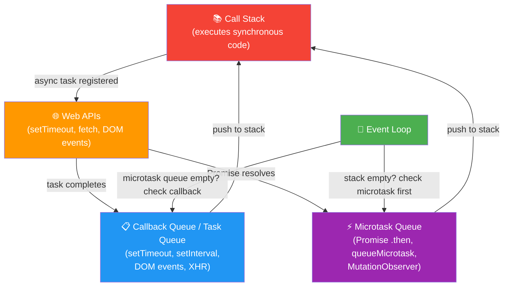

## Microtask Queue vs Callback Queue

> The **Microtask Queue has higher priority** than the Callback Queue. Every time the Call Stack becomes empty, the Event Loop **drains the entire Microtask Queue first** before picking even one item from the Callback Queue.

| Queue | What goes here | Priority | Examples |
|---|---|---|---|
| **Microtask Queue** | Promise callbacks, `queueMicrotask` | **Higher** — runs first | `.then()`, `.catch()`, `async/await` continuations |
| **Callback Queue** | Timer callbacks, event listeners | **Lower** — runs after microtasks | `setTimeout`, `setInterval`, `click` handlers |

```javascript
console.log("1 — synchronous");

setTimeout(() => console.log("2 — setTimeout (Callback Queue)"), 0);

Promise.resolve().then(() => console.log("3 — Promise.then (Microtask Queue)"));

queueMicrotask(() => console.log("4 — queueMicrotask (Microtask Queue)"));

console.log("5 — synchronous");

// Output order:
// 1 — synchronous
// 5 — synchronous
// 3 — Promise.then (Microtask Queue)    ← microtasks drain first
// 4 — queueMicrotask (Microtask Queue)  ← microtask queue fully empty
// 2 — setTimeout (Callback Queue)       ← only then callback queue
```

> ⚠️ **Starvation**: If the Microtask Queue is continuously refilled (e.g., a `.then()` always adds another `.then()`), the Callback Queue items will **never execute** — this is called starvation of the Callback Queue.

---

# 7. Async & Defer

> When the browser's HTML parser encounters a `<script>` tag, it **stops parsing HTML** to download and execute the script synchronously. `async` and `defer` are attributes on `<script>` that control this behavior, preventing the script from blocking the page render.

```mermaid
gantt
    title Script Loading Behavior
    dateFormat X
    axisFormat %s

    section Normal script
    Parse HTML    :a1, 0, 3
    Block + Download + Execute :crit, a2, 3, 6
    Resume HTML :a3, 6, 8

    section defer
    Parse HTML (continuous) :b1, 0, 8
    Download (parallel)     :b2, 1, 4
    Execute (after parse)   :b3, 8, 10

    section async
    Parse HTML    :c1, 0, 4
    Download (parallel) :c2, 1, 3
    Block + Execute :crit, c3, 3, 5
    Resume HTML :c4, 5, 8
```

## Comparison Table

| Attribute | Download | Execution Time | Execution Order | Use Case |
|---|---|---|---|---|
| **None** (normal) | Blocks HTML parsing | Immediately after download | In order | Should be avoided in `<head>` |
| **`defer`** | Parallel (non-blocking) | **After** full HTML parsed | **In order** | Scripts that need the DOM |
| **`async`** | Parallel (non-blocking) | **As soon as** downloaded (may interrupt parsing) | **Not guaranteed** | Independent scripts (analytics) |

```html
<!-- ❌ Blocks HTML parsing — avoid in <head> -->
<script src="app.js"></script>

<!-- ✅ defer — downloads in parallel, runs after DOM ready, maintains order -->
<script defer src="main.js"></script>
<script defer src="utils.js"></script>
<!-- utils.js always runs AFTER main.js -->

<!-- ✅ async — downloads in parallel, runs immediately when ready, no order guarantee -->
<script async src="analytics.js"></script>
```

> 💡 **Best Practice**: Use `defer` for application scripts (they need the DOM and must run in order). Use `async` for independent third-party scripts (analytics, ads) that don't depend on other scripts or the DOM.

---

# 8. Currying

> **Currying** is the functional programming technique of transforming a function that takes **multiple arguments** into a **sequence of functions** each taking **one argument**. Instead of `f(a, b, c)`, currying produces `f(a)(b)(c)`.
>
> Named after mathematician **Haskell Curry**, it enables **partial application** — pre-filling some arguments of a function to create a specialized version — without modifying the original function.

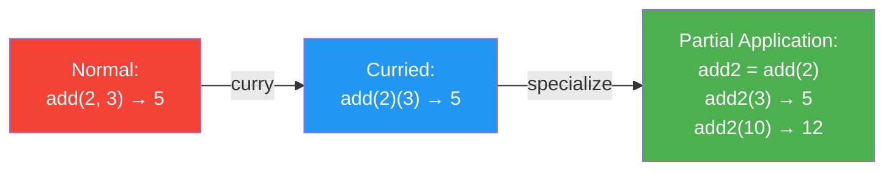

```javascript
// Normal function
function add(a, b, c) {
    return a + b + c;
}
console.log(add(1, 2, 3)); // 6

// Manually curried version
function curriedAdd(a) {
    return function(b) {
        return function(c) {
            return a + b + c;
        };
    };
}
console.log(curriedAdd(1)(2)(3)); // 6

// Arrow function shorthand
const curriedAddArrow = a => b => c => a + b + c;
console.log(curriedAddArrow(1)(2)(3)); // 6
```

## Generic Curry Utility

```javascript
// curry() — converts ANY multi-arg function to curried form
function curry(fn) {
    return function curried(...args) {
        if (args.length >= fn.length) {
            // Enough arguments — call original function
            return fn.apply(this, args);
        }
        // Not enough — return a function waiting for more
        return function(...moreArgs) {
            return curried.apply(this, args.concat(moreArgs));
        };
    };
}

const sum = (a, b, c) => a + b + c;
const curriedSum = curry(sum);

console.log(curriedSum(1)(2)(3));    // 6
console.log(curriedSum(1, 2)(3));    // 6  ← can still pass multiple at once
console.log(curriedSum(1)(2, 3));    // 6
```

## Real-World Use Cases

```javascript
// 1. Configurable logger
const log = level => message => `[${level.toUpperCase()}] ${message}`;

const info  = log("info");
const warn  = log("warn");
const error = log("error");

console.log(info("Server started"));   // [INFO] Server started
console.log(warn("High memory"));      // [WARN] High memory
console.log(error("DB connection"));   // [ERROR] DB connection

// 2. URL builder
const buildUrl = baseUrl => endpoint => params =>
    `${baseUrl}/${endpoint}?${new URLSearchParams(params).toString()}`;

const apiUrl = buildUrl("https://api.example.com");
const usersUrl = apiUrl("users");

console.log(usersUrl({ page: 1, limit: 10 }));
// https://api.example.com/users?page=1&limit=10

// 3. Tax calculator
const addTax = rate => price => price + (price * rate / 100);
const addGST = addTax(18);
const addVAT = addTax(5);

console.log(addGST(1000)); // 1180
console.log(addVAT(1000)); // 1050
```

---

# 9. Debounce & Throttle

> Both **Debounce** and **Throttle** are techniques to **limit how frequently a function can be called** — essential for performance when dealing with high-frequency events like `scroll`, `resize`, `keyup`, or `mousemove`.

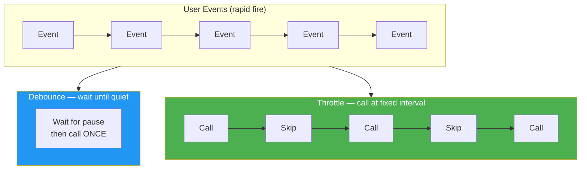

## Debounce

> **Debounce** delays execution of a function until **after a specified wait time has elapsed since the last call**. If the function is called again before the timer expires, the timer resets. It fires **once** after the user stops triggering the event.

```javascript
function debounce(fn, delay) {
    let timerId;
    return function(...args) {
        clearTimeout(timerId);               // cancel previous timer
        timerId = setTimeout(() => {
            fn.apply(this, args);            // call only after silence
        }, delay);
    };
}

// Usage: Search input — don't query API on every keystroke
const searchInput = document.getElementById("search");

const handleSearch = debounce(function(event) {
    console.log("API call with:", event.target.value);
    // fetch(`/api/search?q=${event.target.value}`)
}, 500);

searchInput.addEventListener("keyup", handleSearch);
// API called only 500ms after user stops typing
```

## Throttle

> **Throttle** ensures a function is called **at most once per specified time interval**, regardless of how many times the event fires. Unlike debounce, it guarantees **regular execution** during continuous events.

```javascript
function throttle(fn, interval) {
    let lastCall = 0;
    return function(...args) {
        const now = Date.now();
        if (now - lastCall >= interval) {
            lastCall = now;
            fn.apply(this, args);
        }
    };
}

// Usage: Scroll handler — update position max once per 200ms
const handleScroll = throttle(function() {
    console.log("Scroll position:", window.scrollY);
}, 200);

window.addEventListener("scroll", handleScroll);
```

## Debounce vs Throttle — When to Use

| Scenario | Technique | Reason |
|---|---|---|
| Search / autocomplete input | **Debounce** | Wait until user stops typing |
| Window resize handler | **Debounce** | React only when resize is complete |
| API call on form input | **Debounce** | Fire once after changes settle |
| Scroll event (lazy load / animations) | **Throttle** | Regular updates during scrolling |
| Mouse move (game / canvas) | **Throttle** | Consistent frame rate |
| Button click (prevent double submit) | **Debounce** | Fire once even if clicked repeatedly |

---

# 10. Event Delegation

> **Event Delegation** is a technique that leverages **event bubbling** to handle events for many child elements with a **single event listener on a parent element**, rather than attaching individual listeners to each child.
>
> When an event fires on a child element, it **bubbles up** through all ancestor elements. The parent listener receives the event and checks `event.target` to determine which child was actually clicked.

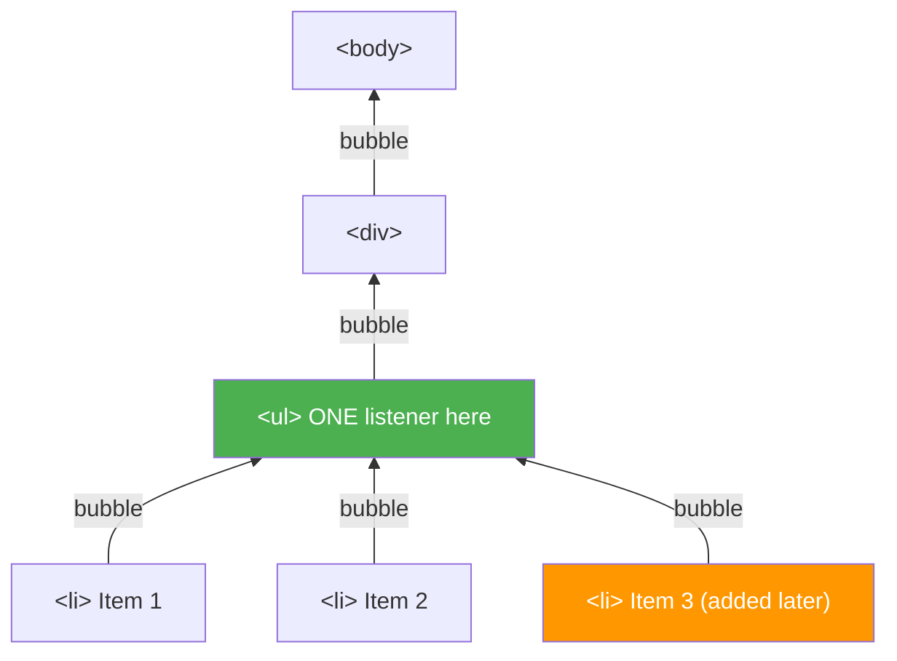

```javascript
// ❌ Bad approach — individual listeners (doesn't work for dynamic items)
document.querySelectorAll("li").forEach(li => {
    li.addEventListener("click", function() {
        console.log("Clicked:", this.textContent);
    });
});
// Problem 1: Memory — N listeners for N items
// Problem 2: New items added dynamically have NO listener

// ✅ Event Delegation — ONE listener on the parent
const ul = document.querySelector("ul");

ul.addEventListener("click", function(event) {
    // Check that the clicked element is actually an <li>
    if (event.target.tagName === "LI") {
        console.log("Clicked:", event.target.textContent);
        event.target.classList.toggle("active");
    }
});

// ✅ Works for items added AFTER the listener was set up!
const newItem = document.createElement("li");
newItem.textContent = "New Dynamic Item";
ul.appendChild(newItem); // Click on this — it still works!
```

## Real-World Use Case: Todo List

```javascript
const todoList = document.getElementById("todo-list");

todoList.addEventListener("click", function(event) {
    const target = event.target;

    // Handle delete button click
    if (target.classList.contains("delete-btn")) {
        target.closest("li").remove();
    }

    // Handle complete checkbox
    if (target.classList.contains("complete-btn")) {
        target.closest("li").classList.toggle("completed");
    }
});

// Benefits:
// ✅ One listener handles all interactions
// ✅ Works for items added dynamically
// ✅ Less memory usage
// ✅ Easier to manage
```

## Benefits Table

| Benefit | Without Delegation | With Delegation |
|---|---|---|
| Memory | N listeners for N items | 1 listener for all |
| Dynamic items | Must re-attach manually | Works automatically |
| Performance | Slower on large lists | Faster setup |
| Code complexity | Higher | Lower |

---

# 11. Polyfills

> A **Polyfill** is JavaScript code that **implements a feature natively supported by modern browsers, for older browsers that lack that support**. The name comes from "Polyfilla" (a wall filler product) — it fills the gaps in older environments.
>
> Writing a polyfill means studying the **official specification** of a built-in method and recreating its exact behavior, then conditionally attaching it to the relevant prototype only if the native version doesn't exist.

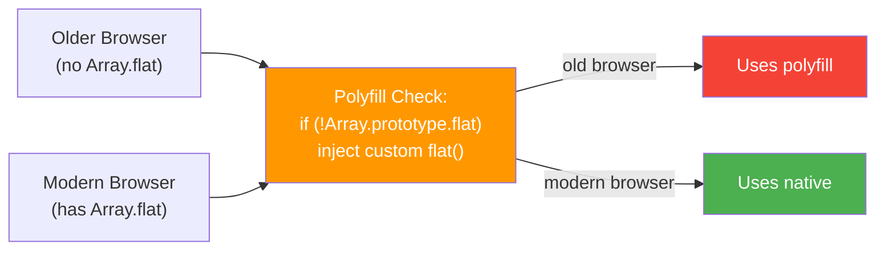

## Polyfill for `Array.prototype.map`

```javascript
// First, understand the spec:
// map(callbackFn) — calls callbackFn(element, index, array) for each element
// Returns a NEW array of the same length with transformed values

if (!Array.prototype.myMap) {
    Array.prototype.myMap = function(callbackFn, thisArg) {
        if (typeof callbackFn !== "function") {
            throw new TypeError(callbackFn + " is not a function");
        }
        const result = new Array(this.length);
        for (let i = 0; i < this.length; i++) {
            if (i in this) { // skip holes in sparse arrays
                result[i] = callbackFn.call(thisArg, this[i], i, this);
            }
        }
        return result;
    };
}

console.log([1, 2, 3].myMap(x => x * 2)); // [2, 4, 6]
```

## Polyfill for `Array.prototype.filter`

```javascript
if (!Array.prototype.myFilter) {
    Array.prototype.myFilter = function(callbackFn, thisArg) {
        if (typeof callbackFn !== "function") {
            throw new TypeError(callbackFn + " is not a function");
        }
        const result = [];
        for (let i = 0; i < this.length; i++) {
            if (i in this && callbackFn.call(thisArg, this[i], i, this)) {
                result.push(this[i]);
            }
        }
        return result;
    };
}

console.log([1, 2, 3, 4].myFilter(x => x % 2 === 0)); // [2, 4]
```

## Polyfill for `Function.prototype.bind`

```javascript
if (!Function.prototype.myBind) {
    Function.prototype.myBind = function(thisArg, ...presetArgs) {
        const originalFn = this; // the function being bound
        return function(...laterArgs) {
            return originalFn.apply(thisArg, [...presetArgs, ...laterArgs]);
        };
    };
}

function greet(greeting, punctuation) {
    return `${greeting}, ${this.name}${punctuation}`;
}

const hitesh = { name: "Hitesh" };
const sayHello = greet.myBind(hitesh, "Hello");
console.log(sayHello("!"));  // "Hello, Hitesh!"
console.log(sayHello("?")); // "Hello, Hitesh?"
```

## Polyfill for `Promise`

```javascript
// Simplified Promise polyfill structure
function MyPromise(executor) {
    this.state = "pending";
    this.value = undefined;
    this.handlers = [];

    const resolve = (value) => {
        if (this.state !== "pending") return;
        this.state = "fulfilled";
        this.value = value;
        this.handlers.forEach(h => h.onFulfilled(value));
    };

    const reject = (reason) => {
        if (this.state !== "pending") return;
        this.state = "rejected";
        this.value = reason;
        this.handlers.forEach(h => h.onRejected(reason));
    };

    try { executor(resolve, reject); }
    catch(e) { reject(e); }
}

MyPromise.prototype.then = function(onFulfilled, onRejected) {
    return new MyPromise((resolve, reject) => {
        const handle = () => {
            try {
                if (this.state === "fulfilled") resolve(onFulfilled(this.value));
                else reject(onRejected(this.value));
            } catch(e) { reject(e); }
        };
        if (this.state === "pending") {
            this.handlers.push({ onFulfilled, onRejected });
        } else { handle(); }
    });
};
```

---

# 12. Memory Leaks

> A **Memory Leak** occurs when memory that is no longer needed by the application is **never released** back to the operating system. In JavaScript, the **Garbage Collector** (GC) automatically reclaims memory for objects with **no remaining references**. A leak happens when code unintentionally keeps references alive, preventing GC from doing its job.
>
> Memory leaks cause applications to progressively **consume more RAM**, leading to slowdowns, tab crashes, and poor user experience.

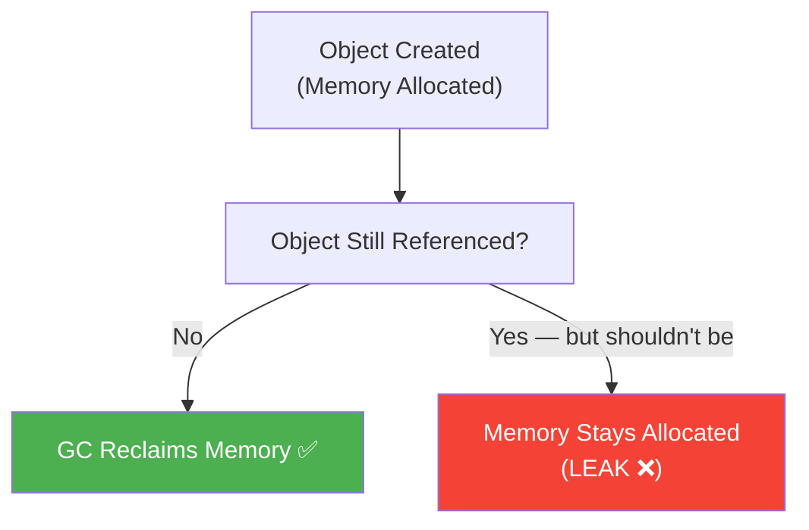

## Common Causes & Fixes

### 1. Forgotten Event Listeners

```javascript
// ❌ Leak — listener holds reference to element and callback forever
function setup() {
    const btn = document.getElementById("myBtn");
    btn.addEventListener("click", function handleClick() {
        console.log("clicked");
    });
    // If btn is removed from DOM, the listener (and its closure) still exists
}

// ✅ Fix — always remove listeners you no longer need
function setup() {
    const btn = document.getElementById("myBtn");
    function handleClick() { console.log("clicked"); }
    btn.addEventListener("click", handleClick);

    // Cleanup
    return function cleanup() {
        btn.removeEventListener("click", handleClick);
    };
}
const cleanup = setup();
cleanup(); // call when component unmounts
```

### 2. Closures Retaining Large Data

```javascript
// ❌ Leak — closure retains reference to a large array
function createLeakyProcessor() {
    const largeData = new Array(1000000).fill("data"); // 1M items

    return function process() {
        // Only uses largeData.length but holds the ENTIRE array in closure
        console.log(largeData.length);
    };
}

// ✅ Fix — capture only what you need
function createProcessor() {
    const largeData = new Array(1000000).fill("data");
    const count = largeData.length; // extract only needed value
    // largeData can now be GC'd

    return function process() {
        console.log(count); // only holds a number, not the array
    };
}
```

### 3. Global Variables

```javascript
// ❌ Leak — accidental global (missing let/const/var)
function processData() {
    result = { data: "huge object" }; // no declaration → attaches to window
}
processData();
// window.result holds the object forever

// ✅ Fix — always declare variables
function processData() {
    const result = { data: "huge object" }; // scoped, GC'd when function exits
}
```

### 4. Detached DOM Nodes

```javascript
// ❌ Leak — JS reference prevents GC even after DOM removal
const refs = {};

function addItem() {
    const div = document.createElement("div");
    refs.myDiv = div;          // stored in JS object
    document.body.appendChild(div);
}

function removeItem() {
    document.body.removeChild(refs.myDiv); // removed from DOM
    // refs.myDiv still holds reference → div lives in memory!
}

// ✅ Fix — clear the reference after removal
function removeItem() {
    document.body.removeChild(refs.myDiv);
    refs.myDiv = null; // release reference → GC can collect
}
```

### 5. setInterval Not Cleared

```javascript
// ❌ Leak — interval keeps running and holding references
function startPolling() {
    setInterval(function() {
        fetch('/api/data').then(updateUI);
    }, 1000);
    // If component is destroyed, interval keeps firing forever
}

// ✅ Fix — always clear intervals
function startPolling() {
    const intervalId = setInterval(function() {
        fetch('/api/data').then(updateUI);
    }, 1000);

    return function stop() {
        clearInterval(intervalId); // call this on component destroy
    };
}
```

## Memory Leak Detection

```javascript
// Use WeakMap for cache (GC-friendly — doesn't prevent collection)
const cache = new WeakMap(); // key is an object; auto-cleaned when object is GC'd

function processUser(user) {
    if (cache.has(user)) return cache.get(user);
    const result = expensiveComputation(user);
    cache.set(user, result); // won't prevent user from being GC'd
    return result;
}
```

> 🛠️ **Debug Tools**: Use Chrome DevTools → Memory tab → **Heap Snapshot** to compare memory before/after suspected operations and identify objects that should have been collected.

---

# 13. Generators & Iterators

> **Iterators** are objects that follow the **Iterator Protocol** — they have a `next()` method returning `{ value, done }`. **Generators** are special functions (using `function*` syntax) that can **pause and resume** execution using the `yield` keyword, automatically implementing the Iterator Protocol.
>
> Generators are memory-efficient for large sequences because they compute values **lazily** — one at a time, only when requested.

```javascript
// Basic Generator
function* counter(start = 0) {
    while (true) {
        yield start++;  // pauses here, returns start, resumes next call
    }
}

const gen = counter(1);
console.log(gen.next()); // { value: 1, done: false }
console.log(gen.next()); // { value: 2, done: false }
console.log(gen.next()); // { value: 3, done: false }
// Infinite sequence — but only computes what's requested!

// Generator with return
function* range(start, end, step = 1) {
    for (let i = start; i <= end; i += step) {
        yield i;
    }
}

for (const num of range(1, 10, 2)) {
    console.log(num); // 1, 3, 5, 7, 9
}

// Spread a generator
console.log([...range(1, 5)]); // [1, 2, 3, 4, 5]
```

```javascript
// Practical: Paginated API fetching
async function* fetchPages(url) {
    let page = 1;
    while (true) {
        const res = await fetch(`${url}?page=${page}`);
        const data = await res.json();
        if (data.items.length === 0) return; // done
        yield data.items;
        page++;
    }
}

for await (const items of fetchPages('/api/products')) {
    console.log("Page items:", items);
}
```

---

# 14. WeakMap & WeakSet

> `WeakMap` and `WeakSet` are collections like `Map` and `Set`, but their **keys (WeakMap) / values (WeakSet) must be objects**, and they hold **weak references** — the referenced object can still be **garbage collected** if there are no other strong references to it. They are not enumerable (no `.size`, no iteration).
>
> Primary use case: **attaching private metadata to objects without preventing GC**.

```javascript
// WeakMap — private data per instance
const _private = new WeakMap();

class BankAccount {
    constructor(owner, balance) {
        _private.set(this, { balance }); // private data stored outside instance
        this.owner = owner;
    }

    deposit(amount) {
        _private.get(this).balance += amount;
    }

    getBalance() {
        return _private.get(this).balance;
    }
}

const acc = new BankAccount("Hitesh", 1000);
acc.deposit(500);
console.log(acc.getBalance()); // 1500
console.log(acc.balance);      // undefined — truly private!
// When acc is GC'd, the WeakMap entry is automatically removed
```

```javascript
// WeakSet — track visited objects
const visited = new WeakSet();

function processNode(node) {
    if (visited.has(node)) return; // already processed
    visited.add(node);
    // process...
}
// When node objects are removed from DOM, WeakSet entries auto-clean
```

| Feature | Map / Set | WeakMap / WeakSet |
|---|---|---|
| Key types | Any | **Objects only** |
| GC behavior | Prevents GC | **Allows GC** |
| Enumerable | Yes (`.size`, `forEach`) | **No** — not iterable |
| Use case | General purpose | Private metadata, caches |

---

# 15. Proxy & Reflect

> A **Proxy** wraps an object and intercepts fundamental operations (property access, assignment, function calls) through **traps** — custom handler functions. `Reflect` is a companion API that provides the default behavior for each trap, making it easy to apply the default action alongside custom logic.

```javascript
// Basic Proxy — validation on property set
const validator = {
    set(target, property, value) {
        if (property === "age") {
            if (typeof value !== "number") throw new TypeError("Age must be a number");
            if (value < 0 || value > 150)  throw new RangeError("Age out of range");
        }
        Reflect.set(target, property, value); // apply default behavior
        return true;
    },

    get(target, property) {
        if (!(property in target)) {
            console.warn(`Property "${property}" doesn't exist`);
            return undefined;
        }
        return Reflect.get(target, property);
    }
};

const person = new Proxy({}, validator);
person.name = "Hitesh"; // ✅
person.age  = 30;       // ✅
// person.age = "thirty"; // ❌ TypeError: Age must be a number
console.log(person.phone); // ⚠️ Warning + undefined
```

```javascript
// Proxy for observable state (like Vue 3 reactivity)
function reactive(obj) {
    return new Proxy(obj, {
        set(target, key, value) {
            console.log(`🔄 State changed: ${key} = ${value}`);
            Reflect.set(target, key, value);
            // trigger re-render here
            return true;
        }
    });
}

const state = reactive({ count: 0, name: "Hitesh" });
state.count = 1; // 🔄 State changed: count = 1
state.name = "Chai"; // 🔄 State changed: name = Chai
```

---

# 16. Symbol & Well-Known Symbols

> Beyond user-created Symbols (Section 1 of Part 2), JavaScript defines **Well-Known Symbols** on `Symbol.*` that allow you to **customize the language's built-in behaviour** for your own objects — like how they are iterated, converted to primitive, or converted to string.

```javascript
// Symbol.iterator — make any object iterable (usable in for...of, spread)
class Range {
    constructor(start, end) {
        this.start = start;
        this.end   = end;
    }

    [Symbol.iterator]() {
        let current = this.start;
        const end   = this.end;
        return {
            next() {
                return current <= end
                    ? { value: current++, done: false }
                    : { value: undefined, done: true };
            }
        };
    }
}

const range = new Range(1, 5);
console.log([...range]);        // [1, 2, 3, 4, 5]
for (const n of range) console.log(n); // 1 2 3 4 5

// Symbol.toPrimitive — control type coercion
class Money {
    constructor(amount, currency) {
        this.amount   = amount;
        this.currency = currency;
    }

    [Symbol.toPrimitive](hint) {
        if (hint === "number") return this.amount;
        if (hint === "string") return `${this.amount} ${this.currency}`;
        return this.amount; // default
    }
}

const price = new Money(100, "INR");
console.log(`Price: ${price}`);  // "Price: 100 INR"
console.log(price + 50);         // 150
console.log(price > 90);         // true
```

---

# 17. Modules — ESM vs CommonJS

> JavaScript modules allow splitting code into **separate files with explicit imports and exports**, providing encapsulation, reusability, and avoiding global namespace pollution.

## Comparison Table

| Feature | **ESM** (ES Modules) | **CommonJS** (CJS) |
|---|---|---|
| Syntax | `import` / `export` | `require()` / `module.exports` |
| Loading | **Static** (analysed at parse time) | **Dynamic** (evaluated at runtime) |
| Environment | Browser native + Node.js (`.mjs`) | Node.js default |
| Top-level `await` | ✅ Supported | ❌ Not supported |
| Tree-shaking | ✅ Yes (bundlers can eliminate dead code) | ❌ No |
| `this` at top level | `undefined` | `module.exports` object |

```javascript
// ===== ESM =====
// math.js — named exports
export const PI = 3.14159;
export function add(a, b) { return a + b; }
export default class Calculator { /* ... */ } // default export

// main.js — imports
import Calculator, { PI, add } from './math.js'; // named + default
import * as Math from './math.js';               // namespace import
import('./math.js').then(m => console.log(m.PI)); // dynamic import

// ===== CommonJS =====
// math.js
const PI = 3.14159;
const add = (a, b) => a + b;
module.exports = { PI, add };

// main.js
const { PI, add } = require('./math.js');
```

```javascript
// Dynamic import — lazy load modules on demand (code splitting)
async function loadChartLibrary() {
    const { Chart } = await import('./chart.js');
    // Chart only downloaded when this function runs
    new Chart(data);
}
```

---

# 18. Error Handling

> Robust error handling is essential for production JavaScript. Beyond basic `try/catch`, understanding **error types**, **custom errors**, and **async error propagation** is critical.

## Error Types

| Error Type | When Thrown |
|---|---|
| `SyntaxError` | Invalid JavaScript syntax (parse time) |
| `ReferenceError` | Accessing an undeclared variable |
| `TypeError` | Operation on wrong type (`null.property`) |
| `RangeError` | Value out of valid range (`new Array(-1)`) |
| `URIError` | Malformed URI (`decodeURIComponent('%')`) |
| `EvalError` | Issues with `eval()` (rare) |

```javascript
// Custom Error Classes
class ValidationError extends Error {
    constructor(message, field) {
        super(message);
        this.name  = "ValidationError";
        this.field = field;
    }
}

class NetworkError extends Error {
    constructor(message, statusCode) {
        super(message);
        this.name       = "NetworkError";
        this.statusCode = statusCode;
    }
}

// Using custom errors
function validateAge(age) {
    if (typeof age !== "number") throw new ValidationError("Age must be a number", "age");
    if (age < 0 || age > 120)   throw new ValidationError("Age out of valid range", "age");
    return true;
}

try {
    validateAge("thirty");
} catch (err) {
    if (err instanceof ValidationError) {
        console.error(`Validation failed on field "${err.field}": ${err.message}`);
    } else {
        throw err; // re-throw unexpected errors
    }
}
```

```javascript
// Async error propagation
async function fetchWithRetry(url, retries = 3) {
    for (let i = 0; i < retries; i++) {
        try {
            const res = await fetch(url);
            if (!res.ok) throw new NetworkError(`HTTP ${res.status}`, res.status);
            return await res.json();
        } catch (err) {
            if (err instanceof NetworkError && err.statusCode >= 500 && i < retries - 1) {
                console.warn(`Retry ${i + 1}/${retries}...`);
                await new Promise(r => setTimeout(r, 1000 * (i + 1))); // exponential backoff
            } else {
                throw err; // non-retryable or out of retries
            }
        }
    }
}
```

## Global Error Handlers

```javascript
// Catch unhandled Promise rejections (don't let them silently fail)
process.on('unhandledRejection', (reason, promise) => {
    console.error('Unhandled Promise Rejection:', reason);
    process.exit(1); // in Node.js — exit with error code
});

// Browser equivalent
window.addEventListener('unhandledrejection', (event) => {
    console.error('Unhandled Promise:', event.reason);
    event.preventDefault(); // suppress browser default console error
});

// Catch synchronous errors
window.onerror = function(message, source, lineno, colno, error) {
    console.error("Global error:", message, "at", source, lineno);
    return true; // prevent default browser error UI
};
```

---

# 19. Functional Programming Patterns

> **Functional Programming (FP)** treats computation as the evaluation of mathematical functions and avoids **shared state**, **mutable data**, and **side effects**. In JavaScript, FP patterns coexist naturally with OOP.

## Core Principles

| Principle | Definition | Example |
|---|---|---|
| **Pure Functions** | Same input → always same output; no side effects | `const add = (a,b) => a + b` |
| **Immutability** | Never mutate data; create new values | Spread, `Object.freeze` |
| **Function Composition** | Combine small functions to build complex logic | `pipe(f, g, h)(x)` |
| **Avoid Side Effects** | Functions don't modify external state | No DOM access inside pure fns |

```javascript
// Pure vs Impure
let total = 0;

// ❌ Impure — modifies external state
function addToTotal(n) { total += n; }

// ✅ Pure — no side effects, same input → same output
function add(a, b) { return a + b; }

// Immutability
const original = { name: "Hitesh", skills: ["JS"] };

// ❌ Mutating
original.skills.push("React");

// ✅ Immutable update
const updated = {
    ...original,
    skills: [...original.skills, "React"]
};
```

```javascript
// Memoization — cache results of pure functions
function memoize(fn) {
    const cache = new Map();
    return function(...args) {
        const key = JSON.stringify(args);
        if (cache.has(key)) {
            console.log("Cache hit!");
            return cache.get(key);
        }
        const result = fn.apply(this, args);
        cache.set(key, result);
        return result;
    };
}

function slowFibonacci(n) {
    if (n <= 1) return n;
    return slowFibonacci(n - 1) + slowFibonacci(n - 2);
}

const fastFib = memoize(slowFibonacci);
console.log(fastFib(40)); // computed
console.log(fastFib(40)); // Cache hit! — instant
```

```javascript
// Partial Application
function partial(fn, ...presetArgs) {
    return function(...laterArgs) {
        return fn(...presetArgs, ...laterArgs);
    };
}

const multiply = (a, b, c) => a * b * c;
const double   = partial(multiply, 2);
const triple   = partial(multiply, 3);

console.log(double(4, 5)); // 40
console.log(triple(4, 5)); // 60
```

---

# 20. Design Patterns in JavaScript

> **Design Patterns** are proven, reusable solutions to commonly occurring problems in software design. They are not code templates — they are conceptual blueprints.

## Creational Patterns

```javascript
// ── Singleton ──────────────────────────────────────────────
// Ensures a class has only ONE instance (e.g., DB connection, config)
class DatabaseConnection {
    static #instance = null;

    constructor(url) {
        if (DatabaseConnection.#instance) {
            return DatabaseConnection.#instance;
        }
        this.url = url;
        this.connected = false;
        DatabaseConnection.#instance = this;
    }

    connect() {
        this.connected = true;
        console.log(`Connected to ${this.url}`);
    }

    static getInstance(url) {
        if (!DatabaseConnection.#instance) {
            new DatabaseConnection(url);
        }
        return DatabaseConnection.#instance;
    }
}

const db1 = DatabaseConnection.getInstance("mongodb://localhost:27017");
const db2 = DatabaseConnection.getInstance("mongodb://other");
console.log(db1 === db2); // true — same instance
```

```javascript
// ── Factory ─────────────────────────────────────────────────
// Creates objects without specifying the exact class
class NotificationFactory {
    static create(type, message) {
        const types = {
            email: (msg) => ({ type: "email", send: () => console.log(`📧 ${msg}`) }),
            sms:   (msg) => ({ type: "sms",   send: () => console.log(`📱 ${msg}`) }),
            push:  (msg) => ({ type: "push",  send: () => console.log(`🔔 ${msg}`) }),
        };
        if (!types[type]) throw new Error(`Unknown notification type: ${type}`);
        return types[type](message);
    }
}

const notification = NotificationFactory.create("email", "Your order shipped!");
notification.send(); // 📧 Your order shipped!
```

## Structural Patterns

```javascript
// ── Observer ─────────────────────────────────────────────────
// One-to-many dependency: when one object changes, all dependents are notified
class EventEmitter {
    constructor() {
        this.events = {};
    }

    on(event, listener) {
        if (!this.events[event]) this.events[event] = [];
        this.events[event].push(listener);
        return this; // chainable
    }

    off(event, listener) {
        if (this.events[event]) {
            this.events[event] = this.events[event].filter(l => l !== listener);
        }
        return this;
    }

    emit(event, ...args) {
        (this.events[event] || []).forEach(listener => listener(...args));
        return this;
    }

    once(event, listener) {
        const wrapper = (...args) => {
            listener(...args);
            this.off(event, wrapper);
        };
        return this.on(event, wrapper);
    }
}

const store = new EventEmitter();
store.on("userLogin", (user) => console.log(`Welcome, ${user.name}!`));
store.on("userLogin", (user) => console.log(`Logging audit: ${user.id}`));

store.emit("userLogin", { id: 1, name: "Hitesh" });
// Welcome, Hitesh!
// Logging audit: 1
```

```javascript
// ── Module Pattern (Revealing Module) ──────────────────────
// Encapsulate private state, expose public API
const CounterModule = (function() {
    let _count = 0; // private

    function increment() { _count++; }
    function decrement() { _count--; }
    function getCount()  { return _count; }
    function reset()     { _count = 0; }

    return { increment, decrement, getCount, reset }; // public API
})();

CounterModule.increment();
CounterModule.increment();
console.log(CounterModule.getCount()); // 2
console.log(CounterModule._count);     // undefined — private!
```

## Behavioural Patterns

```javascript
// ── Strategy ────────────────────────────────────────────────
// Define family of algorithms, encapsulate each, make them interchangeable
class Sorter {
    constructor(strategy) {
        this.strategy = strategy;
    }

    sort(data) {
        return this.strategy(data);
    }
}

const bubbleSort = (arr) => [...arr].sort((a, b) => a - b); // simplified
const quickSort  = (arr) => [...arr].sort((a, b) => b - a); // simplified

const asc  = new Sorter(bubbleSort);
const desc = new Sorter(quickSort);

console.log(asc.sort([3, 1, 4, 1, 5]));  // [1, 1, 3, 4, 5]
console.log(desc.sort([3, 1, 4, 1, 5])); // [5, 4, 3, 1, 1]
```

---

*Notes based on the "Chai aur Code — Namaste JavaScript" curriculum and advanced JavaScript specifications.*
