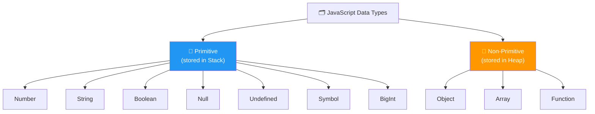
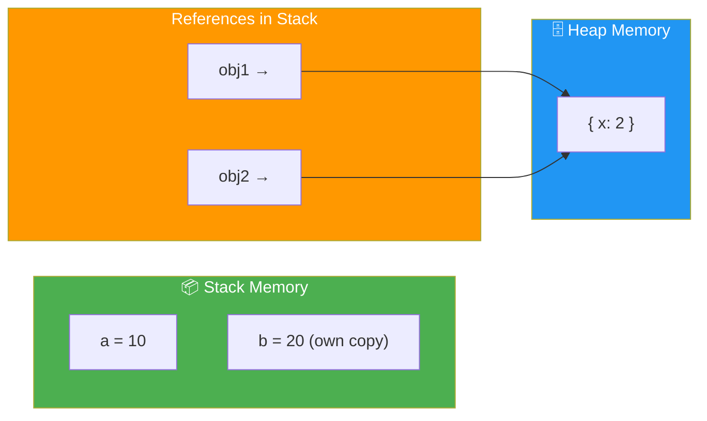
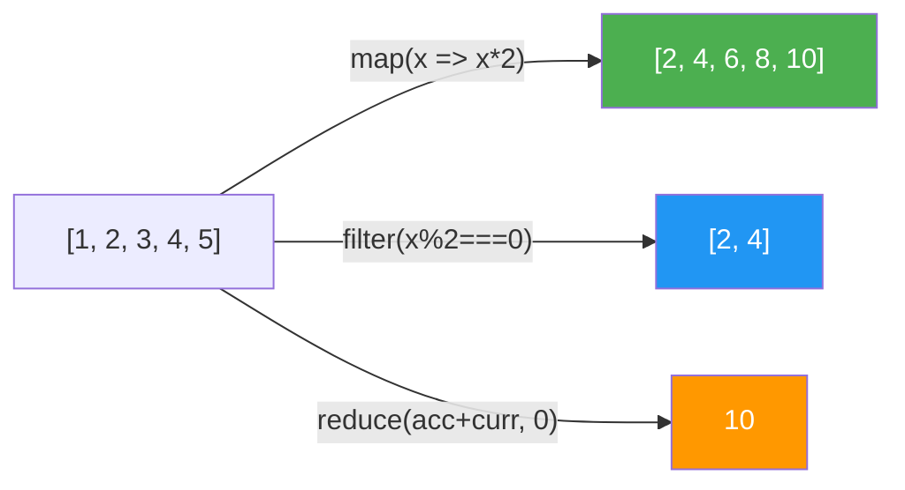
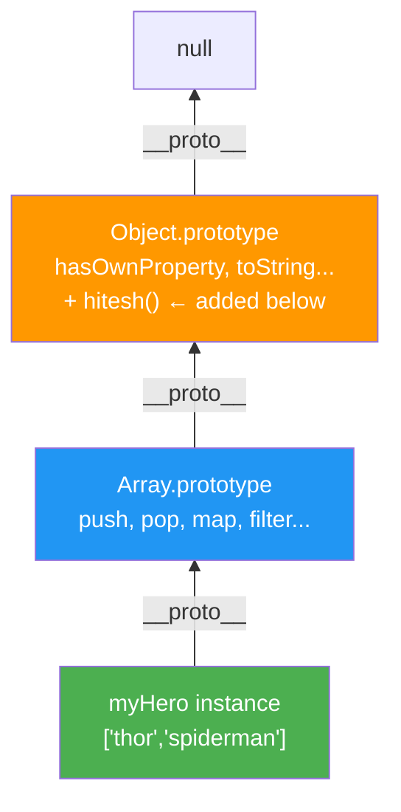
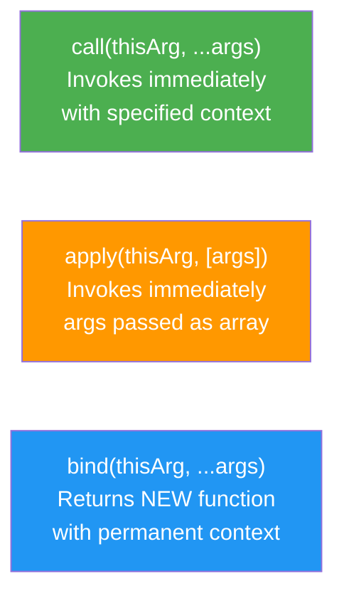

# JavaScript Notes — Structured Study Guide

## 📚 Table of Contents

1. [JavaScript Data Types](#1-javascript-data-types)
2. [Stack and Heap Memory](#2-stack-and-heap-memory)
3. [Strings in JavaScript](#3-strings-in-javascript)
4. [Numbers and Math](#4-numbers-and-math)
5. [Date and Time](#5-date-and-time)
6. [Arrays in JavaScript](#6-arrays-in-javascript)
7. [Objects in JavaScript](#7-objects-in-javascript)
8. [OOP in JavaScript](#8-object-oriented-programming)
9. [Magic of Prototype](#9-magic-of-prototype)
10. [call() and this](#10-call-and-this)
11. [Class, Constructor and Static](#11-class-constructor-and-static)
12. [Bind in JavaScript](#12-bind-in-javascript)
13. [Getters & Setters](#13-getters--setters)
14. [Object Property Descriptors](#14-object-property-descriptors)

---

# 1. JavaScript Data Types



## Primitive Types

> **Primitive types** are the basic building blocks of data in JavaScript. They are **immutable** — the value itself cannot be changed in memory; you can only replace it with a new value. When assigned to a new variable, a **literal copy** of the value is created in the **Stack memory** — changes to the copy never affect the original. There are exactly **7 primitive types** in JavaScript:
>
> - **Number**: Used for both integer and floating-point values (e.g., `42`, `3.14`). JS does not have separate `int` and `float` types.
> - **String**: Represents sequences of characters, declared using single quotes, double quotes, or backticks (template literals).
> - **Boolean**: A logical type that can only be `true` or `false`.
> - **Null**: An **intentional** representation of an empty or non-existent value — it is a standalone value, not zero, not an empty string.
> - **Undefined**: The **default value** automatically assigned to variables that have been declared but not yet initialized with a value.
> - **Symbol**: Introduced in ES6 to create **unique and immutable identifiers**, often used to prevent property name collisions in complex objects.
> - **BigInt**: Designed to handle integers larger than the maximum safe limit (`2^53 - 1`) allowed by the standard Number type (e.g., `123n`).

> ⚠️ `typeof null` returning `"object"` is a **historical bug** from JavaScript's very first version (1995). `null` is NOT an object — it represents the intentional absence of any value. It was never fixed to avoid breaking existing web pages.

> 💡 **Type Coercion**: JavaScript is **dynamically and weakly typed**, meaning the engine can implicitly convert types during operations (e.g., converting a string to a number). Always prefer **strict equality (`===`)** over loose equality (`==`) to avoid unexpected coercion bugs.

| Type | Example | `typeof` |
|---|---|---|
| Number | `42`, `3.14` | `"number"` |
| String | `"hello"` | `"string"` |
| Boolean | `true`, `false` | `"boolean"` |
| Null | `null` | `"object"` ⚠️ |
| Undefined | `undefined` | `"undefined"` |
| Symbol | `Symbol('id')` | `"symbol"` |
| BigInt | `123n` | `"bigint"` |

```javascript
// Primitive Types (Stored in Stack)
let score = 100;           // Number
let name = "Hitesh";       // String
let isLogged = true;       // Boolean
let outsideTemp = null;    // Null
let userEmail;             // Undefined
let id = Symbol('123');    // Symbol
let bigNumber = 123n;      // BigInt

console.log(typeof score);       // "number"
console.log(typeof name);        // "string"
console.log(typeof outsideTemp); // "object" ← known JS quirk
console.log(typeof userEmail);   // "undefined"
console.log(typeof id);          // "symbol"
console.log(typeof bigNumber);   // "bigint"
```

## Non-Primitive Types

> **Non-primitive types** (also called **Reference types**) are treated as reference types because the variable does **not** store the data itself — it stores a **reference (memory address/pointer)** to where the data lives in the **Heap memory**. These types are dynamic and can hold complex collections of data. Because two variables can hold the same reference, modifying through one affects the other. Unlike primitives, non-primitives are **mutable** — their contents can be changed after creation. They include:
>
> - **Objects**: The core mechanism for modeling real-world entities using key-value pairs.
> - **Arrays**: Ordered, dynamic collections that can store **multiple data types simultaneously**.
> - **Functions**: Treated as **first-class objects** in JavaScript — they can be stored in variables and passed as arguments.

```javascript
// Non-Primitive Types (Stored in Heap, Referenced in Stack)
const heroes = ["Shaktiman", "Naagraj", "Doga"]; // Array

let myObj = {
    name: "Hitesh",
    age: 30,
}; // Object

const myFunction = function() {
    console.log("Hello World");
}; // Function

console.log(typeof heroes);     // "object"
console.log(typeof myObj);      // "object"
console.log(typeof myFunction); // "function"
```

---

# 2. Stack and Heap Memory



## Stack Memory

> The **Stack** is used for **static memory allocation** and follows a **Last-In-First-Out (LIFO)** structure.

- **What it stores**: All **Primitive datatypes** (`number`, `string`, `boolean`, `null`, `undefined`, `symbol`, `bigint`) and function execution frames
- **Access Speed**: Exceptionally **fast** — the size of the data is known at compile time, so no dynamic lookup is needed
- **Lifetime**: **Short** — memory is automatically "popped" off and reclaimed as soon as a function completes its execution
- **Copy Mechanism**: When you assign a primitive to a new variable, you get a completely **independent copy** of the value — changes to the copy do NOT affect the original
- **Size Limit**: The Stack has a fixed size limit. Deeply recursive functions can cause a **Stack Overflow** (`RangeError: Maximum call stack size exceeded`)

## Heap Memory

> The **Heap** is an unorganised, large region of memory used for **dynamic memory allocation**.

- **What it stores**: All **Non-Primitive (Reference) types** — Objects, Arrays, and Functions
- **Access Speed**: **Slower** than the Stack — requires **pointer indirection** (the engine reads the reference from the Stack, then follows it to the actual data in the Heap)
- **Lifetime**: **Longer** — data persists until it is no longer reachable by any variable and is cleared by the **Garbage Collector** (JS's automated memory management)
- **Reference Mechanism**: When you create an object, the engine allocates memory in the Heap and stores a **reference (memory address)** in the Stack. Modifying the object through this reference affects the original data

### Summary Comparison Table

| Aspect | Stack Memory | Heap Memory |
|---|---|---|
| **Stores** | Call frames, primitives, references | Objects, Arrays, Functions |
| **Access Speed** | Fast | Slower (pointer lookup) |
| **Lifetime** | Short (function execution) | Long (until Garbage Collection) |
| **Allocation** | Static / Automatic (LIFO) | Dynamic |
| **Copy Behavior** | Value copy (independent) | Reference copy (shared) |

```javascript
// Stack Example (Primitives — Value Copy)
let a = 10;
let b = a;   // 'b' gets a copy of the value 10
b = 20;      // Changing 'b' does NOT affect 'a'
console.log(a); // Output: 10

// Heap Example (Objects — Reference Copy)
let obj1 = { x: 1 };
let obj2 = obj1; // 'obj2' gets a reference to the SAME heap address
obj2.x = 2;      // Changing 'obj2' modifies the original object in the Heap
console.log(obj1.x); // Output: 2
```

> ⚠️ **Key Takeaway:** Primitives → independent copies. Objects → shared reference.

---

# 3. Strings in JavaScript

> A **String** is one of the seven essential **primitive data types** used to represent sequences of characters. While strings are primitive literals, JavaScript uses a **"boxing" mechanism** to temporarily wrap them in a String object, granting access to a rich library of prototype methods. Strings are encoded in **UTF-16** format internally.
>
> Strings are **immutable** — once created, the character sequence cannot be altered. All string methods return a **brand new string** rather than modifying the original.
>
> **Three ways to declare strings:**
> - Single quotes: `'hello'`
> - Double quotes: `"hello"`
> - Backticks (**Template Literals**): `` `hello` `` — the modern superior approach, supporting **multi-line strings** and **string interpolation** via `${expression}` syntax

## Template Literals

```javascript
const name = "hitesh";
const repoCount = 50;

// Modern string interpolation
console.log(`Hello my name is ${name} and my repo count is ${repoCount}`);
// Hello my name is hitesh and my repo count is 50
```

## String Methods

> ⚠️ All methods below return a **new string** — the original is never modified.

| Method | Technical Function | Example Output |
|---|---|---|
| `charAt(index)` | Retrieves character at a specific position | `"chai".charAt(0)` → `"c"` |
| `indexOf(char)` | Locates first occurrence of a character | `"code".indexOf("o")` → `1` |
| `substring(s, e)` | Extracts from index `s` up to (not including) `e` | `"javascript".substring(0,4)` → `"java"` |
| `slice(s, e)` | Like substring; supports **negative indices** | `"hello".slice(-3)` → `"llo"` |
| `trim()` | Removes whitespace from both ends | `" chai ".trim()` → `"chai"` |
| `replace(a, b)` | Replaces first occurrence of `a` with `b` | `url.replace("%20", "-")` |
| `split(sep)` | Splits string into an **array** by separator | `"a/b/c".split("/")` → `["a","b","c"]` |
| `includes(str)` | Boolean check for substring presence | `"email@x.com".includes("@")` → `true` |
| `toUpperCase()` | Converts all characters to uppercase | `"chai".toUpperCase()` → `"CHAI"` |
| `toLowerCase()` | Converts all characters to lowercase | `"CHAI".toLowerCase()` → `"chai"` |

```javascript
const gameName = new String('hitesh-hc-com');

console.log(gameName.length);           // 13
console.log(gameName.toUpperCase());    // HITESH-HC-COM
console.log(gameName.charAt(2));        // t
console.log(gameName.indexOf('t'));     // 2
console.log(gameName.substring(0, 4));  // hite
console.log(gameName.slice(-8, 4));     // (negative index demo)
console.log(gameName.split('-'));       // ['hitesh', 'hc', 'com']

const newStringOne = "   hitesh    ";
console.log(newStringOne.trim());       // "hitesh"

const url = "https://hitesh.com/hitesh%20choudhary";
console.log(url.replace('%20', '-'));   // https://hitesh.com/hitesh-choudhary
console.log(url.includes('sundar'));    // false
```

## Additional String Methods

### Search & Check

| Method | Technical Function | Example Output |
|---|---|---|
| `startsWith(str, pos?)` | Returns `true` if string begins with `str` | `"hello".startsWith("he")` → `true` |
| `endsWith(str, len?)` | Returns `true` if string ends with `str` | `"hello".endsWith("lo")` → `true` |
| `lastIndexOf(char)` | Index of the **last** occurrence of `char` | `"abcabc".lastIndexOf("a")` → `3` |
| `search(regex)` | Index of first **regex** match; `-1` if none | `"foo123".search(/\d+/)` → `3` |
| `match(regex)` | Returns array of matches (or `null`) | `"test".match(/e/)` → `["e"]` |

```javascript
const email = "user@example.com";
console.log(email.startsWith("user"));  // true
console.log(email.endsWith(".com"));    // true
console.log(email.lastIndexOf("e"));    // 11

const str = "Order #12345 shipped";
console.log(str.search(/\d+/));         // 7
console.log(str.match(/\d+/));          // ["12345"]
console.log(str.match(/\d+/g));         // ["12345"] (global flag → all matches)
```

### Modify & Format

| Method | Technical Function | Example Output |
|---|---|---|
| `replaceAll(a, b)` | Replaces **every** occurrence of `a` with `b` | `"a-b-a".replaceAll("a","x")` → `"x-b-x"` |
| `repeat(n)` | Returns the string repeated `n` times | `"ha".repeat(3)` → `"hahaha"` |
| `padStart(len, char)` | Pads the **start** until total length is `len` | `"5".padStart(3,"0")` → `"005"` |
| `padEnd(len, char)` | Pads the **end** until total length is `len` | `"5".padEnd(3,"0")` → `"500"` |
| `trimStart()` | Removes leading whitespace only | `" hi ".trimStart()` → `"hi "` |
| `trimEnd()` | Removes trailing whitespace only | `" hi ".trimEnd()` → `" hi"` |

```javascript
const tag = "<div>hello</div>";
console.log(tag.replaceAll("div", "p")); // "<p>hello</p>"

console.log("ha".repeat(3));            // "hahaha"

// padStart is commonly used to format numbers/IDs
console.log("42".padStart(6, "0"));    // "000042"
console.log("hi".padEnd(6, "."));      // "hi...."

const padded = "   hello   ";
console.log(padded.trimStart());        // "hello   "
console.log(padded.trimEnd());          // "   hello"
```

### Index Access & Character Codes

| Method | Technical Function | Example Output |
|---|---|---|
| `at(index)` | Character at index; **supports negative** | `"hello".at(-1)` → `"o"` |
| `charCodeAt(index)` | UTF-16 code unit at position | `"A".charCodeAt(0)` → `65` |
| `String.fromCharCode(n)` | **Static** — character from UTF-16 code | `String.fromCharCode(65)` → `"A"` |

```javascript
const word = "JavaScript";
console.log(word.at(0));           // "J"
console.log(word.at(-1));          // "t"  ← last char (no length math needed)

console.log("A".charCodeAt(0));    // 65
console.log("a".charCodeAt(0));    // 97
console.log(String.fromCharCode(72, 105)); // "Hi"
```

---

# 4. Numbers and Math

> JavaScript follows the **IEEE 754 standard** for double-precision 64-bit binary format, which means it uses the same type — **Number** — to represent both integers and floating-point values. The global **Math** object is a **static utility object** — not a constructor — providing mathematical constants (`Math.PI`) and functions. You cannot use `new Math()`.

## Number Prototype Methods

> These methods are used to **format** numbers. All return a **string**, not a number.

| Method | Purpose | Example |
|---|---|---|
| `toFixed(n)` | Rounds to `n` decimal places (returns string) | `(100).toFixed(2)` → `"100.00"` |
| `toPrecision(n)` | Formats to `n` total significant digits | `(123.8966).toPrecision(4)` → `"123.9"` |
| `toLocaleString(locale)` | Formats by cultural convention | `(1000000).toLocaleString('en-IN')` → `"10,00,000"` |
| `toString()` | Converts number to string | `(255).toString(16)` → `"ff"` (hex) |

```javascript
const balance = new Number(100);
console.log(balance.toFixed(2));             // "100.00"

const otherNumber = 123.8966;
console.log(otherNumber.toPrecision(4));     // "123.9"

const hundreds = 1000000;
console.log(hundreds.toLocaleString('en-IN')); // "10,00,000"
```

## Math Object Methods

> `Math` is **not a constructor** — use it directly as `Math.method()`.

| Method | Purpose | Example |
|---|---|---|
| `Math.round(x)` | Standard rounding | `Math.round(4.6)` → `5` |
| `Math.ceil(x)` | Always rounds **up** | `Math.ceil(4.2)` → `5` |
| `Math.floor(x)` | Always rounds **down** | `Math.floor(4.9)` → `4` |
| `Math.abs(x)` | Absolute value (removes sign) | `Math.abs(-4)` → `4` |
| `Math.min(...args)` | Lowest value in a set | `Math.min(4,3,6,8)` → `3` |
| `Math.max(...args)` | Highest value in a set | `Math.max(4,3,6,8)` → `8` |
| `Math.random()` | Float between `0` and `1` (exclusive) | `Math.random()` → `0.573...` |
| `Math.pow(x, y)` | `x` to the power of `y` | `Math.pow(2,3)` → `8` |
| `Math.sqrt(x)` | Square root | `Math.sqrt(9)` → `3` |

```javascript
console.log(Math.abs(-4));         // 4
console.log(Math.round(4.6));      // 5
console.log(Math.ceil(4.2));       // 5
console.log(Math.floor(4.9));      // 4
console.log(Math.min(4, 3, 6, 8)); // 3
```

## Random Integer in a Range

> This formula scales `Math.random()` (which produces `[0,1)`) to the desired range size, then `Math.floor()` ensures a discrete **integer** result. Adding `min` shifts the result to start at the lower bound.

```javascript
const min = 10;
const max = 20;

// Formula: gives a random integer between min and max (inclusive)
console.log(Math.floor(Math.random() * (max - min + 1)) + min);
```

---

# 5. Date and Time

> The **Date object** in JavaScript represents a single moment in time stored internally as the number of **milliseconds** elapsed since the **Unix Epoch** (January 1, 1970, 00:00:00 UTC). Managing temporal data is recognized as one of the more complex aspects of JavaScript development due to a specific design choice — the **zero-indexing of months**.

## Creating Dates

```javascript
let myDate = new Date();                       // Current date & time
let specificDate = new Date(2023, 0, 23);      // Jan 23, 2023 — ⚠️ month is zero-indexed!
let fromString = new Date('2023-01-23');       // ISO string format — unambiguous
let withTime = new Date(2023, 0, 23, 14, 30, 0); // Jan 23, 2023 at 14:30:00
```

## ⚠️ The Month Indexing Paradox

> Months in JavaScript are **zero-indexed** when using numeric arguments:
> - `0` = January, `11` = December
> - Always **add 1** to `getMonth()` for a human-readable month number.

## Date Methods

| Method | Description | Example Output |
|---|---|---|
| `toString()` | Full string with date, time, and timezone | `"Mon Jan 23 2023 00:00:00..."` |
| `toDateString()` | Simplified date only | `"Mon Jan 23 2023"` |
| `toLocaleString()` | Locale-sensitive representation | `"1/23/2023, 12:00:00 AM"` |
| `toISOString()` | ISO 8601 format | `"2023-01-23T00:00:00.000Z"` |
| `getFullYear()` | Year | `2023` |
| `getMonth()` | Month (0-indexed!) | `0` (= January) |
| `getDate()` | Day of month | `23` |
| `getDay()` | Day of week (0=Sunday) | `1` (= Monday) |
| `getTime()` | Milliseconds since Unix Epoch | `1674432000000` |
| `Date.now()` | Current timestamp in ms (static) | `1715000000000` |

> **`getTime()` and `Date.now()`** return milliseconds since the Unix Epoch. This integer format is the **preferred method** for comparing two dates or calculating durations — it avoids all locale and format issues.

```javascript
let myDate = new Date();
console.log(myDate.toString());       // Full date string
console.log(myDate.toDateString());   // "Wed May 06 2026"
console.log(myDate.toLocaleString()); // "5/6/2026, 10:30:00 AM"
console.log(typeof myDate);           // "object"

let myCreatedDate = new Date(2023, 0, 23); // ← 0 = January!
console.log(myCreatedDate.toDateString()); // "Mon Jan 23 2023"

let myTimeStamp = Date.now();
console.log(myTimeStamp); // e.g., 1715000000000 (ms since epoch)

let newDate = new Date();
console.log(newDate.getMonth() + 1);  // +1 for human-readable month
console.log(newDate.getFullYear());   // 2026
console.log(newDate.getDay());        // Day of week (0=Sunday)

// Locale-specific weekday name
console.log(newDate.toLocaleString('default', { weekday: 'long' })); // "Wednesday"
```

---

# 6. Arrays in JavaScript

> **Arrays** are dynamic, ordered collections capable of storing **multiple data types simultaneously**. They are **Non-Primitive (Reference) types** — the actual array data is stored in the **Heap memory**, while the variable holds only a **reference (pointer)** to that Heap location. When you assign one array variable to another, you duplicate the **pointer only** — both variables point to the same underlying data, so modifying one affects the other.
>
> **Shallow Copying**: Most standard array operations perform a **"shallow copy"**. The top-level array is a new instance, but any **nested objects or arrays** within it still hold references to the original memory. Modifying a nested element in the copy modifies the original as well.

```javascript
const myArr = [0, 1, 2, 3, 4, 5];
console.log(typeof myArr); // "object"
console.log(myArr[0]);     // 0
console.log(myArr.length); // 6
```

## slice() vs splice()

| Feature | `slice(start, end)` | `splice(start, count, ...items)` |
|---|---|---|
| **Mutation** | **Non-destructive** (original unchanged) | **Destructive** (original modified) |
| **Return Value** | New array with the subset | Array of the **deleted** elements |
| **Argument 2** | End index (not included) | **Count** of elements to remove |
| **Use Case** | Read a portion of an array safely | Remove, replace, or insert elements |

```javascript
const myArr = [0, 1, 2, 3, 4, 5];

// slice: Non-destructive
const nArr1 = myArr.slice(1, 3);
console.log(nArr1);  // [1, 2]         ← original unchanged
console.log(myArr);  // [0,1,2,3,4,5]

// splice: Destructive
const nArr2 = myArr.splice(1, 3);
console.log(nArr2);  // [1, 2, 3]      ← removed elements
console.log(myArr);  // [0, 4, 5]      ← original modified!
```

## Mutating Methods (Stack & Queue logic)

| Method | Description | Example |
|---|---|---|
| `push(x)` | Add to **end** | `[1,2].push(3)` → `[1,2,3]` |
| `pop()` | Remove from **end** | `[1,2,3].pop()` → `3` |
| `unshift(x)` | Add to **beginning** | `[1,2].unshift(0)` → `[0,1,2]` |
| `shift()` | Remove from **beginning** | `[1,2,3].shift()` → `1` |
| `sort()` | Sort in place | `[3,1,2].sort()` → `[1,2,3]` |
| `reverse()` | Reverse in place | `[1,2,3].reverse()` → `[3,2,1]` |

## The "Holy Trinity" of Transformation

> `map()`, `filter()`, and `reduce()` are the primary tools for transforming, aggregating, and filtering data sets **without manual loops**.

```javascript
const nums = [1, 2, 3, 4, 5];

// map — transforms every element, returns new array
const doubled = nums.map(num => num * 2);
console.log(doubled); // [2, 4, 6, 8, 10]

// filter — keeps elements matching condition, returns new array
const even = nums.filter(num => num % 2 === 0);
console.log(even);    // [2, 4]

// reduce — aggregates into a single value
const sum = nums.reduce((acc, curr) => acc + curr, 0);
console.log(sum);     // 10

// find — first element matching condition
const found = nums.find(n => n > 3);
console.log(found);   // 4

// findIndex — index of first matching element
console.log(nums.findIndex(n => n > 3)); // 3

// forEach — iterate (no return value, unlike map)
nums.forEach(n => console.log(n));

// flat — flattens nested arrays
const complex = [1, [2, 3], [4, [5]]];
console.log(complex.flat(2)); // [1, 2, 3, 4, 5]

// join — all elements into a single string
console.log(["Chai", "Code"].join("-")); // "Chai-Code"
```



## Search & Check Methods

| Method | Technical Function | Mutates? |
|---|---|---|
| `includes(val, from?)` | Returns `true` if `val` exists in the array | ❌ No |
| `indexOf(val, from?)` | First index of `val`; `-1` if not found | ❌ No |
| `lastIndexOf(val, from?)` | Last index of `val`; `-1` if not found | ❌ No |
| `every(fn)` | `true` if **all** elements pass the test | ❌ No |
| `some(fn)` | `true` if **at least one** element passes | ❌ No |
| `at(index)` | Element at index; supports **negative** | ❌ No |

```javascript
const scores = [10, 20, 30, 20, 40];

console.log(scores.includes(20));        // true
console.log(scores.indexOf(20));         // 1 (first match)
console.log(scores.lastIndexOf(20));     // 3 (last match)

console.log(scores.every(n => n > 5));   // true  — all > 5
console.log(scores.every(n => n > 15));  // false — 10 fails
console.log(scores.some(n => n > 35));   // true  — 40 qualifies

console.log(scores.at(0));               // 10
console.log(scores.at(-1));              // 40  ← last element
```

## Build & Combine Methods

| Method | Technical Function | Mutates? |
|---|---|---|
| `concat(...arrs)` | Merges arrays into a new array | ❌ No |
| `fill(val, start?, end?)` | Fills a range with a static value | ✅ Yes |
| `flatMap(fn)` | `map()` then `flat(1)` in one pass | ❌ No |
| `copyWithin(target, start?, end?)` | Copies a section to another position | ✅ Yes |

```javascript
const a = [1, 2];
const b = [3, 4];
console.log(a.concat(b, [5, 6]));  // [1, 2, 3, 4, 5, 6]

const arr = [1, 2, 3, 4, 5];
arr.fill(0, 2, 4);                  // fills indices 2 and 3 with 0
console.log(arr);                   // [1, 2, 0, 0, 5]

// flatMap — useful for "expand each item" patterns
const words = ["hello world", "foo bar"];
console.log(words.flatMap(w => w.split(" ")));
// ["hello", "world", "foo", "bar"]
```

## Static Array Methods

| Method | Technical Function |
|---|---|
| `Array.isArray(val)` | Returns `true` if `val` is an array |
| `Array.from(iterable, mapFn?)` | Creates array from any iterable or array-like object |
| `Array.of(...items)` | Creates array from the provided arguments |

```javascript
console.log(Array.isArray([1, 2, 3])); // true
console.log(Array.isArray("hello"));   // false

// Array.from — great for Sets, NodeLists, strings
console.log(Array.from("hello"));             // ['h','e','l','l','o']
console.log(Array.from({length: 3}, (_, i) => i + 1)); // [1, 2, 3]
console.log(Array.from(new Set([1, 2, 2, 3]))); // [1, 2, 3]

console.log(Array.of(7));    // [7]   (vs. new Array(7) which creates 7 empty slots)
```

## Iterators

> These methods return **iterator objects** and are used with `for...of` loops to get structured access to indices and values.

| Method | Yields |
|---|---|
| `entries()` | `[index, value]` pairs |
| `keys()` | Indices only |
| `values()` | Values only |

```javascript
const fruits = ["apple", "banana", "cherry"];

for (const [i, fruit] of fruits.entries()) {
    console.log(`${i}: ${fruit}`);
}
// 0: apple
// 1: banana
// 2: cherry

for (const key of fruits.keys()) {
    console.log(key); // 0, 1, 2
}
```

---

# 7. Objects in JavaScript

> **Objects** are the primary mechanism for modeling real-world entities and managing application state. They are **Non-Primitive (Reference) types** stored in the **Heap memory**, with the variable holding a reference to that location. Objects store data as **unordered** collections of **key-value pairs** — keys are strings (or Symbols), values can be any type.
>
> **Two main instantiation patterns:**
> - **Object Literals `{}`** — **Non-Singleton**: every execution creates a new, independent instance in the Heap.
> - **Constructor Pattern `new Object()` / `Object.create()`** — **Singleton**: intended to exist as a **single shared instance** throughout the application (e.g., database connections, global config).

```javascript
const mySym = Symbol("key1");

const jsUser = {
    name: "Hitesh",
    age: 18,
    [mySym]: "mykey1",    // Symbol as key — prevents property name collision
    location: "Jaipur",
    isLoggedIn: false,
    lastLoginDays: ["Monday", "Saturday"]
};

// Dot notation (standard)
console.log(jsUser.name);        // Hitesh
// Bracket notation (required for Symbols and dynamic keys)
console.log(jsUser["location"]); // Jaipur
console.log(jsUser[mySym]);      // mykey1
```

## Object Utility Methods

| Method | Technical Function | Example |
|---|---|---|
| `Object.keys(obj)` | Array of property **names** | `Object.keys(jsUser)` |
| `Object.values(obj)` | Array of property **values** | `Object.values(jsUser)` |
| `Object.entries(obj)` | Array of `[key, value]` pairs | `Object.entries(jsUser)` |
| `Object.assign(target, src)` | Merges source into target | `Object.assign({}, obj1, obj2)` |
| `Object.freeze(obj)` | Makes object **immutable** — no changes allowed | `Object.freeze(jsUser)` |
| `hasOwnProperty(key)` | Checks if key exists directly on the object | `jsUser.hasOwnProperty('name')` |

```javascript
console.log(Object.keys(jsUser));              // ['name', 'age', 'location', ...]
console.log(Object.values(jsUser));            // ['Hitesh', 18, 'Jaipur', ...]
console.log(jsUser.hasOwnProperty('isLoggedIn')); // true

// Merging objects
const obj1 = {1: "a", 2: "b"};
const obj2 = {3: "c", 4: "d"};
const merged = { ...obj1, ...obj2 }; // Spread — modern preferred approach

// Immutability
Object.freeze(jsUser);
jsUser.name = "Chai"; // Silently fails — change NOT applied
console.log(jsUser.name); // "Hitesh"
```

## Destructuring & Optional Chaining

```javascript
// Basic destructuring — unpack into variables
const { name: userName, age } = jsUser;
console.log(userName); // "Hitesh"
console.log(age);      // 18

// Nested destructuring
const user = { fullname: { firstname: "Hitesh", lastname: "Choudhary" } };
const { fullname: { firstname } } = user;
console.log(firstname); // "Hitesh"

// Optional chaining — safe access to deeply nested properties
console.log(jsUser?.address?.city); // undefined (no error)
```

> 💡 **Objects → JSON**: In web development, JavaScript objects are serialized to **JSON** (JavaScript Object Notation) for API data exchange using `JSON.stringify(obj)` and parsed back with `JSON.parse(jsonString)`.

## Additional Static Object Methods

### Create & Inspect

| Method | Technical Function |
|---|---|
| `Object.create(proto)` | Creates a new object with `proto` as its prototype |
| `Object.fromEntries(entries)` | Inverse of `Object.entries()` — converts `[key, val]` pairs back into an object |
| `Object.getOwnPropertyNames(obj)` | Array of **all** own property names, including non-enumerable ones |
| `Object.getPrototypeOf(obj)` | Returns the prototype of `obj` |

```javascript
// Object.create — set up a prototype chain manually
const animal = { breathes: true };
const dog = Object.create(animal);
dog.sound = "Woof";
console.log(dog.breathes); // true  ← inherited from animal via prototype
console.log(Object.getPrototypeOf(dog) === animal); // true

// Object.fromEntries — reverse of Object.entries
const entries = [["name", "Hitesh"], ["age", 30]];
const obj = Object.fromEntries(entries);
console.log(obj); // { name: 'Hitesh', age: 30 }

// Powerful combo: transform object values
const prices = { chai: 20, coffee: 60, water: 5 };
const discounted = Object.fromEntries(
    Object.entries(prices).map(([key, val]) => [key, val * 0.9])
);
console.log(discounted); // { chai: 18, coffee: 54, water: 4.5 }

// Object.getOwnPropertyNames — includes hidden (non-enumerable) keys
const secret = {};
Object.defineProperty(secret, "_id", { value: 42, enumerable: false });
console.log(Object.keys(secret));                   // []         ← hidden
console.log(Object.getOwnPropertyNames(secret));    // ['_id']    ← visible
```

### Equality & Locking

| Method | Technical Function |
|---|---|
| `Object.is(a, b)` | Strict equality that correctly handles `NaN` and `-0` |
| `Object.seal(obj)` | Prevents adding/deleting properties but allows **modifying** existing values |
| `Object.isFrozen(obj)` | Returns `true` if the object is fully immutable (`Object.freeze`) |
| `Object.isSealed(obj)` | Returns `true` if the object is sealed |
| `Object.hasOwn(obj, key)` | Modern, safe replacement for `hasOwnProperty` |

```javascript
// Object.is — handles edge cases that === misses
console.log(NaN === NaN);           // false  ← === is wrong here
console.log(Object.is(NaN, NaN));   // true   ← correct
console.log(Object.is(+0, -0));     // false  ← distinguishes sign
console.log(+0 === -0);             // true   ← === cannot tell

// Object.seal — allow edits, block add/delete
const config = { env: "prod", version: 2 };
Object.seal(config);
config.version = 3;       // ✅ allowed — modifying existing property
config.newKey = "value";  // ❌ silently fails — new property blocked
delete config.env;        // ❌ silently fails — delete blocked
console.log(config);      // { env: 'prod', version: 3 }

// Object.hasOwn — preferred over hasOwnProperty (works on null-prototype objects)
const user = { name: "Hitesh" };
console.log(Object.hasOwn(user, "name"));    // true
console.log(Object.hasOwn(user, "age"));     // false
```

### Copying Objects (Shallow vs Deep)

| Technique | Type | Notes |
|---|---|---|
| `{ ...obj }` | **Shallow** | Top-level copy; nested references are shared |
| `Object.assign({}, obj)` | **Shallow** | Equivalent to spread for simple copies |
| `structuredClone(obj)` | **Deep** | Recursively copies everything — no shared references |

```javascript
const original = { name: "Hitesh", address: { city: "Jaipur" } };

// Shallow copy — nested object is still shared
const shallow = { ...original };
shallow.address.city = "Mumbai";
console.log(original.address.city); // "Mumbai" ← original affected!

// Deep clone — fully independent copy
const deep = structuredClone(original);
deep.address.city = "Delhi";
console.log(original.address.city); // "Mumbai" ← original unchanged ✅
```

---

# 8. Object-Oriented Programming

> **Object-Oriented Programming (OOP)** in JavaScript is a programming paradigm that organises code around **objects** — bundles of data (properties) and behaviour (methods) — rather than standalone functions and variables. JavaScript uses **class-based OOP syntax** (introduced in ES6), which is actually **syntactic sugar over its existing prototype-based inheritance**. The four core pillars of OOP are:
> - **Encapsulation** — bundling data and methods that operate on that data inside a class, hiding internal details
> - **Inheritance** — a child class (`extends`) reuses and extends the properties and methods of a parent class
> - **Abstraction** — exposing only what is necessary and hiding complex implementation details
> - **Polymorphism** — child classes can override parent methods to behave differently

> 💡 In JS, `class` is syntactic sugar — under the hood it still uses **prototypes**. A class is essentially a function. When you use `new`, a new object is allocated in **Heap memory** and the constructor initializes its state.


## Class & Constructor

```javascript
// Base Class
class User {
    constructor(username, email, password) {
        this.username = username;
        this.email = email;
        this.password = password;
    }

    // Regular method — available to all instances
    encryptPassword() {
        return `${this.password}abc`;
    }

    changeUsername() {
        return `${this.username.toUpperCase()}`;
    }
}

const chai = new User("hitesh", "hitesh@gmail.com", "123");
console.log(chai.encryptPassword()); // 123abc
console.log(chai.changeUsername());  // HITESH
```

## Inheritance with `extends` & `super`

```javascript
// Child Class (Inheritance)
class Teacher extends User {
    constructor(username, email, password, subject) {
        super(username, email, password); // calls parent User constructor
        this.subject = subject;
    }

    addCourse() {
        console.log(`A new course was added by ${this.username}`);
    }
}

const tea = new Teacher("chai", "tea@teacher.com", "456", "JavaScript");
tea.addCourse();                      // A new course was added by chai
console.log(tea.changeUsername());    // CHAI (inherited from User)
console.log(tea.encryptPassword());   // 456abc (inherited from User)

// Checking instances (prototype chain verification)
console.log(tea instanceof Teacher);  // true
console.log(tea instanceof User);     // true
```

---

# 9. Magic of Prototype

> **Prototypes** are the mechanism by which JavaScript objects **inherit features from one another**. Every JavaScript object has an internal hidden property called `[[Prototype]]` (accessible via `__proto__`) that is a **link/reference to another object** — its prototype. When you try to access a property or method on an object and it's **not found on the object itself**, JavaScript automatically walks **up the prototype chain** — checking the object's prototype, then the prototype's prototype, and so on — until it either finds it or reaches `null` (the end of the chain). This is called **Prototypal Inheritance**. All built-in types (`Array`, `String`, `Number`, etc.) get their methods (`push`, `map`, `toUpperCase`, etc.) this way — those methods live on their respective prototypes, not on each individual instance.



```javascript
// Example A: Global injection — available to ALL objects (use with caution)
Object.prototype.hitesh = function() {
    console.log(`Hitesh is present in all objects`);
};

let myHero = ["thor", "spiderman"];
myHero.hitesh(); // "Hitesh is present in all objects"
// The array found the method by walking up the chain to Object.prototype

let obj = { a: 1 };
obj.hitesh();    // "Hitesh is present in all objects"
```

> ⚠️ Modifying `Object.prototype` affects **every single entity** in your codebase — strings, arrays, functions, and all objects. Use with caution in production code.

> 💡 **Memory Efficiency**: Methods defined on the prototype are stored **once** in the Heap, rather than being recreated for every new instance. This is the core reason JavaScript uses prototypes.

```javascript
// Example B: Custom String prototype method
String.prototype.trueLength = function() {
    console.log(`True length is: ${this.trim().length}`);
};

let anotherUsername = "ChaiAurCode     ";
anotherUsername.trueLength(); // "True length is: 11"
// 'this' refers to the specific string instance that called the method
```

```javascript
// Example C: Prototypal Inheritance (Manual Linking)
const User = { name: "chai", email: "chai@google.com" };
const Teacher = { makeVideo: true };

// Link Teacher to User — Teacher now inherits User's properties
Object.setPrototypeOf(Teacher, User);

console.log(Teacher.name);      // "chai" (inherited via prototype chain)
console.log(Teacher.makeVideo); // true (own property)
```

> Always use `Object.getPrototypeOf()` and `Object.setPrototypeOf()` in production — `__proto__` is a legacy accessor.

---

# 10. call() and this

> The keyword **`this`** refers to the **current execution context** — the object that "owns" the currently executing code. Its value is **not fixed**; it is determined at the **moment of function invocation**, not at the point of definition:
>
> - **Global context**: `this` refers to the global object (`window` in browsers, `global` in Node.js)
> - **Object methods**: `this` refers to the object that called the method
> - **Arrow functions**: Do **not** have their own `this` binding — they **inherit** `this` from the parent lexical scope
>
> **Why `call()` exists**: When a helper function is invoked normally, its `this` defaults to the global context — losing the reference to the object being built. `call()` lets you **explicitly specify** what `this` should refer to during that invocation.



```javascript
function SetUsername(username) {
    // In a real app: DB validation, formatting, etc.
    this.username = username;
    console.log("SetUsername called");
}

function CreateUser(username, email, password) {
    /*
       Simply calling SetUsername(username) here would NOT work.
       Without .call(this), 'this' inside SetUsername would refer
       to the Global object, assigning username there instead of
       to the new user object being constructed.
    */
    SetUsername.call(this, username); // Pass current 'this' (new user) to SetUsername
    this.email = email;
    this.password = password;
}

const userOne = new CreateUser("chai", "chai@fb.com", "123");
console.log(userOne);
// Output: { username: 'chai', email: 'chai@fb.com', password: '123' }
```

> **Key Insight — Constructor Chaining**: This pattern is the foundational precursor to modern class-based `super()` calls — allowing different functions to cooperatively build a single object instance.

---

# 11. Class, Constructor and Static

> **ES6 Classes** are syntactic sugar over JavaScript's prototype-based inheritance — under the hood, `class` still uses prototypes. They provide a clean, organized way to implement OOP.

### The Constructor Method

> The **`constructor`** is automatically invoked when a new instance is created with `new`. A class can have **only one** constructor. It initializes the instance by assigning values to properties via `this`.

### Static Properties and Methods

> The **`static`** keyword defines methods or properties that belong to the **class itself**, not to any instance. They **cannot** be called on an instance — only on the class name directly.
>
> **Common Use Cases**: ID generators, factory methods, database connection managers, utility functions where a separate copy per instance would be wasteful.

### Constructor vs Regular vs Static — Comparison

| Feature | Constructor | Regular Method | Static Method |
|---|---|---|---|
| **Purpose** | Initializes the object instance | Defines behavior for instances | Class-level utility logic |
| **Triggered by** | `new ClassName()` | `instance.method()` | `ClassName.method()` |
| **`this` refers to** | The new instance | The calling instance | The Class itself |
| **Inherited** | Yes (via `super()`) | Yes (overridable) | Yes (called on Class) |

```javascript
class User {
    constructor(username, email, password) {
        this.username = username;
        this.email = email;
        this.password = password;
    }

    // Regular method — available to all instances
    logMe() {
        console.log(`Username: ${this.username}`);
    }

    // Static method — belongs to the Class, NOT instances
    static createId() {
        return `ID-${Math.floor(Math.random() * 1000)}`;
    }
}

const hitesh = new User("hitesh", "hitesh@gmail.com", "123");
hitesh.logMe();               // "Username: hitesh"

// hitesh.createId();         // ❌ TypeError: hitesh.createId is not a function
console.log(User.createId()); // ✅ "ID-452"

// Inheritance with static
class Teacher extends User {
    constructor(username, email, password, subject) {
        super(username, email, password);
        this.subject = subject;
    }
    addCourse() {
        console.log(`Course added by ${this.username}`);
    }
}

const t = new Teacher("chai", "chai@t.com", "456", "JS");
t.logMe();      // Inherited — "Username: chai"
t.addCourse();  // "Course added by chai"
```

---

# 12. Bind in JavaScript

> The **`bind()`** method creates a **new function** — a "bound function" — where `this` is **permanently and irrevocably set** to a specified value. Unlike `call()` and `apply()` which invoke the function immediately, `bind()` **does not execute** the function — it returns a new callable reference with the context pre-attached.
>
> **The Practical Problem — Context Loss**: When a method is passed as a callback (e.g., to a DOM event listener), the function is invoked by the browser/DOM, not by the original object. This causes `this` inside the method to be `undefined` (strict mode) or the global `window` — breaking access to the object's properties.

### call / apply / bind Comparison

| Method | Execution | Arguments | `this` Binding |
|---|---|---|---|
| `call(ctx, a, b)` | **Immediate** | Individual args | Explicit, one-time |
| `apply(ctx, [a,b])` | **Immediate** | Array of args | Explicit, one-time |
| `bind(ctx, a, b)` | **Returns new fn** | Individual args | **Permanent** |

```javascript
class ReactComponent {
    constructor() {
        this.library = "React";
        this.server = "https://localhost:3000";

        /*
           Problem: Passing this.handleClick directly to addEventListener
           causes 'this' inside handleClick to refer to the HTML Button
           element — not this ReactComponent instance.

           Solution: .bind(this) creates a new function where 'this'
           is permanently locked to this ReactComponent instance.
        */
        document
            .querySelector('button')
            .addEventListener('click', this.handleClick.bind(this));
    }

    handleClick() {
        console.log("Button clicked!");
        console.log(this.server); // ✅ "https://localhost:3000" (correct context)
    }
}

const app = new ReactComponent();
```

> **Key Takeaways**:
> - `bind` returns a **new function reference** — store it in a variable or pass it directly
> - Once bound, the `this` context **cannot be changed**, even with a subsequent `.call()` or `.apply()`
> - In React class components, binding in the constructor is the standard pattern to ensure event handlers retain access to `this.state` and `this.props`

---

# 13. Getters & Setters

> **Getters** (`get`) and **Setters** (`set`) are special accessor methods that let you **intercept and control** how a class property is read and written, while keeping the syntax looking like normal property access (no parentheses). They are a core tool for implementing **Encapsulation**.
>
> - **Getter (`get`)**: Retrieves the value of a property — allows logic (formatting, calculation, security) **before returning** the data
> - **Setter (`set`)**: Assigns a value — primarily used for **validation** or **transformation** before data is stored

### ⚠️ The Stack Overflow (Infinite Recursion) Problem

> If your getter/setter uses the **same name** as the constructor's assignment (e.g., `this.password = value` inside the `set password` setter), the engine calls the setter again, which calls itself again — infinite loop until the **Call Stack overflows** (`RangeError: Maximum call stack size exceeded`).
>
> **The Solution**: Use a **backing variable** — a separate internal property prefixed with an underscore (e.g., `_password`) to store the actual data, while the getter/setter use the public-facing name.

```javascript
class User {
    constructor(email, password) {
        this.email = email;       // triggers the email setter
        this.password = password; // triggers the password setter
    }

    get email() {
        return this._email.toUpperCase(); // formatting on read
    }
    set email(value) {
        this._email = value; // stored in _email to avoid infinite loop
    }

    get password() {
        return `${this._password}hitesh`; // never expose raw password
    }
    set password(value) {
        this._password = value; // stored in _password
    }
}

const hitesh = new User("h@hitesh.com", "abc");
console.log(hitesh.email);    // "H@HITESH.COM"  ← getter runs
console.log(hitesh.password); // "abchitesh"     ← getter runs
```

### Why Use Getters & Setters?

| Benefit | Description |
|---|---|
| **Encapsulation** | Hide internal data representation behind a clean public interface |
| **Validation** | Prevent invalid data from being stored |
| **Security** | Return a modified/encrypted version instead of raw sensitive data |
| **Backward Compatibility** | Change internal property names without breaking dependent code |

---

# 14. Object Property Descriptors

> Every property in a JavaScript object has hidden **"meta-properties"** called **Property Descriptors** that govern how it behaves at a fundamental level. This is the internal mechanism that explains *why* `Math.PI = 5` silently fails — it is not magic, it is a **descriptor flag** set inside the JavaScript engine.
>
> Understanding property descriptors is essential for **library/framework development**, **security**, and building **truly immutable** data structures beyond what `const` provides (`const` only prevents reassignment, not property mutation).

### The Four Descriptor Flags

| Flag | Type | Default | Description |
|---|---|---|---|
| `value` | Any | `undefined` | The actual data stored in the property |
| `writable` | Boolean | `true` | If `false`, the value **cannot be modified** |
| `enumerable` | Boolean | `true` | If `false`, property is **hidden** from `for...in` and `Object.keys()` |
| `configurable` | Boolean | `true` | If `false`, property **cannot be deleted** and descriptor flags cannot change |

### Key Methods

| Method | Purpose |
|---|---|
| `Object.getOwnPropertyDescriptor(obj, "prop")` | Retrieves the descriptor object for a specific property |
| `Object.defineProperty(obj, "prop", {descriptor})` | Defines or modifies descriptor flags on a property |

### The `Math.PI` Mystery — Explained

```javascript
// Why can't you change Math.PI?
console.log(Object.getOwnPropertyDescriptor(Math, "PI"));
/*
Output:
{
  value: 3.141592653589793,
  writable: false,       ← Cannot be changed
  enumerable: false,     ← Hidden from loops
  configurable: false    ← Cannot be deleted or reconfigured
}
*/
Math.PI = 5;
console.log(Math.PI); // 3.141592653589793 — unchanged, silently failed
```

### Practical Coding Example

```javascript
const myNewObject = {
    name: 'ginger chai',
    price: 250,
    isAvailable: true
};

// 1. Inspect initial descriptors
console.log(Object.getOwnPropertyDescriptor(myNewObject, "name"));
/*
{
  value: 'ginger chai',
  writable: true,
  enumerable: true,
  configurable: true
}
*/

// 2. Lock the 'name' property and hide it from loops
Object.defineProperty(myNewObject, 'name', {
    writable: false,
    enumerable: false
});

// 3. Attempt to modify — silently fails (throws in strict mode)
myNewObject.name = "lemon tea";
console.log(myNewObject.name); // 'ginger chai' — unchanged

// 4. Enumeration — 'name' is now hidden
for (let [key, value] of Object.entries(myNewObject)) {
    console.log(`${key} : ${value}`);
}
// Output:
// price : 250
// isAvailable : true
// ('name' is missing — enumerable: false)
```

### When to Use Property Descriptors

| Scenario | Descriptor to Use |
|---|---|
| Protect a constant (like `Math.PI`) | `writable: false` |
| Hide internal/private properties from loops | `enumerable: false` |
| Prevent deletion of critical properties | `configurable: false` |
| Full lock-down of an object property | All three set to `false` |

---

*Notes based on the "Chai aur Code — Namaste JavaScript" curriculum.*
