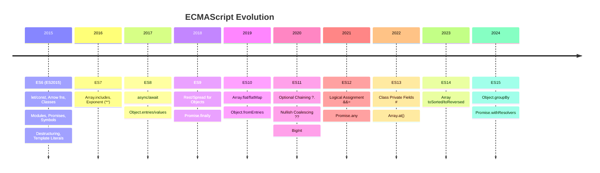
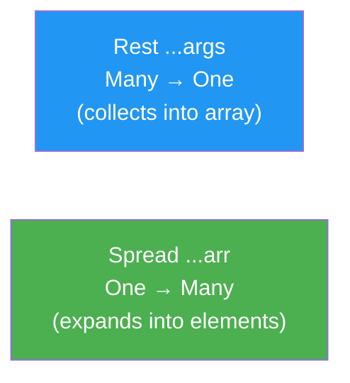

# JavaScript — ES6 & Beyond (Modern Features)

---

## 📚 Table of Contents

1. [let & const](#1-let--const)
2. [Template Literals](#2-template-literals)
3. [Arrow Functions](#3-arrow-functions)
4. [Default Parameters](#4-default-parameters)
5. [Rest & Spread Operator](#5-rest--spread-operator)
6. [Destructuring](#6-destructuring)
7. [Enhanced Object Literals](#7-enhanced-object-literals)
8. [Classes](#8-classes)
9. [Modules — import / export](#9-modules--import--export)
10. [Promises](#10-promises)
11. [Symbol](#11-symbol)
12. [Iterators & for...of](#12-iterators--forof)
13. [Generators](#13-generators)
14. [Map & Set](#14-map--set)
15. [WeakMap & WeakSet](#15-weakmap--weakset)
16. [Proxy & Reflect](#16-proxy--reflect)
17. [ES2017 — Async / Await & Object Methods](#17-es2017--async--await--object-methods)
18. [ES2018 — Rest/Spread for Objects & Promise.finally](#18-es2018--restspread-for-objects--promisefinally)
19. [ES2019 — flat, flatMap, trimStart/End, fromEntries](#19-es2019--flat-flatmap-trimstartend-fromentries)
20. [ES2020 — Optional Chaining, Nullish Coalescing, BigInt](#20-es2020--optional-chaining-nullish-coalescing-bigint)
21. [ES2021 — Logical Assignment, String.replaceAll, Promise.any](#21-es2021--logical-assignment-stringreplaceall-promiseany)
22. [ES2022 — Class Fields, at(), Object.hasOwn, Error.cause](#22-es2022--class-fields-at-objecthasown-errorcause)
23. [ES2023 — Array findLast, toSorted, toReversed, toSpliced](#23-es2023--array-findlast-tosorted-toreversed-tospliced)
24. [ES2024 — Object.groupBy, Promise.withResolvers](#24-es2024--objectgroupby-promisewithresolvers)

---



---

# 1. let & const

> **ES6 replaced `var`** with two new declarations that fix its biggest flaws: lack of block scope and hoisting confusion.
>
> - **`let`** — block-scoped, re-assignable, NOT hoisted to usable state (in the **Temporal Dead Zone** until the declaration line)
> - **`const`** — block-scoped, NOT re-assignable after initialization. For objects/arrays, the **reference** is locked but the **contents** can still be mutated.

## var vs let vs const

| Feature | `var` | `let` | `const` |
|---|---|---|---|
| Scope | **Function** scope | **Block** scope | **Block** scope |
| Re-assignable | ✅ Yes | ✅ Yes | ❌ No |
| Re-declarable | ✅ Yes | ❌ No | ❌ No |
| Hoisted | ✅ (as `undefined`) | ⚠️ TDZ | ⚠️ TDZ |
| Global property | ✅ Adds to `window` | ❌ No | ❌ No |

```javascript
// var — function scoped, leaks out of blocks
if (true) {
    var name = "Hitesh";  // accessible outside the block!
}
console.log(name); // "Hitesh" ← leaks

// let — block scoped
if (true) {
    let city = "Jaipur";
}
// console.log(city); // ❌ ReferenceError: city is not defined

// const — reference is locked
const PI = 3.14159;
// PI = 3; // ❌ TypeError: Assignment to constant variable

const user = { name: "Hitesh" };
user.name = "Chai";   // ✅ Mutating contents is allowed
// user = {};         // ❌ Re-assigning the reference is not

// Temporal Dead Zone (TDZ)
// console.log(x); // ❌ ReferenceError (TDZ — cannot access before declaration)
let x = 10;
console.log(x); // ✅ 10
```

> 💡 **Rule of Thumb**: Default to `const`. Use `let` only when you know the variable needs to be reassigned. Never use `var` in modern code.

---

# 2. Template Literals

> **Template Literals** (backtick strings) replace traditional string concatenation with a clean, readable syntax supporting **multi-line strings**, **expression interpolation**, and **tagged templates**.

```javascript
const name   = "Hitesh";
const course = "JavaScript";
const price  = 999;

// ❌ Old way — messy concatenation
const old = "Hello, " + name + "! Your course: " + course + " costs ₹" + price;

// ✅ Template Literal
const modern = `Hello, ${name}! Your course: ${course} costs ₹${price}`;

// Expressions inside ${}
console.log(`2 + 2 = ${2 + 2}`);                     // 2 + 2 = 4
console.log(`Is admin: ${price > 500 ? "Yes" : "No"}`); // Is admin: Yes

// Multi-line strings
const html = `
  <div class="card">
    <h2>${name}</h2>
    <p>Course: ${course}</p>
  </div>
`;

// Nested template literals
const items = ["chai", "coffee", "water"];
const list  = `Items:\n${items.map((item, i) => `  ${i + 1}. ${item}`).join("\n")}`;
console.log(list);
// Items:
//   1. chai
//   2. coffee
//   3. water
```

## Tagged Templates

> A **tagged template** lets a function process the template literal before it's assembled into a string. The tag function receives the raw string parts and interpolated values separately.

```javascript
// Tag function — first arg is array of string parts, rest are interpolated values
function highlight(strings, ...values) {
    return strings.reduce((result, str, i) => {
        const value = values[i] !== undefined ? `<strong>${values[i]}</strong>` : "";
        return result + str + value;
    }, "");
}

const item  = "JavaScript";
const price = 999;

console.log(highlight`Course: ${item} costs ₹${price}`);
// Course: <strong>JavaScript</strong> costs ₹<strong>999</strong>
```

---

# 3. Arrow Functions

> **Arrow functions** (`=>`) are a concise syntax for writing function expressions. Beyond syntax, they have one critical behavioural difference: they do **not have their own `this`** — they **lexically inherit `this`** from the surrounding scope where they were defined.

## Syntax Variations

```javascript
// Traditional function expression
const add1 = function(a, b) { return a + b; };

// Arrow function — full
const add2 = (a, b) => { return a + b; };

// Arrow function — implicit return (single expression, no braces)
const add3 = (a, b) => a + b;

// Single parameter — parentheses optional
const double = n => n * 2;

// No parameters — parentheses required
const greet = () => "Hello!";

// Returning an object literal — wrap in parentheses to avoid ambiguity with block {}
const makeUser = (name, age) => ({ name, age });
console.log(makeUser("Hitesh", 30)); // { name: 'Hitesh', age: 30 }
```

## `this` Behaviour — The Key Difference

```javascript
// Problem with traditional functions in callbacks
const timer = {
    seconds: 0,
    start: function() {
        setInterval(function() {
            this.seconds++; // ❌ 'this' is undefined (strict) or window (sloppy)
            console.log(this.seconds);
        }, 1000);
    }
};

// Fix with arrow function — inherits 'this' from start()
const timerFixed = {
    seconds: 0,
    start: function() {
        setInterval(() => {
            this.seconds++; // ✅ 'this' correctly refers to timerFixed
            console.log(this.seconds); // 1, 2, 3...
        }, 1000);
    }
};

// Arrow functions should NOT be used as object methods
const obj = {
    name: "Hitesh",
    greet: () => {
        console.log(this.name); // ❌ 'this' is the outer scope (window/undefined)
    },
    greetCorrect: function() {
        console.log(this.name); // ✅ 'this' is obj
    }
};
```

| Feature | Regular Function | Arrow Function |
|---|---|---|
| `this` binding | Own (dynamic) | Inherited (lexical) |
| `arguments` object | ✅ Has own | ❌ Inherits from parent |
| Used as constructor | ✅ `new fn()` works | ❌ Cannot use `new` |
| `prototype` property | ✅ Has | ❌ None |
| Use as method | ✅ Recommended | ⚠️ Avoid (wrong `this`) |
| Callbacks/closures | ✅ Works | ✅ Preferred |

---

# 4. Default Parameters

> **Default Parameters** allow function parameters to have a **fallback value** used when the argument is `undefined` or not provided. Eliminates the old `param = param || defaultValue` pattern.

```javascript
// ❌ Old pattern
function greet(name) {
    name = name || "Guest";
    return `Hello, ${name}!`;
}

// ✅ ES6 Default Parameters
function greet(name = "Guest") {
    return `Hello, ${name}!`;
}

console.log(greet("Hitesh")); // Hello, Hitesh!
console.log(greet());         // Hello, Guest!
console.log(greet(undefined));// Hello, Guest!  ← undefined triggers default
console.log(greet(null));     // Hello, null!   ← null does NOT trigger default

// Defaults can reference earlier parameters
function createRange(start = 0, end = start + 10) {
    return { start, end };
}
console.log(createRange());      // { start: 0, end: 10 }
console.log(createRange(5));     // { start: 5, end: 15 }
console.log(createRange(5, 20)); // { start: 5, end: 20 }

// Defaults can be expressions or function calls
function getDefaultId() { return Math.floor(Math.random() * 1000); }

function createUser(name, id = getDefaultId()) {
    return { name, id };
}
console.log(createUser("Hitesh")); // { name: 'Hitesh', id: 742 }
```

---

# 5. Rest & Spread Operator

> Both use the `...` syntax but serve **opposite purposes**:
> - **Rest (`...`)** — **collects** multiple values into a single array (used in function parameters)
> - **Spread (`...`)** — **expands** an iterable (array, string, object) into individual elements



## Rest Parameter

```javascript
// Rest must be the LAST parameter
function sum(first, second, ...remaining) {
    const restSum = remaining.reduce((acc, n) => acc + n, 0);
    return first + second + restSum;
}

console.log(sum(1, 2));           // 3
console.log(sum(1, 2, 3, 4, 5)); // 15
// remaining = [3, 4, 5] — a real Array (unlike the old 'arguments' object)

// Variadic logger
function log(level, ...messages) {
    messages.forEach(msg => console.log(`[${level.toUpperCase()}] ${msg}`));
}
log("info", "Server started", "Listening on port 3000");
// [INFO] Server started
// [INFO] Listening on port 3000
```

## Spread Operator

```javascript
// ── Arrays ──────────────────────────────────────────────────
const arr1 = [1, 2, 3];
const arr2 = [4, 5, 6];

// Merge arrays
const merged = [...arr1, ...arr2];          // [1, 2, 3, 4, 5, 6]

// Copy array (shallow)
const copy = [...arr1];                      // [1, 2, 3] — independent copy

// Insert mid-array
const inserted = [...arr1, 10, ...arr2];    // [1, 2, 3, 10, 4, 5, 6]

// Pass array as individual arguments
console.log(Math.max(...arr1));              // 3
console.log(Math.max(...arr2));              // 6

// Spread a string into characters
console.log([..."hello"]);                   // ['h','e','l','l','o']

// ── Objects ─────────────────────────────────────────────────
const defaults = { theme: "light", lang: "en", fontSize: 14 };
const userPrefs = { lang: "hi", fontSize: 18 };

// Merge — later keys overwrite earlier ones
const settings = { ...defaults, ...userPrefs };
console.log(settings);
// { theme: 'light', lang: 'hi', fontSize: 18 }

// Add properties to a copy
const updated = { ...defaults, theme: "dark" };
console.log(updated); // { theme: 'dark', lang: 'en', fontSize: 14 }
```

---

# 6. Destructuring

> **Destructuring** is a syntax for **unpacking values from arrays** or **properties from objects** into distinct variables in a single, readable statement.

## Array Destructuring

```javascript
const rgb = [255, 128, 0];

// ❌ Old way
const r1 = rgb[0], g1 = rgb[1], b1 = rgb[2];

// ✅ Array destructuring
const [red, green, blue] = rgb;
console.log(red, green, blue); // 255 128 0

// Skip elements with commas
const [first, , third] = [10, 20, 30];
console.log(first, third); // 10 30

// Default values
const [a = 1, b = 2, c = 3] = [10, 20];
console.log(a, b, c); // 10 20 3 ← c uses default

// Rest in destructuring
const [head, ...tail] = [1, 2, 3, 4, 5];
console.log(head); // 1
console.log(tail); // [2, 3, 4, 5]

// Swap variables — no temp variable needed
let x = 1, y = 2;
[x, y] = [y, x];
console.log(x, y); // 2 1
```

## Object Destructuring

```javascript
const user = {
    name: "Hitesh",
    age: 30,
    location: "Jaipur",
    role: "admin"
};

// Basic
const { name, age } = user;
console.log(name, age); // Hitesh 30

// Rename while destructuring
const { name: userName, location: city } = user;
console.log(userName, city); // Hitesh Jaipur

// Default values
const { role = "user", salary = 50000 } = user;
console.log(role);   // "admin"    ← from object
console.log(salary); // 50000     ← default (not in object)

// Rest
const { name: n, ...rest } = user;
console.log(n);    // Hitesh
console.log(rest); // { age: 30, location: 'Jaipur', role: 'admin' }

// Nested destructuring
const config = {
    server: { host: "localhost", port: 3000 },
    db:     { host: "127.0.0.1", name: "mydb" }
};
const { server: { host, port }, db: { name: dbName } } = config;
console.log(host, port, dbName); // localhost 3000 mydb

// Function parameter destructuring
function renderUser({ name, age, role = "user" }) {
    console.log(`${name} (${age}) — ${role}`);
}
renderUser(user); // Hitesh (30) — admin
```

## Mixed Destructuring

```javascript
// API response — common real-world pattern
const apiResponse = {
    status: 200,
    data: {
        users: [
            { id: 1, name: "Hitesh" },
            { id: 2, name: "Chai" }
        ],
        total: 2
    }
};

const { status, data: { users: [firstUser, secondUser], total } } = apiResponse;
console.log(status);     // 200
console.log(firstUser);  // { id: 1, name: 'Hitesh' }
console.log(total);      // 2
```

---

# 7. Enhanced Object Literals

> ES6 introduced several shorthand improvements for writing object literals — less repetition, cleaner syntax.

```javascript
const name = "Hitesh";
const age  = 30;

// ── 1. Property Shorthand ────────────────────────────────────
// ❌ Old
const user1 = { name: name, age: age };

// ✅ Shorthand — when key and variable name match
const user2 = { name, age };
console.log(user2); // { name: 'Hitesh', age: 30 }

// ── 2. Method Shorthand ──────────────────────────────────────
// ❌ Old
const obj1 = {
    greet: function() { return "Hello"; }
};

// ✅ Method shorthand
const obj2 = {
    greet() { return "Hello"; },
    async fetchData() { return await fetch("/api"); }, // async method
    *generate() { yield 1; yield 2; }                  // generator method
};

// ── 3. Computed Property Names ───────────────────────────────
const prefix = "user";
const id     = 42;

const dynamic = {
    [`${prefix}_${id}`]: "Hitesh",     // "user_42": "Hitesh"
    [`get${prefix.charAt(0).toUpperCase() + prefix.slice(1)}`]() {
        return this[`${prefix}_${id}`];
    }
};

console.log(dynamic["user_42"]);  // "Hitesh"
console.log(dynamic.getUser());   // "Hitesh"

// ── 4. Putting It All Together ───────────────────────────────
const host = "localhost";
const port = 3000;

const serverConfig = {
    host,
    port,
    url: `http://${host}:${port}`,
    start() {
        console.log(`Server running at ${this.url}`);
    },
    stop() {
        console.log("Server stopped");
    }
};
serverConfig.start(); // Server running at http://localhost:3000
```

---

# 8. Classes

> **Classes** (ES6) provide a cleaner, more familiar syntax for creating objects and dealing with inheritance — they are **syntactic sugar over JavaScript's prototype-based system**.

```javascript
// ── Base Class ───────────────────────────────────────────────
class Animal {
    // Class field (ES2022) — can also be in constructor
    #sound = "...";  // private field

    constructor(name, species) {
        this.name    = name;
        this.species = species;
    }

    // Instance method
    speak() {
        console.log(`${this.name} says ${this.#sound}`);
    }

    // Getter
    get info() {
        return `${this.name} (${this.species})`;
    }

    // Setter
    set sound(val) {
        this.#sound = val;
    }

    // Static method — belongs to the class, not instances
    static create(name, species) {
        return new Animal(name, species);
    }

    // toString override
    toString() {
        return this.info;
    }
}

const dog = Animal.create("Bruno", "Dog");
dog.sound = "Woof";
dog.speak();               // Bruno says Woof
console.log(dog.info);     // Bruno (Dog)
console.log(`${dog}`);     // Bruno (Dog)  ← toString called

// ── Inheritance ──────────────────────────────────────────────
class Dog extends Animal {
    #tricks = [];

    constructor(name) {
        super(name, "Dog"); // MUST call super() before using 'this'
        this.sound = "Woof";
    }

    learn(trick) {
        this.#tricks.push(trick);
        console.log(`${this.name} learned: ${trick}`);
    }

    // Override parent method
    speak() {
        super.speak();                          // call parent version
        console.log(`${this.name} is excited!`);
    }

    get tricks() { return [...this.#tricks]; } // return copy
}

const rex = new Dog("Rex");
rex.learn("sit");    // Rex learned: sit
rex.learn("shake");  // Rex learned: shake
rex.speak();
// Rex says Woof
// Rex is excited!

console.log(rex instanceof Dog);    // true
console.log(rex instanceof Animal); // true
console.log(rex.tricks);            // ['sit', 'shake']
// console.log(rex.#tricks);        // ❌ SyntaxError — private field
```

---

# 9. Modules — import / export

> **ES Modules (ESM)** provide a native, standardized way to split code across files with explicit, static imports and exports — enabling code reuse, encapsulation, and **tree-shaking** (dead code elimination by bundlers).

```javascript
// ── math.js ─────────────────────────────────────────────────

// Named exports — multiple per file
export const PI = 3.14159;
export function add(a, b) { return a + b; }
export function multiply(a, b) { return a * b; }

// Default export — one per file
export default class Calculator {
    add(a, b)      { return a + b; }
    subtract(a, b) { return a - b; }
}
```

```javascript
// ── main.js ─────────────────────────────────────────────────

// Import default + named
import Calculator, { PI, add, multiply } from './math.js';

// Rename on import
import { add as sum } from './math.js';

// Import everything as a namespace
import * as MathUtils from './math.js';
console.log(MathUtils.PI);           // 3.14159
console.log(MathUtils.add(2, 3));    // 5

// Dynamic import — lazy load on demand
async function loadHeavyModule() {
    const { Chart } = await import('./chart.js');
    new Chart(data); // only downloaded when this runs
}

// Re-export from a barrel file (index.js)
export { add, multiply } from './math.js';
export { default as Calculator } from './math.js';
```

| Feature | Named Export | Default Export |
|---|---|---|
| Quantity per file | Multiple | One |
| Import syntax | `import { name }` | `import anything` |
| Rename on export | `export { fn as alias }` | N/A |
| Tree-shakeable | ✅ Better | ✅ Works |

---

# 10. Promises

> **Promises** are the native ES6 solution to callback hell — an object representing an async operation's **eventual completion or failure**.

```javascript
// Creating a Promise
const fetchData = (id) => new Promise((resolve, reject) => {
    setTimeout(() => {
        if (id > 0) resolve({ id, name: "Hitesh" });
        else        reject(new Error("Invalid ID"));
    }, 1000);
});

// Consuming with .then / .catch / .finally
fetchData(1)
    .then(user  => { console.log(user); return user.id; })
    .then(id    => fetchData(id + 1))   // chaining — each .then returns a Promise
    .catch(err  => console.error(err))
    .finally(() => console.log("Done"));

// Static combinators
Promise.all([fetchData(1), fetchData(2)])          // all must succeed
    .then(([u1, u2]) => console.log(u1, u2));

Promise.allSettled([fetchData(1), fetchData(-1)])  // get all results
    .then(results => results.forEach(r => console.log(r.status)));

Promise.race([fetchData(1), fetchData(2)])         // first to settle wins
    .then(first => console.log("Fastest:", first));

Promise.any([fetchData(-1), fetchData(2)])         // first SUCCESS wins
    .then(first => console.log("First success:", first));
```

---

# 11. Symbol

> **Symbol** is a new primitive type (ES6) whose every instance is **guaranteed to be unique**, regardless of the description. Used to create property keys that never collide.

```javascript
// Every Symbol() call produces a unique value
const s1 = Symbol("id");
const s2 = Symbol("id");
console.log(s1 === s2); // false — always unique!

// As unique object keys
const ID   = Symbol("id");
const NAME = Symbol("name");

const user = {
    [ID]: 101,
    [NAME]: "Hitesh",
    name: "Public Name"  // regular string key — different from [NAME]
};

console.log(user[ID]);   // 101
console.log(user[NAME]); // Hitesh
console.log(user.name);  // Public Name

// Symbol keys are hidden from normal enumeration
console.log(Object.keys(user));              // ['name'] — no Symbols
console.log(Object.getOwnPropertySymbols(user)); // [Symbol(id), Symbol(name)]

// Global Symbol registry — share Symbols across files/modules
const globalId = Symbol.for("app.userId");  // created or retrieved
const sameId   = Symbol.for("app.userId");  // same Symbol
console.log(globalId === sameId); // true

// Well-Known Symbols — customize language behaviour
class MyArray {
    static [Symbol.hasInstance](instance) {
        return Array.isArray(instance);
    }
}
console.log([] instanceof MyArray); // true
```

---

# 12. Iterators & for...of

> The **Iteration Protocol** defines a standard way for objects to produce a sequence of values. An **iterable** implements `[Symbol.iterator]()` returning an **iterator** — an object with a `next()` method returning `{ value, done }`.
>
> `for...of` works with any iterable: arrays, strings, Maps, Sets, generators, NodeLists.

```javascript
// for...of — clean iteration (vs for...in which iterates keys)
const fruits = ["apple", "banana", "cherry"];

for (const fruit of fruits) {
    console.log(fruit); // apple, banana, cherry
}

// Works on strings
for (const char of "hello") {
    console.log(char); // h, e, l, l, o
}

// Works on Map and Set
const map = new Map([["a", 1], ["b", 2]]);
for (const [key, val] of map) {
    console.log(`${key}: ${val}`); // a: 1, b: 2
}

// Custom iterable object
const range = {
    from: 1,
    to: 5,
    [Symbol.iterator]() {
        let current = this.from;
        const last  = this.to;
        return {
            next() {
                return current <= last
                    ? { value: current++, done: false }
                    : { value: undefined, done: true };
            }
        };
    }
};

console.log([...range]);      // [1, 2, 3, 4, 5]
for (const n of range) console.log(n); // 1, 2, 3, 4, 5
```

---

# 13. Generators

> **Generator functions** (`function*`) can **pause** (`yield`) and **resume** execution, producing a sequence of values lazily — only computing the next value when `.next()` is called. They automatically implement the Iterable and Iterator protocols.

```javascript
// Basic generator
function* fibonacci() {
    let [a, b] = [0, 1];
    while (true) {
        yield a;
        [a, b] = [b, a + b];
    }
}

const fib = fibonacci();
console.log(fib.next().value); // 0
console.log(fib.next().value); // 1
console.log(fib.next().value); // 1
console.log(fib.next().value); // 2
console.log(fib.next().value); // 3

// Take first N values from infinite generator
function take(gen, n) {
    const result = [];
    for (const val of gen) {
        result.push(val);
        if (result.length === n) break;
    }
    return result;
}
console.log(take(fibonacci(), 8)); // [0, 1, 1, 2, 3, 5, 8, 13]

// Generator with return value and two-way communication
function* accumulator() {
    let total = 0;
    while (true) {
        const n = yield total; // yield current total, receive next value
        if (n === null) return total; // terminate
        total += n;
    }
}

const acc = accumulator();
console.log(acc.next().value);    // 0     — start
console.log(acc.next(10).value);  // 10    — send 10
console.log(acc.next(20).value);  // 30    — send 20
console.log(acc.next(null).value);// 30    — done
```

---

# 14. Map & Set

## Map

> A **Map** is an ordered collection of **key-value pairs** where keys can be **any type** (including objects and functions) — unlike plain objects where keys must be strings or symbols.

```javascript
const map = new Map();

// Set entries
map.set("name", "Hitesh");
map.set(42, "the answer");
map.set(true, "boolean key");
const objKey = { id: 1 };
map.set(objKey, "object as key!");

// Get
console.log(map.get("name"));   // Hitesh
console.log(map.get(42));       // the answer
console.log(map.get(objKey));   // object as key!

// Properties & Methods
console.log(map.size);          // 4
console.log(map.has("name"));   // true
map.delete(42);
console.log(map.size);          // 3

// Iteration
for (const [key, value] of map) {
    console.log(`${key} → ${value}`);
}

// Convert to/from Object
const obj  = { a: 1, b: 2 };
const fromObj = new Map(Object.entries(obj));
const backToObj = Object.fromEntries(map);
```

## Set

> A **Set** is an ordered collection of **unique values** — duplicates are automatically ignored. Any value type can be stored.

```javascript
const set = new Set([1, 2, 3, 2, 1, 3]); // duplicates removed
console.log(set);      // Set(3) { 1, 2, 3 }
console.log(set.size); // 3

set.add(4);
set.add(2);            // duplicate — ignored silently
console.log(set.size); // 4

set.has(3);   // true
set.delete(1);

// Iteration
for (const val of set) console.log(val);
console.log([...set]); // convert to array

// Most common use case: remove duplicates from array
const arr = [1, 2, 2, 3, 3, 3, 4];
const unique = [...new Set(arr)];
console.log(unique); // [1, 2, 3, 4]

// Set operations
const setA = new Set([1, 2, 3, 4]);
const setB = new Set([3, 4, 5, 6]);

const union        = new Set([...setA, ...setB]);         // {1,2,3,4,5,6}
const intersection = new Set([...setA].filter(x => setB.has(x))); // {3,4}
const difference   = new Set([...setA].filter(x => !setB.has(x))); // {1,2}
```

---

# 15. WeakMap & WeakSet

> Like `Map`/`Set` but keys/values must be **objects**, and references are **weak** — they don't prevent garbage collection. Not iterable. Used for private data and memory-safe caches.

```javascript
// WeakMap — private metadata without memory leak
const _private = new WeakMap();

class User {
    constructor(name, password) {
        _private.set(this, { password });
        this.name = name;
    }
    checkPassword(input) {
        return _private.get(this).password === input;
    }
}

const user = new User("Hitesh", "secret123");
console.log(user.checkPassword("secret123")); // true
console.log(user.password);                   // undefined — truly private

// WeakSet — track objects without preventing GC
const processed = new WeakSet();

function processOnce(obj) {
    if (processed.has(obj)) {
        console.log("Already processed");
        return;
    }
    processed.add(obj);
    console.log("Processing:", obj);
}
```

---

# 16. Proxy & Reflect

> **Proxy** wraps an object and intercepts fundamental operations. **Reflect** provides the default implementations of those operations.

```javascript
// Validation proxy
function createValidatedUser(data) {
    return new Proxy(data, {
        set(target, prop, value) {
            if (prop === "age") {
                if (typeof value !== "number") throw new TypeError("Age must be a number");
                if (value < 0 || value > 130)  throw new RangeError("Age out of range");
            }
            if (prop === "email" && !value.includes("@")) {
                throw new Error("Invalid email format");
            }
            return Reflect.set(target, prop, value); // default behaviour
        },
        get(target, prop) {
            return prop in target
                ? Reflect.get(target, prop)
                : `Property "${prop}" not found`;
        }
    });
}

const user = createValidatedUser({});
user.name  = "Hitesh";
user.age   = 30;
user.email = "hitesh@example.com";
// user.age = "thirty"; // ❌ TypeError

console.log(user.name);  // Hitesh
console.log(user.phone); // Property "phone" not found
```

---

# 17. ES2017 — Async / Await & Object Methods

## async / await

```javascript
async function loadUserData(userId) {
    try {
        const res  = await fetch(`/api/users/${userId}`);
        if (!res.ok) throw new Error(`HTTP ${res.status}`);
        const user = await res.json();
        return user;
    } catch (err) {
        console.error("Failed:", err.message);
        return null;
    }
}

// Parallel execution
async function loadAll() {
    const [users, products] = await Promise.all([
        fetch("/api/users").then(r => r.json()),
        fetch("/api/products").then(r => r.json())
    ]);
    return { users, products };
}
```

## New Object Methods (ES2017)

```javascript
const scores = { math: 95, science: 88, english: 92 };

// Object.values() — array of values
console.log(Object.values(scores));   // [95, 88, 92]

// Object.entries() — array of [key, value] pairs
console.log(Object.entries(scores));  // [['math',95], ['science',88], ['english',92]]

// Iterate with destructuring
for (const [subject, score] of Object.entries(scores)) {
    console.log(`${subject}: ${score}`);
}

// Object.getOwnPropertyDescriptors() — all property descriptors at once
const descriptors = Object.getOwnPropertyDescriptors(scores);
console.log(descriptors.math);
// { value: 95, writable: true, enumerable: true, configurable: true }

// String padding (ES2017)
console.log("5".padStart(3, "0"));   // "005"
console.log("hi".padEnd(6, "."));    // "hi...."
```

---

# 18. ES2018 — Rest/Spread for Objects & Promise.finally

```javascript
// ── Object Rest (destructuring) ──────────────────────────────
const { name, age, ...rest } = { name: "Hitesh", age: 30, city: "Jaipur", role: "admin" };
console.log(name); // Hitesh
console.log(rest); // { city: 'Jaipur', role: 'admin' }

// ── Object Spread ────────────────────────────────────────────
const defaults  = { color: "blue", size: "md", weight: 100 };
const overrides = { color: "red", size: "lg" };
const merged    = { ...defaults, ...overrides };
console.log(merged); // { color: 'red', size: 'lg', weight: 100 }

// ── Promise.finally ──────────────────────────────────────────
// Runs regardless of resolve or reject — great for cleanup
let isLoading = true;

fetch("/api/data")
    .then(res  => res.json())
    .then(data => console.log(data))
    .catch(err => console.error(err))
    .finally(() => {
        isLoading = false; // always hide loader
        console.log("Request complete");
    });

// ── Async Iteration (for await...of) ─────────────────────────
async function* readLines(file) {
    // yield lines one by one from a stream
    for (const line of file.split("\n")) yield line;
}

async function processFile() {
    for await (const line of readLines("a\nb\nc")) {
        console.log(line);
    }
}
```

---

# 19. ES2019 — flat, flatMap, trimStart/End, fromEntries

```javascript
// ── Array.flat() ─────────────────────────────────────────────
const nested = [1, [2, 3], [4, [5, [6]]]];
console.log(nested.flat());    // [1, 2, 3, 4, [5, [6]]]  — 1 level
console.log(nested.flat(2));   // [1, 2, 3, 4, 5, [6]]    — 2 levels
console.log(nested.flat(Infinity)); // [1, 2, 3, 4, 5, 6]  — fully flatten

// ── Array.flatMap() ───────────────────────────────────────────
// Same as .map().flat(1) but more efficient
const sentences = ["Hello World", "Foo Bar"];
console.log(sentences.flatMap(s => s.split(" ")));
// ['Hello', 'World', 'Foo', 'Bar']

// More complex: expand each product into tagged items
const cart = [
    { name: "Chai", qty: 2 },
    { name: "Coffee", qty: 3 }
];
const items = cart.flatMap(({ name, qty }) => Array(qty).fill(name));
console.log(items); // ['Chai','Chai','Coffee','Coffee','Coffee']

// ── String trimStart / trimEnd ────────────────────────────────
const messy = "   hello world   ";
console.log(messy.trimStart()); // "hello world   "
console.log(messy.trimEnd());   // "   hello world"
console.log(messy.trim());      // "hello world"

// ── Object.fromEntries() ─────────────────────────────────────
// Inverse of Object.entries() — converts [key, val] pairs → object
const entries = [["name", "Hitesh"], ["age", 30]];
console.log(Object.fromEntries(entries)); // { name: 'Hitesh', age: 30 }

// Power pattern: transform object values
const prices  = { chai: 20, coffee: 60, water: 5 };
const doubled = Object.fromEntries(
    Object.entries(prices).map(([k, v]) => [k, v * 2])
);
console.log(doubled); // { chai: 40, coffee: 120, water: 10 }

// Convert Map → Object
const map = new Map([["x", 1], ["y", 2]]);
console.log(Object.fromEntries(map)); // { x: 1, y: 2 }
```

---

# 20. ES2020 — Optional Chaining, Nullish Coalescing, BigInt

## Optional Chaining `?.`

> Safely access deeply nested properties — returns `undefined` instead of throwing a `TypeError` if an intermediate value is `null` or `undefined`.

```javascript
const user = {
    name: "Hitesh",
    address: {
        city: "Jaipur"
    }
    // no 'phone' property
};

// ❌ Old way — verbose guard
const phone = user && user.phone && user.phone.number;

// ✅ Optional chaining
console.log(user?.phone?.number);         // undefined (no error)
console.log(user?.address?.city);         // "Jaipur"
console.log(user?.address?.pincode);      // undefined

// Works on method calls
console.log(user?.getProfile?.());        // undefined (method doesn't exist)

// Works on array index access
const arr = null;
console.log(arr?.[0]);                    // undefined (no error)

// Practical: API response guard
async function getCity(userId) {
    const user = await fetchUser(userId);
    return user?.profile?.address?.city ?? "Unknown"; // combined with ??
}
```

## Nullish Coalescing `??`

> Returns the **right-hand side** only when the left side is **`null` or `undefined`** — NOT for falsy values like `0`, `""`, or `false`. This fixes the `||` operator's common false-positive bug.

```javascript
// Problem with || operator
const score    = 0;
const username = "";

console.log(score    || 100); // 100 ← WRONG: 0 is valid but treated as falsy
console.log(username || "Guest"); // "Guest" ← WRONG: empty string was intentional

// ✅ Nullish coalescing — only triggers for null/undefined
console.log(score    ?? 100);      // 0      ← correct, 0 is a valid value
console.log(username ?? "Guest");  // ""     ← correct, empty string preserved
console.log(null     ?? "default");// "default"
console.log(undefined ?? "default");// "default"

// Practical: config with defaults
function initApp(config) {
    const port    = config.port    ?? 3000;
    const timeout = config.timeout ?? 5000;
    const debug   = config.debug   ?? false;
    console.log({ port, timeout, debug });
}

initApp({ port: 0, debug: false }); // { port: 0, timeout: 5000, debug: false }
// port: 0 preserved (not replaced by 3000)
// debug: false preserved (not replaced by false default)
```

## BigInt

> **BigInt** handles integers larger than `Number.MAX_SAFE_INTEGER` (`2^53 - 1 = 9007199254740991`). Created by appending `n` to a number or using `BigInt()`.

```javascript
const maxSafe = Number.MAX_SAFE_INTEGER;
console.log(maxSafe + 1 === maxSafe + 2); // true ← precision lost!

// BigInt — arbitrary precision
const big = 9007199254740991n;
console.log(big + 1n); // 9007199254740992n
console.log(big + 2n); // 9007199254740993n — correct!

// Arithmetic
console.log(10n + 20n);   // 30n
console.log(10n * 3n);    // 30n
console.log(10n ** 2n);   // 100n
console.log(10n / 3n);    // 3n  ← integer division, no decimals

// ⚠️ Cannot mix BigInt and Number
// console.log(1n + 1);   // ❌ TypeError
console.log(Number(1n) + 1); // ✅ 2 — explicit conversion
console.log(typeof 42n);     // "bigint"

// Use case: cryptocurrency, large IDs
const twitterId = 1580786604594597889n;
console.log(twitterId.toString()); // "1580786604594597889"
```

---

# 21. ES2021 — Logical Assignment, String.replaceAll, Promise.any

## Logical Assignment Operators

```javascript
// &&= assigns only if left side is TRUTHY
let a = 1;
a &&= 10;         // a = 10  (1 is truthy, so assign)
let b = 0;
b &&= 10;         // b = 0   (0 is falsy, skip)

// ||= assigns only if left side is FALSY
let c = null;
c ||= "default";  // c = "default"  (null is falsy)
let d = "hello";
d ||= "default";  // d = "hello"    (truthy, skip)

// ??= assigns only if left side is NULL or UNDEFINED
let e = null;
e ??= "fallback"; // e = "fallback"
let f = 0;
f ??= "fallback"; // f = 0  (0 is not null/undefined)

// Practical — initialize object properties
const config = {};
config.port    ??= 3000;  // set if not already set
config.debug   ??= false;
config.timeout ??= 5000;
console.log(config); // { port: 3000, debug: false, timeout: 5000 }
```

## String.replaceAll

```javascript
const text = "I like chai. Chai is good. chai is life.";

// replace() — only first match
console.log(text.replace("chai", "coffee"));
// "I like coffee. Chai is good. chai is life."

// replaceAll() — every match (case-sensitive)
console.log(text.replaceAll("chai", "coffee"));
// "I like coffee. Chai is good. coffee is life."

// ⚠️ replaceAll is case-sensitive
// For case-insensitive, use replace with /g flag regex:
console.log(text.replace(/chai/gi, "coffee"));
// "I like coffee. coffee is good. coffee is life."
```

## Promise.any

```javascript
// Resolves with the FIRST fulfilled promise
// Rejects only if ALL promises reject (AggregateError)
const servers = [
    fetch("https://server1.com/api"),
    fetch("https://server2.com/api"),
    fetch("https://server3.com/api")
];

Promise.any(servers)
    .then(res  => console.log("Fastest server responded:", res.url))
    .catch(err => console.error("All servers failed:", err.errors));
// AggregateError contains all individual errors
```

---

# 22. ES2022 — Class Fields, at(), Object.hasOwn, Error.cause

## Class Fields & Private Methods

```javascript
class BankAccount {
    // Public class field (no need to declare in constructor)
    currency = "INR";
    owner;

    // Private field — truly inaccessible outside the class
    #balance = 0;
    #transactions = [];

    // Private method
    #log(type, amount) {
        this.#transactions.push({ type, amount, date: new Date() });
    }

    constructor(owner, initialBalance = 0) {
        this.owner    = owner;
        this.#balance = initialBalance;
    }

    deposit(amount) {
        if (amount <= 0) throw new RangeError("Amount must be positive");
        this.#balance += amount;
        this.#log("deposit", amount);
    }

    withdraw(amount) {
        if (amount > this.#balance) throw new Error("Insufficient funds");
        this.#balance -= amount;
        this.#log("withdrawal", amount);
    }

    get balance() { return this.#balance; }

    // Static private field
    static #interestRate = 0.07;
    static getInterestRate() { return BankAccount.#interestRate; }
}

const acc = new BankAccount("Hitesh", 1000);
acc.deposit(500);
console.log(acc.balance);           // 1500
console.log(BankAccount.getInterestRate()); // 0.07
// console.log(acc.#balance);       // ❌ SyntaxError
```

## Array/String `.at()`

```javascript
const arr = [10, 20, 30, 40, 50];

// at() supports negative indices
console.log(arr.at(0));   // 10  (first)
console.log(arr.at(-1));  // 50  (last)
console.log(arr.at(-2));  // 40  (second to last)

// vs old way
console.log(arr[arr.length - 1]);   // 50 — verbose

// Works on strings too
const str = "JavaScript";
console.log(str.at(-1));  // "t"
console.log(str.at(-4));  // "r"
```

## Object.hasOwn

```javascript
// Safer replacement for hasOwnProperty
const obj = Object.create(null); // null-prototype object
obj.name = "Hitesh";

// obj.hasOwnProperty("name"); // ❌ TypeError — no hasOwnProperty!
console.log(Object.hasOwn(obj, "name")); // ✅ true
console.log(Object.hasOwn(obj, "age"));  // false
```

## Error.cause

```javascript
// Chain errors with context — know WHY an error was caused
async function fetchUser(id) {
    try {
        const res = await fetch(`/api/users/${id}`);
        return await res.json();
    } catch (err) {
        throw new Error(`Failed to fetch user ${id}`, { cause: err });
    }
}

async function loadDashboard(userId) {
    try {
        const user = await fetchUser(userId);
        return user;
    } catch (err) {
        throw new Error("Dashboard load failed", { cause: err });
    }
}

try {
    await loadDashboard(1);
} catch (err) {
    console.error(err.message);       // Dashboard load failed
    console.error(err.cause.message); // Failed to fetch user 1
    console.error(err.cause.cause);   // Original network/fetch error
}
```

---

# 23. ES2023 — Array findLast, toSorted, toReversed, toSpliced

> ES2023 introduced **non-mutating** versions of `sort()`, `reverse()`, and `splice()` — they return a **new array** without modifying the original.

```javascript
const nums = [3, 1, 4, 1, 5, 9, 2, 6];

// ── findLast / findLastIndex ──────────────────────────────────
const lastEven = nums.findLast(n => n % 2 === 0);
console.log(lastEven); // 6

const lastEvenIndex = nums.findLastIndex(n => n % 2 === 0);
console.log(lastEvenIndex); // 7

// ── toSorted() — non-mutating sort ───────────────────────────
const sorted = nums.toSorted((a, b) => a - b);
console.log(sorted); // [1, 1, 2, 3, 4, 5, 6, 9]
console.log(nums);   // [3, 1, 4, 1, 5, 9, 2, 6] — UNCHANGED ✅

// ── toReversed() — non-mutating reverse ──────────────────────
const reversed = nums.toReversed();
console.log(reversed); // [6, 2, 9, 5, 1, 4, 1, 3]
console.log(nums);     // [3, 1, 4, 1, 5, 9, 2, 6] — UNCHANGED ✅

// ── toSpliced() — non-mutating splice ────────────────────────
const spliced = nums.toSpliced(2, 3, 100, 200);
// remove 3 elements at index 2, insert 100 and 200
console.log(spliced); // [3, 1, 100, 200, 9, 2, 6]
console.log(nums);    // [3, 1, 4, 1, 5, 9, 2, 6] — UNCHANGED ✅

// ── with() — update single element immutably ─────────────────
const updated = nums.with(0, 99); // replace index 0 with 99
console.log(updated); // [99, 1, 4, 1, 5, 9, 2, 6]
console.log(nums);    // [3, 1, 4, 1, 5, 9, 2, 6] — UNCHANGED ✅
```

| Mutating (old) | Non-mutating (ES2023) |
|---|---|
| `sort()` | `toSorted()` |
| `reverse()` | `toReversed()` |
| `splice()` | `toSpliced()` |
| `arr[i] = x` | `with(i, x)` |

---

# 24. ES2024 — Object.groupBy, Promise.withResolvers

## Object.groupBy

```javascript
// Group array items by a key derived from each item
const products = [
    { name: "Chai",    category: "beverages", price: 20 },
    { name: "Coffee",  category: "beverages", price: 60 },
    { name: "Samosa",  category: "snacks",    price: 15 },
    { name: "Paratha", category: "food",      price: 50 },
    { name: "Water",   category: "beverages", price: 5  },
];

const grouped = Object.groupBy(products, item => item.category);
console.log(grouped);
/*
{
  beverages: [ { name: 'Chai', ... }, { name: 'Coffee', ... }, { name: 'Water', ... } ],
  snacks:    [ { name: 'Samosa', ... } ],
  food:      [ { name: 'Paratha', ... } ]
}
*/

// Group by computed property
const byPriceRange = Object.groupBy(products, item =>
    item.price < 20 ? "cheap" : item.price < 50 ? "medium" : "expensive"
);
console.log(Object.keys(byPriceRange)); // ['medium', 'expensive', 'cheap']

// Map.groupBy — same but returns a Map (keys can be any type)
const byCategory = Map.groupBy(products, item => item.category);
console.log(byCategory.get("beverages")); // [Chai, Coffee, Water]
```

## Promise.withResolvers

```javascript
// Old way — resolve/reject not accessible outside the executor
let resolve, reject;
const promise = new Promise((res, rej) => {
    resolve = res;
    reject  = rej;
});
// Messy — need outer variables

// ✅ ES2024 — Promise.withResolvers()
const { promise: p, resolve: res, reject: rej } = Promise.withResolvers();

// resolve/reject now accessible anywhere in scope
setTimeout(() => res("Done after 1 second"), 1000);

p.then(val => console.log(val)); // "Done after 1 second"

// Real-world: Deferred pattern
function createDeferred() {
    const { promise, resolve, reject } = Promise.withResolvers();
    return { promise, resolve, reject };
}

const deferred = createDeferred();
// Resolve from anywhere — e.g., after user action
document.getElementById("confirmBtn")
    .addEventListener("click", () => deferred.resolve("confirmed"), { once: true });

const result = await deferred.promise;
console.log("User action:", result);
```

---

## 📊 Quick Reference — ES6+ Feature Summary

| Feature | ES Version | Syntax |
|---|---|---|
| `let` / `const` | ES6 | `let x = 1; const Y = 2;` |
| Arrow functions | ES6 | `(a, b) => a + b` |
| Template literals | ES6 | `` `Hello ${name}` `` |
| Destructuring | ES6 | `const { a, b } = obj` |
| Default params | ES6 | `function fn(x = 10)` |
| Rest / Spread | ES6 | `...args` / `...arr` |
| Classes | ES6 | `class Foo extends Bar` |
| Modules | ES6 | `import / export` |
| Promises | ES6 | `new Promise((res,rej)=>{})` |
| Symbol | ES6 | `Symbol('desc')` |
| `for...of` | ES6 | `for (const x of iterable)` |
| Generators | ES6 | `function* gen() { yield }` |
| Map / Set | ES6 | `new Map()` / `new Set()` |
| `**` exponent | ES7 | `2 ** 8` → `256` |
| `Array.includes` | ES7 | `[1,2].includes(1)` |
| `async/await` | ES8 | `async fn() { await p }` |
| `Object.entries/values` | ES8 | `Object.entries(obj)` |
| `String.padStart/End` | ES8 | `"5".padStart(3,"0")` |
| Object rest/spread | ES9 | `{ a, ...rest } = obj` |
| `Promise.finally` | ES9 | `.finally(() => {})` |
| `Array.flat/flatMap` | ES10 | `[1,[2]].flat()` |
| `Object.fromEntries` | ES10 | `Object.fromEntries(map)` |
| Optional chaining `?.` | ES11 | `obj?.prop?.nested` |
| Nullish coalescing `??` | ES11 | `val ?? 'default'` |
| BigInt | ES11 | `9999999999999999n` |
| `Promise.any` | ES12 | `Promise.any([p1,p2])` |
| Logical assignment | ES12 | `a ??= b; a &&= b; a \|\|= b` |
| `String.replaceAll` | ES12 | `str.replaceAll('a','b')` |
| Class private fields | ES13 | `#field = value` |
| `Array.at()` | ES13 | `arr.at(-1)` |
| `Object.hasOwn` | ES13 | `Object.hasOwn(obj,'key')` |
| `Error.cause` | ES13 | `new Error('msg', {cause})` |
| `Array.findLast` | ES14 | `arr.findLast(fn)` |
| `toSorted/toReversed` | ES14 | `arr.toSorted()` |
| `Object.groupBy` | ES15 | `Object.groupBy(arr, fn)` |
| `Promise.withResolvers` | ES15 | `Promise.withResolvers()` |

---

*Notes covering ECMAScript 2015 (ES6) through ES2024 — based on official ECMAScript specifications and MDN documentation.*
