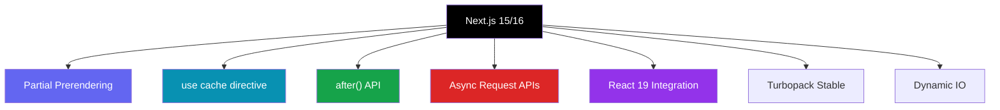
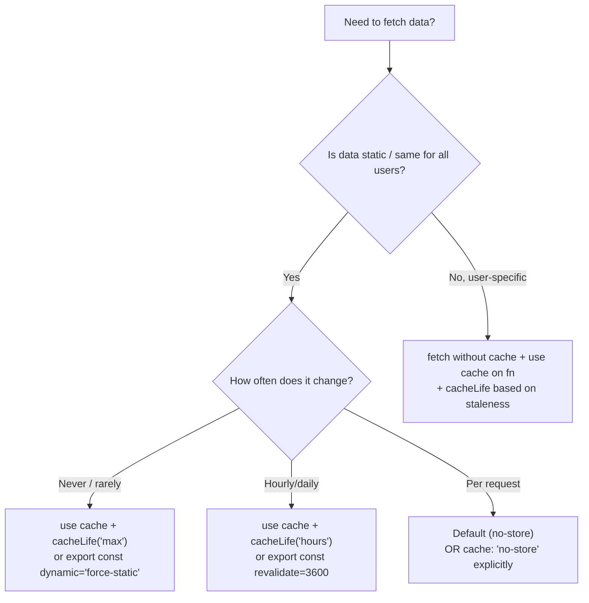

# Next.js 15 & 16 — Latest Features Guide

> This file covers features introduced or stabilized in Next.js 15 and 16 that are **not** covered in the Beginner or Advanced guides. Essential for senior interviews in 2025–2026.

---

## 📚 Table of Contents

1. [Breaking Changes in Next.js 15](#1-breaking-changes-in-nextjs-15)
2. [Partial Prerendering (PPR)](#2-partial-prerendering-ppr)
3. [use cache Directive](#3-use-cache-directive)
4. [cacheLife and cacheTag APIs](#4-cachelife-and-cachetag-apis)
5. [after() — Post-Response Work](#5-after--post-response-work)
6. [connection() API](#6-connection-api)
7. [next/form Component](#7-nextform-component)
8. [Async Request APIs](#8-async-request-apis)
9. [forbidden() and unauthorized() Helpers](#9-forbidden-and-unauthorized-helpers)
10. [Turbopack (Stable)](#10-turbopack-stable)
11. [instrumentation.ts (Stable)](#11-instrumentationts-stable)
12. [next.config.ts — TypeScript Config](#12-nextconfigts--typescript-config)
13. [staleTimes — Router Cache Control](#13-staletimes--router-cache-control)
14. [Fetch Caching Changes (Next.js 15)](#14-fetch-caching-changes-nextjs-15)
15. [Dynamic IO](#15-dynamic-io)
16. [React 19 Integration](#16-react-19-integration)
17. [Self-Hosting Improvements](#17-self-hosting-improvements)
18. [Senior Interview Q&A](#18-senior-interview-qa)

---



---

# 1. Breaking Changes in Next.js 15

> Next.js 15 introduced several **breaking changes** you must know for interviews and migrations.

## 1.1 — `fetch` no longer cached by default

**Before (Next.js 14)**:
```tsx
// Automatically cached (force-cache was the default)
const res = await fetch('https://api.example.com/posts');
```

**After (Next.js 15)**:
```tsx
// Now defaults to cache: 'no-store' — NOT cached
const res = await fetch('https://api.example.com/posts');

// To opt into caching, you must be explicit:
const res = await fetch('https://api.example.com/posts', {
  cache: 'force-cache',
});

// Or use the new 'use cache' directive (see Section 3)
```

## 1.2 — `GET` Route Handlers no longer cached by default

**Before (Next.js 14)**: `GET` Route Handlers were statically cached.

**After (Next.js 15)**: They are dynamic by default.
```tsx
// app/api/time/route.ts
export async function GET() {
  // In Next.js 15 — runs fresh on every request (no longer cached)
  return Response.json({ time: Date.now() });
}

// To opt into caching:
export const dynamic = 'force-static';
export async function GET() {
  return Response.json({ time: Date.now() });
}
```

## 1.3 — `params` and `searchParams` are now Promises

> The most impactful breaking change. All page props are now async.

```tsx
// ❌ Next.js 14 style — BREAKS in Next.js 15
export default function Page({ params }: { params: { id: string } }) {
  return <div>{params.id}</div>; // Error: params is now a Promise
}

// ✅ Next.js 15 style
export default async function Page({
  params,
}: {
  params: Promise<{ id: string }>;
}) {
  const { id } = await params;
  return <div>{id}</div>;
}
```

```tsx
// searchParams is also a Promise
export default async function Page({
  searchParams,
}: {
  searchParams: Promise<{ q: string }>;
}) {
  const { q } = await searchParams;
  return <div>Search: {q}</div>;
}
```

## 1.4 — `headers()`, `cookies()`, `draftMode()` are async

```tsx
import { headers, cookies } from 'next/headers';

// ❌ Next.js 14
const headersList = headers();
const cookieStore = cookies();

// ✅ Next.js 15
const headersList = await headers();
const cookieStore = await cookies();
const token = cookieStore.get('token');
```

## 1.5 — Minimum Node.js version is 18.18.0

Node.js 16 and 17 are no longer supported.

---

# 2. Partial Prerendering (PPR)

> **PPR is the most significant architectural addition in Next.js 15.** It lets a single route be partially static and partially dynamic simultaneously, with no tradeoffs.

## The Problem PPR Solves

Before PPR, you had to choose:
- **Static** → fast, but no personalization
- **Dynamic (SSR)** → personalized, but slower TTFB for the whole page

PPR lets you have **both** on the same page.

## How PPR Works


1. The **static shell** (navbar, layout, hero, footer) is served instantly from the CDN edge cache
2. **Dynamic "holes"** (user cart, personalized feed, live prices) stream in via Suspense
3. The browser shows the shell immediately — users see content in milliseconds

## Enabling PPR

```ts
// next.config.ts
import type { NextConfig } from 'next';

const nextConfig: NextConfig = {
  experimental: {
    ppr: true, // Next.js 15: enable for all routes
    // or ppr: 'incremental' to opt-in per route
  },
};

export default nextConfig;
```

## Per-Route Opt-in (Incremental PPR)

```tsx
// app/dashboard/page.tsx
export const experimental_ppr = true; // Opt this route into PPR

import { Suspense } from 'react';

export default function DashboardPage() {
  return (
    <div>
      {/* Static — served from CDN instantly */}
      <header>
        <h1>Dashboard</h1>
        <StaticNav />
      </header>

      {/* Dynamic hole — streams in after the static shell */}
      <Suspense fallback={<CartSkeleton />}>
        <UserCart />       {/* reads cookies — dynamic */}
      </Suspense>

      <Suspense fallback={<FeedSkeleton />}>
        <PersonalizedFeed /> {/* user-specific DB query — dynamic */}
      </Suspense>

      {/* Static footer — part of the shell */}
      <footer>Static Footer</footer>
    </div>
  );
}
```

## What Makes a Component Dynamic in PPR?

Any component that uses these APIs becomes a "dynamic hole":
- `cookies()` — reading user session
- `headers()` — reading request headers
- `searchParams` — URL query params
- `Math.random()` / `Date.now()` without caching
- Uncached `fetch()` with `cache: 'no-store'`

## PPR vs Old Approaches

| Approach | Static Speed | Personalization | Use Case |
|---|---|---|---|
| SSG | ⚡ Instant | ❌ None | Blogs, docs |
| SSR | 🐌 Server TTFB | ✅ Full | Dashboards, auth pages |
| CSR | 🐌 JS download | ✅ Full | SPAs |
| **PPR** | **⚡ Instant shell** | **✅ Dynamic holes** | **Everything** |

## Senior Interview Point

> "PPR eliminates the classic tradeoff between performance and personalization. The static shell is prerendered at build time and cached at the CDN edge. Dynamic `<Suspense>` boundaries are fulfilled server-side and streamed to the browser. This means TTFB for the shell is as fast as a static site, but you still get real-time personalization."

---

# 3. `use cache` Directive

> A new caching primitive in Next.js 15 that replaces the implicit fetch caching model. Works like `'use server'` / `'use client'` — placed at the top of a file or function.

## Why `use cache`?

- `fetch` no longer caches by default in Next.js 15
- `unstable_cache` is verbose and doesn't compose well
- `use cache` is declarative, composable, and works on functions, components, and files

## Function-Level Caching

```tsx
// app/data.ts
async function getProducts() {
  'use cache'; // Cache this function's result
  
  const res = await fetch('https://api.example.com/products');
  return res.json();
}

// This function result is now cached across requests
export default async function ProductsPage() {
  const products = await getProducts(); // Served from cache
  return <div>{products.length} products</div>;
}
```

## Component-Level Caching

```tsx
// Cache an entire Server Component's output
async function ProductCard({ id }: { id: string }) {
  'use cache';
  
  const product = await db.products.findById(id);
  return <div>{product.name} — ${product.price}</div>;
}
```

## File-Level Caching

```tsx
// app/lib/data.ts
'use cache'; // ALL exports from this file are cached

export async function getUsers() {
  return db.users.findAll();
}

export async function getProducts() {
  return db.products.findAll();
}
```

## Combining with `cacheLife` and `cacheTag` (see Section 4)

```tsx
import { cacheLife, cacheTag } from 'next/cache';

async function getUser(id: string) {
  'use cache';
  cacheLife('hours'); // Revalidate every hour
  cacheTag(`user-${id}`); // Tag for on-demand invalidation
  
  return db.users.findById(id);
}
```

---

# 4. `cacheLife` and `cacheTag` APIs

> Fine-grained cache control APIs that work with `use cache`. Think of them as the "TTL" and "cache key tags" for the new caching model.

## `cacheLife` — Set Cache Duration

```tsx
import { cacheLife } from 'next/cache';

async function getStockPrice(ticker: string) {
  'use cache';
  cacheLife('seconds'); // Revalidate every few seconds — live data
  
  return fetch(`https://api.stocks.com/${ticker}`).then(r => r.json());
}

async function getBlogPost(slug: string) {
  'use cache';
  cacheLife('days'); // Revalidate daily — stable content
  
  return db.posts.findBySlug(slug);
}

async function getStaticConfig() {
  'use cache';
  cacheLife('max'); // Cache indefinitely — immutable content
  
  return db.config.findAll();
}
```

## Built-in `cacheLife` Profiles

| Profile | Revalidate | Use Case |
|---|---|---|
| `'seconds'` | ~15 seconds | Stock prices, live scores |
| `'minutes'` | ~5 minutes | News feed, trending items |
| `'hours'` | ~1 hour | Product catalog, user profiles |
| `'days'` | ~1 day | Blog posts, documentation |
| `'weeks'` | ~1 week | Rarely updated content |
| `'max'` | 1 year+ | Immutable / versioned assets |

## Custom `cacheLife` Profile

```ts
// next.config.ts
const nextConfig: NextConfig = {
  experimental: {
    cacheLife: {
      // Custom profile
      realtime: {
        stale: 5,       // Browser considers fresh for 5s
        revalidate: 10, // Revalidate after 10s
        expire: 60,     // Remove from cache after 60s
      },
      marketing: {
        stale: 3600,
        revalidate: 86400,
        expire: 604800,
      },
    },
  },
};
```

```tsx
async function getLiveScore() {
  'use cache';
  cacheLife('realtime'); // Use custom profile
  return fetch('https://api.sports.com/score').then(r => r.json());
}
```

## `cacheTag` — On-Demand Cache Invalidation

```tsx
import { cacheTag } from 'next/cache';
import { revalidateTag } from 'next/cache';

// Tag the cached data
async function getPost(id: string) {
  'use cache';
  cacheTag(`post-${id}`, 'posts-list'); // Multiple tags allowed
  
  return db.posts.findById(id);
}

// Invalidate all cache entries tagged with 'post-123'
// (e.g., in a Route Handler called after CMS webhook)
export async function POST(req: Request) {
  const { postId } = await req.json();
  revalidateTag(`post-${postId}`); // All cached calls with this tag are purged
  return Response.json({ revalidated: true });
}
```

## Comparing Old vs New Cache APIs

| Old API (Next.js 14) | New API (Next.js 15+) |
|---|---|
| `fetch(..., { next: { revalidate: 60 } })` | `cacheLife('minutes')` |
| `fetch(..., { next: { tags: ['posts'] } })` | `cacheTag('posts')` |
| `unstable_cache(fn, keys, options)` | `'use cache'` on function |
| Implicit fetch caching | Explicit `'use cache'` everywhere |

---

# 5. `after()` — Post-Response Work

> `after()` lets you schedule work to run **after** the response has been sent to the client. Perfect for analytics, logging, and cleanup that should not block the response.

## The Problem It Solves

```tsx
// ❌ Old pattern — analytics call blocks the response
export async function POST(req: Request) {
  const data = await req.json();
  await db.posts.create(data);
  
  await analytics.track('post_created', data); // This delays the response!
  await sendNotificationEmail(data.authorId);   // This too!
  
  return Response.json({ success: true });
}
```

```tsx
// ✅ With after() — response is sent immediately, work runs after
import { after } from 'next/server';

export async function POST(req: Request) {
  const data = await req.json();
  const post = await db.posts.create(data);

  // Schedule non-critical work to run AFTER the response
  after(async () => {
    await analytics.track('post_created', { postId: post.id });
    await sendNotificationEmail(data.authorId);
    await updateSearchIndex(post);
  });

  return Response.json({ success: true }); // Sent immediately
}
```

## Using `after()` in Server Components

```tsx
import { after } from 'next/server';

export default async function ProductPage({ params }: { params: Promise<{ id: string }> }) {
  const { id } = await params;
  const product = await db.products.findById(id);

  // Track page view without blocking render
  after(async () => {
    await analytics.trackPageView({ productId: id });
    await db.products.incrementViewCount(id);
  });

  return <ProductDetail product={product} />;
}
```

## Using `after()` in Server Actions

```tsx
'use server';

import { after } from 'next/server';

export async function submitOrder(formData: FormData) {
  const order = await db.orders.create({
    userId: formData.get('userId'),
    items: JSON.parse(formData.get('items') as string),
  });

  after(async () => {
    // These run after the Server Action response
    await sendOrderConfirmationEmail(order);
    await updateInventory(order.items);
    await notifyWarehouse(order);
  });

  return { orderId: order.id };
}
```

## Rules for `after()`

- The callback runs after the response is **fully sent**
- Errors in `after()` do not affect the response status
- `after()` works in Route Handlers, Server Components, Server Actions, and Middleware
- Has a configurable timeout (default varies by platform)
- On Vercel: Fluid Compute ensures `after()` completes even after response is streamed

---

# 6. `connection()` API

> `connection()` is a new API that **opts a component into dynamic rendering** and returns information about the incoming request. It's the explicit way to signal "this component needs the current request."

## Usage

```tsx
import { connection } from 'next/server';

export default async function LivePricePage() {
  // Explicitly declare this component needs the live connection
  await connection();
  
  const price = await fetch('https://api.prices.com/btc', {
    cache: 'no-store',
  }).then(r => r.json());

  return <div>BTC Price: ${price.usd}</div>;
}
```

## Why Use `connection()` Instead of Just Reading Request Data?

```tsx
// Without connection() — Next.js might try to statically render this
// and can get confused about intent

// With connection() — explicitly signals "I need the live request"
// Makes PPR boundaries clearer: this component is always dynamic
import { connection } from 'next/server';

async function UserGreeting() {
  await connection(); // "I am a dynamic component"
  const cookieStore = await cookies();
  const userId = cookieStore.get('userId')?.value;
  const user = userId ? await db.users.findById(userId) : null;
  
  return <span>Hello, {user?.name ?? 'Guest'}</span>;
}
```

## `connection()` Returns Request Info

```tsx
import { connection } from 'next/server';

export default async function Page() {
  const conn = await connection();
  
  // conn.type — 'prerender' | 'render'
  if (conn.type === 'prerender') {
    // Being prerendered (static shell in PPR)
    return <Skeleton />;
  }
  
  // Being rendered dynamically — safe to use request-specific data
  return <DynamicContent />;
}
```

---

# 7. `next/form` Component

> A new built-in `<Form>` component that extends the HTML `<form>` with client-side navigation behavior, prefetching, and progressive enhancement out of the box.

## The Problem With Plain HTML Forms for Search

```tsx
// ❌ Plain HTML form — triggers a full page reload on submit
<form action="/search">
  <input name="q" />
  <button>Search</button>
</form>
```

## `next/form` Solution

```tsx
import Form from 'next/form';

// ✅ Client-side navigation (no full page reload)
// ✅ Prefetches /search layout on hover
// ✅ Progressive enhancement — works without JS
// ✅ Loading UI (loading.tsx) shown during navigation
export default function SearchBar() {
  return (
    <Form action="/search">
      <input name="q" placeholder="Search..." />
      <button type="submit">Search</button>
    </Form>
  );
}
```

## Handling Search Results

```tsx
// app/search/page.tsx
export default async function SearchPage({
  searchParams,
}: {
  searchParams: Promise<{ q: string }>;
}) {
  const { q } = await searchParams;
  const results = await db.search(q);
  
  return (
    <div>
      <h1>Results for "{q}"</h1>
      {results.map(r => <ResultItem key={r.id} result={r} />)}
    </div>
  );
}
```

## `next/form` with Server Actions (Mutations)

```tsx
import Form from 'next/form';

async function createPost(formData: FormData) {
  'use server';
  const title = formData.get('title') as string;
  await db.posts.create({ title });
  redirect('/posts');
}

export default function NewPostPage() {
  return (
    <Form action={createPost}>
      <input name="title" required />
      <button type="submit">Create Post</button>
    </Form>
  );
}
```

## Key Differences: `<form>` vs `<Form>`

| Feature | `<form>` (HTML) | `<Form>` (next/form) |
|---|---|---|
| Navigation on submit | Full page reload | Client-side navigation |
| Layout prefetch | ❌ No | ✅ On hover/focus |
| Loading UI | ❌ No | ✅ Shows loading.tsx |
| Progressive enhancement | ✅ Yes | ✅ Yes |
| Works with Server Actions | ✅ Yes | ✅ Yes |
| Works with URL-based navigation | ✅ Yes | ✅ Yes |

---

# 8. Async Request APIs

> In Next.js 15, the Dynamic APIs that access request information are now **asynchronous**. This is required for PPR to work correctly.

## All Affected APIs

```tsx
import { cookies, headers, draftMode } from 'next/headers';
import { notFound, redirect } from 'next/navigation';

// ✅ Next.js 15 — all are async
const cookieStore = await cookies();
const headersList = await headers();
const { isEnabled } = await draftMode();
```

## `cookies()` — Full Example

```tsx
import { cookies } from 'next/headers';

export default async function SettingsPage() {
  const cookieStore = await cookies();
  const theme = cookieStore.get('theme')?.value ?? 'light';
  const token = cookieStore.get('auth-token')?.value;

  if (!token) redirect('/login');

  return <Settings theme={theme} />;
}
```

## `headers()` — Full Example

```tsx
import { headers } from 'next/headers';

export default async function GeoPage() {
  const headersList = await headers();
  
  const country = headersList.get('x-vercel-ip-country') ?? 'US';
  const userAgent = headersList.get('user-agent') ?? '';
  const isMobile = /Mobile|Android/i.test(userAgent);

  return (
    <div>
      <p>Your country: {country}</p>
      <p>Device: {isMobile ? 'Mobile' : 'Desktop'}</p>
    </div>
  );
}
```

## `draftMode()` — CMS Preview Mode

```tsx
import { draftMode } from 'next/headers';

export default async function BlogPost({ params }: { params: Promise<{ slug: string }> }) {
  const { slug } = await params;
  const { isEnabled } = await draftMode();

  // If draft mode is on, fetch unpublished version
  const post = isEnabled
    ? await cms.getPreviewPost(slug)
    : await cms.getPublishedPost(slug);

  return <PostContent post={post} />;
}
```

## Params and SearchParams Migration

```tsx
// pages that use these must await them

// Layout
export default async function Layout({
  children,
  params,
}: {
  children: React.ReactNode;
  params: Promise<{ lang: string }>;
}) {
  const { lang } = await params;
  return <html lang={lang}>{children}</html>;
}

// Page
export default async function Page({
  params,
  searchParams,
}: {
  params: Promise<{ category: string; id: string }>;
  searchParams: Promise<{ sort: string; page: string }>;
}) {
  const { category, id } = await params;
  const { sort = 'date', page = '1' } = await searchParams;

  return <div>{category} / {id} / sorted by {sort} / page {page}</div>;
}
```

## generateStaticParams — Still Synchronous

```tsx
// generateStaticParams does NOT need await — it remains synchronous
export async function generateStaticParams() {
  const posts = await db.posts.findAll();
  return posts.map(post => ({ slug: post.slug }));
}

// But the page component itself must await params
export default async function PostPage({
  params,
}: {
  params: Promise<{ slug: string }>;
}) {
  const { slug } = await params;
  // ...
}
```

---

# 9. `forbidden()` and `unauthorized()` Helpers

> New navigation helpers that throw the appropriate HTTP response, similar to `notFound()`. They render special error boundaries: `forbidden.tsx` and `unauthorized.tsx`.

## Setup: Enable in next.config.ts

```ts
// next.config.ts
const nextConfig: NextConfig = {
  experimental: {
    authInterrupts: true, // Enable forbidden() and unauthorized()
  },
};
```

## `unauthorized()` — 401 Response

```tsx
// app/dashboard/page.tsx
import { unauthorized } from 'next/navigation';
import { getSession } from '@/lib/auth';

export default async function DashboardPage() {
  const session = await getSession();
  
  if (!session) {
    unauthorized(); // Throws 401 — renders app/unauthorized.tsx
  }

  return <Dashboard user={session.user} />;
}
```

```tsx
// app/unauthorized.tsx — Custom 401 page
export default function UnauthorizedPage() {
  return (
    <div>
      <h1>401 — Please Sign In</h1>
      <p>You need to be logged in to access this page.</p>
      <a href="/login">Sign In</a>
    </div>
  );
}
```

## `forbidden()` — 403 Response

```tsx
// app/admin/page.tsx
import { forbidden } from 'next/navigation';
import { getSession } from '@/lib/auth';

export default async function AdminPage() {
  const session = await getSession();
  
  if (!session) unauthorized();            // Not logged in → 401
  if (session.role !== 'admin') forbidden(); // Logged in, wrong role → 403

  return <AdminPanel />;
}
```

```tsx
// app/forbidden.tsx — Custom 403 page
export default function ForbiddenPage() {
  return (
    <div>
      <h1>403 — Access Denied</h1>
      <p>You don't have permission to view this page.</p>
    </div>
  );
}
```

## Comparison: notFound / unauthorized / forbidden

| Helper | HTTP Code | Error Boundary File | Use Case |
|---|---|---|---|
| `notFound()` | 404 | `not-found.tsx` | Resource doesn't exist |
| `unauthorized()` | 401 | `unauthorized.tsx` | Not authenticated |
| `forbidden()` | 403 | `forbidden.tsx` | Authenticated but no permission |

---

# 10. Turbopack (Stable)

> Turbopack is now stable in Next.js 15 for **development** (`next dev --turbopack`). It replaces Webpack for local development with dramatically faster HMR and startup.

## Enabling Turbopack

```bash
# Dev with Turbopack (stable in Next.js 15)
next dev --turbopack

# Or in package.json
{
  "scripts": {
    "dev": "next dev --turbopack"
  }
}
```

## Performance Improvements

| Metric | Webpack | Turbopack |
|---|---|---|
| Initial compile | 8–15 seconds | 1–3 seconds |
| HMR (Hot Module Replacement) | 500ms–3s | <50ms |
| Memory usage | High | ~30% less |
| Cold start (large apps) | 20–40 seconds | 2–5 seconds |

## Turbopack vs Webpack Feature Status (Next.js 15)

| Feature | Turbopack Status |
|---|---|
| TypeScript | ✅ Supported |
| Tailwind CSS | ✅ Supported |
| CSS Modules | ✅ Supported |
| `next/image` | ✅ Supported |
| Custom webpack loaders | ⚠️ Limited — some require Webpack |
| Production build | ❌ Still uses Webpack (Turbopack build coming in Next.js 16) |

## Interview Point

> "Turbopack uses Rust-based incremental computation — it only recompiles the exact modules that changed. Webpack recompiles entire module graphs. For large Next.js apps, Turbopack can reduce HMR from seconds to milliseconds."

---

# 11. `instrumentation.ts` (Stable)

> `instrumentation.ts` allows you to initialize third-party observability tools (OpenTelemetry, Sentry, DataDog) once at server startup. It was experimental in Next.js 13/14 and **stable in Next.js 15**.

## Setup

```ts
// instrumentation.ts (at project root, same level as app/)

export async function register() {
  // This runs ONCE when the Next.js server starts (not on every request)
  
  if (process.env.NEXT_RUNTIME === 'nodejs') {
    // Node.js server-side initialization
    const { NodeSDK } = await import('@opentelemetry/sdk-node');
    const { Resource } = await import('@opentelemetry/resources');
    
    const sdk = new NodeSDK({
      resource: new Resource({ 'service.name': 'my-next-app' }),
    });
    sdk.start();
  }

  if (process.env.NEXT_RUNTIME === 'edge') {
    // Edge runtime initialization (lighter setup)
  }
}
```

## Sentry Integration via instrumentation.ts

```ts
// instrumentation.ts
import * as Sentry from '@sentry/nextjs';

export async function register() {
  if (process.env.NEXT_RUNTIME === 'nodejs') {
    Sentry.init({
      dsn: process.env.SENTRY_DSN,
      tracesSampleRate: 1.0,
    });
  }
}

// Handle errors caught by Next.js error boundaries
export const onRequestError = Sentry.captureRequestError;
```

## `onRequestError` Hook (New in Next.js 15)

```ts
// instrumentation.ts

export function onRequestError(
  error: Error,
  request: { path: string; method: string },
  context: { routeType: 'app-render' | 'route-handler' }
) {
  // Called automatically when any Server Component or Route Handler throws
  console.error(`[${context.routeType}] ${request.method} ${request.path}:`, error);
  
  // Send to monitoring
  monitoring.captureException(error, { request, context });
}
```

---

# 12. `next.config.ts` — TypeScript Config

> Next.js 15 supports `next.config.ts` natively — you get full TypeScript type safety on your config without any workarounds.

## Before (JavaScript)

```js
// next.config.js — no types, no autocomplete
/** @type {import('next').NextConfig} */
const nextConfig = {
  experimental: {
    ppr: true,
  },
};

module.exports = nextConfig;
```

## After (TypeScript — Next.js 15)

```ts
// next.config.ts — full TypeScript support
import type { NextConfig } from 'next';

const nextConfig: NextConfig = {
  experimental: {
    ppr: true,
    after: true,
    cacheLife: {
      shortLived: { stale: 30, revalidate: 60, expire: 300 },
    },
  },
  images: {
    remotePatterns: [
      { protocol: 'https', hostname: 'images.example.com' },
    ],
  },
  async redirects() {
    return [
      { source: '/old-path', destination: '/new-path', permanent: true },
    ];
  },
};

export default nextConfig;
```

---

# 13. `staleTimes` — Router Cache Control

> `staleTimes` controls how long the **client-side router cache** (the in-browser route cache) holds prefetched and visited page data. New in Next.js 15.

## The Router Cache Problem (Next.js 14)

In Next.js 14, the router cache was too aggressive — navigating back to a page showed stale data for 30 seconds (dynamic) or 5 minutes (static) with no way to configure it.

## Configuring `staleTimes`

```ts
// next.config.ts
const nextConfig: NextConfig = {
  experimental: {
    staleTimes: {
      // How long (seconds) to cache DYNAMIC page data in the router
      dynamic: 0,  // Default in Next.js 15: 0 (no client-side cache for dynamic)
      
      // How long (seconds) to cache STATIC page data in the router
      static: 180, // Default: 300 (5 min). Customize as needed
    },
  },
};
```

## When to Adjust

```ts
// E-commerce — don't cache prices
staleTimes: { dynamic: 0, static: 60 }

// Blog / docs — aggressively cache static content
staleTimes: { dynamic: 30, static: 600 }

// Real-time dashboard — no client cache at all
staleTimes: { dynamic: 0, static: 0 }
```

---

# 14. Fetch Caching Changes (Next.js 15)

> Full summary of all fetch caching behavior changes — a common interview topic.

## Default Behavior Change

```tsx
// Next.js 14 — cached by default (force-cache)
fetch('https://api.example.com/data');

// Next.js 15 — NOT cached by default (no-store)
fetch('https://api.example.com/data');
```

## How to Cache in Next.js 15

### Option 1: Explicit `force-cache`
```tsx
fetch('https://api.example.com/data', { cache: 'force-cache' });
```

### Option 2: `use cache` directive (recommended)
```tsx
async function getData() {
  'use cache';
  cacheLife('hours');
  return fetch('https://api.example.com/data').then(r => r.json());
}
```

### Option 3: Route-level cache via `export const dynamic`
```tsx
// app/page.tsx
export const dynamic = 'force-static'; // All fetches on this page are cached

export default async function Page() {
  const data = await fetch('https://api.example.com/data').then(r => r.json());
  return <div>{JSON.stringify(data)}</div>;
}
```

### Option 4: Segment-level `revalidate`
```tsx
export const revalidate = 3600; // Revalidate this page every hour

export default async function Page() {
  // fetch on this page will use the segment revalidate period
  const data = await fetch('https://api.example.com/data').then(r => r.json());
  return <div>{JSON.stringify(data)}</div>;
}
```

## Decision Tree



---

# 15. Dynamic IO

> **Dynamic IO** is a new model in Next.js 15+ that makes all I/O (DB calls, API calls) that is request-specific **explicit and opt-in**. It prevents accidentally making pages slow by ensuring developers consciously choose dynamic behavior.

## The Problem

In Next.js 14, reading `cookies()` or `headers()` inside a page silently made the whole page dynamic (SSR). This was hard to reason about and broke PPR.

## Dynamic IO: Explicit Dynamic Signals

With Dynamic IO + PPR, dynamic behavior must be **explicitly wrapped in Suspense**:

```tsx
// app/shop/page.tsx
export const experimental_ppr = true;

import { Suspense } from 'react';

// Static part — prerendered, served from CDN
export default function ShopPage() {
  return (
    <div>
      <h1>Our Products</h1>
      <ProductGrid /> {/* Static — no dynamic I/O, prerendered */}
      
      {/* Dynamic I/O explicitly isolated in Suspense */}
      <Suspense fallback={<CartSkeleton />}>
        <UserCart /> {/* Uses cookies() — dynamic I/O */}
      </Suspense>
      
      <Suspense fallback={<RecommendationsSkeleton />}>
        <PersonalizedRecommendations /> {/* Uses user DB query */}
      </Suspense>
    </div>
  );
}

// Static — no dynamic I/O
async function ProductGrid() {
  'use cache';
  const products = await db.products.findFeatured();
  return <div>{products.map(p => <ProductCard key={p.id} product={p} />)}</div>;
}

// Dynamic — uses cookies
async function UserCart() {
  const cookieStore = await cookies(); // Dynamic I/O signal
  const cartId = cookieStore.get('cartId')?.value;
  const cart = cartId ? await db.cart.findById(cartId) : null;
  return <CartIcon itemCount={cart?.items.length ?? 0} />;
}
```

---

# 16. React 19 Integration

> Next.js 15 ships with **React 19** (stable). This brings several changes to how Server Actions, forms, and optimistic updates work.

## `useActionState` — Replaces `useFormState`

```tsx
'use client';

import { useActionState } from 'react'; // React 19 — moved from react-dom

async function submitContact(prevState: any, formData: FormData) {
  'use server';
  const email = formData.get('email') as string;
  if (!email) return { error: 'Email required' };
  await db.contacts.create({ email });
  return { success: true };
}

export default function ContactForm() {
  const [state, action, isPending] = useActionState(submitContact, null);

  return (
    <form action={action}>
      <input name="email" type="email" />
      <button type="submit" disabled={isPending}>
        {isPending ? 'Submitting...' : 'Submit'}
      </button>
      {state?.error && <p className="error">{state.error}</p>}
      {state?.success && <p className="success">Thank you!</p>}
    </form>
  );
}
```

## `useOptimistic` — Stable in React 19

```tsx
'use client';

import { useOptimistic, useTransition } from 'react';
import { toggleLike } from './actions';

export function LikeButton({ postId, initialLikes }: { postId: string; initialLikes: number }) {
  const [optimisticLikes, setOptimisticLikes] = useOptimistic(initialLikes);
  const [isPending, startTransition] = useTransition();

  function handleLike() {
    startTransition(async () => {
      setOptimisticLikes(l => l + 1); // Instantly update UI
      await toggleLike(postId);       // Sync with server
    });
  }

  return (
    <button onClick={handleLike} disabled={isPending}>
      ❤️ {optimisticLikes}
    </button>
  );
}
```

## `use()` Hook — Unwrap Promises and Context

```tsx
'use client';

import { use } from 'react'; // React 19

// Unwrap a Promise passed from a Server Component
function UserProfile({ userPromise }: { userPromise: Promise<User> }) {
  const user = use(userPromise); // Suspends until resolved
  return <div>{user.name}</div>;
}

// Pass promise from Server Component (avoids awaiting in parent)
export default async function Page() {
  const userPromise = db.users.findById('123'); // Start fetching — don't await
  
  return (
    <Suspense fallback={<ProfileSkeleton />}>
      <UserProfile userPromise={userPromise} /> {/* Resolves inside */}
    </Suspense>
  );
}
```

## Server Action Improvements in React 19 + Next.js 15

```tsx
// React 19: form action can directly be a Server Action
// Progressive enhancement works without JS

async function subscribe(formData: FormData) {
  'use server';
  await db.subscribers.create({ email: formData.get('email') });
}

export default function NewsletterPage() {
  return (
    // Works with and without JavaScript
    <form action={subscribe}>
      <input name="email" type="email" required />
      <button type="submit">Subscribe</button>
    </form>
  );
}
```

## `<form>` ref + `requestFormReset` (React 19)

```tsx
'use client';

import { useRef } from 'react';
import { useActionState } from 'react';

export default function CommentForm({ postId }: { postId: string }) {
  const formRef = useRef<HTMLFormElement>(null);
  
  const [state, action] = useActionState(async (prev: any, formData: FormData) => {
    'use server';
    await db.comments.create({
      postId,
      body: formData.get('body'),
    });
    return { success: true };
  }, null);

  // Reset form after successful submission
  if (state?.success) formRef.current?.reset();

  return (
    <form ref={formRef} action={action}>
      <textarea name="body" required />
      <button type="submit">Comment</button>
    </form>
  );
}
```

---

# 17. Self-Hosting Improvements

> Next.js 15 significantly improved self-hosting (outside Vercel) to match Vercel platform features.

## `after()` in Self-Hosted Environments

```ts
// next.config.ts — enable after() for self-hosted
const nextConfig: NextConfig = {
  experimental: {
    after: true,
  },
};
```

> On self-hosted, `after()` callbacks run in a background microtask after the response streams. Configure a minimum server keep-alive to ensure completion.

## Cache Handler Customization

```ts
// next.config.ts
const nextConfig: NextConfig = {
  cacheHandler: require.resolve('./cache-handler.js'),
  cacheMaxMemorySize: 0, // Disable default in-memory cache (use Redis instead)
};
```

```ts
// cache-handler.js — custom Redis-backed cache for self-hosted
const { createClient } = require('redis');

const redis = createClient({ url: process.env.REDIS_URL });
redis.connect();

module.exports = class RedisCacheHandler {
  async get(key: string) {
    const data = await redis.get(key);
    return data ? JSON.parse(data) : null;
  }

  async set(key: string, data: any, ctx: { tags: string[] }) {
    await redis.setEx(key, 3600, JSON.stringify({ data, tags: ctx.tags }));
  }

  async revalidateTag(tag: string) {
    // Find and delete all keys tagged with this tag
    const keys = await redis.keys(`*`);
    for (const key of keys) {
      const entry = JSON.parse(await redis.get(key) ?? '{}');
      if (entry.tags?.includes(tag)) await redis.del(key);
    }
  }
};
```

## Sharp for Image Optimization (Required for Self-Hosting)

```bash
npm install sharp
```

```ts
// next.config.ts
const nextConfig: NextConfig = {
  images: {
    // For self-hosted, configure allowed remote patterns explicitly
    remotePatterns: [
      { protocol: 'https', hostname: 'images.example.com', port: '', pathname: '/uploads/**' },
    ],
  },
};
```

---

# 18. Senior Interview Q&A

---

**Q: What is Partial Prerendering and how does it differ from SSR and SSG?**

> PPR is a hybrid rendering model where a single page has a **static shell** (prerendered at build time, served from CDN) and **dynamic holes** (rendered per-request and streamed in via Suspense boundaries). SSG generates the full page at build time (no personalization). SSR generates the full page per request (slow TTFB). PPR gives you CDN-speed static delivery for the shell AND real-time personalization for dynamic parts — simultaneously, on the same route.

---

**Q: Why did Next.js 15 change fetch to not cache by default?**

> In Next.js 14, the implicit caching of `fetch` caused bugs where developers accidentally served stale data because they didn't realize fetches were cached. Next.js 15 follows the web platform default (`no-store`) and makes caching **explicit** via `use cache`, `force-cache`, or `export const revalidate`. This aligns with the principle of "no magic defaults."

---

**Q: When would you use `after()` vs a background job queue?**

> `after()` is for lightweight, fire-and-forget tasks where: (1) the work is tied to a specific request, (2) it should complete within the request's server lifetime, and (3) failure is non-critical. Examples: analytics events, view count increments, simple notifications. Use a proper job queue (BullMQ, SQS) when: tasks are heavy, must survive server crashes, need retry logic with backoff, or run independently of any request (CRON jobs, batch processing).

---

**Q: What are the implications of `params` being a Promise in Next.js 15?**

> It's required for PPR. When Next.js builds the static shell, it doesn't have access to the actual route params yet (those are only known at request time). Making `params` a Promise means the static shell can be built without resolving them — they resolve at render time for dynamic components. It also enables better TypeScript typing and consistency with other async APIs.

---

**Q: How does `use cache` differ from `unstable_cache`?**

> `unstable_cache` is a function wrapper that requires manually specifying cache keys and tags as arguments — it's verbose and easy to miss cache invalidation. `use cache` is a directive-based API (like `'use server'`) that: works at function, component, or file level; automatically determines cache keys; integrates with `cacheLife` and `cacheTag` for declarative TTL and tag-based invalidation; and composes naturally with async Server Components.

---

**Q: How would you implement PPR for an e-commerce product page?**

```tsx
export const experimental_ppr = true;

// Static shell — prerendered, cached at CDN
export default function ProductPage({ params }: { params: Promise<{id: string}> }) {
  return (
    <div>
      <Suspense fallback={<ProductSkeleton />}>
        <ProductDetails params={params} />  {/* awaits params — dynamic */}
      </Suspense>
      <Suspense fallback={<CartSkeleton />}>
        <AddToCartButton />  {/* reads cookie — dynamic */}
      </Suspense>
      <RelatedProducts />  {/* 'use cache' — static shell */}
      <Footer />           {/* static shell */}
    </div>
  );
}

async function RelatedProducts() {
  'use cache';
  cacheLife('hours');
  const products = await db.getRelated(); // cached — part of static shell
  return <ProductGrid products={products} />;
}
```

---

## Quick Revision Table

| Feature | Version | Key Point |
|---|---|---|
| PPR | Next.js 15 | Static shell + dynamic Suspense holes — no tradeoff |
| `use cache` | Next.js 15 | Replaces implicit fetch caching — explicit, composable |
| `cacheLife` | Next.js 15 | TTL control for `use cache` — predefined profiles |
| `cacheTag` | Next.js 15 | Tag-based on-demand invalidation with `revalidateTag` |
| `after()` | Next.js 15 | Post-response side effects — analytics, notifications |
| `connection()` | Next.js 15 | Explicit dynamic signal — required for clean PPR |
| `next/form` | Next.js 15 | Form with client navigation + prefetch + progressive enhancement |
| Async params | Next.js 15 | `params`, `searchParams`, `cookies()`, `headers()` all async |
| `forbidden()` | Next.js 15 | 403 helper — renders `forbidden.tsx` |
| `unauthorized()` | Next.js 15 | 401 helper — renders `unauthorized.tsx` |
| Turbopack | Next.js 15 | Stable for dev — up to 96% faster HMR than Webpack |
| `instrumentation.ts` | Next.js 15 | Stable — init observability at server startup |
| `next.config.ts` | Next.js 15 | TypeScript config file natively supported |
| `staleTimes` | Next.js 15 | Control router (client) cache duration per page type |
| Fetch no cache | Next.js 15 | `fetch` defaults to `no-store` — caching must be explicit |
| Dynamic IO | Next.js 15 | All dynamic I/O must be inside Suspense for PPR |
| React 19 | Next.js 15 | `useActionState`, stable `useOptimistic`, `use()` hook |

---

*Notes based on Next.js 15 release notes, Next.js 16 preview features, and official Vercel documentation as of May 2026.*
