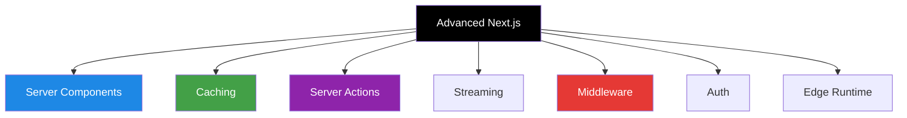

# Next.js — Advanced Concepts Guide

> This file covers advanced Next.js concepts frequently asked in interviews for mid-level and senior frontend/full-stack roles.

---

## 📚 Table of Contents

1. [Server Components vs Client Components](#1-server-components-vs-client-components)
2. [Data Fetching in App Router](#2-data-fetching-in-app-router)
3. [Caching in Next.js](#3-caching-in-nextjs)
4. [Revalidation and ISR](#4-revalidation-and-isr)
5. [Server Actions](#5-server-actions)
6. [Streaming and Suspense](#6-streaming-and-suspense)
7. [Parallel Routes and Intercepting Routes](#7-parallel-routes-and-intercepting-routes)
8. [Middleware](#8-middleware)
9. [Authentication and Protected Routes](#9-authentication-and-protected-routes)
10. [Route Handlers in Depth](#10-route-handlers-in-depth)
11. [SEO and Dynamic Metadata](#11-seo-and-dynamic-metadata)
12. [Performance Optimization](#12-performance-optimization)
13. [Edge Runtime vs Node Runtime](#13-edge-runtime-vs-node-runtime)
14. [next.config.js Important Settings](#14-nextconfigjs-important-settings)
15. [Deployment and Environment Strategy](#15-deployment-and-environment-strategy)
16. [Important Missing Advanced Topics](#16-important-missing-advanced-topics)

---



---

# 1. Server Components vs Client Components

## Server Components

> Default in App Router. They run on the server and do not send extra JS to the browser.

## Client Components

> Use `'use client'` when interactivity, hooks, or browser APIs are needed.

```jsx
// Server Component
export default async function ProductsPage() {
  const res = await fetch('https://api.example.com/products');
  const products = await res.json();

  return <div>{products.length}</div>;
}
```

```jsx
'use client';

import { useState } from 'react';

export default function Counter() {
  const [count, setCount] = useState(0);
  return <button onClick={() => setCount(count + 1)}>{count}</button>;
}
```

## Comparison

| Feature | Server Component | Client Component |
|---|---|---|
| Runs on server | Yes | No |
| Uses hooks | No | Yes |
| Access browser APIs | No | Yes |
| Bundle size | Smaller | Larger |

---

# 2. Data Fetching in App Router

> Data fetching can be done directly inside Server Components.

```jsx
export default async function UsersPage() {
  const res = await fetch('https://api.example.com/users', {
    cache: 'no-store',
  });

  const users = await res.json();
  return <div>{users.length} users</div>;
}
```

## Common fetch options

- `cache: 'force-cache'`
- `cache: 'no-store'`
- `next: { revalidate: 60 }`

---

# 3. Caching in Next.js

> Next.js has multiple caching layers.

## Common cache types

- Request memoization
- Data cache
- Full route cache
- Router cache on client

## Example

```jsx
await fetch('https://api.example.com/posts', {
  next: { revalidate: 60 }
});
```

## Interview point

Understand when data is cached automatically and when it must be disabled.

---

# 4. Revalidation and ISR

> ISR means a static page can be updated after deployment.

```jsx
export const revalidate = 60;

export default async function BlogPage() {
  const res = await fetch('https://api.example.com/posts');
  const posts = await res.json();
  return <div>{posts.length} posts</div>;
}
```

## On-demand revalidation

```jsx
import { revalidatePath } from 'next/cache';

export async function POST() {
  revalidatePath('/blog');
  return Response.json({ ok: true });
}
```

---

# 5. Server Actions

> Server Actions let forms and mutations run on the server directly.

```jsx
// app/actions.js
'use server';

export async function createPost(formData) {
  const title = formData.get('title');
  // save to DB
}
```

```jsx
import { createPost } from './actions';

export default function Page() {
  return (
    <form action={createPost}>
      <input name="title" />
      <button type="submit">Create</button>
    </form>
  );
}
```

## Benefits

- Less API boilerplate
- Simpler form handling
- Better server-side mutation flow

---

# 6. Streaming and Suspense

> Streaming allows parts of the page to render earlier while slower parts continue loading.

```jsx
import { Suspense } from 'react';

export default function Dashboard() {
  return (
    <div>
      <h1>Dashboard</h1>
      <Suspense fallback={<p>Loading analytics...</p>}>
        <Analytics />
      </Suspense>
    </div>
  );
}
```


---

# 7. Parallel Routes and Intercepting Routes

## Parallel routes

Allow multiple route segments to render side by side.

## Intercepting routes

Useful for modals that open over existing pages.

```text
app/
  @analytics/
  @team/
```

## Interview use case

- Modal login over current page
- Dashboard panels loading independently

---

# 8. Middleware

> Middleware runs before a request is completed.

## Use cases

- Redirect unauthenticated users
- Rewrite URLs
- A/B testing
- Geo-based routing

```jsx
// middleware.js
import { NextResponse } from 'next/server';

export function middleware(request) {
  const token = request.cookies.get('token');

  if (!token && request.nextUrl.pathname.startsWith('/dashboard')) {
    return NextResponse.redirect(new URL('/login', request.url));
  }

  return NextResponse.next();
}
```

---

# 9. Authentication and Protected Routes

## Common approaches

- Cookies + session
- JWT
- NextAuth/Auth.js
- Middleware-based protection

## Example pattern

- Middleware checks auth token
- Server Component validates session
- Client UI shows user state

## Senior discussion points

- HttpOnly cookies vs localStorage
- Refresh token strategy
- CSRF protection

---

# 10. Route Handlers in Depth

> Route Handlers in App Router replace many API route needs.

```jsx
// app/api/products/route.js
export async function GET() {
  return Response.json([{ id: 1, name: 'Phone' }]);
}

export async function POST(request) {
  const body = await request.json();
  return Response.json({ created: true, body });
}
```

## Good uses

- Lightweight backend endpoints
- Webhooks
- CRUD handlers
- Revalidation triggers

---

# 11. SEO and Dynamic Metadata

## Static metadata

```jsx
export const metadata = {
  title: 'Products',
  description: 'Browse our products',
};
```

## Dynamic metadata

```jsx
export async function generateMetadata({ params }) {
  return {
    title: `Post ${params.slug}`,
    description: `Read blog post ${params.slug}`,
  };
}
```

## Interview points

- Open Graph tags
- Canonical URLs
- Sitemap and robots

---

# 12. Performance Optimization

## Important strategies

- Prefer Server Components
- Use `next/image`
- Dynamic imports
- Reduce client bundle size
- Stream slow parts
- Cache stable data

## Dynamic import example

```jsx
import dynamic from 'next/dynamic';

const HeavyChart = dynamic(() => import('./HeavyChart'), {
  loading: () => <p>Loading chart...</p>,
  ssr: false,
});
```

---

# 13. Edge Runtime vs Node Runtime

| Feature | Edge Runtime | Node Runtime |
|---|---|---|
| Speed near user | Faster | Normal |
| Cold starts | Lower | Higher |
| Node APIs | Limited | Full |
| Best for | Middleware, lightweight logic | DB-heavy backend logic |

## Example

```jsx
export const runtime = 'edge';
```

---

# 14. next.config.js Important Settings

```js
/** @type {import('next').NextConfig} */
const nextConfig = {
  images: {
    domains: ['images.example.com'],
  },
  reactStrictMode: true,
};

module.exports = nextConfig;
```

## Common settings

- image domains
- redirects
- rewrites
- headers
- experimental flags

---

# 15. Deployment and Environment Strategy

## Common deployment targets

- Vercel
- Docker + Node server
- Serverless platforms

## Important points

- Separate envs for dev/staging/prod
- Do not expose secrets to client
- Monitor build output and bundle size

---

# 16. Important Missing Advanced Topics

## Loading and Error boundaries per route segment

```text
app/dashboard/loading.js
app/dashboard/error.js
```

## `notFound()` helper

```jsx
import { notFound } from 'next/navigation';

export default async function PostPage({ params }) {
  const post = null;
  if (!post) notFound();
  return <div>{post.title}</div>;
}
```

## Redirect helper

```jsx
import { redirect } from 'next/navigation';

export default function Page() {
  redirect('/login');
}
```

## Partial Prerendering discussion

Mention that newer Next.js versions improve hybrid rendering so static shells can stream dynamic sections later.

## Common interview trade-offs

- When to use Server Component vs Client Component
- When to cache vs disable cache
- SSR vs SSG vs ISR vs CSR
- Middleware vs Route Handler

---

## Quick Revision Table

| Topic | Summary |
|---|---|
| Server Components | Default in App Router, less client JS |
| Client Components | Needed for hooks and browser APIs |
| Caching | Multiple built-in cache layers |
| ISR | Revalidate static content later |
| Server Actions | Server-side mutations without API boilerplate |
| Streaming | Render fast content first |
| Middleware | Runs before request completes |
| Route Handlers | Backend endpoints in App Router |
| SEO metadata | Static and dynamic metadata support |
| Edge runtime | Fast lightweight logic near users |

---

*Notes based on practical Next.js interview topics, App Router concepts, and modern production patterns.*