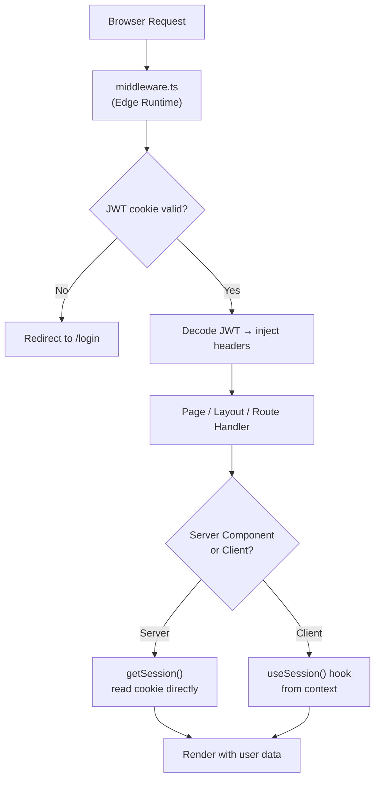

# Next.js Authentication — Production Grade Implementation Guide

> Complete authentication implementation for a Next.js 14/15 App Router + TypeScript application. Covers JWT with httpOnly cookies (no localStorage), `middleware.ts` route protection, Server Actions auth, Google OAuth, and full SSR-compatible patterns.

---

## 📚 Table of Contents

1. [Architecture Overview](#1-architecture-overview)
2. [Token Strategy for Next.js](#2-token-strategy-for-nextjs)
3. [Auth Library Setup — `jose` for Edge-Compatible JWT](#3-auth-library-setup--jose-for-edge-compatible-jwt)
4. [Auth Actions — Server Actions (App Router)](#4-auth-actions--server-actions-app-router)
5. [Register & Login Forms — with useActionState](#5-register--login-forms--with-useactionstate)
6. [Middleware — Route Protection at the Edge](#6-middleware--route-protection-at-the-edge)
7. [Server-Side Session Access](#7-server-side-session-access)
8. [Google OAuth with NextAuth.js v5](#8-google-oauth-with-nextauthjs-v5)
9. [Custom OAuth Without NextAuth](#9-custom-oauth-without-nextauth)
10. [Role-Based Access Control (RBAC)](#10-role-based-access-control-rbac)
11. [Auth Context — Client Components](#11-auth-context--client-components)
12. [Protected Pages & Layouts](#12-protected-pages--layouts)
13. [Logout Implementation](#13-logout-implementation)
14. [Security Best Practices](#14-security-best-practices)
15. [NextAuth.js v5 (Auth.js) — Full Setup](#15-nextauthjs-v5-authjs--full-setup)
16. [Senior Interview Q&A](#16-senior-interview-qa)

---



---

# 1. Architecture Overview

## Why Next.js Auth is Different from React SPA

| Concern | React SPA (CRA/Vite) | Next.js App Router |
|---|---|---|
| Auth check timing | Client-side after hydration | **Edge middleware — before render** |
| Token storage | In-memory + httpOnly cookie | **httpOnly cookie only** (accessible server-side) |
| Protected routes | Client-side redirect | **Server-side redirect via middleware** |
| User data access | Redux selector / hook | **Server Component: `cookies()` / Client: Context** |
| Login form | Client submit + axios | **Server Action — no API route needed** |
| Token verification | Client can't verify | **Server / Edge verifies with `jose`** |

## Folder Structure

```
src/
├── app/
│   ├── (auth)/                      # Route group — no layout chrome
│   │   ├── login/
│   │   │   └── page.tsx
│   │   ├── register/
│   │   │   └── page.tsx
│   │   ├── forgot-password/
│   │   │   └── page.tsx
│   │   └── layout.tsx               # Auth-only layout (centered card)
│   ├── (protected)/                 # Route group — requires auth
│   │   ├── dashboard/
│   │   │   └── page.tsx
│   │   ├── settings/
│   │   │   └── page.tsx
│   │   └── layout.tsx               # Protected layout (sidebar, navbar)
│   ├── api/
│   │   └── auth/
│   │       └── [...nextauth]/       # Only needed for NextAuth.js
│   │           └── route.ts
│   └── layout.tsx                   # Root layout with SessionProvider
├── actions/
│   └── auth.actions.ts              # Server Actions for login/register/logout
├── lib/
│   ├── auth.ts                      # JWT utils (jose) — session helpers
│   ├── session.ts                   # getSession() server helper
│   └── db.ts                        # Database client
├── middleware.ts                    # Edge route protection
├── components/
│   └── auth/
│       ├── LoginForm.tsx
│       ├── RegisterForm.tsx
│       ├── GoogleButton.tsx
│       └── LogoutButton.tsx
└── context/
    └── SessionContext.tsx           # Client-side session context
```

---

# 2. Token Strategy for Next.js

## Single Token in httpOnly Cookie

```
Next.js Auth Pattern:
  ✅ ONE JWT stored in an httpOnly cookie
  ✅ Cookie is sent automatically on every request (including SSR)
  ✅ Middleware reads cookie → verifies JWT → allows/redirects
  ✅ Server Components read cookie via cookies() API
  ✅ No Redux, no localStorage, no in-memory juggling

Why not access + refresh token pair like React SPA?
  - In Next.js, the server handles every request
  - Middleware can verify the session cookie on every edge request
  - Use a slightly longer-lived session cookie (e.g., 7 days)
  - Rotate the cookie on each request (sliding session) OR use refresh at API level
  - For high-security apps: keep the two-token model with Route Handlers
```

## Cookie Configuration

```typescript
// lib/auth.ts
export const SESSION_COOKIE_NAME = 'session';

export const COOKIE_OPTIONS = {
  httpOnly: true,         // Not accessible by JavaScript
  secure: process.env.NODE_ENV === 'production', // HTTPS only in prod
  sameSite: 'lax' as const,  // 'strict' breaks OAuth redirect flows
  path: '/',
  maxAge: 60 * 60 * 24 * 7,  // 7 days in seconds
} as const;
```

---

# 3. Auth Library Setup — `jose` for Edge-Compatible JWT

> Do NOT use `jsonwebtoken` — it uses Node.js crypto APIs unavailable in the Edge Runtime (middleware). Use `jose` instead.

```bash
npm install jose zod bcryptjs
npm install -D @types/bcryptjs
```

## lib/auth.ts

```typescript
// src/lib/auth.ts
import { SignJWT, jwtVerify } from 'jose';
import { cookies } from 'next/headers';
import { User } from '@/types/auth';

// ─── Secret Key Setup ────────────────────────────────────────────────────────
const getSecret = () => {
  const secret = process.env.JWT_SECRET;
  if (!secret) throw new Error('JWT_SECRET environment variable is not set');
  return new TextEncoder().encode(secret);
};

export interface SessionPayload {
  userId: string;
  email: string;
  role: 'admin' | 'member' | 'viewer';
  subscriptionTier: 'free' | 'pro' | 'enterprise';
  iat?: number;
  exp?: number;
}

// ─── Create Session JWT ──────────────────────────────────────────────────────
export async function createSession(user: Pick<User, 'id' | 'email' | 'role' | 'subscriptionTier'>): Promise<string> {
  const token = await new SignJWT({
    userId: user.id,
    email: user.email,
    role: user.role,
    subscriptionTier: user.subscriptionTier,
  } satisfies Omit<SessionPayload, 'iat' | 'exp'>)
    .setProtectedHeader({ alg: 'HS256' })
    .setIssuedAt()
    .setExpirationTime('7d')
    .sign(getSecret());

  return token;
}

// ─── Verify Session JWT ──────────────────────────────────────────────────────
export async function verifySession(token: string): Promise<SessionPayload | null> {
  try {
    const { payload } = await jwtVerify(token, getSecret(), {
      algorithms: ['HS256'],
    });
    return payload as SessionPayload;
  } catch {
    // Token expired, tampered, or invalid
    return null;
  }
}

// ─── Set Session Cookie ──────────────────────────────────────────────────────
export async function setSessionCookie(token: string): Promise<void> {
  const cookieStore = await cookies();
  cookieStore.set(SESSION_COOKIE_NAME, token, COOKIE_OPTIONS);
}

// ─── Clear Session Cookie ────────────────────────────────────────────────────
export async function clearSessionCookie(): Promise<void> {
  const cookieStore = await cookies();
  cookieStore.delete(SESSION_COOKIE_NAME);
}

export const SESSION_COOKIE_NAME = 'session';

export const COOKIE_OPTIONS = {
  httpOnly: true,
  secure: process.env.NODE_ENV === 'production',
  sameSite: 'lax' as const,
  path: '/',
  maxAge: 60 * 60 * 24 * 7,
} as const;
```

## lib/session.ts

```typescript
// src/lib/session.ts
// Helper to get current session — use in Server Components, Route Handlers, Server Actions

import { cookies } from 'next/headers';
import { cache } from 'react';
import { SESSION_COOKIE_NAME, verifySession, SessionPayload } from './auth';

// React cache() deduplicates calls per request — call getSession() freely
// in layouts, pages, and server components without extra DB/token hits
export const getSession = cache(async (): Promise<SessionPayload | null> => {
  const cookieStore = await cookies();
  const token = cookieStore.get(SESSION_COOKIE_NAME)?.value;
  if (!token) return null;
  return verifySession(token);
});

// Throws redirect if not authenticated — use in page.tsx
export async function requireAuth(): Promise<SessionPayload> {
  const session = await getSession();
  if (!session) {
    const { redirect } = await import('next/navigation');
    redirect('/login');
  }
  return session;
}

// Throws redirect if wrong role
export async function requireRole(
  allowedRoles: SessionPayload['role'][]
): Promise<SessionPayload> {
  const session = await requireAuth();
  if (!allowedRoles.includes(session.role)) {
    const { redirect } = await import('next/navigation');
    redirect('/403');
  }
  return session;
}
```

---

# 4. Auth Actions — Server Actions (App Router)

> Server Actions let us handle login/register directly without creating Route Handlers. They run on the server, can set cookies, and return typed errors to the client — no API layer needed.

```typescript
// src/actions/auth.actions.ts
'use server';

import { z } from 'zod';
import bcrypt from 'bcryptjs';
import { redirect } from 'next/navigation';
import { createSession, setSessionCookie, clearSessionCookie } from '@/lib/auth';
import { db } from '@/lib/db';

// ─── Shared Types ─────────────────────────────────────────────────────────────
export type ActionResult = {
  success: boolean;
  error?: string;
  fieldErrors?: Record<string, string[]>;
};

// ─── Register ─────────────────────────────────────────────────────────────────
const registerSchema = z.object({
  name: z.string().min(2).max(50),
  email: z.string().email().toLowerCase(),
  password: z
    .string()
    .min(8)
    .regex(/[A-Z]/, 'Must contain uppercase')
    .regex(/[0-9]/, 'Must contain number')
    .regex(/[^a-zA-Z0-9]/, 'Must contain special character'),
});

export async function registerAction(
  _prevState: ActionResult,
  formData: FormData
): Promise<ActionResult> {
  const raw = {
    name: formData.get('name'),
    email: formData.get('email'),
    password: formData.get('password'),
  };

  const result = registerSchema.safeParse(raw);
  if (!result.success) {
    return {
      success: false,
      fieldErrors: result.error.flatten().fieldErrors,
    };
  }

  const { name, email, password } = result.data;

  try {
    // Check existing user
    const existing = await db.user.findUnique({ where: { email } });
    if (existing) {
      return { success: false, error: 'An account with this email already exists.' };
    }

    // Hash password — NEVER store plaintext
    const hashedPassword = await bcrypt.hash(password, 12);

    // Create user
    await db.user.create({
      data: {
        name,
        email,
        password: hashedPassword,
        role: 'member',
        subscriptionTier: 'free',
      },
    });

    // TODO: Send verification email
    // await emailService.sendVerification(email);

    return { success: true };
  } catch {
    return { success: false, error: 'Something went wrong. Please try again.' };
  }
}

// ─── Login ────────────────────────────────────────────────────────────────────
const loginSchema = z.object({
  email: z.string().email().toLowerCase(),
  password: z.string().min(1, 'Password is required'),
});

export async function loginAction(
  _prevState: ActionResult,
  formData: FormData
): Promise<ActionResult> {
  const raw = {
    email: formData.get('email'),
    password: formData.get('password'),
  };

  const result = loginSchema.safeParse(raw);
  if (!result.success) {
    return {
      success: false,
      fieldErrors: result.error.flatten().fieldErrors,
    };
  }

  const { email, password } = result.data;

  try {
    // Find user
    const user = await db.user.findUnique({ where: { email } });

    // Timing-safe comparison — use bcrypt even if user not found to prevent timing attacks
    const dummyHash = '$2b$12$invalid.hash.to.prevent.timing.attack.please.do.not.use';
    const isValid = user
      ? await bcrypt.compare(password, user.password)
      : await bcrypt.compare(password, dummyHash);

    if (!user || !isValid) {
      return { success: false, error: 'Invalid email or password.' };
    }

    if (!user.isEmailVerified) {
      return { success: false, error: 'Please verify your email before logging in.' };
    }

    // Create JWT session
    const token = await createSession({
      id: user.id,
      email: user.email,
      role: user.role,
      subscriptionTier: user.subscriptionTier,
    });

    // Set httpOnly cookie
    await setSessionCookie(token);
  } catch {
    return { success: false, error: 'Something went wrong. Please try again.' };
  }

  // Redirect AFTER try/catch — redirect() throws internally
  redirect('/dashboard');
}

// ─── Logout ───────────────────────────────────────────────────────────────────
export async function logoutAction(): Promise<void> {
  await clearSessionCookie();
  redirect('/login');
}

// ─── Forgot Password ──────────────────────────────────────────────────────────
export async function forgotPasswordAction(
  _prevState: ActionResult,
  formData: FormData
): Promise<ActionResult> {
  const email = String(formData.get('email')).toLowerCase();

  if (!z.string().email().safeParse(email).success) {
    return { success: false, error: 'Invalid email address.' };
  }

  // Always return success to prevent email enumeration attacks
  try {
    const user = await db.user.findUnique({ where: { email } });
    if (user) {
      // Generate reset token and send email
      const resetToken = crypto.randomUUID();
      const expires = new Date(Date.now() + 60 * 60 * 1000); // 1 hour
      await db.passwordReset.create({
        data: { userId: user.id, token: resetToken, expiresAt: expires },
      });
      // await emailService.sendPasswordReset(email, resetToken);
    }
  } catch {
    // Silently fail — don't reveal if email exists
  }

  return {
    success: true,
    // Don't say "if your email exists" — say it clearly for UX
    // Security through obscurity vs UX: pick your side
  };
}
```

---

# 5. Register & Login Forms — with useActionState

## LoginForm.tsx

```tsx
// src/components/auth/LoginForm.tsx
'use client';

import { useActionState } from 'react';
import { useEffect } from 'react';
import Link from 'next/link';
import { loginAction, ActionResult } from '@/actions/auth.actions';
import { GoogleButton } from './GoogleButton';

const initialState: ActionResult = { success: false };

export function LoginForm() {
  const [state, formAction, isPending] = useActionState(loginAction, initialState);

  return (
    <div className="max-w-md mx-auto mt-16 p-8 bg-white rounded-xl shadow">
      <h1 className="text-3xl font-bold mb-6 text-center">Sign In</h1>

      {state.error && !state.success && (
        <div role="alert" className="mb-4 p-3 bg-red-50 border border-red-200 text-red-700 rounded-lg text-sm">
          {state.error}
        </div>
      )}

      <form action={formAction} className="space-y-4" noValidate>
        <div>
          <label htmlFor="email" className="block text-sm font-medium text-gray-700 mb-1">
            Email address
          </label>
          <input
            id="email"
            name="email"
            type="email"
            autoComplete="email"
            required
            className="w-full border border-gray-300 rounded-md px-3 py-2 focus:ring-2 focus:ring-indigo-500 focus:border-indigo-500"
            aria-invalid={!!state.fieldErrors?.email}
            aria-describedby={state.fieldErrors?.email ? 'email-error' : undefined}
          />
          {state.fieldErrors?.email && (
            <p id="email-error" className="text-red-600 text-xs mt-1">
              {state.fieldErrors.email[0]}
            </p>
          )}
        </div>

        <div>
          <div className="flex justify-between items-center mb-1">
            <label htmlFor="password" className="block text-sm font-medium text-gray-700">
              Password
            </label>
            <Link href="/forgot-password" className="text-xs text-indigo-600 hover:underline">
              Forgot password?
            </Link>
          </div>
          <input
            id="password"
            name="password"
            type="password"
            autoComplete="current-password"
            required
            className="w-full border border-gray-300 rounded-md px-3 py-2 focus:ring-2 focus:ring-indigo-500 focus:border-indigo-500"
          />
          {state.fieldErrors?.password && (
            <p className="text-red-600 text-xs mt-1">{state.fieldErrors.password[0]}</p>
          )}
        </div>

        <button
          type="submit"
          disabled={isPending}
          className="w-full bg-indigo-600 text-white py-2.5 rounded-md font-medium hover:bg-indigo-700 disabled:opacity-50 disabled:cursor-not-allowed transition-colors"
          aria-busy={isPending}
        >
          {isPending ? 'Signing in…' : 'Sign In'}
        </button>
      </form>

      <div className="relative my-6">
        <div className="absolute inset-0 flex items-center">
          <div className="w-full border-t border-gray-200" />
        </div>
        <div className="relative flex justify-center text-sm">
          <span className="bg-white px-2 text-gray-500">Or continue with</span>
        </div>
      </div>

      <GoogleButton />

      <p className="mt-6 text-center text-sm text-gray-600">
        Don't have an account?{' '}
        <Link href="/register" className="text-indigo-600 font-medium hover:underline">
          Sign up
        </Link>
      </p>
    </div>
  );
}
```

## RegisterForm.tsx

```tsx
// src/components/auth/RegisterForm.tsx
'use client';

import { useActionState } from 'react';
import Link from 'next/link';
import { registerAction, ActionResult } from '@/actions/auth.actions';

const initialState: ActionResult = { success: false };

export function RegisterForm() {
  const [state, formAction, isPending] = useActionState(registerAction, initialState);

  if (state.success) {
    return (
      <div className="max-w-md mx-auto mt-16 p-8 bg-white rounded-xl shadow text-center">
        <div className="text-5xl mb-4">📧</div>
        <h2 className="text-2xl font-bold mb-2">Check your email</h2>
        <p className="text-gray-600 mb-4">
          We've sent a verification link to your email. Click it to activate your account.
        </p>
        <Link href="/login" className="text-indigo-600 hover:underline text-sm">
          Back to login
        </Link>
      </div>
    );
  }

  return (
    <div className="max-w-md mx-auto mt-16 p-8 bg-white rounded-xl shadow">
      <h1 className="text-3xl font-bold mb-6 text-center">Create Account</h1>

      {state.error && (
        <div role="alert" className="mb-4 p-3 bg-red-50 border border-red-200 text-red-700 rounded-lg text-sm">
          {state.error}
        </div>
      )}

      <form action={formAction} className="space-y-4" noValidate>
        <div>
          <label htmlFor="name" className="block text-sm font-medium text-gray-700 mb-1">Full name</label>
          <input
            id="name" name="name" type="text" autoComplete="name" required
            className="w-full border border-gray-300 rounded-md px-3 py-2 focus:ring-2 focus:ring-indigo-500"
          />
          {state.fieldErrors?.name && (
            <p className="text-red-600 text-xs mt-1">{state.fieldErrors.name[0]}</p>
          )}
        </div>

        <div>
          <label htmlFor="email" className="block text-sm font-medium text-gray-700 mb-1">Email address</label>
          <input
            id="email" name="email" type="email" autoComplete="email" required
            className="w-full border border-gray-300 rounded-md px-3 py-2 focus:ring-2 focus:ring-indigo-500"
          />
          {state.fieldErrors?.email && (
            <p className="text-red-600 text-xs mt-1">{state.fieldErrors.email[0]}</p>
          )}
        </div>

        <div>
          <label htmlFor="password" className="block text-sm font-medium text-gray-700 mb-1">Password</label>
          <input
            id="password" name="password" type="password" autoComplete="new-password" required
            className="w-full border border-gray-300 rounded-md px-3 py-2 focus:ring-2 focus:ring-indigo-500"
          />
          {state.fieldErrors?.password && (
            <p className="text-red-600 text-xs mt-1">{state.fieldErrors.password[0]}</p>
          )}
          <p className="text-gray-400 text-xs mt-1">Min 8 chars, 1 uppercase, 1 number, 1 special character</p>
        </div>

        <button
          type="submit" disabled={isPending}
          className="w-full bg-indigo-600 text-white py-2.5 rounded-md font-medium hover:bg-indigo-700 disabled:opacity-50 transition-colors"
        >
          {isPending ? 'Creating account…' : 'Create Account'}
        </button>
      </form>

      <p className="mt-6 text-center text-sm text-gray-600">
        Already have an account?{' '}
        <Link href="/login" className="text-indigo-600 font-medium hover:underline">Sign in</Link>
      </p>
    </div>
  );
}
```

---

# 6. Middleware — Route Protection at the Edge

> The middleware runs at the Edge before any page renders. It's the primary security gate — even if someone bypasses client-side checks, they still get redirected here.

```typescript
// middleware.ts (root of project, not inside src/)
import { NextResponse } from 'next/server';
import type { NextRequest } from 'next/server';
import { verifySession, SESSION_COOKIE_NAME } from '@/lib/auth';

// ─── Route Definitions ───────────────────────────────────────────────────────
const PUBLIC_ROUTES = ['/', '/login', '/register', '/forgot-password'];
const AUTH_ROUTES = ['/login', '/register', '/forgot-password']; // Redirect if already logged in
const ADMIN_ROUTES = ['/admin'];

// ─── Middleware Function ─────────────────────────────────────────────────────
export async function middleware(request: NextRequest) {
  const { pathname } = request.nextUrl;

  // Skip static files, API routes, Next.js internals
  if (
    pathname.startsWith('/_next') ||
    pathname.startsWith('/api/auth') || // NextAuth endpoint
    pathname.includes('.') // static files
  ) {
    return NextResponse.next();
  }

  // Get and verify the session cookie
  const token = request.cookies.get(SESSION_COOKIE_NAME)?.value;
  const session = token ? await verifySession(token) : null;
  const isAuthenticated = !!session;

  // ── Authenticated user hitting auth routes → redirect to dashboard ──
  if (isAuthenticated && AUTH_ROUTES.some(route => pathname.startsWith(route))) {
    return NextResponse.redirect(new URL('/dashboard', request.url));
  }

  // ── Unauthenticated user hitting protected route → redirect to login ──
  const isPublic = PUBLIC_ROUTES.some(route => pathname === route || pathname.startsWith(route + '/'));
  if (!isAuthenticated && !isPublic) {
    const loginUrl = new URL('/login', request.url);
    loginUrl.searchParams.set('returnUrl', pathname); // Preserve destination
    return NextResponse.redirect(loginUrl);
  }

  // ── Role check for admin routes ──────────────────────────────────────
  if (ADMIN_ROUTES.some(route => pathname.startsWith(route))) {
    if (session?.role !== 'admin') {
      return NextResponse.redirect(new URL('/403', request.url));
    }
  }

  // ── Inject user info into headers for Server Components ─────────────
  // Server Components can read these without calling getSession() from cookies again
  if (session) {
    const requestHeaders = new Headers(request.headers);
    requestHeaders.set('x-user-id', session.userId);
    requestHeaders.set('x-user-role', session.role);
    requestHeaders.set('x-user-tier', session.subscriptionTier);

    return NextResponse.next({ request: { headers: requestHeaders } });
  }

  return NextResponse.next();
}

// ─── Matcher ─────────────────────────────────────────────────────────────────
export const config = {
  matcher: [
    /*
     * Match all request paths EXCEPT:
     * - _next/static (static files)
     * - _next/image (image optimization)
     * - favicon.ico
     * - Public files with extensions (images, etc.)
     */
    '/((?!_next/static|_next/image|favicon.ico|.*\\.(?:svg|png|jpg|jpeg|gif|webp)$).*)',
  ],
};
```

---

# 7. Server-Side Session Access

## Reading Session in Server Components

```tsx
// app/(protected)/dashboard/page.tsx
import { requireAuth } from '@/lib/session';
import { db } from '@/lib/db';

// This page auto-redirects to /login if not authenticated
export default async function DashboardPage() {
  // requireAuth throws redirect() if no valid session
  const session = await requireAuth();

  // Fetch user-specific data with their userId from session
  const dashboardData = await db.resume.findMany({
    where: { userId: session.userId },
    orderBy: { updatedAt: 'desc' },
    take: 5,
  });

  return (
    <div>
      <h1>Welcome back!</h1>
      <p>Logged in as {session.email} ({session.role})</p>
      {/* Render dashboard data */}
    </div>
  );
}
```

## Reading from Middleware Headers (Alternative)

```tsx
// app/(protected)/layout.tsx
import { headers } from 'next/headers';

export default async function ProtectedLayout({ children }: { children: React.ReactNode }) {
  // Read user info injected by middleware — no JWT verification needed again
  const headersList = await headers();
  const userId = headersList.get('x-user-id');
  const role = headersList.get('x-user-role');

  if (!userId) {
    // Fallback — middleware should have redirected, but just in case
    return null;
  }

  return (
    <div>
      <Sidebar role={role} />
      <main>{children}</main>
    </div>
  );
}
```

## Reading Session in Route Handlers

```typescript
// app/api/resumes/route.ts
import { NextRequest, NextResponse } from 'next/server';
import { getSession } from '@/lib/session';

export async function GET(request: NextRequest) {
  const session = await getSession();

  if (!session) {
    return NextResponse.json({ error: 'Unauthorized' }, { status: 401 });
  }

  const resumes = await db.resume.findMany({
    where: { userId: session.userId },
  });

  return NextResponse.json(resumes);
}
```

---

# 8. Google OAuth with NextAuth.js v5

```bash
npm install next-auth@beta
```

## auth.ts — NextAuth Configuration

```typescript
// src/auth.ts (or src/lib/auth-nextauth.ts)
import NextAuth from 'next-auth';
import Google from 'next-auth/providers/google';
import Credentials from 'next-auth/providers/credentials';
import { db } from '@/lib/db';
import bcrypt from 'bcryptjs';
import { z } from 'zod';

export const { handlers, auth, signIn, signOut } = NextAuth({
  providers: [
    // ── Google OAuth ──────────────────────────────────────────────────
    Google({
      clientId: process.env.GOOGLE_CLIENT_ID!,
      clientSecret: process.env.GOOGLE_CLIENT_SECRET!,
    }),

    // ── Credentials (email + password) ───────────────────────────────
    Credentials({
      credentials: {
        email: { label: 'Email', type: 'email' },
        password: { label: 'Password', type: 'password' },
      },
      async authorize(credentials) {
        const parsed = z.object({
          email: z.string().email(),
          password: z.string().min(1),
        }).safeParse(credentials);

        if (!parsed.success) return null;

        const user = await db.user.findUnique({
          where: { email: parsed.data.email.toLowerCase() },
        });

        if (!user || !user.password) return null;

        const isValid = await bcrypt.compare(parsed.data.password, user.password);
        if (!isValid) return null;

        return {
          id: user.id,
          name: user.name,
          email: user.email,
          image: user.avatarUrl,
          role: user.role,
          subscriptionTier: user.subscriptionTier,
        };
      },
    }),
  ],

  callbacks: {
    // Add custom fields to JWT token
    async jwt({ token, user, account }) {
      if (user) {
        // First sign in — enrich token with DB fields
        token.userId = user.id;
        token.role = (user as any).role ?? 'member';
        token.subscriptionTier = (user as any).subscriptionTier ?? 'free';
      }
      return token;
    },

    // Expose token fields to session (client-accessible)
    async session({ session, token }) {
      if (session.user) {
        session.user.id = token.userId as string;
        session.user.role = token.role as string;
        session.user.subscriptionTier = token.subscriptionTier as string;
      }
      return session;
    },

    // Handle new OAuth sign-ins — create user in DB if not exists
    async signIn({ user, account }) {
      if (account?.provider === 'google') {
        try {
          const existing = await db.user.findUnique({ where: { email: user.email! } });
          if (!existing) {
            await db.user.create({
              data: {
                email: user.email!,
                name: user.name!,
                avatarUrl: user.image,
                googleId: account.providerAccountId,
                role: 'member',
                subscriptionTier: 'free',
                isEmailVerified: true, // Google emails are verified
              },
            });
          }
        } catch {
          return false; // Abort sign in
        }
      }
      return true;
    },
  },

  pages: {
    signIn: '/login',      // Custom login page
    error: '/login',       // Redirect errors to login page
    newUser: '/onboarding', // Redirect new OAuth users here
  },

  session: {
    strategy: 'jwt',
    maxAge: 7 * 24 * 60 * 60, // 7 days
  },
});
```

## NextAuth Route Handler

```typescript
// app/api/auth/[...nextauth]/route.ts
import { handlers } from '@/auth';

export const { GET, POST } = handlers;
```

## NextAuth Session in Server Components

```tsx
// Any server component
import { auth } from '@/auth';

export default async function ProfilePage() {
  const session = await auth();

  if (!session) {
    // middleware handles redirect, this is a fallback
    return null;
  }

  return <div>Hello {session.user.name} — Role: {session.user.role}</div>;
}
```

## NextAuth Middleware

```typescript
// middleware.ts (when using NextAuth)
import { auth } from '@/auth';
import { NextResponse } from 'next/server';

export default auth((request) => {
  const { nextUrl, auth: session } = request;

  const isLoggedIn = !!session;
  const isAuthRoute = nextUrl.pathname.startsWith('/login') || nextUrl.pathname.startsWith('/register');
  const isProtected = nextUrl.pathname.startsWith('/dashboard') || nextUrl.pathname.startsWith('/settings');

  if (isAuthRoute && isLoggedIn) {
    return NextResponse.redirect(new URL('/dashboard', nextUrl));
  }

  if (isProtected && !isLoggedIn) {
    const loginUrl = new URL('/login', nextUrl);
    loginUrl.searchParams.set('returnUrl', nextUrl.pathname);
    return NextResponse.redirect(loginUrl);
  }

  return NextResponse.next();
});

export const config = { matcher: ['/((?!_next/static|_next/image|favicon.ico).*)'] };
```

---

# 9. Custom OAuth Without NextAuth

> When you need full control over the OAuth flow (custom scopes, multi-provider, token storage in DB).

```typescript
// app/api/auth/google/route.ts — Initiate OAuth flow
import { NextResponse } from 'next/server';

export async function GET() {
  const params = new URLSearchParams({
    client_id: process.env.GOOGLE_CLIENT_ID!,
    redirect_uri: `${process.env.NEXT_PUBLIC_APP_URL}/api/auth/google/callback`,
    response_type: 'code',
    scope: 'openid email profile',
    access_type: 'offline',
    prompt: 'consent',
  });

  return NextResponse.redirect(
    `https://accounts.google.com/o/oauth2/v2/auth?${params.toString()}`
  );
}

// app/api/auth/google/callback/route.ts — Handle callback
import { NextRequest, NextResponse } from 'next/server';
import { createSession, setSessionCookie } from '@/lib/auth';
import { db } from '@/lib/db';

export async function GET(request: NextRequest) {
  const { searchParams } = new URL(request.url);
  const code = searchParams.get('code');

  if (!code) {
    return NextResponse.redirect(new URL('/login?error=oauth_failed', request.url));
  }

  try {
    // Exchange code for tokens
    const tokenRes = await fetch('https://oauth2.googleapis.com/token', {
      method: 'POST',
      headers: { 'Content-Type': 'application/x-www-form-urlencoded' },
      body: new URLSearchParams({
        code,
        client_id: process.env.GOOGLE_CLIENT_ID!,
        client_secret: process.env.GOOGLE_CLIENT_SECRET!,
        redirect_uri: `${process.env.NEXT_PUBLIC_APP_URL}/api/auth/google/callback`,
        grant_type: 'authorization_code',
      }),
    });

    const tokens = await tokenRes.json();

    // Get user profile from Google
    const profileRes = await fetch('https://www.googleapis.com/oauth2/v2/userinfo', {
      headers: { Authorization: `Bearer ${tokens.access_token}` },
    });
    const profile = await profileRes.json();

    // Find or create user
    let user = await db.user.findUnique({ where: { email: profile.email } });
    if (!user) {
      user = await db.user.create({
        data: {
          email: profile.email,
          name: profile.name,
          avatarUrl: profile.picture,
          googleId: profile.id,
          role: 'member',
          subscriptionTier: 'free',
          isEmailVerified: true,
        },
      });
    }

    // Create session and set cookie
    const sessionToken = await createSession({
      id: user.id,
      email: user.email,
      role: user.role,
      subscriptionTier: user.subscriptionTier,
    });
    await setSessionCookie(sessionToken);

    const returnUrl = request.cookies.get('oauth_return_url')?.value ?? '/dashboard';
    return NextResponse.redirect(new URL(returnUrl, request.url));
  } catch {
    return NextResponse.redirect(new URL('/login?error=oauth_failed', request.url));
  }
}
```

---

# 10. Role-Based Access Control (RBAC)

## Server-Side Role Check

```typescript
// In any Server Component or Server Action
import { requireRole } from '@/lib/session';

// Admin-only page
export default async function AdminPage() {
  await requireRole(['admin']); // Throws redirect to /403 if not admin
  // ... admin content
}
```

## Client-Side RBAC with Context

```tsx
// Used for UI decisions — NOT security (security is middleware + server)
import { useSession } from '@/context/SessionContext';

const PERMISSIONS = {
  admin: ['create', 'edit', 'delete', 'manage_users', 'view_analytics'],
  member: ['create', 'edit'],
  viewer: [],
} as const;

export function usePermission(action: string): boolean {
  const { session } = useSession();
  if (!session) return false;
  return (PERMISSIONS[session.role as keyof typeof PERMISSIONS] as readonly string[]).includes(action);
}

// Usage:
// const canDelete = usePermission('delete');
// <button disabled={!canDelete}>Delete</button>
```

---

# 11. Auth Context — Client Components

> Server Components can read cookies directly, but Client Components need the session passed via context.

```tsx
// src/context/SessionContext.tsx
'use client';

import { createContext, useContext } from 'react';
import { SessionPayload } from '@/lib/auth';

interface SessionContextValue {
  session: SessionPayload | null;
}

const SessionContext = createContext<SessionContextValue>({ session: null });

export function SessionProvider({
  children,
  session,
}: {
  children: React.ReactNode;
  session: SessionPayload | null;
}) {
  return (
    <SessionContext.Provider value={{ session }}>
      {children}
    </SessionContext.Provider>
  );
}

export function useSession(): SessionContextValue {
  return useContext(SessionContext);
}

// ─── Usage in Root Layout ────────────────────────────────────────────────────
// app/layout.tsx
// import { getSession } from '@/lib/session';
//
// export default async function RootLayout({ children }) {
//   const session = await getSession(); // Server Component — reads cookie
//   return (
//     <html>
//       <body>
//         <SessionProvider session={session}>
//           {children}
//         </SessionProvider>
//       </body>
//     </html>
//   );
// }
```

## Root Layout

```tsx
// app/layout.tsx
import { getSession } from '@/lib/session';
import { SessionProvider } from '@/context/SessionContext';

export default async function RootLayout({ children }: { children: React.ReactNode }) {
  // Runs on server — can read cookie
  const session = await getSession();

  return (
    <html lang="en">
      <body>
        {/* Pass session to context for all Client Components */}
        <SessionProvider session={session}>
          {children}
        </SessionProvider>
      </body>
    </html>
  );
}
```

---

# 12. Protected Pages & Layouts

## Protected Layout (Server Component)

```tsx
// app/(protected)/layout.tsx
import { requireAuth } from '@/lib/session';
import { Sidebar } from '@/components/Sidebar';
import { Navbar } from '@/components/Navbar';

export default async function ProtectedLayout({ children }: { children: React.ReactNode }) {
  // middleware already ensures auth — this is a safety net + gets session for UI
  const session = await requireAuth();

  return (
    <div className="flex h-screen">
      <Sidebar role={session.role} tier={session.subscriptionTier} />
      <div className="flex-1 flex flex-col">
        <Navbar userId={session.userId} />
        <main className="flex-1 overflow-auto p-6">{children}</main>
      </div>
    </div>
  );
}
```

## Admin-Only Page

```tsx
// app/(protected)/admin/page.tsx
import { requireRole } from '@/lib/session';
import { forbidden } from 'next/navigation'; // Next.js 15+

export default async function AdminPage() {
  const session = await requireRole(['admin']);
  // or for Next.js 15:
  // const session = await getSession();
  // if (session?.role !== 'admin') forbidden();

  return <AdminDashboard userId={session.userId} />;
}
```

---

# 13. Logout Implementation

```tsx
// src/components/auth/LogoutButton.tsx
'use client';

import { logoutAction } from '@/actions/auth.actions';
import { useTransition } from 'react';

export function LogoutButton() {
  const [isPending, startTransition] = useTransition();

  const handleLogout = () => {
    startTransition(async () => {
      await logoutAction(); // Clears cookie + redirects server-side
    });
  };

  return (
    <button
      onClick={handleLogout}
      disabled={isPending}
      className="text-sm text-gray-600 hover:text-gray-900 disabled:opacity-50"
    >
      {isPending ? 'Signing out…' : 'Sign Out'}
    </button>
  );
}

// Or use form action for progressive enhancement (works without JS):
export function LogoutForm() {
  return (
    <form action={logoutAction}>
      <button type="submit" className="text-sm text-gray-600 hover:text-gray-900">
        Sign Out
      </button>
    </form>
  );
}
```

---

# 14. Security Best Practices

## Middleware vs Server Component Auth

```typescript
// ❌ WRONG — Security only in Server Component (middleware bypassed)
// app/(protected)/dashboard/page.tsx
export default async function DashboardPage() {
  const session = await getSession();
  if (!session) redirect('/login'); // Can be bypassed if middleware has a bug
}

// ✅ CORRECT — Defense in depth: middleware is primary, server component is backup
// middleware.ts handles all protected routes
// server component adds secondary check + gets session for data fetching
```

## Cookie Security Settings

```typescript
// Production-ready cookie options
const COOKIE_OPTIONS = {
  httpOnly: true,          // ✅ No JS access — prevents XSS token theft
  secure: true,            // ✅ HTTPS only
  sameSite: 'lax',        // ✅ Prevents CSRF on navigation, allows OAuth redirects
  // sameSite: 'strict'   // ⚠️ Breaks OAuth redirect flows (Google sends back via redirect)
  path: '/',               // Cookie sent on all paths
  maxAge: 60 * 60 * 24 * 7, // 7 days — or use 'expires' for absolute expiry
  domain: '.yourdomain.com', // Allows sharing across subdomains in production
};
```

## Environment Variables

```bash
# .env.local
JWT_SECRET=your-very-long-random-secret-minimum-32-chars   # openssl rand -base64 32
NEXTAUTH_SECRET=another-random-secret                       # NextAuth only
GOOGLE_CLIENT_ID=xxx.apps.googleusercontent.com
GOOGLE_CLIENT_SECRET=GOCSPX-xxx
NEXT_PUBLIC_APP_URL=https://yourdomain.com
DATABASE_URL=postgresql://...
```

## Security Headers in next.config.ts

```typescript
// next.config.ts
import type { NextConfig } from 'next';

const nextConfig: NextConfig = {
  async headers() {
    return [
      {
        source: '/(.*)',
        headers: [
          { key: 'X-Frame-Options', value: 'DENY' },                    // Clickjacking
          { key: 'X-Content-Type-Options', value: 'nosniff' },          // MIME sniffing
          { key: 'Referrer-Policy', value: 'strict-origin-when-cross-origin' },
          { key: 'Permissions-Policy', value: 'camera=(), microphone=()' },
          {
            key: 'Content-Security-Policy',
            value: [
              "default-src 'self'",
              "script-src 'self' 'unsafe-inline' https://accounts.google.com",
              "frame-ancestors 'none'",
            ].join('; '),
          },
          {
            key: 'Strict-Transport-Security',
            value: 'max-age=63072000; includeSubDomains; preload', // HSTS
          },
        ],
      },
    ];
  },
};

export default nextConfig;
```

---

# 15. NextAuth.js v5 (Auth.js) — Full Setup Summary

```typescript
// Extend TypeScript types for custom session fields
// types/next-auth.d.ts
import 'next-auth';
import 'next-auth/jwt';

declare module 'next-auth' {
  interface User {
    role?: string;
    subscriptionTier?: string;
  }
  interface Session {
    user: {
      id: string;
      role: string;
      subscriptionTier: string;
    } & DefaultSession['user'];
  }
}

declare module 'next-auth/jwt' {
  interface JWT {
    userId: string;
    role: string;
    subscriptionTier: string;
  }
}
```

## Using NextAuth Sign In / Sign Out in Client

```tsx
'use client';
import { signIn, signOut, useSession } from 'next-auth/react';

// Get session in Client Component (via NextAuth)
export function UserMenu() {
  const { data: session, status } = useSession();

  if (status === 'loading') return <Spinner />;
  if (!session) return <button onClick={() => signIn()}>Sign In</button>;

  return (
    <div>
      <span>{session.user.name}</span>
      <button onClick={() => signOut({ callbackUrl: '/login' })}>Sign Out</button>
    </div>
  );
}
```

---

# 16. Senior Interview Q&A

---

**Q: How is Next.js authentication different from a React SPA?**

> In a React SPA, authentication is entirely client-side — the user's browser checks if they're logged in after JavaScript loads, which means there's always a brief moment where the page renders before the auth check. In Next.js with the App Router, the `middleware.ts` runs at the Edge before any rendering happens. The route is blocked or redirected at the CDN level, so there's no flash of unauthorized content. Additionally, Server Components can read the session cookie directly from the `cookies()` API without an API round trip — you get the user's data as part of the initial render, not after a fetch.

---

**Q: Why use `jose` instead of `jsonwebtoken` for JWT in Next.js middleware?**

> `jsonwebtoken` depends on Node.js-specific crypto APIs (`crypto.createHmac`, etc.) that are unavailable in the Edge Runtime — which is a subset of the Web APIs. Next.js middleware runs in the Edge Runtime for performance (runs globally at CDN PoPs). `jose` is built on the Web Crypto API (`SubtleCrypto`) which is available everywhere — browsers, Edge Runtime, Node.js. Using `jsonwebtoken` in middleware will throw a `crypto` module not found error at runtime.

---

**Q: Why is `sameSite: 'lax'` used instead of `'strict'` for the session cookie?**

> `sameSite: 'strict'` means the cookie is never sent on cross-site requests, including top-level navigations. This breaks OAuth flows: when Google redirects back to your app (`GET /api/auth/google/callback`), the browser considers this a cross-site request (coming from `accounts.google.com`) and won't include the cookie. With `'lax'`, the cookie is sent on top-level GET navigations from other sites but not on POST requests, XHR, or iframes from other origins — this blocks CSRF attacks on mutation endpoints while allowing OAuth redirects to work.

---

**Q: How do you read session data in both Server and Client Components?**

> Server Components call `getSession()` (which uses `cookies()` from `next/headers`) — this directly reads the httpOnly cookie on the server without any HTTP round trip. For Client Components (which can't read httpOnly cookies), we use the "pass through context" pattern: the root `layout.tsx` (a Server Component) calls `getSession()`, then passes the result to a `<SessionProvider>` context. Client Components use `useSession()` to read from that context. The key insight is that the session data flows from server to client as serialized props at render time — no client-side API call needed.

---

**Q: How does session persistence work in Next.js vs React SPA?**

> In a React SPA with in-memory tokens, the access token is lost on page reload — the SPA needs to call a refresh endpoint on mount to restore the session. In Next.js, the session JWT is in an httpOnly cookie, which persists across page reloads, browser restarts, and new tabs automatically. On every server render, `middleware.ts` reads and validates the cookie. If it's expired, the user is redirected to login. If it's valid, the page renders with the user's data. There's no "restore session" flow needed — the browser's native cookie mechanism handles persistence.

---

**Q: How do you handle the returnUrl redirect after login in Next.js?**

> The middleware sets `?returnUrl=/original-path` as a query parameter when redirecting unauthenticated users to login. The login Server Action reads this query param from `headers()` (or the form includes it as a hidden input). After successful login, the action uses `redirect(returnUrl)` to send the user back to where they were. You must sanitize the `returnUrl` to prevent open redirect attacks — only allow paths that start with `/` and don't contain `://` (which would indicate an external URL).

---

## Quick Comparison: Custom JWT vs NextAuth.js v5

| Feature | Custom JWT (jose) | NextAuth.js v5 |
|---|---|---|
| Setup complexity | Manual (more code) | Quick (less code) |
| Google OAuth | Build yourself | Built-in provider |
| Session strategy | httpOnly cookie JWT | JWT or DB sessions |
| Customization | Full control | Callback-based customization |
| DB adapters | Your own | Prisma, Drizzle, etc. built-in |
| TypeScript | Manual typing | Types included |
| Token refresh | Build yourself | Handled for OAuth tokens |
| Best for | Full control, custom flows | Rapid development, multiple providers |

## Quick Revision Checklist

| Concern | Solution |
|---|---|
| Token storage | httpOnly cookie — no localStorage, no memory |
| Route protection | `middleware.ts` at Edge (primary) + server-side `requireAuth()` (secondary) |
| JWT verification | `jose` (Edge-compatible) — NOT `jsonwebtoken` |
| Session in Server Components | `getSession()` using `cookies()` from `next/headers` |
| Session in Client Components | `useSession()` from context (populated by root layout) |
| Login form | Server Action + `useActionState` (no API route needed) |
| Google OAuth (quick) | NextAuth.js v5 with Google provider |
| Google OAuth (custom) | Manual code → token exchange → `/api/auth/google/callback` |
| Logout | Server Action clears cookie + `redirect('/login')` |
| CSRF protection | `sameSite: 'lax'` on cookie + Next.js built-in CSRF for Server Actions |
| Security headers | CSP, HSTS, X-Frame-Options in `next.config.ts` |
| RBAC server-side | `requireRole(['admin'])` in page/layout |
| RBAC client-side | `usePermission()` hook from session context |

---

*Production authentication patterns for Next.js 14/15 App Router + TypeScript applications.*
