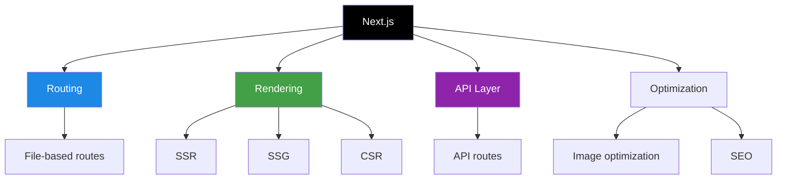
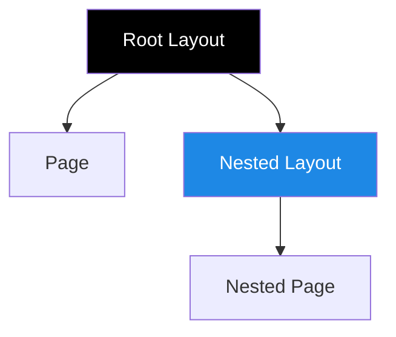

# Next.js — Beginner Guide

> Next.js is a React framework used to build fast web applications with features like file-based routing, server-side rendering, static generation, API routes, image optimization, and full-stack capabilities.

---

## 📚 Table of Contents

1. [What is Next.js?](#1-what-is-nextjs)
2. [Why Use Next.js?](#2-why-use-nextjs)
3. [Next.js vs React](#3-nextjs-vs-react)
4. [Project Structure](#4-project-structure)
5. [Pages Router vs App Router](#5-pages-router-vs-app-router)
6. [File-Based Routing](#6-file-based-routing)
7. [Nested Routes and Dynamic Routes](#7-nested-routes-and-dynamic-routes)
8. [Link and Navigation](#8-link-and-navigation)
9. [Layouts in Next.js](#9-layouts-in-nextjs)
10. [Rendering Types in Next.js](#10-rendering-types-in-nextjs)
11. [Server-Side Rendering (SSR)](#11-server-side-rendering-ssr)
12. [Static Site Generation (SSG)](#12-static-site-generation-ssg)
13. [Client-Side Rendering (CSR)](#13-client-side-rendering-csr)
14. [API Routes and Route Handlers](#14-api-routes-and-route-handlers)
15. [Image Optimization](#15-image-optimization)
16. [Metadata and SEO](#16-metadata-and-seo)
17. [Environment Variables](#17-environment-variables)
18. [Important Missing Basics](#18-important-missing-basics)

---



---

# 1. What is Next.js?

> Next.js is a React framework created by Vercel. It adds production-ready features on top of React, such as routing, SSR, SSG, API endpoints, layouts, and performance optimizations.

## Example

```jsx
export default function HomePage() {
  return <h1>Hello from Next.js</h1>;
}
```

---

# 2. Why Use Next.js?

## Main benefits

- File-based routing
- Better SEO with SSR/SSG
- Full-stack support
- Fast performance
- Built-in image optimization
- Code splitting by default
- Easy deployment on Vercel

---

# 3. Next.js vs React

| Feature | React | Next.js |
|---|---|---|
| Routing | External library needed | Built-in |
| SSR | Manual setup | Built-in |
| SSG | Manual setup | Built-in |
| API backend | Separate server needed | Built-in API routes |
| SEO | Harder with CSR only | Easier with SSR/SSG |
| Image optimization | Manual | Built-in `next/image` |

---

# 4. Project Structure

## App Router style

```text
app/
  layout.js
  page.js
  about/
    page.js
  blog/
    [slug]/
      page.js
public/
components/
lib/
next.config.js
package.json
```

## Meaning

- `app/page.js` → home page
- `app/about/page.js` → `/about`
- `app/blog/[slug]/page.js` → dynamic route
- `public/` → static assets

---

# 5. Pages Router vs App Router

| Router | Folder | Notes |
|---|---|---|
| Pages Router | `pages/` | Older approach |
| App Router | `app/` | New recommended approach |

## App Router advantages

- Nested layouts
- Server Components by default
- Loading and error UI support
- Better data fetching model

---

# 6. File-Based Routing

> In Next.js, folder and file names define URLs.

## Example

```text
app/
  page.js           -> /
  about/
    page.js         -> /about
  contact/
    page.js         -> /contact
```

```jsx
// app/about/page.js
export default function AboutPage() {
  return <h1>About Page</h1>;
}
```

---

# 7. Nested Routes and Dynamic Routes

## Nested route

```text
app/dashboard/settings/page.js -> /dashboard/settings
```

## Dynamic route

```text
app/blog/[slug]/page.js -> /blog/react-basics
```

```jsx
export default function BlogPost({ params }) {
  return <h1>Post: {params.slug}</h1>;
}
```

## Catch-all route

```text
app/docs/[...slug]/page.js
```

---

# 8. Link and Navigation

> Use `Link` for client-side navigation.

```jsx
import Link from 'next/link';

export default function Nav() {
  return (
    <nav>
      <Link href="/">Home</Link>
      <Link href="/about">About</Link>
    </nav>
  );
}
```

## Programmatic navigation

```jsx
'use client';

import { useRouter } from 'next/navigation';

export default function GoButton() {
  const router = useRouter();

  return <button onClick={() => router.push('/dashboard')}>Go</button>;
}
```

---

# 9. Layouts in Next.js

> Layouts let multiple pages share UI like header, sidebar, and footer.

```jsx
// app/layout.js
export default function RootLayout({ children }) {
  return (
    <html lang="en">
      <body>
        <header>Header</header>
        <main>{children}</main>
        <footer>Footer</footer>
      </body>
    </html>
  );
}
```



---

# 10. Rendering Types in Next.js

| Type | Meaning | Best For |
|---|---|---|
| SSR | HTML generated on each request | Personalized pages |
| SSG | HTML generated at build time | Blogs, docs |
| CSR | Data fetched in browser | Highly interactive UI |
| ISR | Static page regenerated later | Content updated occasionally |

---

# 11. Server-Side Rendering (SSR)

> SSR renders HTML on the server for each request.

## Pages Router example

```jsx
export async function getServerSideProps() {
  const res = await fetch('https://api.example.com/products');
  const products = await res.json();

  return { props: { products } };
}

export default function ProductsPage({ products }) {
  return <div>{products.length} products</div>;
}
```

## Why use SSR?

- Better SEO
- Fresh data on every request
- Personalized responses

---

# 12. Static Site Generation (SSG)

> SSG generates HTML at build time.

```jsx
export async function getStaticProps() {
  const res = await fetch('https://api.example.com/posts');
  const posts = await res.json();

  return { props: { posts } };
}

export default function BlogPage({ posts }) {
  return <div>{posts.length} posts</div>;
}
```

## Dynamic SSG

```jsx
export async function getStaticPaths() {
  return {
    paths: [{ params: { slug: 'hello-next' } }],
    fallback: false,
  };
}
```

---

# 13. Client-Side Rendering (CSR)

> CSR fetches data in the browser after page load.

```jsx
'use client';

import { useEffect, useState } from 'react';

export default function Dashboard() {
  const [data, setData] = useState([]);

  useEffect(() => {
    fetch('/api/items')
      .then(res => res.json())
      .then(setData);
  }, []);

  return <div>{data.length} items</div>;
}
```

---

# 14. API Routes and Route Handlers

## Pages Router API route

```jsx
// pages/api/hello.js
export default function handler(req, res) {
  res.status(200).json({ message: 'Hello API' });
}
```

## App Router route handler

```jsx
// app/api/users/route.js
export async function GET() {
  return Response.json([{ id: 1, name: 'Aman' }]);
}
```

---

# 15. Image Optimization

> Next.js provides the `Image` component for optimized image loading.

```jsx
import Image from 'next/image';

export default function Profile() {
  return (
    <Image
      src="/avatar.png"
      alt="Profile"
      width={200}
      height={200}
    />
  );
}
```

## Benefits

- Lazy loading
- Responsive sizing
- Modern formats
- Better performance

---

# 16. Metadata and SEO

## App Router metadata

```jsx
export const metadata = {
  title: 'Home Page',
  description: 'Learn Next.js basics',
};

export default function HomePage() {
  return <h1>Home</h1>;
}
```

## Why important?

- Better search engine visibility
- Better social sharing preview

---

# 17. Environment Variables

## Example

```env
DB_URL=postgres://secret
NEXT_PUBLIC_API_URL=https://api.example.com
```

## Rule

- Server-only: normal env vars
- Client-side accessible: must start with `NEXT_PUBLIC_`

```jsx
console.log(process.env.NEXT_PUBLIC_API_URL);
```

---

# 18. Important Missing Basics

## Loading UI

```jsx
// app/dashboard/loading.js
export default function Loading() {
  return <p>Loading...</p>;
}
```

## Error UI

```jsx
'use client';

export default function Error({ error, reset }) {
  return (
    <div>
      <p>{error.message}</p>
      <button onClick={() => reset()}>Retry</button>
    </div>
  );
}
```

## Not Found page

```jsx
// app/not-found.js
export default function NotFound() {
  return <h1>404 - Page Not Found</h1>;
}
```

## Static assets

Use `public/` folder:

```text
public/logo.png -> /logo.png
```

---

## Quick Revision Table

| Topic | Summary |
|---|---|
| Next.js | React framework with full-stack features |
| App Router | Modern routing system in `app/` |
| File-based routing | File names define URLs |
| SSR | Server renders on each request |
| SSG | Build-time rendering |
| CSR | Browser-side data fetching |
| API routes | Backend endpoints inside project |
| Layouts | Shared UI across pages |
| Metadata | Built-in SEO support |
| Image optimization | Built-in `next/image` |

---

*Notes based on practical Next.js interview concepts and common beginner questions.*