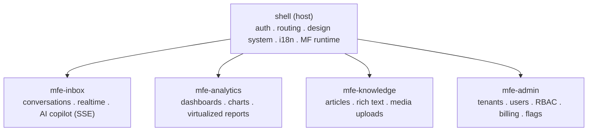

# Project Research

> Selecting one project that lets a senior developer exercise **every frontend concept from basic to advanced** on a **React + TypeScript + Module-Federation micro-frontend** stack. Chosen project: **NexusDesk** — an AI-native, multi-tenant customer support & operations platform.

## Table of Contents
1. [Selection criteria](#1-selection-criteria)
2. [Candidate comparison](#2-candidate-comparison)
3. [Final choice — NexusDesk](#3-final-choice--nexusdesk)
4. [Concept-coverage matrix](#4-concept-coverage-matrix-basic--advanced)
5. [Scope tiers](#5-scope-tiers)
6. [Vision statement](#6-vision-statement)

---

## 1. Selection criteria
A project worth building for mastery must **force** every important concept by its nature, and must **decompose into independent vertical slices** so Module Federation is justified (not bolted on).

| Requirement | Why it matters for MFE learning |
|---|---|
| Auth + RBAC/multi-tenant | Shared singleton auth across remotes |
| Real-time + streaming | WebSocket presence + **SSE AI streaming** |
| Complex forms + validation | State + UX depth |
| Large lists / tables | Virtualization / windowing + perf |
| Multi-step workflows | Routing, state machines, cross-MFE nav |
| File/media handling | Uploads, optimization |
| Dashboards + charts | Code splitting, lazy loading, data viz |
| Multi-language surface | i18n / l10n / RTL |
| AI assistant surface | Streaming events, generative UI, guardrails |
| Naturally 4+ domains | Justifies host + remotes decomposition |

## 2. Candidate comparison

| Project | Auth/RBAC | Real-time+SSE | Virtualization | Forms | Files | Charts | i18n | AI surface | MFE fit | Score |
|---|---|---|---|---|---|---|---|---|---|---|
| **NexusDesk** (support & ops) | ✅ | ✅ | ✅ | ✅ | ✅ | ✅ | ✅ | ✅ | ✅✅ | **10/10** |
| E-commerce storefront | ✅ | ⚠️ | ✅ | ✅ | ⚠️ | ⚠️ | ✅ | ⚠️ | ✅ | 7/10 |
| Project-management (Jira-lite) | ✅ | ✅ | ✅ | ✅ | ⚠️ | ⚠️ | ✅ | ⚠️ | ✅ | 8/10 |
| Social feed app | ✅ | ✅ | ✅ | ⚠️ | ✅ | ⚠️ | ⚠️ | ⚠️ | ⚠️ | 6/10 |

**Winner: NexusDesk** — the only candidate that maximizes every axis and decomposes cleanly into autonomous domains, each a strong Module-Federation remote owned by a "team."

## 3. Final choice — NexusDesk

**NexusDesk** is a multi-tenant SaaS where support agents handle customer conversations, an **AI copilot** drafts and summarizes replies in real time, supervisors watch live analytics, a knowledge base powers self-service, and admins manage tenants, users, roles, and billing.

**Micro-frontend decomposition (host + 4 remotes):**

Each remote maps to a "team-owned vertical slice" — the textbook reason to adopt Module Federation.

## 4. Concept-coverage matrix (basic → advanced)

| Tier | Concepts | Where exercised |
|---|---|---|
| **Basic** | components, props, hooks, controlled inputs, `fetch`, routing | every remote |
| **Intermediate** | state topology (server/client/URL/form), code splitting, lazy loading, error boundaries, Suspense, optimistic updates, i18n, a11y, forms + Zod | inbox, knowledge, admin |
| **Advanced** | **Module Federation**, shared singletons, cross-MFE event bus, **SSE AI streaming**, generative UI, virtualization, RBAC/ABAC, CSP, performance budgets + RUM, design-token pipeline, WebSocket presence, CI/CD, 90%+ tests | shell, inbox, analytics |

Nothing important is missing: the project touches architecture, rendering, state, performance, security, i18n, testing, and AI streaming.

## 5. Scope tiers

| Tier | Scope |
|---|---|
| **MVP** | Login (OIDC+PKCE), shell + inbox remote, conversation list (virtualized), message thread, SSE AI "suggest reply", basic analytics tile |
| **v1** | Analytics remote (dashboards/charts), knowledge remote (articles + uploads), admin remote (users/roles), i18n (2 locales), presence via WebSocket |
| **Advanced** | Generative UI in copilot, ABAC policies, feature flags, offline draft (CRDT-lite), 3rd locale + RTL, full CI perf/a11y gates, remote independent deploys |

## 6. Vision statement
> NexusDesk lets small support teams operate like large ones: an AI copilot that streams draft replies and live summaries, real-time analytics, and a self-service knowledge base — delivered as independently deployable micro-frontends so each domain team ships on its own cadence.

## Checklist
- [x] Project forces basic→advanced coverage
- [x] Decomposes into host + remotes (MFE justified)
- [x] Includes real-time + AI streaming + i18n + RBAC
- [x] Scope tiers defined (MVP/v1/advanced)

## Next deliverable
→ [02-Tech-Stack.md](02-Tech-Stack.md)

