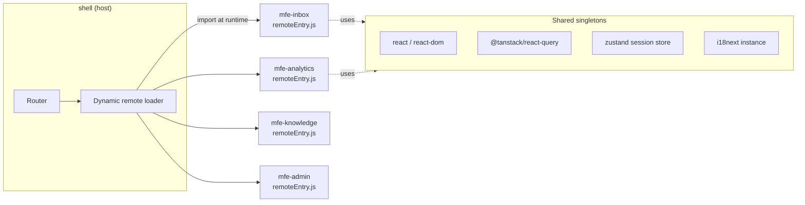

# Tech Stack

> Finalized, current, production-grade toolchain for **NexusDesk** — React + TypeScript, **Rspack Module Federation** micro-frontends in a pnpm + Turborepo monorepo. **No Next.js.**

## Table of Contents
1. [Toolchain decisions](#1-toolchain-decisions)
2. [Why Module Federation with Rspack](#2-why-module-federation-with-rspack)
3. [Dependency preview](#3-dependency-preview)
4. [Version policy](#4-version-policy)
5. [Platform & delivery context](#5-platform--delivery-context-frontend-adjacent)

---

## 1. Toolchain decisions

| Category | Choice | Why (one line) |
|---|---|---|
| Language | **TypeScript** (strict) | Type-safe end-to-end; no `any` |
| Build (prod) | **Rspack** + **Module Federation** | Rust-fast bundling with first-class MF |
| Dev server (remotes standalone) | **Rsbuild** / Vite | Fast HMR when developing a remote in isolation |
| Package manager | **pnpm** workspaces | Strict, fast, disk-efficient |
| Monorepo orchestrator | **Turborepo** | Task graph + remote cache |
| Routing | **React Router v7** (data APIs) | Loaders/actions, nested routes, framework-free |
| Server state | **TanStack Query v5** | Caching, invalidation, optimistic updates |
| Client state | **Zustand** | Tiny global store; shared singleton across MFEs |
| Cross-MFE comms | **Custom event bus** (typed) | Decouple remotes without hard imports |
| Styling | **Tailwind CSS v4** + **CVA** | Token-driven utility styling, variants |
| Primitives | **Radix UI** / **React Aria** | Accessible headless components |
| Forms + validation | **React Hook Form** + **Zod** | Perf + schema validation at boundaries |
| Data viz | **visx** / **Recharts** (lazy) | Composable charts, code-split |
| Virtualization | **TanStack Virtual** | 100k-row lists at 60fps |
| Real-time (AI) | **SSE** via `fetch` streaming | Token-by-token AI, proxy-friendly |
| Real-time (presence/msg) | **WebSocket** (native / `partysocket`) | Bidirectional live updates |
| i18n | **i18next** + **react-i18next** | ICU, namespaces, lazy locale loading |
| Auth | **OIDC/OAuth2 + PKCE** (`oidc-client-ts`) via BFF | Standards-based SSO, tokens in httpOnly cookies |
| Testing (unit/integration) | **Vitest** + **Testing Library** | Fast, ESM-native |
| Network mocking | **MSW** | Deterministic integration tests |
| E2E | **Playwright** | Cross-browser critical journeys |
| A11y testing | **@axe-core/playwright** | Automated WCAG checks |
| Lint/format | **ESLint (flat)** + **typescript-eslint** + **Prettier** | Consistent, CI-enforced |
| Boundaries | **eslint-plugin-boundaries** | Enforce slice/remote isolation |
| CI/CD | **GitHub Actions** | Matrix build + gates |
| Perf gate | **Lighthouse CI** + **size-limit** | Fail on regressions |
| Design tokens pipeline | **Style Dictionary** | Figma variables → CSS vars / Tailwind theme in `packages/tokens` |
| Component workshop | **Storybook** + **Chromatic** | Isolated dev + visual-regression tests |
| Design-to-Code (opt) | **Figma Dev Mode MCP** | Agent reads frames/tokens to draft components |
| Feature flags | **OpenFeature** SDK | Vendor-neutral gating for plan tiers (admin) |
| Tracing | **OpenTelemetry** (web) | Browser → BFF distributed traces |
| Observability | **Sentry** + **web-vitals** | Errors + RUM CWV |

## 2. Why Module Federation with Rspack



- **Runtime composition** → each remote deploys independently (own `remoteEntry.js`).
- **Shared singletons** (`react`, `react-dom`, `react-query`, `i18next`, session store) marked `singleton: true, requiredVersion` to avoid duplicate React/context bugs.
- **Rspack** gives Webpack-compatible Module Federation at Rust speed.

## 3. Dependency preview

```jsonc
// package.json (shared root — versions are ranges, resolve latest at install)
{
  "dependencies": {
    "react": "^19",
    "react-dom": "^19",
    "react-router": "^7",
    "@tanstack/react-query": "^5",
    "@tanstack/react-virtual": "^3",
    "zustand": "^5",
    "react-hook-form": "^7",
    "zod": "^3",
    "i18next": "^25",
    "react-i18next": "^15",
    "oidc-client-ts": "^3",
    "@radix-ui/react-dialog": "^1",
    "class-variance-authority": "^0.7",
    "@openfeature/web-sdk": "^1"
  },
  "devDependencies": {
    "typescript": "^5.6",
    "@rspack/core": "^1",
    "@module-federation/enhanced": "^0",
    "@rsbuild/core": "^1",
    "tailwindcss": "^4",
    "vitest": "^2",
    "@testing-library/react": "^16",
    "@playwright/test": "^1",
    "msw": "^2",
    "@axe-core/playwright": "^4",
    "eslint": "^9",
    "typescript-eslint": "^8",
    "eslint-plugin-boundaries": "^5",
    "prettier": "^3",
    "@size-limit/preset-app": "^11",
    "@storybook/react": "^8",
    "chromatic": "^11",
    "style-dictionary": "^4",
    "turbo": "^2"
  }
}
```

## 4. Version policy
- Use **ranges (`^`)**, not exact pins, at the workspace root; commit `pnpm-lock.yaml`.
- Renovate/Dependabot for automated updates.
- Shared MF deps pinned to a **single major** across all remotes to keep singletons compatible.

## 5. Platform & delivery context (frontend-adjacent)
The frontend depends on — and a senior owns the contract with — this platform layer (see `03-Architecture.md`):

| Concern | Choice | Note |
|---|---|---|
| CDN | Cloudflare / CloudFront | Serve each remote's `remoteEntry.js` + hashed chunks as `immutable`; keep the **remote manifest** revalidated |
| Containers | Docker (multi-stage) | BFF image; static apps served via `nginx:alpine` or straight from CDN |
| BFF boundary | server-owned (e.g., Node + Fastify) | Frontend consumes only the typed contract in `packages/sdk`; auth + payload shaping live here |
| Gateway / LB | API gateway + L7 load balancer | Fronts the BFF; **least-connections** for WebSocket/SSE |
| i18n TMS | Locize / Crowdin | Translation workflow feeding `packages/i18n` |

> These are frontend-adjacent: the app never calls core services directly, only the BFF. Rendering stays **CSR** (no SSR/Next.js).

## Checklist
- [x] No Next.js / nothing on exclusion list
- [x] Rspack Module Federation with shared singletons
- [x] Server vs client state tools chosen
- [x] Testing + perf + observability tooling set
- [x] Design-system pipeline (Style Dictionary) + Storybook/Chromatic
- [x] Feature flags + platform/delivery (CDN, Docker, BFF, gateway/LB) covered

## Next deliverable
→ [03-Architecture.md](03-Architecture.md)

