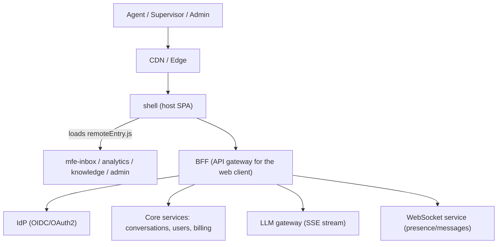
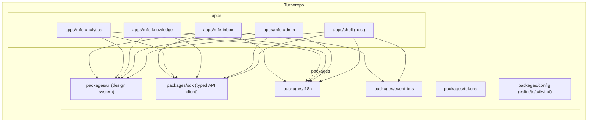
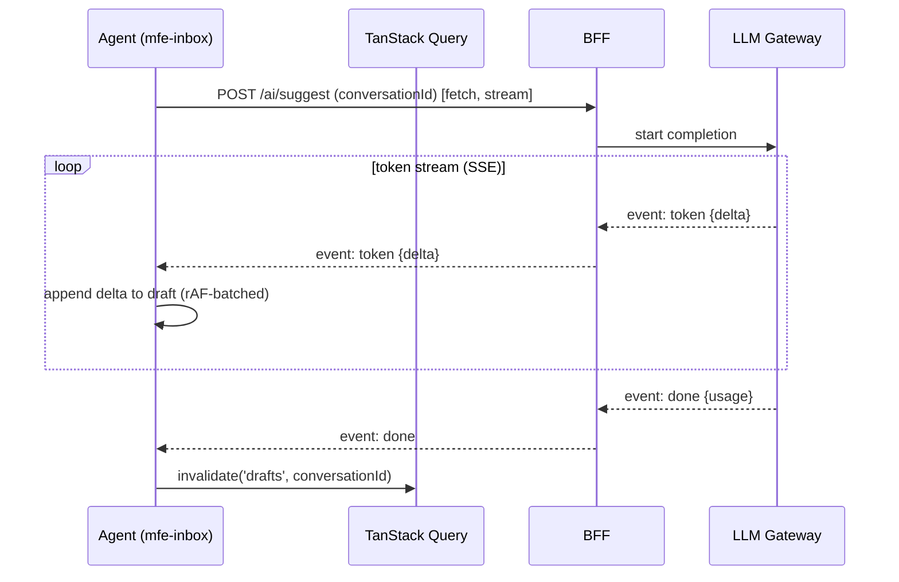

# Architecture

> System, module, and data-flow design for **NexusDesk** — an Rspack **Module Federation** micro-frontend (host + 4 remotes) in a Turborepo monorepo, fronted by a **BFF** and streaming AI over **SSE**.

## Table of Contents
1. [System context](#1-system-context)
2. [Module / domain boundaries](#2-module--domain-boundaries)
3. [Rendering strategy](#3-rendering-strategy-per-route)
4. [State topology](#4-state-topology)
5. [Key data flow (AI suggest-reply)](#5-key-data-flow--ai-suggest-reply-sse)
6. [Real-time / streaming path](#6-real-time--streaming-path)
7. [Cross-cutting concerns](#7-cross-cutting-concerns)
8. [API / BFF contract](#8-api--bff-contract)
9. [Deployment & observability](#9-deployment--observability)
10. [Folder structure](#10-folder-structure)
11. [Scalability path](#11-scalability-path)

---

## 1. System context



## 2. Module / domain boundaries



**Boundary rules** (enforced by `eslint-plugin-boundaries`): remotes never import each other; they communicate only via the shell router and the typed `event-bus`. Shared code lives in `packages/*`.

## 3. Rendering strategy per route

| Route | Strategy | Why |
|---|---|---|
| `/login`, `/callback` | CSR | Auth handshake, no SEO |
| `/inbox/*` | CSR + streaming data | App-like, real-time |
| `/analytics/*` | CSR + lazy charts | Heavy viz, code-split |
| `/kb/*` (public articles) | Prerender/SSG (optional edge) | SEO for self-service |
| `/admin/*` | CSR | Gated, no SEO |

NexusDesk is an authenticated app → **CSR-first SPA remotes**; only public KB articles are candidates for edge prerender.

## 4. State topology

| Kind | Example | Tool | Scope |
|---|---|---|---|
| Server | conversations, users | TanStack Query | per remote, shared cache client |
| Client global | session, tenant, theme, locale | Zustand (shared singleton) | shell-owned |
| URL | filters, pagination, selected convo | React Router search params | per remote |
| Form | reply draft, article editor | React Hook Form | local |
| Cross-MFE events | "conversation.assigned" | typed event bus | app-wide |

## 5. Key data flow — AI suggest-reply (SSE)



## 6. Real-time / streaming path
- **AI copilot** → **SSE** (`fetch` + `ReadableStream`), cancellable via `AbortController`.
- **Presence & new messages** → **WebSocket**, one shared connection owned by the shell, fanned out to remotes via the event bus.
- Backpressure: UI updates batched with `requestAnimationFrame`; query cache updated on `done`.

## 7. Cross-cutting concerns
- **Auth boundary:** shell owns the session; remotes read it from the shared store; API auth via httpOnly cookie handled by BFF.
- **Error boundaries:** one per remote mount point so a failing remote never crashes the shell (fallback UI).
- **Logging/telemetry:** Sentry (errors) + **OpenTelemetry** traces from browser → BFF, scoped by remote + release.
- **Feature flags:** **OpenFeature** provider; flags injected by the shell and consumed by remotes via context (gates plan-tier features).

## 8. API / BFF contract
The frontend depends on a **BFF**, not core services directly. Representative typed contract:

```ts
// packages/sdk/contracts.ts
export interface Conversation { id: string; subject: string; status: 'open'|'pending'|'closed'; assigneeId?: string; updatedAt: string; }
export interface Message { id: string; convId: string; author: 'customer'|'agent'|'ai'; body: string; createdAt: string; }
export interface Paginated<T> { items: T[]; nextCursor?: string; }
// GET /api/conversations?cursor= -> Paginated<Conversation>
// GET /api/conversations/:id/messages?cursor= -> Paginated<Message>
// POST /api/ai/suggest (SSE) -> event: token|tool_call|done
```
All responses validated with Zod at the SDK boundary before entering the app.

## 9. Deployment & observability
- Each app builds to a static bundle + `remoteEntry.js`, deployed independently to CDN/edge (versioned URLs; shell resolves remotes via a manifest).
- **Observability:** Sentry (errors + releases per remote), `web-vitals` → RUM endpoint, structured logs at BFF.

## 10. Folder structure

```
nexusdesk/
  apps/
    shell/        # host: auth, router, layout, MF runtime, providers
    mfe-inbox/
    mfe-analytics/
    mfe-knowledge/
    mfe-admin/
  packages/
    ui/           # design-system components
    tokens/       # design tokens -> CSS vars / tailwind preset
    sdk/          # typed API client + Zod contracts
    i18n/         # shared i18next config + locale loader
    event-bus/    # typed cross-MFE events
    config/       # eslint, ts, tailwind, vitest presets
  turbo.json  pnpm-workspace.yaml  tsconfig.base.json
```

Inside each app/remote (feature-sliced):
```
src/
  app/            # composition root, providers, router
  features/<name>/{ui,model,api,index.ts}
  entities/  shared/
```

## 11. Scalability path
- Start with all remotes in one monorepo; split any remote into its own repo when a team owns it — the `remoteEntry.js` contract stays stable.
- Introduce module-federation runtime plugins for versioned remote resolution and canary releases.

## Checklist
- [x] Context + module + sequence diagrams
- [x] Rendering strategy per route
- [x] State topology mapped to tools
- [x] BFF contract + deployment/observability
- [x] Concrete folder tree + scalability path

## Next deliverable
→ [04-Product-Spec.md](04-Product-Spec.md)

