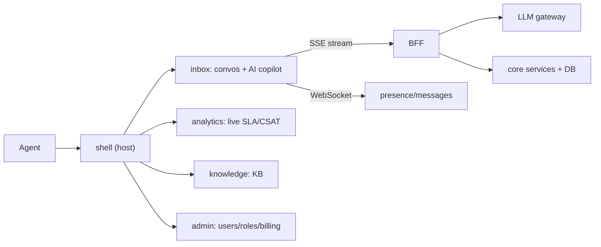
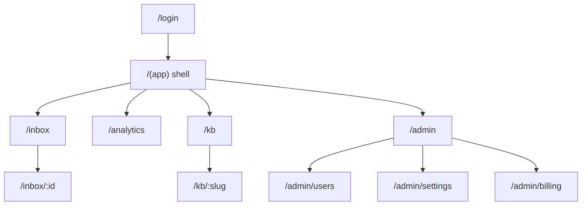
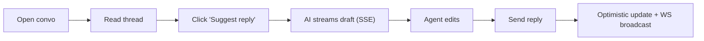
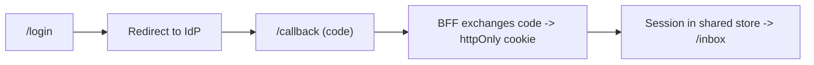
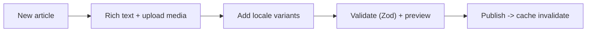

# Product Spec

> Features, pages, roles, user flows, and requirements for **NexusDesk**. Terminology here is the source of truth for all later deliverables.

## 0. Project overview — what is NexusDesk?

**In one sentence:** NexusDesk is an **AI-native, multi-tenant customer-support & operations platform** — a help desk where support agents answer customer conversations with an AI copilot that **streams** draft replies and summaries in real time.

**Who it's for:** support teams from a 3-person startup to a 500-seat BPO (beachhead: 25–150-agent SaaS support teams).

**What a user actually does (end-to-end):**
1. An **agent** logs in (OIDC + PKCE) and lands in the **Inbox**.
2. They pick a customer **conversation** from a virtualized list (filters live in the URL).
3. They open the thread and click **“Suggest reply”** — the **AI copilot streams a draft token-by-token** (over SSE) into the composer; they can stop, edit, or accept it.
4. They send the reply — it applies **optimistically** and broadcasts to teammates over WebSocket (presence/typing).
5. A **supervisor** watches live **Analytics** (SLA, CSAT, volume) and gets alerted *before* an SLA breaches.
6. Customers self-serve through a multi-language **Knowledge Base**; **admins/owners** manage users, roles, feature flags, and billing.

**How it's built (in brief):** a **micro-frontend** app — a `shell` host composes four independently deployable remotes (`inbox`, `analytics`, `knowledge`, `admin`) via **Rspack Module Federation**; a **BFF** shapes data and owns auth; the AI copilot streams over **SSE**. Full technical detail is in [03-Architecture.md](03-Architecture.md).

> **Why this project?** It naturally exercises every senior concept — auth/RBAC, real-time + AI streaming, virtualization, forms, uploads, dashboards, i18n, and independently deployable micro-frontends. See [01-Project-Research.md](01-Project-Research.md).

## Table of Contents
- [0. Project overview — what is NexusDesk?](#0-project-overview--what-is-nexusdesk)

**Part A — Product Owner Brief**
- [A. Vision & mission](#a-vision--mission)
- [B. Problem statement](#b-problem-statement)
- [C. Target market & segments](#c-target-market--segments)
- [D. Value proposition](#d-value-proposition)
- [E. Goals & success metrics (OKRs / KPIs)](#e-goals--success-metrics-okrs--kpis)
- [F. Detailed personas](#f-detailed-personas)
- [G. Business rules & policies](#g-business-rules--policies)
- [H. Prioritization (MoSCoW)](#h-prioritization-moscow)
- [I. Release roadmap & outcomes](#i-release-roadmap--outcomes)
- [J. Assumptions, dependencies, risks](#j-assumptions-dependencies-risks)
- [K. Out of scope](#k-out-of-scope)
- [L. Pricing & packaging](#l-pricing--packaging)
- [M. Glossary](#m-glossary)

**Part B — Functional Spec**
1. [Personas & roles](#1-personas--roles)
2. [Feature list](#2-feature-list-by-domain)
3. [Sitemap & page inventory](#3-sitemap--page-inventory)
4. [Top user flows](#4-top-user-flows)
5. [Functional requirements](#5-functional-requirements)
6. [Non-functional requirements](#6-non-functional-requirements)
7. [Acceptance-criteria style](#7-acceptance-criteria-style)
8. [Screen states](#8-screen-states)

---

# Part A — Product Owner Brief

## A. Vision & mission
**Vision.** Every support team — no matter its size — resolves customer issues with the speed and consistency of a world-class operation.

**Mission.** Give agents an AI copilot that drafts, summarizes, and surfaces knowledge in real time, wrapped in a fast, accessible, multi-tenant workspace that scales from a 3-person startup to a 500-seat BPO.

**Product one-liner.** *"The AI-native help desk that answers with your team, not for them."*

## B. Problem statement
Support orgs struggle with three chronic problems:
1. **Slow first response** — agents retype the same answers; SLAs slip at peak volume.
2. **Inconsistent quality** — answers vary by agent tenure; knowledge lives in people's heads.
3. **No real-time visibility** — supervisors learn about SLA breaches after they happen.

Existing tools bolt AI on as an afterthought and ship monolithic UIs that domain teams can't evolve independently. NexusDesk is **AI-native** and **micro-frontend-native** from day one.

## C. Target market & segments

| Segment | Size | Primary pain | Why NexusDesk |
|---|---|---|---|
| **Startup / SMB support** (3–25 agents) | Beachhead | Too few agents for the volume | AI copilot multiplies each agent |
| **Scale-up SaaS** (25–150 agents) | Growth | Quality drifts as they hire fast | KB + AI enforce consistency |
| **BPO / outsourcers** (150–500+ agents) | Expansion | Multi-tenant, multi-language, SLA-bound | Tenancy, i18n (incl. RTL), analytics |

**Beachhead:** scale-up B2B SaaS support teams (25–150 agents) — enough volume to feel the pain, modern enough to adopt AI.

## D. Value proposition
- **For agents:** answer 2–3× faster with streaming AI drafts they stay in control of.
- **For supervisors:** live SLA/CSAT dashboards catch problems before they breach.
- **For admins/owners:** one multi-tenant platform, RBAC, and per-domain teams that ship independently.
- **Differentiator:** AI streaming + generative UI + independently deployable micro-frontends — not a monolith with a chatbot stapled on.

## E. Goals & success metrics (OKRs / KPIs)

**North-star metric:** *median time-to-first-response (TTFR)*.

| Objective | Key result (target) |
|---|---|
| O1 — Make agents faster | Median TTFR − 40%; ≥ 60% of replies start from an AI draft |
| O2 — Raise answer quality | CSAT +8 pts; reopen rate − 25% |
| O3 — Give supervisors control | 100% of SLA breaches alerted < 60s; 0 "surprise" breaches |
| O4 — Product health | LCP ≤ 2.5s p75; ≥ 90% test coverage; < 0.1% error rate |
| O5 — Adoption | ≥ 70% weekly-active agents use the copilot |

**Guardrail metrics:** AI edit-rate (agents shouldn't send unedited AI blindly), hallucination/flag rate, cost per resolved ticket.

## F. Detailed personas

**Aisha — Support Agent (primary)**
- *Goals:* clear the queue, hit SLA, sound on-brand. *Pains:* repetitive typing, hunting for KB articles, context-switching.
- *Jobs-to-be-done:* "When a ticket arrives, help me draft an accurate reply fast so I can move on."
- *Success:* AI draft appears in < 1s, needs only light edits.

**Diego — Supervisor**
- *Goals:* protect SLA/CSAT, coach agents, staff the peaks. *Pains:* no live view, reacts too late.
- *JTBD:* "Warn me before an SLA breaches and show me who needs help."

**Priya — Tenant Admin**
- *Goals:* onboard agents, manage roles, keep KB current. *Pains:* clunky user management, stale articles.
- *JTBD:* "Let me manage people, permissions, and content without engineering."

**Omar — Owner / Billing**
- *Goals:* control spend, prove ROI. *Pains:* opaque AI costs, seat sprawl.
- *JTBD:* "Show me cost per resolution and let me manage the plan."

**Lena — End customer (indirect)**
- *Goals:* a fast, correct answer in her language. *Pains:* slow, generic, English-only replies.

## G. Business rules & policies
1. **AI never auto-sends** — every AI draft requires explicit agent confirmation (reversibility).
2. **Assignment:** an agent may reply only to conversations assigned to them or their team (ABAC).
3. **SLA:** first-response SLA is per-plan; a breach-risk alert fires at 80% of the SLA window.
4. **Tenancy isolation:** data is strictly scoped per tenant; no cross-tenant read, ever.
5. **KB publishing:** an article is publishable only when the default-locale variant passes validation; other locales fall back to default.
6. **PII:** customer PII is redacted from AI prompts and never written to AI logs.
7. **Audit:** role changes, reassignments, and AI tool calls are audit-logged.

## H. Prioritization (MoSCoW)

| Priority | Items |
|---|---|
| **Must** | Auth (OIDC+PKCE), inbox list + thread + composer, streaming AI suggest-reply, RBAC, basic KPI tile |
| **Should** | Analytics charts, KB (articles + upload), user/role admin, presence, i18n (2 locales) |
| **Could** | Generative UI cards, feature flags, 3rd locale + RTL, report export, offline draft |
| **Won't (now)** | Native mobile apps, voice/telephony, marketplace integrations, custom LLM fine-tuning |

## I. Release roadmap & outcomes

| Release | Outcome (what customers can do) | Ships |
|---|---|---|
| **MVP (S0–S2)** | Log in, work the inbox, answer with streaming AI | shell + inbox + copilot |
| **v1 (S3–S5)** | See live analytics, self-serve via KB, manage users | analytics + knowledge + admin remotes |
| **Advanced (S6)** | Generative UI, 3 locales incl. RTL, flags, independent remote deploys | hardening + platform |

Mapped to sprints in [06-Delivery-Plan.md](06-Delivery-Plan.md).

## J. Assumptions, dependencies, risks

| Type | Item | Mitigation |
|---|---|---|
| Assumption | A BFF + LLM gateway exist server-side | Contract defined in [03-Architecture.md](03-Architecture.md) |
| Dependency | IdP (OIDC), LLM provider, WebSocket service | Abstract behind SDK; provider-agnostic |
| Risk | AI hallucination / wrong answers | Human-in-loop, moderation, edit-rate metric |
| Risk | AI cost per ticket too high | Token budget, caching, cost KPI |
| Risk | MFE complexity slows delivery | Start monorepo, split only when a team owns a remote |
| Risk | Latency hurts streaming UX | SSE + rAF batching + perf budget gate |

## K. Out of scope
Telephony/voice, native mobile, social-channel ingestion, billing invoicing engine (integrate, don't build), and custom model training — all explicitly deferred to keep the learning project focused on frontend depth.

## L. Pricing & packaging
Tenant plans gate features and SLAs (drives RBAC + feature-flag work):

| Plan | Seats | AI credits | SLA | Locales | Notable features |
|---|---|---|---|---|---|
| **Starter** | up to 5 | limited | none | 1 | inbox + copilot |
| **Growth** | up to 50 | standard | 8h first-response | 2 | + analytics + KB |
| **Scale** | 50+ | high + budgets | 1h first-response | 3+ incl. RTL | + admin, flags, export, SSO |

## M. Glossary
**Tenant** — an isolated customer org. **Conversation** — a customer thread. **Copilot** — the AI assist surface. **Draft** — AI-suggested reply text (never sent automatically). **Remote** — an independently deployed micro-frontend. **Shell** — the host app. **TTFR** — time to first response. **SLA breach-risk** — crossing 80% of the SLA window.

---

# Part B — Functional Spec

## 1. Personas & roles

| Role | Description | Key permissions |
|---|---|---|
| **Guest** | Unauthenticated | View public KB, login |
| **Agent** | Handles conversations | Read/reply assigned convos, use AI copilot |
| **Supervisor** | Oversees a team | All agent + reassign, view analytics |
| **Admin** | Tenant admin | Manage users/roles, KB, settings |
| **Owner** | Billing owner | All admin + billing, tenant lifecycle |

## 2. Feature list (by domain)

| Domain (remote) | Feature | Tier |
|---|---|---|
| Inbox | Conversation list (virtualized, filters) | MVP |
| Inbox | Message thread + reply composer | MVP |
| Inbox | **AI copilot: streaming suggest-reply** | MVP |
| Inbox | AI summarize thread, sentiment tag | v1 |
| Inbox | Presence & typing indicators (WS) | v1 |
| Analytics | KPI tiles (open/closed, CSAT, SLA) | MVP/v1 |
| Analytics | Charts (volume, response time) | v1 |
| Analytics | Virtualized report export | Advanced |
| Knowledge | Article browse/search | v1 |
| Knowledge | Rich-text editor + media upload | v1 |
| Knowledge | Multi-locale articles | v1 |
| Admin | Users & roles (RBAC) | v1 |
| Admin | Feature flags, tenant settings | Advanced |
| Admin | Billing & plan | Advanced |
| Shell | Auth (OIDC+PKCE), global nav, theme, locale switch, command palette | MVP |

## 3. Sitemap & page inventory

| Route | Purpose | Key components | Data |
|---|---|---|---|
| `/login` `/callback` | Auth | AuthCard | IdP |
| `/inbox` | Triage | ConvoList (virtual), Filters | conversations |
| `/inbox/:id` | Handle convo | Thread, Composer, CopilotPanel | messages, AI |
| `/analytics` | Metrics | KpiTiles, Charts | reports |
| `/kb` `/kb/:slug` | Self-service | ArticleList, ArticleView | articles |
| `/admin/users` | RBAC | UserTable, RoleForm | users |
| `/admin/settings` | Config | FlagsForm | settings |
| `/admin/billing` | Billing | PlanCard | billing |

## 4. Top user flows

**Flow 1 — Answer with AI copilot**

**Flow 2 — Login (OIDC + PKCE)**

**Flow 3 — Publish KB article (multi-locale)**

## 5. Functional requirements
1. FR-1 Users authenticate via OIDC+PKCE; sessions persist across remotes.
2. FR-2 Agents see only conversations they're permitted to (RBAC).
3. FR-3 Conversation list virtualizes and supports cursor pagination + filters in the URL.
4. FR-4 AI suggest-reply streams tokens and is cancellable.
5. FR-5 Replies apply optimistically and reconcile on server ack.
6. FR-6 KB articles support rich text, media upload, and per-locale variants.
7. FR-7 Admins manage users and roles; changes take effect without full reload.
8. FR-8 All user-facing strings are translatable; locale is switchable at runtime.

## 6. Non-functional requirements
| Area | Requirement |
|---|---|
| Performance | LCP ≤ 2.5s, INP ≤ 200ms, CLS ≤ 0.1 (p75) |
| A11y | WCAG 2.2 AA |
| Security | OWASP Top 10 mitigated; CSP enforced |
| i18n | ≥ 3 locales incl. 1 RTL |
| Reliability | A failed remote degrades gracefully |
| Testability | ≥ 90% coverage; critical journeys in E2E |

## 7. Acceptance-criteria style
All stories use **Given/When/Then**. Example (FR-4):
> **Given** an open conversation, **When** the agent clicks “Suggest reply”, **Then** a draft streams token-by-token into the composer and can be cancelled mid-stream, leaving any partial text editable.

## 8. Screen states
Every data screen defines: **default / loading (skeleton) / empty / error (retry) / success**. The AI copilot additionally defines: **idle / streaming / cancelled / failed**.

## Checklist
- [x] Roles + permissions
- [x] Feature list tagged by tier
- [x] Sitemap + page inventory
- [x] ≥3 user-flow diagrams
- [x] FR + NFR + acceptance style + states

## Next deliverable
→ [05-UIUX-Design.md](05-UIUX-Design.md)

