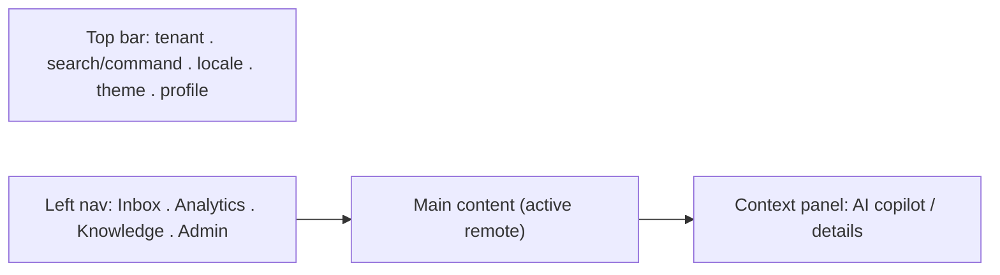

# UI/UX Design

> Design system for **NexusDesk**: information architecture, color, typography, spacing, tokens, components, motion, and accessibility. Tokens here feed the Tailwind preset in `packages/tokens`.

## Table of Contents
1. [Information architecture](#1-information-architecture)
2. [Brand & mood](#2-brand--mood)
3. [Color system](#3-color-system)
4. [Typography](#4-typography)
5. [Spacing & layout](#5-spacing--layout)
6. [Design tokens (CSS)](#6-design-tokens-css)
7. [Component taxonomy](#7-component-taxonomy)
8. [Motion](#8-motion)
9. [Accessibility (WCAG 2.2 AA)](#9-accessibility-wcag-22-aa)

---

## 1. Information architecture


Three-pane workspace: persistent left nav, central content, contextual right panel (copilot/details).

## 2. Brand & mood
Calm, focused, trustworthy — a professional operations tool. Neutral canvas, one confident indigo accent, generous whitespace, dense-but-legible data tables. Dark mode is first-class (agents work long shifts).

## 3. Color system

| Role | Light | Dark |
|---|---|---|
| bg / surface | `#ffffff` / `#f8fafc` | `#0b1020` / `#141a2e` |
| fg / muted | `#0f172a` / `#64748b` | `#e2e8f0` / `#94a3b8` |
| primary 500 | `#4f46e5` | `#6366f1` |
| success / warning / error / info | `#16a34a` / `#d97706` / `#dc2626` / `#0284c7` | lightened equivalents |

Scales 50–900 generated for primary + neutral. **Contrast:** body text ≥ 4.5:1, UI/large ≥ 3:1. Never signal by color alone (pair with icon/text).

## 4. Typography

| Token | Value |
|---|---|
| Body font | `"Inter", system-ui, sans-serif` |
| Mono | `"JetBrains Mono", ui-monospace` |
| Scale (rem) | 0.75 / 0.875 / 1 / 1.125 / 1.25 / 1.5 / 1.875 / 2.25 |
| Line-height | 1.2 headings, 1.5 body |
| Weights | 400 / 500 / 600 / 700 |

## 5. Spacing & layout
- Base unit **4px**; scale 4/8/12/16/24/32/48/64.
- Breakpoints: 640 / 768 / 1024 / 1280 / 1536.
- Radius 4/8/16; shadows sm/md/lg; z-index scale for nav/modal/toast/popover.

## 6. Design tokens (CSS)

```css
:root {
  --space-1:4px; --space-2:8px; --space-3:12px; --space-4:16px; --space-6:24px; --space-8:32px;
  --radius-sm:4px; --radius-md:8px; --radius-lg:16px;
  --shadow-sm:0 1px 2px rgb(0 0 0 / .06); --shadow-md:0 4px 12px rgb(0 0 0 / .10);
  --font-body:"Inter",system-ui,sans-serif; --font-mono:"JetBrains Mono",ui-monospace;
  --color-bg:#ffffff; --color-surface:#f8fafc; --color-fg:#0f172a; --color-muted:#64748b;
  --color-primary-500:#4f46e5; --color-primary-600:#4338ca;
  --color-success:#16a34a; --color-warning:#d97706; --color-error:#dc2626; --color-info:#0284c7;
  --z-nav:100; --z-popover:200; --z-modal:300; --z-toast:400;
}
[data-theme="dark"] {
  --color-bg:#0b1020; --color-surface:#141a2e; --color-fg:#e2e8f0; --color-muted:#94a3b8;
  --color-primary-500:#6366f1; --color-primary-600:#4f46e5;
}
```
Consumed by Tailwind v4 `@theme` in `packages/tokens`; components use tokens only — no hard-coded values.

## 7. Component taxonomy

| Level | Components |
|---|---|
| Atoms | Button, IconButton, Input, Textarea, Badge, Avatar, Spinner, Text |
| Molecules | Field (label+input+error), SearchBox, MenuItem, Toast, Tooltip, Tag |
| Organisms | ConvoList (virtual), Thread, Composer, CopilotPanel, DataTable, ChartCard, Modal, CommandPalette, NavRail |

Each documents states: **default / hover / focus-visible / active / disabled / loading / error / empty**. Interactive components are keyboard-operable and built on Radix/React Aria.

## 8. Motion
- Durations 100/200/300ms; easing `cubic-bezier(0.4,0,0.2,1)`.
- Streaming text uses a subtle caret; skeletons for loading.
- All motion gated by `@media (prefers-reduced-motion: reduce)`.

## 9. Accessibility (WCAG 2.2 AA)
- [ ] Semantic landmarks (`nav`, `main`, `aside`), one `h1` per view.
- [ ] Visible focus, logical tab order, focus trap in modals/command palette.
- [ ] Labels + `aria-describedby` errors on every field.
- [ ] Live region (`aria-live="polite"`) announces streaming AI status.
- [ ] Target size ≥ 24px; color not sole signal.
- [ ] `prefers-reduced-motion` + `prefers-contrast` honored.
- [ ] RTL via logical properties (`margin-inline`).

## 10. Design-to-Code & tokens pipeline
- **Source of truth:** Figma variables → **Style Dictionary** → `packages/tokens` (CSS vars + Tailwind v4 preset). The token block in §6 is the generated output, not hand-authored.
- **Component workshop:** **Storybook** documents every component and state; **Chromatic** runs visual-regression on each PR.
- **Design-to-Code (optional):** the Figma Dev Mode MCP server lets an agent draft a component from a frame — always refactored into design-system primitives before merge.
- **Loop:** Figma → tokens/MCP → PR → Chromatic diff → human review.

## Checklist
- [x] IA + color + type + spacing
- [x] Copy-pasteable token block
- [x] Component taxonomy with states
- [x] Motion + WCAG 2.2 AA checklist
- [x] Design-to-Code pipeline (Style Dictionary + Storybook/Chromatic)

## Next deliverable
→ [06-Delivery-Plan.md](06-Delivery-Plan.md)

