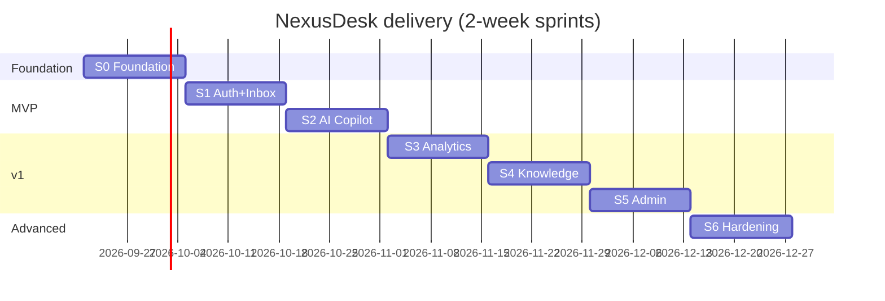
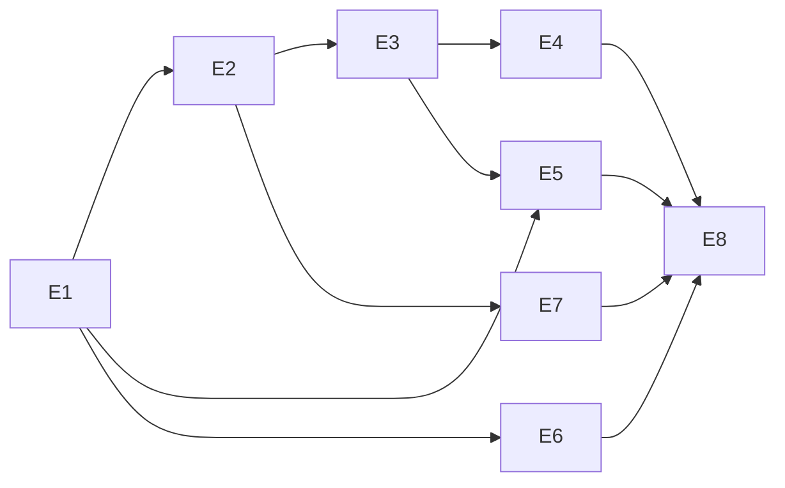

# Delivery Plan

> Agile breakdown for a solo senior dev at **5 focused hours/day** (~50 hrs / 2-week sprint). Epic → Feature → Story → Task, every task ≤ 5h, with a worked LLD. Test tasks are bundled so coverage never lags.

## Table of Contents
1. [Release plan](#1-release-plan)
2. [Epics](#2-epics)
3. [Worked breakdown (Epic→Feature→Story→Task→LLD)](#3-worked-breakdown)
4. [Dependency & sequencing](#4-dependency--sequencing)
5. [DoR / DoD](#5-definition-of-ready--done)

---

## 1. Release plan

| Sprint | Theme | Outcome |
|---|---|---|
| S0 | Foundation | Monorepo, Rspack MF host+1 remote, CI, tokens, design system skeleton |
| S1 | Auth + Inbox MVP | OIDC+PKCE, shell session, virtualized convo list, thread |
| S2 | AI Copilot (SSE) | Streaming suggest-reply, cancel/retry, optimistic send |
| S3 | Analytics remote | KPI tiles, lazy charts, virtualized report |
| S4 | Knowledge remote | Articles, rich text, media upload, i18n content |
| S5 | Admin remote | Users/roles (RBAC), settings, flags |
| S6 | Hardening | i18n (3 locales + RTL), perf budget, a11y, 90% coverage, independent deploys |



## 2. Epics

| Epic | Outcome |
|---|---|
| E1 Platform Foundation | Monorepo + MF runtime + CI + design system |
| E2 Identity & Access | OIDC auth, session, RBAC |
| E3 Conversations | Inbox list + thread + composer |
| E4 AI Copilot | SSE streaming assist + guardrails |
| E5 Analytics | Dashboards + charts + reports |
| E6 Knowledge Base | Articles + media + i18n |
| E7 Administration | Users, roles, settings, billing |
| E8 Quality & Hardening | Perf, a11y, i18n, coverage, deploys |

## 3. Worked breakdown

### Epic **E4 — AI Copilot** › Feature **F4.1 — Streaming suggest-reply**

#### Story E4.1.1 — Stream an AI draft into the composer
> **As an** agent, **I want** an AI-suggested reply to stream into my composer, **so that** I can answer faster.

**Acceptance criteria (Given/When/Then)**
- Given an open conversation, When I click “Suggest reply”, Then tokens stream into the composer within 1s of first byte.
- Given a stream in progress, When I click “Stop”, Then streaming aborts and partial text stays editable.
- Given a network error mid-stream, When it fails, Then I see a retry affordance and no duplicate text.

**Story points:** 5 — **Tasks (each ≤ 5h):**
1. [ ] `useAiStream` hook: `fetch` + `ReadableStream` reader, `AbortController` (4h)
2. [ ] SSE event parsing (`token`/`tool_call`/`done`) + rAF-batched append (3h)
3. [ ] CopilotPanel UI: idle/streaming/cancelled/failed states (4h)
4. [ ] Optimistic wiring + query invalidation on `done` (3h)
5. [ ] Unit tests: hook stream/cancel/error via mock ReadableStream (4h)
6. [ ] E2E: suggest → stream → cancel → send (Playwright + mocked SSE) (3h)

**LLD**
```ts
// features/copilot/model/useAiStream.ts
type StreamState =
  | { tag: 'idle' }
  | { tag: 'streaming'; text: string }
  | { tag: 'cancelled'; text: string }
  | { tag: 'error'; text: string; error: Error };

interface UseAiStream {
  state: StreamState;
  start(convId: string): void;
  stop(): void;
  retry(): void;
}
// API: POST /api/ai/suggest {convId} -> SSE (event: token{delta} | done{usage})
// UI contract: CopilotPanel renders state.text with a caret while tag==='streaming'
// Tests: fixed-chunk ReadableStream -> assert incremental text, abort clears streaming, error exposes retry
```
Component tree: `CopilotPanel → StreamText + StreamControls`; state via `useAiStream` (client), draft handed to `Composer` (RHF field).

## 4. Dependency & sequencing


Front-load E1/E2 (foundation + auth) since every remote depends on the shell session and design system.

## 5. Definition of Ready / Done
**Ready:** story has acceptance criteria, design tokens exist, API contract known, tasks ≤ 5h.
**Done:** lint + types clean, unit+integration+E2E pass, **coverage ≥ 90%**, a11y (axe) pass, i18n keys added (no hard-coded strings), no secrets, reviewed, deployed to preview.

## Checklist
- [x] Sprints sized to 5h/day
- [x] Epics → Features → Stories → Tasks (≤5h)
- [x] One fully worked LLD
- [x] Gantt + dependency graph + DoR/DoD

## Next deliverable
→ [07-Security-Auth.md](07-Security-Auth.md)

