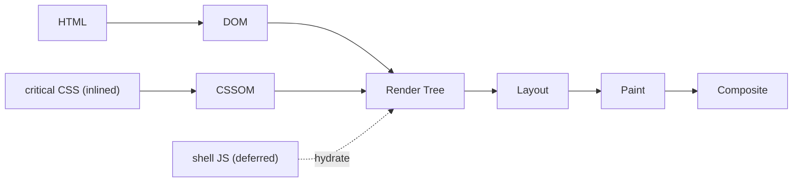

# Performance

> Core Web Vitals budget and optimization plan for **NexusDesk**. Micro-frontends add a real risk (duplicate deps, multiple React copies) that this plan actively controls.

## Table of Contents
1. [Targets](#1-targets-p75)
2. [Budget per route](#2-budget-per-route)
3. [MFE-specific risks](#3-micro-frontend-specific-risks)
4. [Levers by metric](#4-levers-by-metric)
5. [Critical rendering path](#5-critical-rendering-path)
6. [Measurement](#6-measurement)
7. [Caching, delivery & content negotiation](#7-caching-delivery--content-negotiation)
8. [CI gate](#8-ci-gate)

---

## 1. Targets (p75)

| Metric | Target |
|---|---|
| LCP | ≤ 2.5s |
| INP | ≤ 200ms |
| CLS | ≤ 0.1 |
| TTFB | ≤ 0.8s |

## 2. Budget per route (gzipped)

| Route | JS | CSS | Notes |
|---|---|---|---|
| Shell (initial) | ≤ 150 KB | ≤ 40 KB | React + router + shared singletons only |
| `/inbox` remote | ≤ 120 KB | ≤ 20 KB | virtualization lazy |
| `/analytics` remote | ≤ 140 KB | ≤ 20 KB | charts lazy-loaded on view |
| Per lazy chunk | ≤ 60 KB | — | modals, editor, charts |

## 3. Micro-frontend-specific risks
- **Duplicate React / libraries** → mark `react`, `react-dom`, `react-query`, `i18next` as **`singleton: true` shared** in Module Federation; fail the build if a remote requests an incompatible version.
- **Waterfall remote loading** → preload `remoteEntry.js` for the likely-next remote on hover/idle (`<link rel="prefetch">`).
- **Unbounded shared scope** → only share truly common deps; keep remote-specific libs local.

## 4. Levers by metric
- **LCP:** shell renders an app skeleton immediately; preload primary font (`font-display: swap`, subset); hero content server-cacheable for public KB; avoid render-blocking JS.
- **INP:** break long tasks (`scheduler.yield()`), keep streaming appends rAF-batched, `useDeferredValue` for filter typing, virtualize lists so interaction stays cheap.
- **CLS:** reserve space for avatars/media (`aspect-ratio`, width/height), skeletons match final layout, no content injected above existing content.
- **Bundle:** route + component code splitting; lazy-load charts/editor/command-palette; tree-shakeable icon imports.

## 5. Critical rendering path


Inline critical CSS for the shell chrome; defer remote JS until route match; stream remote content behind Suspense with skeletons.

## 6. Measurement
- `web-vitals` in the shell reports LCP/INP/CLS to a RUM endpoint (Sentry Performance), tagged by remote + release.
- Synthetic: **Lighthouse CI** on key routes each PR.
- Bundle: **size-limit** per app with the budgets above.

## 7. Caching, delivery & content negotiation
- **Immutable assets:** hashed JS/CSS chunks + each remote's `remoteEntry.js` → `Cache-Control: public, max-age=31536000, immutable` on the CDN.
- **Revalidated:** `index.html` and the **remote manifest** → `no-cache` so new remote versions are picked up immediately; `ETag`/`If-None-Match` → 304.
- **Cacheable data:** GET reports/articles via `stale-while-revalidate` at the BFF.
- **Content negotiation:** BFF/CDN vary on `Accept` (AVIF→WebP→JPEG for uploads), `Accept-Encoding` (brotli), `Accept-Language`, and `Sec-CH-*` client hints; set `Vary` accordingly.

## 8. CI gate
```yaml
# .github/workflows/perf.yml (excerpt)
- run: pnpm size-limit            # fails if any app exceeds its byte budget
- run: pnpm lhci autorun          # fails if LCP/INP/CLS regress below target
```

## Checklist
- [x] CWV targets + per-route budget
- [x] MFE dedup (shared singletons) enforced
- [x] Levers per metric + CRP diagram
- [x] RUM + Lighthouse CI + size-limit gates

## Next deliverable
→ [10-Internationalization.md](10-Internationalization.md)

