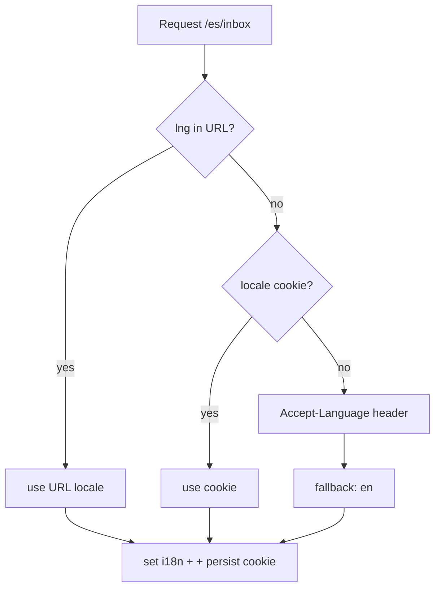

# Internationalization

> Multi-language plan for **NexusDesk**: i18next across all micro-frontends with a shared instance, ICU messages, per-remote namespaces, locale routing, RTL, and `Intl` formatting. Launch locales: **en, es, ar (RTL)**.

## Table of Contents
1. [Library & shared instance](#1-library--shared-instance)
2. [Message strategy](#2-message-strategy)
3. [Locale routing & resolution](#3-locale-routing--resolution)
4. [RTL support](#4-rtl-support)
5. [Formatting (Intl)](#5-formatting-intl)
6. [Translation workflow](#6-translation-workflow)
7. [Testing i18n](#7-testing-i18n)

---

## 1. Library & shared instance
`i18next` + `react-i18next`, created **once** in `packages/i18n` and shared as a **Module Federation singleton** so every remote uses the same instance and locale state.

```ts
// packages/i18n/index.ts
import i18next from 'i18next';
import { initReactI18next } from 'react-i18next';
import ICU from 'i18next-icu';
export const i18n = i18next.createInstance();
i18n.use(ICU).use(initReactI18next).init({
  fallbackLng: 'en', supportedLngs: ['en','es','ar'], ns: ['common'], defaultNS: 'common',
  interpolation: { escapeValue: false }, // React escapes
});
// remotes register their namespace lazily:
export const loadNs = (ns: string, lng: string) =>
  import(`./locales/${lng}/${ns}.json`).then(m => i18n.addResourceBundle(lng, ns, m.default));
```

## 2. Message strategy
- **Namespaces per remote:** `inbox`, `analytics`, `knowledge`, `admin`, plus shared `common`. Loaded lazily with the remote.
- **Keys are semantic**, never English text: `inbox.composer.send`.
- **ICU MessageFormat** for plurals/gender/select:
```json
{ "inbox.unread": "{count, plural, =0 {No unread} one {# unread} other {# unread}}" }
```
- **No hard-coded strings** — enforced by an ESLint rule + CI missing-key check.

## 3. Locale routing & resolution
Subpath routing (`/:lng/...`) — best for SEO on public KB and shareable links.



## 4. RTL support
- Set `<html dir="rtl">` when locale is `ar`; toggle a `data-dir` attribute the shell owns.
- Use **logical CSS** everywhere (`margin-inline-start`, `padding-inline`, `inset-inline`) — already mandated in coding standards.
- Mirror directional icons (chevrons) via CSS `transform` bound to `[dir=rtl]`.

## 5. Formatting (Intl)
Never hand-format numbers/dates/currency:
```ts
new Intl.DateTimeFormat(lng, { dateStyle: 'medium', timeStyle: 'short' }).format(d);
new Intl.NumberFormat(lng, { style: 'currency', currency: tenant.currency }).format(amount);
new Intl.RelativeTimeFormat(lng, { numeric: 'auto' }).format(-3, 'hour');
```

## 6. Translation workflow
1. Extract keys from source (i18next-parser) → `locales/en/*.json` as source of truth.
2. Sync to a TMS (e.g., Locize/Crowdin); translators fill `es`, `ar`.
3. Import back; `fallbackLng: en` covers gaps.
4. CI fails if any non-fallback locale is missing keys present in `en`.

## 7. Testing i18n
- **Pseudo-localization** locale (`en-XA`) in dev to catch truncation + hard-coded strings.
- Unit test ICU plural rendering for `=0/one/other`.
- E2E smoke: switch to `ar`, assert `dir=rtl` and a mirrored layout.
- CI missing-key reporter blocks merge.

## Checklist
- [x] Shared i18next singleton across remotes
- [x] Namespaced keys + ICU
- [x] Locale routing + resolution diagram
- [x] RTL + Intl formatting + workflow + tests

## Next deliverable
→ [11-Coding-Standards.md](11-Coding-Standards.md)

