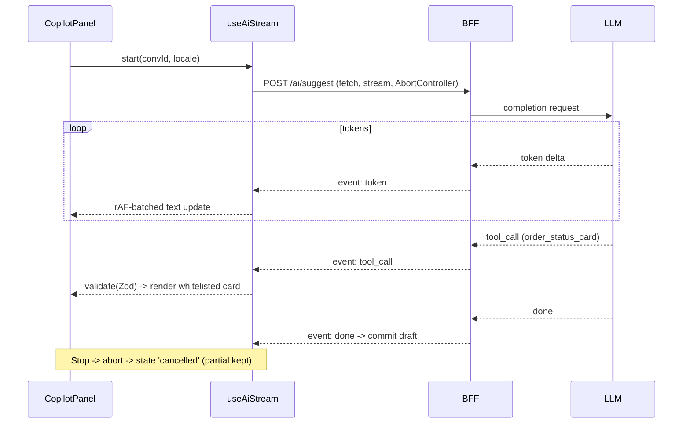

# AI Features

> The AI copilot surface for **NexusDesk**, built on **streaming events (SSE)**: token-by-token draft replies, thread summarization, and generative UI — with cancellation, retry, and production guardrails.

## Table of Contents
1. [AI surface](#1-ai-surface)
2. [Transport choice](#2-transport-choice)
3. [SSE contract](#3-sse-contract-serverclient)
4. [Client streaming hook](#4-client-streaming-hook)
5. [Token UX (cancel/retry)](#5-token-ux-cancel--retry)
6. [Generative UI](#6-generative-ui)
7. [Guardrails](#7-guardrails)
8. [Streaming sequence](#8-streaming-sequence)

---

## 1. AI surface

| Feature | Trigger | Output |
|---|---|---|
| Suggest reply | button in Composer | streamed draft text |
| Summarize thread | button in Thread header | streamed summary + sentiment tag |
| Generative UI cards | model tool call | whitelisted components (e.g., `OrderStatusCard`) |

Lives in `mfe-inbox` `features/copilot/`; the shell exposes a shared `aiClient` (base URL + auth cookie).

## 2. Transport choice
**SSE via `fetch` + `ReadableStream`** — one-way server→client token streaming, HTTP semantics, works through the BFF/proxies, and cancellable with `AbortController`. WebSocket is reserved for presence/messaging, not AI.

## 3. SSE contract (server/client)
```
POST /api/ai/suggest
Content-Type: application/json          Accept: text/event-stream
{ "conversationId": "conv_1", "locale": "en" }

event: token
data: {"delta":"Thanks "}

event: tool_call
data: {"name":"order_status_card","args":{"orderId":"o_99"}}

event: done
data: {"usage":{"tokens":128},"finishReason":"stop"}

event: error
data: {"code":"rate_limited","message":"Try again shortly"}
```
All payloads validated with **Zod** before use.

## 4. Client streaming hook
```ts
export function useAiStream() {
  const [state, set] = useState<StreamState>({ tag: 'idle' });
  const ctrl = useRef<AbortController>();
  const buf = useRef('');

  async function start(conversationId: string, locale: string) {
    ctrl.current = new AbortController();
    set({ tag: 'streaming', text: '' });
    try {
      const res = await fetch('/api/ai/suggest', {
        method: 'POST', signal: ctrl.current.signal,
        headers: { 'Content-Type': 'application/json', Accept: 'text/event-stream' },
        body: JSON.stringify({ conversationId, locale }),
      });
      if (!res.ok || !res.body) throw new Error(`HTTP ${res.status}`);
      const reader = res.body.getReader();
      const dec = new TextDecoder();
      for (;;) {
        const { value, done } = await reader.read();
        if (done) break;
        for (const evt of parseSse(dec.decode(value, { stream: true }))) {
          if (evt.event === 'token') { buf.current += evt.data.delta; scheduleFlush(() => set({ tag: 'streaming', text: buf.current })); }
          if (evt.event === 'tool_call') renderGenerativeUI(evt.data);
          if (evt.event === 'error') throw new Error(evt.data.code);
        }
      }
      set({ tag: 'idle' }); // committed via onDone
    } catch (e) {
      if ((e as Error).name === 'AbortError') set({ tag: 'cancelled', text: buf.current });
      else set({ tag: 'error', text: buf.current, error: e as Error });
    }
  }
  const stop = () => ctrl.current?.abort();
  return { state, start, stop };
}
```
`scheduleFlush` batches with `requestAnimationFrame` to keep INP low during rapid tokens.

## 5. Token UX (cancel / retry)
- Caret indicator while `streaming`; “Stop” aborts and keeps partial text editable.
- `error` state shows an inline **Retry** (re-invokes `start`), never duplicating text.
- Draft flows into the RHF composer field — the agent edits before sending.
- `aria-live="polite"` announces “Generating… / Stopped / Failed” for screen readers.

## 6. Generative UI
The model may emit **typed tool calls** mapped to a **whitelist** of components — raw props are never trusted:
```ts
const GenUiSchema = z.discriminatedUnion('name', [
  z.object({ name: z.literal('order_status_card'), args: z.object({ orderId: z.string() }) }),
  z.object({ name: z.literal('kb_article_link'), args: z.object({ slug: z.string() }) }),
]);
const registry = { order_status_card: OrderStatusCard, kb_article_link: KbArticleLink };
// validate -> look up -> render; unknown tool -> ignored + logged
```

**MCP UI framing.** This is an **MCP UI** pattern — chat and the component UI are peers. `tool_call` events on the SSE stream are validated (Zod) and mapped to whitelisted React components; the UI sends structured context (open convo, selected order) back to the model. The model never receives raw props and never renders an un-whitelisted component.

## 7. Guardrails
- **Rate limit + token budget** per user/tenant at the BFF; `error: rate_limited` surfaces gracefully.
- **PII redaction** on prompt inputs and model output before render.
- **Output moderation** before display; block/flag unsafe content.
- **Auditability:** log every tool call + finishReason (no message bodies) with tenant/user tags.
- **Reversibility:** AI only drafts — nothing sends without agent confirmation; all agent actions undoable.

## 8. Streaming sequence


## Checklist
- [x] SSE transport + contract
- [x] Client streaming hook (cancel/retry)
- [x] Generative UI via typed, whitelisted tool calls
- [x] Guardrails + streaming sequence diagram

## Next deliverable
→ [00-INDEX.md](00-INDEX.md)

