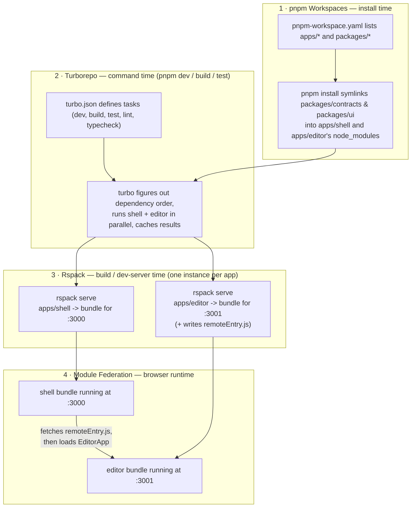

# ResumeForge — Frontend Web App (Starter)

> A working Rspack Module-Federation monorepo: a **shell** host (`:3000`) that loads an **editor** micro-frontend (`:3001`) at runtime. This is the MVP slice generated from [`../plan/12-Starter-Template.md`](../plan/12-Starter-Template.md) — see that doc for the full step-by-step rationale, and [`../plan/06-Delivery-Plan.md`](../plan/06-Delivery-Plan.md) for what gets built next (Sprints 2+).

## Tech stack — what problem each piece solves

Four technologies work together here, each solving a **different layer** of the same overall problem: "let `shell` and `editor` be built, tested, and deployed independently, but still work as one app in the browser."

### Quick reference

| Technology | Responsibility | Example (in this project) |
|---|---|---|
| **Module Federation** | Runtime integration of micro-frontends | Shell loads Editor's `EditorApp` from `remoteEntry.js` at `:3001` |
| **Turborepo** | Monorepo task orchestration and caching | Runs `dev`/`build`/`test`/`lint`/`typecheck` across all packages, in dependency order, in parallel |
| **pnpm Workspaces** | Dependency and workspace management | Links `apps/*` and `packages/*` locally (e.g. `@resumeforge/ui` → `apps/shell`) without publishing to npm |
| **Rspack** | Bundling, dev server, and hosts the Module Federation plugin | Builds/serves Shell and Editor independently; Editor's config also emits `remoteEntry.js` |

> **Two clarifications:** Turborepo isn't limited to "build" — it orchestrates `dev`, `test`, `lint`, and `typecheck` the same way. And Module Federation isn't a separate standalone tool — it's a plugin (`ModuleFederationPlugin`) running *inside* Rspack; Rspack does the bundling, and Module Federation is the specific feature of that bundling that enables runtime cross-app loading.

### Detailed breakdown

| Technology | Problem it solves | Layer / when it runs |
|---|---|---|
| **pnpm Workspaces** | Multiple local packages (`shell`, `editor`, `contracts`, `ui`) need to depend on each other without publishing to npm, and without each having its own duplicate `node_modules`. | Install time |
| **Turborepo** | Running `build`/`test`/`dev` across 4 packages by hand, in the right order, is slow and error-prone. | Command time (`pnpm dev` / `build` / `test`) |
| **Rspack** | Each app's TypeScript/React source needs to become a fast, deployable JS bundle, with a dev server for local work. | Build / dev-server time (once per app) |
| **Module Federation** | The `shell` bundle and the `editor` bundle are built completely separately — they need a way to load each other's code **in the browser**, without either knowing the other's source at build time. | Browser runtime |

### Explained simply (with an analogy)

- **pnpm Workspaces** = the shared filing cabinet. It's what lets `apps/shell` say "I need `@resumeforge/ui`" and get a real, local, always-up-to-date copy — via a symlink, not a published npm version — with one shared `node_modules` for the whole repo instead of four separate ones.
- **Turborepo** = the project manager. You type one command (`pnpm dev`, `pnpm build`); Turborepo reads `turbo.json`, figures out which packages depend on which (build `contracts` before `shell`, since `shell` imports it), runs independent packages **in parallel**, and skips work it's already done before (caching).
- **Rspack** = the factory for one app. Each app (`shell`, `editor`) has its own `rspack.config.mjs`. Rspack takes that one app's TypeScript/JSX/CSS source and turns it into plain JS/CSS the browser can run, and — in dev — serves it with hot reload. Turborepo is what *calls* Rspack for each app; Rspack doesn't know or care that other apps exist.
- **Module Federation** = the phone line between two already-built factories. It's a feature *inside* Rspack's config (`ModuleFederationPlugin`) that makes the `editor` bundle publish a small manifest (`remoteEntry.js`) describing "here's how to fetch my `EditorApp` component," and makes the `shell` bundle know how to fetch and run it — **at runtime, in the user's browser**, not at build time.

### How they work together in this project



**Reading it top to bottom:** pnpm Workspaces makes the packages linkable → Turborepo decides what to run and in what order → Rspack builds/serves each app individually → Module Federation is the runtime bridge that lets the already-running `shell` fetch and mount the already-running `editor`'s component, live, in the browser.

Concretely, in this repo: `pnpm dev` (Turborepo) starts `rspack serve` (Rspack) for both `apps/shell` and `apps/editor` at once; the shell's `App.tsx` does `React.lazy(() => import('editor/EditorApp'))`, which at runtime resolves through Module Federation to `http://localhost:3001/remoteEntry.js` — the exact URL configured in `apps/shell/rspack.config.mjs`'s `remotes` field.

---

## Prerequisites

| Tool | Version | Check |
|------|---------|-------|
| Node.js | >= 20 | `node -v` |
| pnpm | via Corepack (no separate install) | `corepack enable` |

Works identically on Windows, macOS, and Linux — every command below is plain `node`/`pnpm`, no OS-specific shell syntax.

```bash
node -v
corepack enable
corepack prepare pnpm@9.12.0 --activate
```

## Setup

From this folder (`frontend-webapp/`):

```bash
pnpm install
```

This installs everything for all 4 workspace packages (`shell`, `editor`, `contracts`, `ui`) in one step — every `package.json` already declares its own dependencies.

## Run it

```bash
pnpm dev
```

- Shell (host): **http://localhost:3000**
- Editor (remote, standalone preview): **http://localhost:3001**

Open the shell, click **Editor** in the nav — it loads the `EditorApp` component live from the editor's dev server via Module Federation. Type in the **Summary** field and watch the **Live preview** update below it (backed by a shared Zustand store).

> If the shell shows "Could not load the editor remote", the editor dev server isn't running — `pnpm dev` starts both via Turborepo; if you started only the shell, also run `pnpm --filter @resumeforge/editor dev` in a second terminal.

## Other commands

```bash
pnpm build       # production build of both apps -> apps/*/dist
pnpm test        # vitest unit tests for both apps
pnpm typecheck   # tsc --noEmit for both apps
pnpm lint        # eslint for both apps
```

Run everything at once (what CI does):

```bash
pnpm exec turbo run build test typecheck lint
```

## Project structure

```text
frontend-webapp/
├─ packages/
│  ├─ contracts/   # @resumeforge/contracts — Zod schemas (ResumeDoc, ResumePatch)
│  └─ ui/          # @resumeforge/ui — shared design tokens + <Button>
└─ apps/
   ├─ shell/        # HOST — http://localhost:3000
   └─ editor/       # REMOTE — http://localhost:3001
```

## Troubleshooting

| Symptom | Fix |
|---------|-----|
| Port 3000 or 3001 already in use | Stop the other process, or change `devServer.port` in the relevant `apps/*/rspack.config.mjs`. |
| CORS error fetching `remoteEntry.js` | Confirm `devServer.headers['Access-Control-Allow-Origin']` is present in `apps/editor/rspack.config.mjs`. |
| `RuntimeError: factory is undefined (webpack/sharing/consume/...)` | Don't add `eager: true` to shared `react`/`react-dom` — the async `index.ts → bootstrap.tsx` entry boundary already handles initialization order; combining both crashes the app (confirmed by testing). |
| Long path / `ENAMETOOLONG` errors on Windows | Keep the repo closer to the drive root (e.g. `C:\dev\...`) — deep `node_modules` nesting can exceed Windows' path-length limit. |

More detail (including *why* each config choice was made) is in [`../plan/12-Starter-Template.md`](../plan/12-Starter-Template.md).
