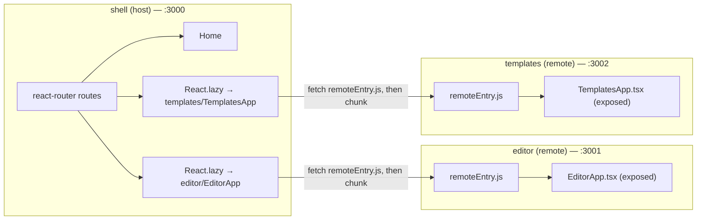

# Micro-Frontend Architecture: How Shell, Editor, and Templates Connect

This app is a **Module Federation** (via `@module-federation/enhanced` + Rspack) monorepo with one **host** and two **remotes**:

| App | Role | Dev port | Exposed module |
|---|---|---|---|
| `shell` | Host — owns routing, layout, nav | `http://localhost:3000` | — (never exposed, only consumes) |
| `editor` | Remote | `http://localhost:3001` | `editor/EditorApp` → [EditorApp.tsx](../apps/editor/src/EditorApp.tsx) |
| `templates` | Remote | `http://localhost:3002` | `templates/TemplatesApp` → [TemplatesApp.tsx](../apps/templates/src/TemplatesApp.tsx) |

## What happens when you open `http://localhost:3000/`

1. Rspack's dev server for `shell` serves [public/index.html](../apps/shell/public/index.html), which loads `main.js` (the shell's own compiled bundle — routing, layout, `Home`).
2. [App.tsx](../apps/shell/src/App.tsx) builds a `react-router` router with three routes: `/` (Home), `/editor/:id`, and `/templates`.
3. On `/`, only the shell's own code runs — **no remote is fetched yet**. Home just renders a welcome message and the shared `@resumeforge/ui` `Button`.
4. Nothing from port 3001 or 3002 is requested until you navigate to a route that needs a remote.

## How the shell connects to the `editor` remote (and `templates`, identically)

1. [shell/rspack.config.mjs](../apps/shell/rspack.config.mjs) declares the remote's address in `ModuleFederationPlugin.remotes`:
   ```js
   remotes: {
     editor: process.env.EDITOR_REMOTE_URL ?? 'editor@http://localhost:3001/remoteEntry.js',
     templates: process.env.TEMPLATES_REMOTE_URL ?? 'templates@http://localhost:3002/remoteEntry.js',
   },
   ```
   This tells the shell's federation runtime: "if code ever imports `editor/EditorApp` or `templates/TemplatesApp`, fetch `remoteEntry.js` from that URL first."
2. In [App.tsx](../apps/shell/src/App.tsx), the components are loaded lazily:
   ```ts
   const EditorApp = React.lazy(() => import('editor/EditorApp'));
   const TemplatesApp = React.lazy(() => import('templates/TemplatesApp'));
   ```
   TypeScript only accepts these bare specifiers because of ambient module declarations in [types/remotes.d.ts](../apps/shell/src/types/remotes.d.ts) — at compile time these are just typed as `ComponentType`; the real resolution happens at **runtime**, not via a normal bundler import.
3. When you navigate to `/editor/demo` (or `/templates`):
   - React Router renders the route's `<Suspense>` boundary, showing the fallback (`"Loading editor remote…"` / `"Loading templates remote…"`).
   - The federation runtime fetches `http://localhost:3001/remoteEntry.js` (or `:3002`), which is a small manifest describing what that remote exposes and what dependencies it shares.
   - It negotiates **shared singletons** — `react`, `react-dom`, `zustand` — so only one copy of React runs across shell + both remotes (declared identically in each app's own `ModuleFederationPlugin.shared`).
   - It then fetches the actual exposed chunk (`EditorApp.tsx` / `TemplatesApp.tsx`, compiled) and any CSS chunk it emitted (e.g. `__federation_expose_EditorApp.css`), injecting a `<link rel="stylesheet">` automatically.
   - Once loaded, `<Suspense>` swaps the fallback for the real component, which renders **inside the shell's `<Outlet />`**, sharing the shell's URL, layout, and header/nav.
4. A `RemoteErrorBoundary` / `TemplatesRemoteErrorBoundary` per remote catches load failures (e.g. remote dev server not running) and shows a friendly message instead of crashing the whole shell.

## How `http://localhost:3001` (editor) relates to `http://localhost:3000` (shell)

These are **two independent Rspack dev servers, two independent processes**, connected only via the Module Federation contract above:

- Visiting `http://localhost:3001/` directly loads the editor's **own** [public/index.html](../apps/editor/public/index.html) → `src/bootstrap.tsx` → renders `EditorApp` standalone, for isolated development. This is a completely separate code path from the shell.
- The shell never imports editor source files directly — it only knows the runtime contract (`editor/EditorApp`, declared in [rspack.config.mjs](../apps/shell/rspack.config.mjs) remotes + [remotes.d.ts](../apps/shell/src/types/remotes.d.ts)).
- Only `EditorApp.tsx` (the exposed file, not `bootstrap.tsx`) is ever included in what the shell loads — see the "Gotcha" in [css-tokens.md](./css-tokens.md) about why CSS imports must live in the exposed file itself.
- The same relationship applies identically for `templates` on port 3002 ([TemplatesApp.tsx](../apps/templates/src/TemplatesApp.tsx), [rspack.config.mjs](../apps/templates/rspack.config.mjs)).



## Testing implication

Since Vite/Vitest can't resolve Module Federation's runtime-only module ids, both remotes are aliased to local stub components in [shell/vitest.config.ts](../apps/shell/vitest.config.ts):
```ts
'editor/EditorApp': path.resolve(process.cwd(), 'test/mocks/EditorAppStub.tsx'),
'templates/TemplatesApp': path.resolve(process.cwd(), 'test/mocks/TemplatesAppStub.tsx'),
```
So shell tests never actually start the editor/templates dev servers — they render lightweight stubs instead.

## The new `templates` micro-frontend

[apps/templates](../apps/templates) was scaffolded as an exact structural mirror of `apps/editor`:
- `src/TemplatesApp.tsx` — the exposed component (a simple template-picker backed by a local `zustand` store in `src/model/templatesStore.ts`).
- `src/bootstrap.tsx` / `src/index.ts` — standalone dev preview only, at `http://localhost:3002`.
- `rspack.config.mjs` — same shape as editor's, with `uniqueName: 'templates'`, `devServer.port: 3002`, and `exposes: { './TemplatesApp': './src/TemplatesApp.tsx' }`.
- Wired into the shell via `remotes.templates` in [shell/rspack.config.mjs](../apps/shell/rspack.config.mjs), a new `/templates` route + nav link in [App.tsx](../apps/shell/src/App.tsx), and its own error boundary/fallback.
