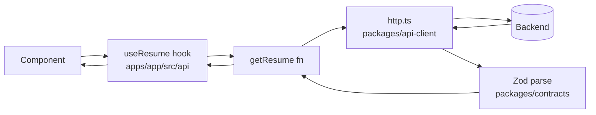

# Project Structure

How the frontend monorepo is organized, and where micro-frontends, CSS, pages, components, state, and API calls go.

> **Legend:** ✅ = exists today · 🆕 = recommended convention, not created yet. Follow the 🆕 layout when you add those pieces so every app stays consistent.

## 1. Monorepo layout

```
frontend-webapp/
├── apps/                     # Deployable micro-frontends (one Rspack build + dev server each)
│   ├── shell/                # ✅ Host  — :3000 — routing, layout, pages owned by the shell
│   ├── editor/               # ✅ Remote — :3001 — exposes editor/EditorApp
│   └── templates/            # ✅ Remote — :3002 — exposes templates/TemplatesApp
├── packages/                 # Shared libraries, consumed via workspace:* (never deployed alone)
│   ├── ui/                   # ✅ Design system: tokens.css, tailwind.css, shared components
│   ├── contracts/            # ✅ Zod schemas + TS types shared by all apps (ResumeDoc, ResumePatch)
│   └── api-client/           # 🆕 Shared HTTP client (see §7)
├── doc/                      # ✅ Architecture docs (this file, css-tokens.md, microfrontend-architecture.md)
├── postcss.config.mjs        # ✅ Tailwind PostCSS plugin, used by every app
├── tsconfig.base.json        # ✅ Shared TS compiler options (strict, noUncheckedIndexedAccess)
├── turbo.json                # ✅ Task pipeline: dev / build / test / lint / typecheck
└── pnpm-workspace.yaml       # ✅ Workspaces: apps/*, packages/*
```

**Rule:** apps may depend on packages, but **apps never import from other apps**. The shell only reaches a remote through Module Federation (`import('editor/EditorApp')`), never through a file path.

## 2. Micro-frontends (`apps/*`)

Every remote has the same shape. Copy `apps/templates` when adding a new one.

```
apps/<remote>/
├── public/index.html         # Standalone dev page (http://localhost:<port>)
├── rspack.config.mjs         # MF config: name, port, exposes, shared singletons
├── package.json              # dev/build/test/lint/typecheck scripts
├── tsconfig.json             # extends ../../tsconfig.base.json
├── vitest.config.ts
├── test/setup.ts             # jest-dom matchers
└── src/
    ├── index.ts              # Async boundary: import('./bootstrap') so MF shared scope is ready
    ├── bootstrap.tsx         # Standalone render ONLY, never loaded by the shell
    ├── <Remote>App.tsx       # The ONE exposed module (the root of the federated UI)
    ├── <Remote>App.test.tsx
    ├── pages/                # 🆕 Route-level screens inside this remote
    ├── components/           # 🆕 Components private to this remote
    ├── model/                # ✅ Zustand stores for this remote's state
    ├── api/                  # 🆕 This remote's API hooks/functions (see §7)
    ├── hooks/                # 🆕 Reusable hooks private to this remote
    └── types/css.d.ts        # Ambient declarations for CSS side-effect imports
```

The shell uses the same layout, plus the files that tie the remotes together:

```
apps/shell/src/
├── App.tsx                   # Router + Layout + lazy remotes + error boundaries
├── page/home.tsx             # ✅ Home page (🆕 rename to pages/Home.tsx, see §4)
├── components/               # 🆕 Shell-only UI (Header, Hero, RemoteBoundary…)
├── types/remotes.d.ts        # Ambient types for 'editor/EditorApp', 'templates/TemplatesApp'
└── test/mocks/*Stub.tsx      # Vitest aliases replace the remotes with these stubs
```

**Adding a remote checklist:**
1. Copy `apps/templates` and pick a new `name`, `uniqueName`, port, and `exposes` key.
2. Shell `rspack.config.mjs`: add an entry to `remotes`.
3. Shell `types/remotes.d.ts`: add a `declare module '<name>/<Exposed>'` block.
4. Shell `App.tsx`: add `React.lazy`, a route, a nav link, and an error boundary + `Suspense`.
5. Shell `vitest.config.ts`: add an alias pointing to a new stub in `test/mocks/`.

Details: [microfrontend-architecture.md](./microfrontend-architecture.md).

## 3. CSS

| Layer | Where | Use for |
|---|---|---|
| Design tokens | `packages/ui/src/tokens.css` | `--rf-*` variables, `[data-theme]` light/dark, `.rf-*` component classes |
| Tailwind utilities | `packages/ui/src/tailwind.css` | Layout and spacing tweaks. Use token-mapped utilities (`bg-rf-surface`, `p-rf-4`) |
| Inline `style={{}}` | Component | Only for truly dynamic values (e.g. computed widths) |

Rules:
- **Import CSS in the exposed module** (`<Remote>App.tsx`), not in `bootstrap.tsx`. Otherwise the CSS never reaches the shell.
- **Don't use raw hex colours or px values.** Use `var(--rf-*)` or a token-mapped Tailwind utility, so theme switching keeps working.
- Reusable visual patterns (button variants, cards, badges) become a `.rf-*` class in `tokens.css` or a component in `packages/ui`, not repeated Tailwind strings.
- Tailwind v4 syntax: CSS variables go in `bg-(--rf-x)` or `bg-[var(--rf-x)]`. The v3 form `bg-[--rf-x]` doesn't work.

Details: [css-tokens.md](./css-tokens.md).

## 4. Pages

A **page** is a route-level component: it maps to a URL and composes sections. It contains no low-level markup or business logic.

```
src/pages/
├── Home.tsx                  # <Hero /> <AboutSection />
├── Login.tsx
└── NotFound.tsx
```

Rules:
- One page per route. Register it in the owning app's router (the shell's `App.tsx` for top-level routes).
- PascalCase file names (`Home.tsx`), default export.
- The page component renders a fragment or `<div>`. `Layout` already provides `<main>`, so don't render a second one.
- Internal navigation uses `<Link to="…">` from `react-router`, not `<a href="*.html">`.
- **Shell pages** are app-wide screens (Home, Login, Account). **Feature screens** live inside their remote (e.g. `editor/src/pages/EditorPage.tsx`) and are reached through the remote's exposed root.

## 5. Components

| Scope | Location | Example |
|---|---|---|
| Shared across apps | `packages/ui/src/` + export from `index.ts` | `Button`, `Card`, `Badge` |
| Private to one app | `apps/<app>/src/components/` | `Hero`, `AiStreamDemo`, `TemplateCard` |
| Private to one page | `apps/<app>/src/pages/<Page>/` folder, next to the page | A section used only by Home |

Rules:
- A component moves to `packages/ui` only when **two or more apps** need it.
- Shared components are presentational only (props in, JSX out). No stores, no API calls, no router.
- Keep each test next to its component (`Hero.tsx` and `Hero.test.tsx`).
- Accept `className` and merge it (see `Button.tsx`). Don't re-pass base classes the component already adds.

## 6. State

| Kind of state | Tool | Location |
|---|---|---|
| UI-local (open/closed, input draft) | `useState` / `useReducer` | Inside the component |
| Feature state within one remote | Zustand store | `apps/<app>/src/model/<feature>Store.ts` ✅ |
| Server data (fetched, cached) | 🆕 TanStack Query | `apps/<app>/src/api/` hooks (§7) |
| URL state (ids, filters, tabs) | `react-router` params/search | Route definition + `useParams` |
| Cross-app state (e.g. current user) | 🆕 Shared contract + event/API | See below |

Rules:
- **Each remote owns its own store.** `resumeStore` (editor) and `templatesStore` (templates) are independent. `zustand` is a shared MF singleton, so there is one library instance, but each store is still a separate object.
- **Don't import another app's store.** It isn't reachable, and doing so would couple the deploys.
- Cross-app data goes through one of:
  1. the **URL** (e.g. `/editor/:id`, `?template=modern`), the simplest and preferred option;
  2. the **backend** (the editor saves `templateId`, and the templates remote reads it);
  3. 🆕 a tiny typed event bus in `packages/contracts` (`window.dispatchEvent(new CustomEvent('rf:template-selected', { detail }))`) for live cross-remote updates.
- Store shapes use types from `@resumeforge/contracts` (e.g. `ResumeDoc`), so they match what the API returns.

## 7. API calls 🆕

No API layer exists yet. Use this layout when adding the first endpoint:

```
packages/api-client/src/
├── http.ts                   # fetch wrapper: base URL, auth header, JSON, error normalization
└── index.ts

packages/contracts/src/       # ✅ Zod schemas: the single source of truth for request/response shapes

apps/<app>/src/api/
├── resumes.ts                # getResume(id), saveResume(doc): call http + parse with Zod
└── useResume.ts              # useQuery / useMutation hooks wrapping the functions above
```

Flow:


Rules:
- **Components never call `fetch` directly.** They use a hook from `src/api/`.
- **Validate every response with the Zod schema** from `@resumeforge/contracts` at the boundary. Types then flow from the schema, so you don't hand-write interfaces.
- **The base URL comes from env/config** (like the `EDITOR_REMOTE_URL` pattern in `rspack.config.mjs`), never hard-coded.
- Auth: send the session via an `HttpOnly` cookie (`credentials: 'include'`). Don't store tokens in `localStorage`.
- Server data lives in the query cache, not copied into Zustand. Zustand holds only client-side edits (e.g. an unsaved draft).
- Tests mock at the `http.ts` boundary (or with MSW), not inside components.

## 8. Types & interfaces

Place a type by **who needs it**. Keep it as close to its use as possible, and promote it to a shared location only when a second consumer appears.

| Kind of type | Location | Example |
|---|---|---|
| Domain / API data (crosses the network or apps) | `packages/contracts/src/` as a **Zod schema + `z.infer`** ✅ | `ResumeDoc`, `ResumePatch` |
| Component props | Same file as the component, above it | `interface HeroProps { … }` in `Hero.tsx` |
| Store state/actions | Same file as the store | `interface EditorState` in `resumeStore.ts` ✅ |
| Local domain types private to one app | `apps/<app>/src/types/<domain>.ts` 🆕 | `ResumeTemplate` (🆕 move out of `templatesStore.ts` once components use it) |
| API request/response not yet shared | Zod schema in `apps/<app>/src/api/<resource>.ts`; move to `contracts` when shared | `SaveResumeResponse` |
| Ambient module declarations | `apps/<app>/src/types/*.d.ts` ✅ | `remotes.d.ts`, `css.d.ts` |
| Props of shared UI components | Exported from `packages/ui` next to the component | `ButtonProps` |
| Cross-app event payloads | `packages/contracts/src/events.ts` 🆕 | `TemplateSelectedEvent` |

```
packages/contracts/src/
├── index.ts           # ✅ re-exports everything
├── resume.ts          # 🆕 split out of index.ts as it grows: ResumeDoc, ResumePatch
├── template.ts        # 🆕 Template schema once the backend serves templates
└── events.ts          # 🆕 CustomEvent names + payload types

apps/<app>/src/types/
├── remotes.d.ts       # ✅ shell only: MF remote module declarations
├── css.d.ts           # ✅ CSS side-effect import declarations
└── <domain>.ts        # 🆕 app-private domain types
```

Rules:
- **Anything validated at runtime is a Zod schema; derive its type** with `export type X = z.infer<typeof X>`. Don't hand-write an `interface` that duplicates a schema.
- **`interface` vs `type`:** use `interface` for object shapes (props, state) and `type` for unions, mapped types, and `z.infer` results.
- **Import types with `import type`**, so they are erased from the bundle and don't create runtime coupling. This matters across MF boundaries.
- **`.d.ts` files are for ambient declarations only** (`declare module …`). Put real types in `.ts` files so they are imported explicitly.
- **Don't add a global `types/index.ts` catch-all** in an app. It becomes a dumping ground and hides ownership.
- **Never import types from another app.** If two apps need a type, move it to `packages/contracts` (data) or `packages/ui` (component props).

## 9. Helper functions

The same principle as types applies: keep a helper next to its only user, and promote it once a second consumer appears.

| Scope | Location | Example |
|---|---|---|
| Used by one component only | Same file, below the component (not exported) | `formatScore()` inside `Hero.tsx` |
| Used by several files in one feature | Next to them: `pages/Home/utils.ts` or `components/<Feature>/utils.ts` | `buildStatLabel()` |
| Used across one app | `apps/<app>/src/lib/<topic>.ts` 🆕 | `lib/date.ts`, `lib/ats.ts` |
| Pure, framework-free, used by 2+ apps | `packages/utils/src/<topic>.ts` 🆕 | `formatDate`, `clamp`, `slugify` |
| Tied to a domain schema | `packages/contracts/src/` next to the schema | `emptyResumeDoc()`, `applyPatch()` |
| Uses React (state/effects) | It's a **hook**, not a helper: `src/hooks/useX.ts` | `useDebounce`, `useStreamText` |
| Class-name merging for UI | `packages/ui/src/cn.ts` 🆕 | `cn('rf-btn', className)` |
| HTTP / fetch logic | `packages/api-client` or `src/api/` (see §7), not `lib/` | `http.get()` |

```
apps/<app>/src/lib/
├── date.ts            # formatDate, relativeTime
├── ats.ts             # scoreKeywords, scoreLabel
└── ats.test.ts        # tests next to the helper

packages/utils/src/    # 🆕 create only when a helper is needed by 2+ apps
├── string.ts
├── number.ts
└── index.ts
```

Rules:
- **Group by topic, not by kind.** Use `lib/date.ts` and `lib/ats.ts`, not one big `utils.ts` or `helpers.ts`.
- **Helpers are pure functions:** input in, output out, with no React, DOM, store, or network access. Anything that needs those is a hook (`hooks/`) or an API function (`api/`).
- **Use named exports only**, so they're easy to find and tree-shake.
- **Every helper in `lib/` or `packages/utils` gets a unit test** next to it (`ats.test.ts`). These are the cheapest tests to write.
- **Shared packages stay dependency-light.** `packages/utils` must not import React, `packages/ui`, or any app.
- **Never import helpers from another app.** Move them to `packages/utils` instead.

## 10. Assets & images 🆕

| Kind | Location | How it's used |
|---|---|---|
| Images for one component | `apps/<app>/src/assets/images/` | `import heroUrl from './assets/images/hero.webp'` then `` |
| Icons (SVG) shared by 2+ apps | `packages/ui/src/icons/` as React components | `<SparkleIcon aria-hidden />` |
| Brand assets (logo) | `packages/ui/src/assets/` | Imported by the shell header and remotes alike |
| Fonts | `packages/ui/src/fonts/` + `@font-face` in `tokens.css` | Referenced via `--rf-font-sans` / `--rf-font-serif` |
| Files served by fixed URL (favicon, `robots.txt`, `manifest.webmanifest`) | `apps/shell/public/` | Copied as-is; referenced by absolute path `/favicon.svg` |
| Resume template thumbnails | `apps/templates/src/assets/thumbnails/` | Owned by the templates remote |

```
apps/<app>/src/assets/
├── images/            # .webp / .avif preferred, .png only when needed
└── svg/               # one-off inline SVGs

packages/ui/src/
├── icons/             # SparkleIcon.tsx, CheckIcon.tsx + index.ts
├── assets/logo.svg
└── fonts/
```

**Build setup required:** no Rspack config handles images yet, so importing a `.png` currently fails. Add this rule to each app's `rspack.config.mjs`:
```js
// Inlines files under 8 KB as data URIs, emits larger ones as hashed files.
{ test: /\.(png|jpe?g|gif|webp|avif|svg|woff2?)$/i, type: 'asset', parser: { dataUrlCondition: { maxSize: 8 * 1024 } } },
```
Also add an ambient declaration in `src/types/assets.d.ts`:
```ts
declare module '*.png' { const src: string; export default src; }
declare module '*.webp' { const src: string; export default src; }
declare module '*.svg' { const src: string; export default src; }
```

Rules:
- **Import assets from `src/`; don't reference them by path from `public/` inside a remote.** With `publicPath: 'auto'` Rspack rewrites imported asset URLs to the remote's own origin (`:3001`, `:3002`). A `/images/x.png` path would resolve against the **shell's** origin and 404 when federated. This is the same trap as CSS in `bootstrap.tsx`.
- `public/` is only for the shell's fixed-URL files (favicon, manifest).
- Prefer `.webp`/`.avif`, and always set `width`/`height` (prevents layout shift) and `loading="lazy"` below the fold.
- Decorative images get `alt=""`, meaningful ones get a descriptive `alt`, and icons next to text get `aria-hidden`.
- Icons are React components (so `currentColor` follows the theme), not ``.

## 11. Localization (i18n) 🆕

The strategy is defined in [plan/10-Internationalization.md](../../plan/10-Internationalization.md): **i18next + react-i18next + i18next-icu**, one namespace per micro-frontend, and locales `en, es, fr, de, ar` (`ar` is RTL).

```
packages/i18n/src/                 # 🆕 shared setup, imported by the shell only
├── init.ts                        # i18n.use(ICU).use(LanguageDetector).use(initReactI18next).init(…)
├── locales.ts                     # SUPPORTED_LOCALES, isRTL()
└── index.ts

apps/shell/src/locales/            # 'common' namespace: nav, header, Home, errors
├── en/common.json
└── ar/common.json

apps/editor/src/locales/           # 'editor' namespace, shipped with the remote
├── en/editor.json
└── ar/editor.json

apps/templates/src/locales/        # 'templates' namespace
└── en/templates.json …
```

How it connects across micro-frontends:
1. The **shell** initializes i18next once (`packages/i18n/init.ts`) in `bootstrap.tsx`.
2. `i18next` and `react-i18next` are added to `shared` as **singletons** in every app's `ModuleFederationPlugin`, so all remotes reuse the shell's single instance and current language (the same mechanism as `react` and `zustand`).
3. Each remote **lazy-loads its own namespace** when its exposed root mounts. The translations code-split with the remote and deploy with it:
   ```ts
   i18n.addResourceBundle(lng, 'editor', await import(`./locales/${lng}/editor.json`));
   const { t } = useTranslation('editor');
   ```
4. The locale lives in the URL (`/:locale/editor/:id`). The shell's root route validates it and sets `i18n.language` plus `<html lang dir>`.

Rules:
- **No hard-coded user-facing strings in JSX.** Use `t('key')`. This includes `alt`, `aria-label`, `placeholder`, and error messages.
- **Semantic, nested keys:** `hero.cta.login`, not `loginButtonText` or the English sentence itself.
- **Plurals, numbers, and genders use ICU syntax** in the JSON, never string concatenation:
  `"ats.keywordsMissing": "{count, plural, =0 {All matched} one {# keyword missing} other {# keywords missing}}"`.
- **Format dates, numbers, and currency with `Intl.*`** using the current locale, put in `lib/format.ts` (§9), not with manual string building.
- **RTL:** use CSS logical properties (`margin-inline-start`, `padding-inline`) and Tailwind logical utilities (`ms-*`, `ps-*`, `start-*`), never `left`/`right`. `tokens.css` already uses `text-align: start`.
- **`en` is the source of truth**, and missing keys fall back to `en`.
- A remote only reads its own namespace plus `common`, never another remote's namespace.
- Tests render with an i18n test instance that returns keys (or loads `en`), so they assert on stable text.

## 12. Naming quick reference

| Thing | Convention | Example |
|---|---|---|
| Component / page file | PascalCase `.tsx` | `Hero.tsx`, `Home.tsx` |
| Hook | `useX.ts` | `useResume.ts` |
| Store | `<feature>Store.ts`, hook `use<Feature>Store` | `templatesStore.ts` → `useTemplatesStore` |
| Props interface | `<Component>Props` | `HeroProps` |
| Helper module | lowercase topic `.ts` in `lib/` | `lib/date.ts` → `formatDate()` |
| Image file | kebab-case | `hero-editor-preview.webp` |
| Icon component | `<Name>Icon.tsx` | `SparkleIcon.tsx` |
| Locale file | `locales/<lng>/<namespace>.json` | `locales/en/editor.json` |
| Translation key | dot-separated, semantic | `editor.section.summary.label` |
| Zod schema + type | Same PascalCase name for both | `const ResumeDoc = z.object(…)`; `type ResumeDoc = z.infer<…>` |
| API module | plural resource | `resumes.ts` |
| Exposed MF module | `<remote>/<Remote>App` | `templates/TemplatesApp` |
| CSS class | `rf-<block>` / `rf-<block>--<modifier>` | `rf-btn--primary` |
| CSS variable | `--rf-<group>-<name>` | `--rf-space-4`, `--rf-accent` |
