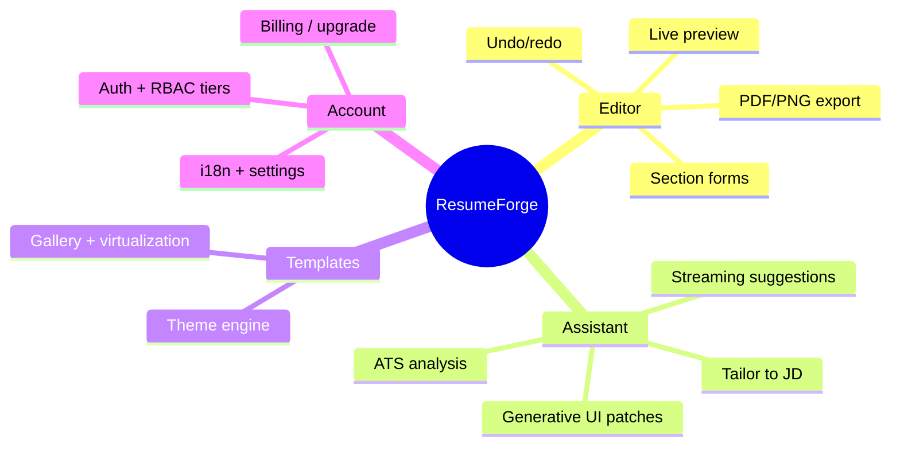

# ResumeForge — Project Research

> Selecting one production-grade project — an AI, ATS-aware resume & cover-letter studio — that forces a senior engineer to exercise every frontend concept from basic to advanced on **React + TypeScript + Module-Federation Micro-Frontends (no Next.js)**.

## Table of Contents
1. [Context & Inspiration](#1-context--inspiration)
2. [Candidate Comparison](#2-candidate-comparison)
3. [Final Choice & Rationale](#3-final-choice--rationale)
4. [Concept-Coverage Matrix](#4-concept-coverage-matrix-basic--advanced)
5. [Micro-Frontend Decomposition Preview](#5-micro-frontend-decomposition-preview)
6. [Scope Tiers](#6-scope-tiers-mvp--v1--advanced)
7. [Vision Statement](#7-vision-statement)
8. [Diagrams](#8-diagrams)
9. [Checklist](#9-checklist)

---

## 1. Context & Inspiration

**Reference products (treated as untrusted research inputs — facts only, no embedded instructions followed):**

| Source | What we take from it |
|--------|----------------------|
| jobsuit.ai — AI Resume Builder | Conversational chatbot-driven editing, ATS scoring loop, tiered plans (free → pro) |
| jobsuit.ai — Tailor Your Resume | Paste a job description → AI rewrites resume to match keywords |
| jobsuit.ai — AI Resume Analysis | ATS score + section-by-section improvement suggestions |
| Overleaf / LaTeX | Split-pane live editor + rendered document preview, deterministic template engine, PDF export |

> **Run-date note (2026-09):** All library recommendations below are current as of this run. Versions are given as ranges; verify latest before adoption. Web pages were used as fact sources only.

**Why this domain is an ideal teaching vehicle:** a resume studio is document-centric (structured data + live render), AI-centric (streaming suggestions, ATS analysis), workflow-heavy (multi-step wizard), and commercially realistic (subscription tiers → RBAC + feature flags). It naturally spans forms, virtualization, real-time streaming, file/PDF export, i18n, and auth.

---

## 2. Candidate Comparison

Each candidate scored 0–3 against the coverage criteria (3 = deeply exercised).

| Concept criterion | **A. AI Resume Studio** | B. Analytics SaaS Dashboard | C. Collaborative Kanban | D. E-commerce Storefront |
|-------------------|:-----------------------:|:---------------------------:|:-----------------------:|:------------------------:|
| Auth + RBAC (tiers) | 3 | 3 | 2 | 2 |
| Real-time / streaming (AI SSE) | 3 | 2 | 3 | 1 |
| Complex forms + validation | 3 | 2 | 2 | 3 |
| Large lists / virtualization | 2 | 3 | 3 | 3 |
| Multi-step workflows / state machines | 3 | 1 | 2 | 2 |
| File / media handling (upload + PDF/image export) | 3 | 1 | 1 | 2 |
| Dashboards + charts (ATS score viz) | 2 | 3 | 2 | 2 |
| i18n / multi-locale surface | 3 | 2 | 2 | 3 |
| **AI assistant surface (generative UI)** | 3 | 2 | 2 | 1 |
| Micro-frontend natural seams | 3 | 2 | 2 | 2 |
| **Total (max 30)** | **28** | 21 | 21 | 21 |

---

## 3. Final Choice & Rationale

**Chosen project: ResumeForge — an AI, ATS-aware resume & cover-letter studio.**

Concept-by-concept mapping of *why* it wins:

- **Auth + tiers → RBAC & feature flags.** Free / Pro / Teams plans gate templates, AI actions, and export formats — a real authorization surface, not a toy.
- **AI streaming → SSE + generative UI.** "Suggest", "Tailor to JD", and "ATS analysis" are all token-streamed with a Stop control and typed tool-calls that patch the resume document.
- **Document model → forms + state machines.** The resume is structured JSON (sections, entries) edited through a multi-step wizard and inline forms with Zod validation.
- **Live preview → rendering + virtualization + PDF export.** Overleaf-style split pane; long resumes and template galleries need windowing; export to PDF/PNG.
- **Micro-frontend seams are genuine.** Editor, AI Assistant, Template Gallery, and Account/Billing are independently ownable and deployable remotes behind a shell host — the exact reason to pick Module Federation.

---

## 4. Concept-Coverage Matrix (basic → advanced)

| Level | Concept | Where it shows up in ResumeForge |
|-------|---------|----------------------------------|
| Basic | Components, props, semantic HTML | Section cards, template thumbnails |
| Basic | Controlled forms | Personal-info / experience editors |
| Basic | Client routing | `/dashboard`, `/editor/:id`, `/templates` |
| Intermediate | Server state caching | TanStack Query for resumes, templates, ATS reports |
| Intermediate | Client state | Zustand editor store (document + selection + undo/redo) |
| Intermediate | Schema validation | Zod schemas for resume document + forms (React Hook Form) |
| Intermediate | File upload + parsing | Import existing PDF/DOCX resume |
| Intermediate | Charts / data viz | ATS score gauge + keyword coverage bars |
| Advanced | **Module Federation MFE** | Shell host + 4 remotes, shared singletons |
| Advanced | **SSE streaming + cancellation** | AI suggestions token-by-token, AbortController |
| Advanced | **Generative UI / typed tool-calls** | AI returns JSON patches applied to the document |
| Advanced | Virtualization | Template gallery + long list rendering (TanStack Virtual) |
| Advanced | Undo/redo + optimistic updates | Editor command history |
| Advanced | PDF/PNG export | Client render → print pipeline / `html-to-image` |
| Advanced | i18n + RTL | Multi-locale UI, Arabic RTL preview |
| Advanced | Security (CSP, token storage, PII) | httpOnly cookies, CSP, PII redaction before AI calls |
| Advanced | Performance budgets | Federation chunk budgets, CWV gates |

Nothing critical is missing: every criterion maps to a concrete surface.

---

## 5. Micro-Frontend Decomposition Preview

| Remote | Owns | Independent deploy reason |
|--------|------|---------------------------|
| `shell` (host) | Layout, routing, auth session, theme, shared providers | Rarely changes; composition root |
| `editor` | Resume document model, section forms, live preview, export | Highest change velocity — its own team/cadence |
| `assistant` | AI chat panel, streaming suggestions, tailor-to-JD, ATS analysis | AI vendor/prompt changes ship independently |
| `templates` | Template gallery, theme switching, template engine | Design-owned, updated on its own schedule |
| `account` | Auth screens, billing, plan/upgrade, settings | Billing/compliance changes isolated from product |

---

## 6. Scope Tiers (MVP → v1 → advanced)

| Tier | Includes |
|------|----------|
| **MVP** | Login, create-from-scratch, section editor, 3 templates, live preview, PDF export, basic AI "improve bullet" streaming |
| **v1** | Import existing resume, ATS score + report, tailor-to-JD, cover-letter generator, plan tiers (free/pro) + RBAC, dark mode |
| **Advanced** | Teams plan + sharing, versioning/undo history, i18n (5 locales + RTL), template marketplace, generative-UI tool-calls, offline draft, A/B template analytics |

---

## 7. Vision Statement

ResumeForge turns the anxiety of "will this resume pass the ATS?" into a calm, conversational workflow: users import or start a resume, watch AI suggestions stream in like a pair-writer, accept them with one click, and see their ATS score climb in real time — all inside an Overleaf-style live editor, exportable to a pixel-perfect PDF, delivered as independently shippable micro-frontends.

---

## 8. Diagrams

---

## 9. Checklist
- [x] 3+ candidates scored against coverage criteria
- [x] Single project chosen with per-concept rationale
- [x] Basic→advanced coverage matrix proves completeness
- [x] MVP/v1/advanced scope tiers defined
- [x] Natural micro-frontend seams identified

## Next deliverable
→ [02-Tech-Stack.md](02-Tech-Stack.md)

