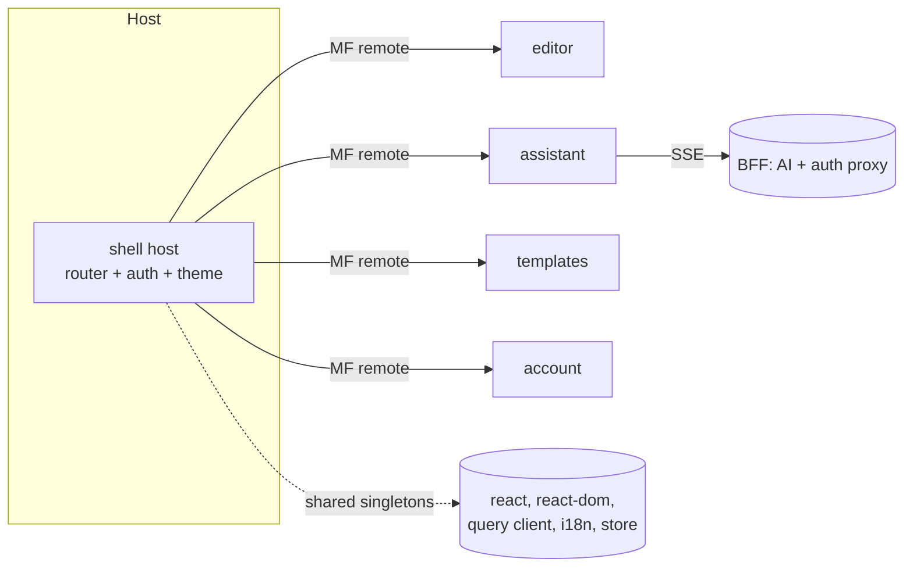

# ResumeForge — Tech Stack & Toolchain

> The complete, current, production-grade toolchain for **React 19 + TypeScript (strict) + Module-Federation Micro-Frontends via Rspack**. No Next.js. Every choice has a one-line rationale.

## Table of Contents
1. [Constraints](#1-constraints)
2. [Toolchain Decisions](#2-toolchain-decisions)
3. [Why Rspack Module Federation](#3-why-rspack-module-federation-over-alternatives)
4. [Dependency Table](#4-dependency-table-with-why)
5. [package.json Preview](#5-packagejson-preview-per-remote--root)
6. [Architecture Options](#6-architecture-options-recap)
7. [Diagrams](#7-diagrams)
8. [Checklist](#8-checklist)

---

## 1. Constraints
- **Named stack:** React + TypeScript + Micro-Frontend.
- **Excluded:** Next.js (and by extension its App Router / RSC runtime).
- **Architecture chosen:** Module Federation (Webpack 5 / Rspack). We standardize on **Rspack** (Rust-based, Webpack-API-compatible) for fast builds while keeping the mature Module Federation contract.

---

## 2. Toolchain Decisions

| Category | Decision | Why (one line) |
|----------|----------|----------------|
| Language | TypeScript 5.6+, `strict: true` | Type safety across independently deployed remotes via shared type packages |
| Build tool | **Rspack 1.x** + `@module-federation/enhanced` | Webpack-compatible Module Federation with Rust-speed builds |
| Dev server | Rspack dev server per remote | Independent HMR per micro-frontend |
| Package manager | **pnpm** (workspaces) | Strict, fast, disk-efficient; ideal for monorepo of remotes |
| Monorepo | **pnpm workspaces + Turborepo** | Cached, parallel task graph across shell + 4 remotes |
| Routing | **React Router 7** (data router) | Framework-agnostic client routing; nested routes per remote |
| Server state | **TanStack Query v5** | Caching, background refetch, mutations for resumes/reports |
| Client state | **Zustand** | Tiny store for editor document, selection, undo/redo |
| Styling | **Tailwind CSS 4** + CSS variables (design tokens) | Utility speed + token theming shared across remotes |
| Component primitives | **Radix UI** | Accessible unstyled primitives (dialog, popover, tabs) |
| Forms + validation | **React Hook Form + Zod** | Performant forms; Zod schema is the single source of truth |
| Data fetching / streaming | `fetch` + `ReadableStream` / **SSE** | Token-by-token AI streaming with `AbortController` cancel |
| Charts | **Recharts** (or visx) | ATS score gauge + keyword coverage bars |
| Virtualization | **TanStack Virtual** | Template gallery + long lists |
| PDF / image export | **@react-pdf/renderer** (vector PDF) + **html-to-image** (PNG) | Deterministic PDF + rasterized snapshot |
| Resume import parsing | **pdfjs-dist** + **mammoth** (DOCX) | Client-side parse of uploaded resumes |
| i18n | **i18next + react-i18next + ICU** | Namespaced messages, plurals/gender, RTL |
| Testing | **Vitest + Testing Library + Playwright + MSW** | Unit/integration/E2E + network mocking |
| Lint/format | **ESLint 9 flat config + Prettier + typescript-eslint** | Consistent, type-aware linting |
| CI/CD | **GitHub Actions** matrix | Per-remote lint/test/build + Lighthouse gate |
| Auth | **OIDC/OAuth2 + PKCE** (`oidc-client-ts`) via BFF | Standard, secure; tokens in httpOnly cookies |
| Error / RUM | **Sentry** + `web-vitals` | Error tracking + real-user CWV |
| Deployment | Static remotes on CDN/edge + a lightweight **BFF** (Node/Fastify) | Independent remote hosting; BFF proxies AI + auth |

---

## 3. Why Rspack Module Federation (over alternatives)

| Option | Pros | Cons | Verdict |
|--------|------|------|---------|
| **Rspack + `@module-federation/enhanced`** | Webpack MF API, Rust-fast builds, mature runtime, dynamic remotes, shared singletons | Newer than Webpack | **Chosen** |
| Webpack 5 Module Federation | Most battle-tested MF | Slow cold builds | Fallback if a plugin is Webpack-only |
| Vite + `@originjs/vite-plugin-federation` | Fast dev | MF less mature, prod-only federation quirks | Rejected for this scale |
| single-spa | Framework-agnostic | Heavier orchestration, no true module sharing | Rejected |

---

## 4. Dependency Table (with why)

**Runtime**

| Package | Range | Why |
|---------|-------|-----|
| `react`, `react-dom` | ^19 | UI runtime; shared singleton across remotes |
| `react-router` | ^7 | Client routing |
| `@tanstack/react-query` | ^5 | Server-state cache |
| `zustand` | ^5 | Editor client state |
| `@radix-ui/react-*` | latest | Accessible primitives |
| `react-hook-form` | ^7 | Forms |
| `zod` | ^3 | Schema validation + AI tool-call schemas |
| `i18next`, `react-i18next` | ^24 / ^15 | i18n |
| `recharts` | ^2 | ATS charts |
| `@tanstack/react-virtual` | ^3 | Virtualization |
| `@react-pdf/renderer` | ^4 | Vector PDF export |
| `html-to-image` | ^1 | PNG export |
| `pdfjs-dist`, `mammoth` | latest | Resume import parsing |
| `oidc-client-ts` | ^3 | OIDC/PKCE client |
| `@sentry/react` | ^8 | Error tracking |
| `web-vitals` | ^4 | RUM CWV |

**Dev / build**

| Package | Range | Why |
|---------|-------|-----|
| `@rspack/core`, `@rspack/cli` | ^1 | Build + dev server |
| `@module-federation/enhanced` | latest | Module Federation runtime/plugin |
| `typescript` | ^5.6 | Types |
| `tailwindcss`, `@tailwindcss/postcss` | ^4 | Styling |
| `vitest`, `@testing-library/react`, `@testing-library/user-event` | latest | Unit/integration |
| `@playwright/test` | latest | E2E |
| `msw` | ^2 | Network mocking incl. SSE |
| `eslint`, `typescript-eslint`, `prettier` | ^9 / latest | Lint/format |
| `turbo` | ^2 | Monorepo task runner |
| `@axe-core/playwright`, `vitest-axe` | latest | a11y tests |

---

## 5. package.json Preview (per-remote + root)

**Root `package.json`**
```jsonc
{
  "name": "resumeforge",
  "private": true,
  "packageManager": "pnpm@9",
  "scripts": {
    "dev": "turbo run dev --parallel",
    "build": "turbo run build",
    "test": "turbo run test",
    "lint": "turbo run lint",
    "e2e": "playwright test"
  },
  "devDependencies": {
    "turbo": "^2",
    "typescript": "^5.6",
    "eslint": "^9",
    "typescript-eslint": "latest",
    "prettier": "latest",
    "@playwright/test": "latest"
  }
}
```

**`apps/editor/package.json` (representative remote)**
```jsonc
{
  "name": "@resumeforge/editor",
  "scripts": {
    "dev": "rspack serve",
    "build": "rspack build",
    "test": "vitest run --coverage"
  },
  "dependencies": {
    "react": "^19",
    "react-dom": "^19",
    "zustand": "^5",
    "react-hook-form": "^7",
    "zod": "^3",
    "@react-pdf/renderer": "^4",
    "html-to-image": "^1"
  },
  "devDependencies": {
    "@rspack/core": "^1",
    "@rspack/cli": "^1",
    "@module-federation/enhanced": "latest",
    "tailwindcss": "^4"
  }
}
```

---

## 6. Architecture Options (recap)

Three MFE architectures were valid; the user selected **Option 1**. See [03-Architecture.md](03-Architecture.md) for the full design.

| Option | Definition | Tradeoff |
|--------|-----------|----------|
| **1. Module Federation (Rspack) — chosen** | Shell host loads remotes at runtime; shared singletons | Most independent deploys; more config |
| 2. Vite federation | Same seams, faster dev | Less mature federation |
| 3. single-spa monorepo | Route-level micro-apps | Simpler ops, looser isolation |

---

## 7. Diagrams



---

## 8. Checklist
- [x] No excluded framework (Next.js) present
- [x] Build tool + MF runtime chosen with rationale
- [x] Server/client/form/streaming state libs selected
- [x] Dependency table has a "why" per package
- [x] package.json preview (root + remote) included

## Next deliverable
→ [03-Architecture.md](03-Architecture.md)

