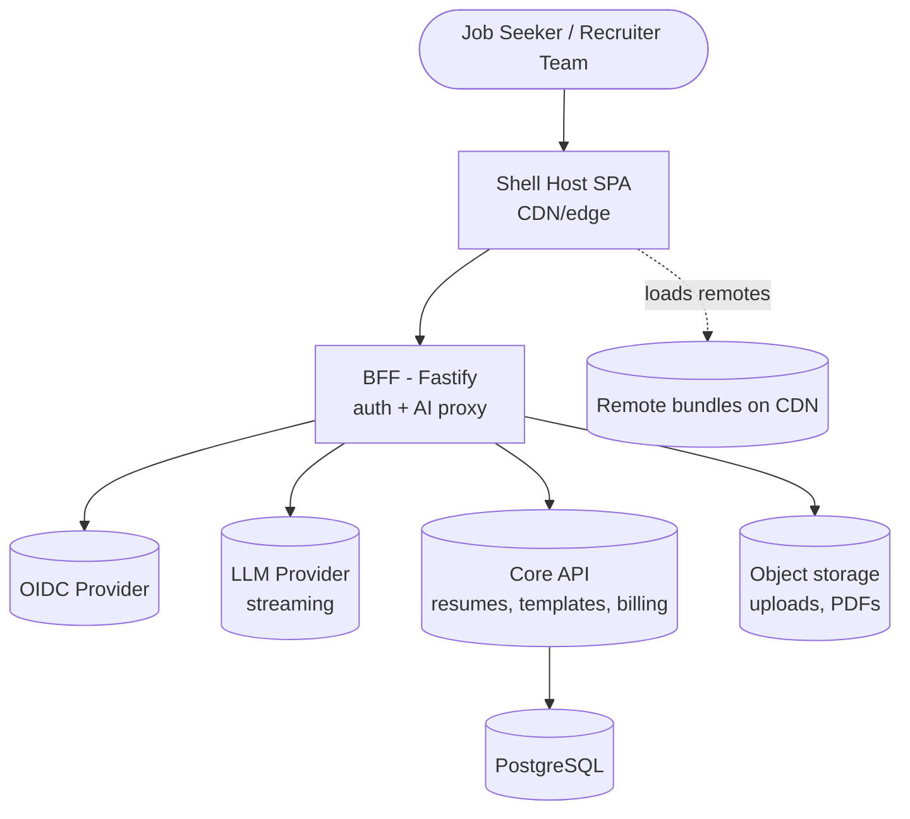
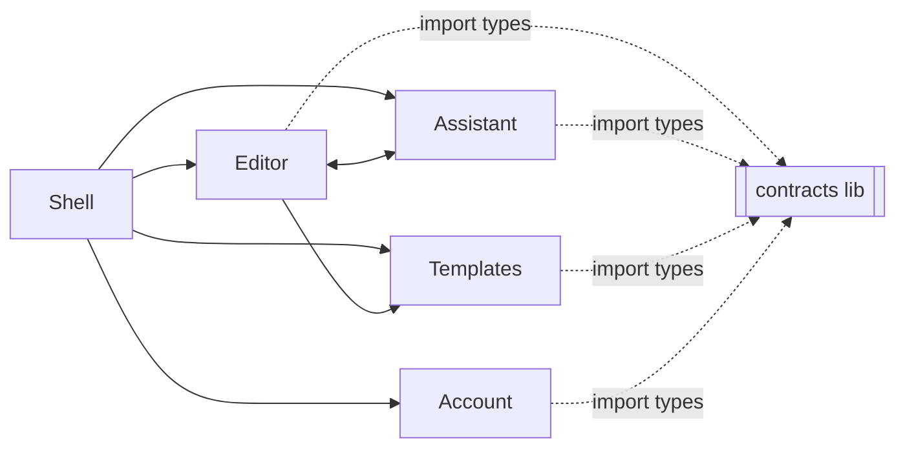
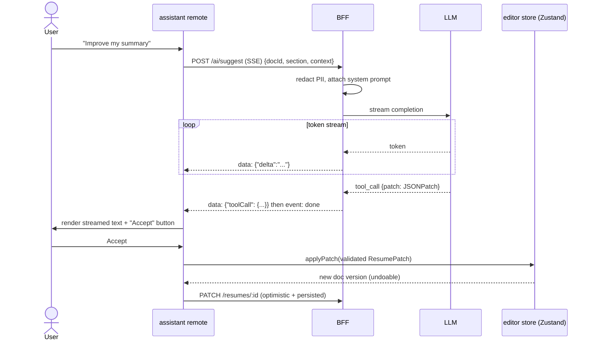
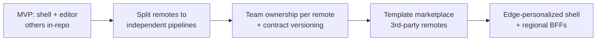

# ResumeForge — Architecture

> Concrete, defensible architecture for a Module-Federation micro-frontend resume studio: system context, module boundaries, rendering strategy, state topology, streaming path, BFF contract, folder tree, and scalability.

## Table of Contents
1. [System Context](#1-system-context)
2. [Module / Domain Boundaries](#2-module--domain-boundaries)
3. [Module Federation Wiring](#3-module-federation-wiring)
4. [Rendering Strategy per Route](#4-rendering-strategy-per-route)
5. [State Topology](#5-state-topology)
6. [Key Data Flow — Accept an AI Suggestion](#6-key-data-flow--accept-an-ai-suggestion-sequence)
7. [Real-time / Streaming Path](#7-real-time--streaming-path)
8. [Cross-cutting Concerns](#8-cross-cutting-concerns)
9. [API / BFF Contract](#9-api--bff-contract-typed)
10. [Deployment & Observability](#10-deployment--observability)
11. [Folder Structure](#11-folder-structure-concrete-tree)
12. [Scalability Path](#12-scalability-path)
13. [Checklist](#13-checklist)

---

## 1. System Context



The frontend never talks to the LLM or IdP directly — the **BFF** owns secrets, token exchange, PII redaction, and SSE fan-out.

---

## 2. Module / Domain Boundaries

Feature-sliced boundaries, one per deployable remote:

| Remote | Domain responsibility | Exposes (MF) |
|--------|----------------------|--------------|
| `shell` (host) | Routing, auth session, theme, error boundary, shared providers | — (consumes remotes) |
| `editor` | Resume document model, section forms, live preview, undo/redo, export | `./EditorApp`, `./useResumeDoc` |
| `assistant` | AI chat, streaming suggestions, tailor-to-JD, ATS analysis, tool-call patches | `./AssistantPanel` |
| `templates` | Gallery, theme engine, template registry | `./TemplateGallery`, `./renderTemplate` |
| `account` | Auth screens, billing, plan/RBAC, settings, i18n switcher | `./AccountRoutes` |
| `@resumeforge/contracts` (lib) | Shared TS types + Zod schemas (resume doc, DTOs, tool-calls) | published package, not a remote |



Editor ↔ Assistant communicate via a **shared Zustand store** exposed by the editor remote + a typed event bus, never by reaching into each other's internals.

---

## 3. Module Federation Wiring

Shell host `rspack.config.ts` (excerpt):
```ts
import { ModuleFederationPlugin } from '@module-federation/enhanced/rspack';

new ModuleFederationPlugin({
  name: 'shell',
  remotes: {
    editor:    'editor@https://cdn.resumeforge.app/editor/remoteEntry.js',
    assistant: 'assistant@https://cdn.resumeforge.app/assistant/remoteEntry.js',
    templates: 'templates@https://cdn.resumeforge.app/templates/remoteEntry.js',
    account:   'account@https://cdn.resumeforge.app/account/remoteEntry.js',
  },
  shared: {
    react:      { singleton: true, requiredVersion: '^19', eager: true },
    'react-dom':{ singleton: true, requiredVersion: '^19', eager: true },
    'react-router': { singleton: true },
    '@tanstack/react-query': { singleton: true },
    zustand: { singleton: true },
    i18next: { singleton: true },
  },
});
```

**Rules:** React, router, query client, store, and i18n are `singleton` to avoid duplicate context/hook instances. Remotes are loaded lazily via `React.lazy` + `Suspense` behind route boundaries. A **remote failure** falls back to an error boundary card, never crashing the shell.

---

## 4. Rendering Strategy per Route

No Next.js — this is a **client-rendered SPA** with per-remote code splitting. Strategy is chosen per route:

| Route | Remote | Strategy | Why |
|-------|--------|----------|-----|
| `/` landing | shell | Static shell + prefetch | Fast first paint; marketing content |
| `/login`, `/signup` | account | CSR, lazy | Small, auth-gated |
| `/dashboard` | shell + editor list | CSR + TanStack Query prefetch | Personalized, cached |
| `/editor/:id` | editor (lazy remote) | CSR + streaming AI overlay | Heavy; loaded only when needed |
| `/templates` | templates (lazy remote) | CSR + virtualization | Large gallery |
| `/account/*` | account (lazy remote) | CSR | Rarely visited |

Perceived performance comes from: route-level lazy remotes, `<link rel="modulepreload">` for likely-next remotes, skeletons, and streaming AI content (not blocking render).

---

## 5. State Topology

| State kind | Owner | Tool | Example |
|-----------|-------|------|---------|
| Server state | shell-provided singleton | TanStack Query | resumes, templates, ATS reports, plan |
| Editor document state | editor remote | Zustand (with undo/redo history) | resume JSON, selection, dirty flag |
| Streaming state | assistant remote | local reducer + AbortController | in-flight tokens, partial suggestion |
| URL state | router | React Router | `:id`, `?template=`, locale prefix |
| Form state | per form | React Hook Form + Zod | section editors |
| Session/auth | shell | context from BFF `/me` (httpOnly cookie) | user, roles, plan |
| Theme/i18n | shell | context + `data-theme`, i18next | dark default, locale |

Golden rule: **server state never duplicated into Zustand**; the editor store holds only the working document + UI ephemeral state.

---

## 6. Key Data Flow — Accept an AI Suggestion (sequence)



---

## 7. Real-time / Streaming Path

- **Transport:** SSE over `fetch` + `ReadableStream` (not `EventSource`, so we can send auth cookies + POST bodies and use `AbortController`).
- **Events:** `delta` (text token), `toolCall` (typed JSON patch validated by Zod), `atsScore` (progressive), `error`, `done`.
- **Cancellation:** Stop button aborts the fetch; partial text is preserved and can still be accepted/discarded.
- **Backpressure/UI:** tokens buffered and flushed on `requestAnimationFrame` to avoid layout thrash.

---

## 8. Cross-cutting Concerns

| Concern | Approach |
|---------|----------|
| Auth boundary | Shell route guard checks session; remotes assume authenticated context |
| Error boundaries | One per lazy remote + a global shell boundary; remote load failure → retry card |
| Logging/telemetry | Sentry (errors) + web-vitals (RUM), correlation id from BFF |
| Feature flags | Plan-driven flags from `/me`; gate templates, AI actions, export formats |
| Config | Runtime `window.__RF_CONFIG__` injected by BFF; no secrets in bundles |
| Contracts | `@resumeforge/contracts` shared Zod schemas keep remotes type-aligned |

---

## 9. API / BFF Contract (typed)

The frontend depends only on this stable contract (defined in `@resumeforge/contracts`):

```ts
// Resume document (source of truth)
export const ResumeDoc = z.object({
  id: z.string(),
  locale: z.string().default('en'),
  templateId: z.string(),
  sections: z.array(z.discriminatedUnion('type', [
    z.object({ type: z.literal('summary'), text: z.string() }),
    z.object({ type: z.literal('experience'), items: z.array(ExperienceItem) }),
    z.object({ type: z.literal('skills'), groups: z.array(SkillGroup) }),
    /* education, projects, custom… */
  ])),
  version: z.number(),
});

// AI tool-call patch the assistant applies
export const ResumePatch = z.object({
  op: z.enum(['replace', 'insert', 'remove']),
  path: z.string(),           // JSON pointer into ResumeDoc
  value: z.unknown().optional(),
});
```

| Endpoint | Method | Shape |
|----------|--------|-------|
| `/me` | GET | `{ user, roles[], plan }` (session cookie) |
| `/resumes` | GET/POST | list / create `ResumeDoc` |
| `/resumes/:id` | GET/PATCH | fetch / partial update |
| `/resumes/import` | POST | multipart upload → parsed `ResumeDoc` |
| `/templates` | GET | template registry |
| `/ai/suggest` | POST (SSE) | stream `delta`/`toolCall`/`done` |
| `/ai/tailor` | POST (SSE) | JD + docId → tailored patches |
| `/ats/analyze` | POST (SSE) | `atsScore` + keyword report |
| `/export/:id.pdf` | GET | server-verified PDF (or client-rendered) |

If the backend is not yet built, the BFF ships with **MSW-mocked** implementations of this exact contract so the frontend is never blocked.

---

## 10. Deployment & Observability

- **Hosting:** each remote builds to static assets on CDN/edge with immutable, hashed `remoteEntry.js`; shell references versioned remote URLs (or a manifest for canary/rollback).
- **BFF:** containerized Fastify at the edge/region; holds IdP + LLM secrets; enforces rate limits.
- **Independent deploys:** a remote can ship without rebuilding the shell as long as the MF shared contract + `@resumeforge/contracts` version are compatible.
- **Observability:** Sentry for errors + release health; `web-vitals` → analytics endpoint; BFF emits structured logs with correlation ids; synthetic Lighthouse CI on PRs.

---

## 11. Folder Structure (concrete tree)

```text
resumeforge/
├─ pnpm-workspace.yaml
├─ turbo.json
├─ package.json
├─ packages/
│  ├─ contracts/            # shared Zod schemas + TS types (published)
│  ├─ ui/                   # shared design-system components + tokens
│  └─ config/               # eslint, tsconfig, tailwind presets
├─ apps/
│  ├─ shell/                # HOST
│  │  ├─ rspack.config.ts
│  │  └─ src/
│  │     ├─ app/ (router, providers, layout)
│  │     ├─ auth/ (session, guards)
│  │     ├─ bootstrap.tsx
│  │     └─ index.ts
│  ├─ editor/               # REMOTE
│  │  └─ src/
│  │     ├─ model/ (resumeStore.ts, patch.ts, history.ts)
│  │     ├─ sections/ (SummaryEditor, ExperienceEditor, …)
│  │     ├─ preview/ (LivePreview, exportPdf.ts)
│  │     └─ EditorApp.tsx
│  ├─ assistant/            # REMOTE
│  │  └─ src/
│  │     ├─ streaming/ (useSSE.ts, sseClient.ts)
│  │     ├─ tools/ (applyPatch.ts, schemas.ts)
│  │     └─ AssistantPanel.tsx
│  ├─ templates/            # REMOTE
│  │  └─ src/ (Gallery, engine/, registry.ts)
│  ├─ account/              # REMOTE
│  │  └─ src/ (auth/, billing/, settings/, i18n/)
│  └─ bff/                  # Fastify: auth + AI proxy + MSW-parity mocks
├─ e2e/                     # Playwright
└─ .github/workflows/       # CI matrix
```

---

## 12. Scalability Path



Start with all remotes in one repo (fast iteration), then peel off pipelines as teams form. Contract-versioned `@resumeforge/contracts` + MF shared singletons keep independent deploys safe.

---

## 13. Checklist
- [x] System context diagram
- [x] Module boundary diagram + table
- [x] Sequence diagram (AI suggestion flow)
- [x] Concrete folder tree
- [x] Typed BFF contract (frontend not assuming undefined backend)
- [x] Deployment + observability defined
- [x] Streaming path + cancellation specified

## Next deliverable
→ [04-Product-Spec.md](04-Product-Spec.md)

