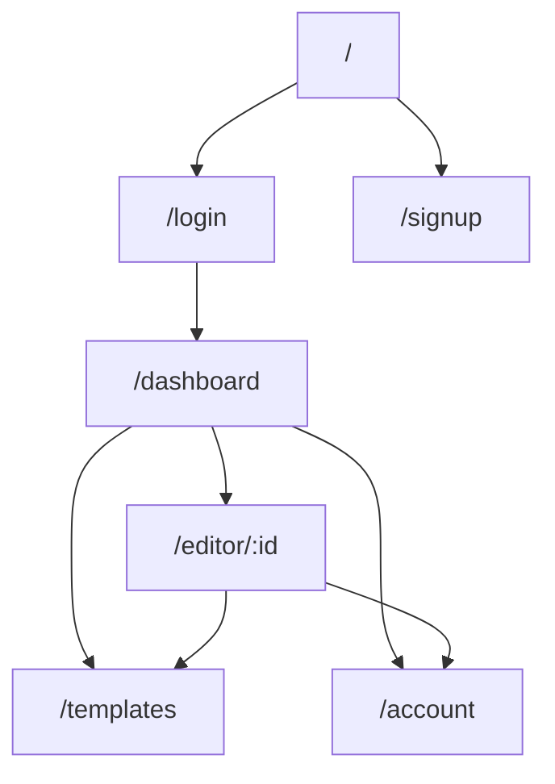
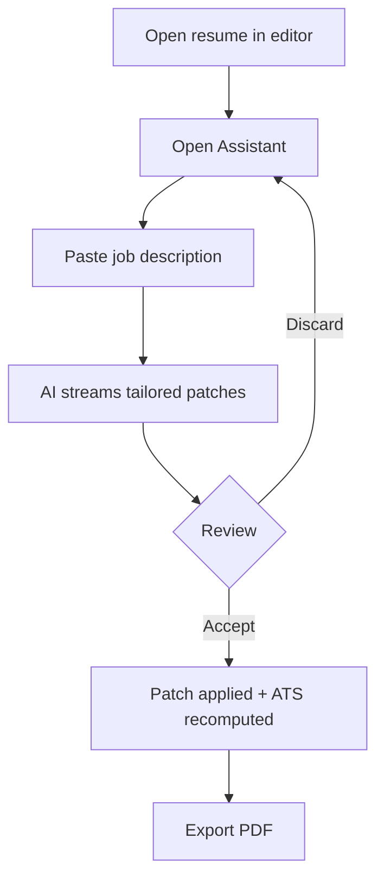
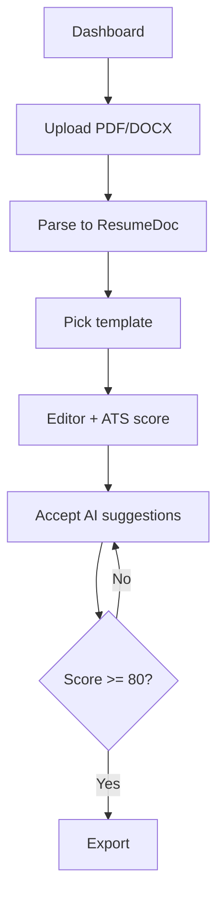
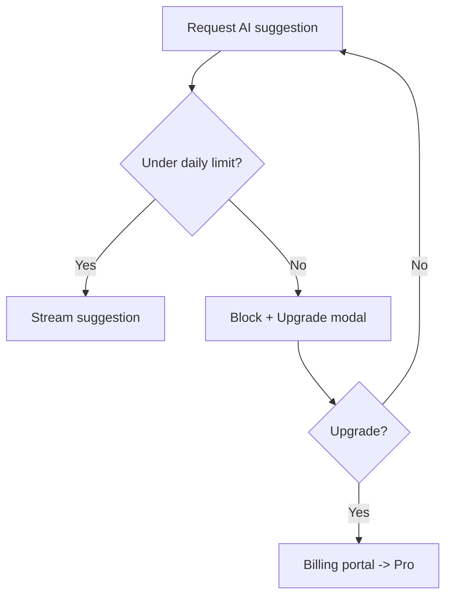

# ResumeForge — Product Specification

> Product Owner brief + functional spec for an AI, ATS-aware resume & cover-letter studio delivered as micro-frontends.

## Table of Contents
- [Part A — Product Owner Brief](#part-a--product-owner-brief)
- [Part B — Functional Spec](#part-b--functional-spec)
- [Diagrams](#diagrams)
- [Checklist](#checklist)

---

# Part A — Product Owner Brief

## A1. Vision & Mission
**Vision:** every job seeker walks into an application confident their resume will pass the machine and impress the human.
**Mission:** an AI pair-writer that streams ATS-optimized suggestions into a live, Overleaf-style editor.
**One-liner:** *ResumeForge — chat your resume past the ATS.*

## A2. Problem Statement (top 3 pains)
1. Applicants can't see *why* they're rejected by ATS keyword filters.
2. Rewriting a resume per job description is slow and repetitive.
3. Formatting/export breaks ATS parsing (columns, tables, images).

## A3. Target Market & Segments
Active job seekers, career switchers, students, and (Teams tier) bootcamps/career-services. **Beachhead:** mid-career tech professionals tailoring to specific job descriptions.

## A4. Value Proposition
| Stakeholder | Value |
|-------------|-------|
| Job seeker | Higher ATS pass rate, faster tailoring, one-click accept |
| Recruiter/career coach (Teams) | Consistent, ATS-safe candidate resumes |
| Business | Subscription revenue from AI + export gating |
**Differentiator:** conversational, streaming edits applied as validated document patches — not a static "download template" tool.

## A5. Goals & Success Metrics
**North-star:** number of resumes that reach an ATS score ≥ 80 and are exported.

| OKR | KPI | Target |
|-----|-----|--------|
| Users succeed fast | Time-to-first-export | ≤ 10 min |
| AI is trusted | Suggestion accept rate | ≥ 45% |
| Scores improve | Avg ATS score lift per session | +15 pts |
| Monetize | Free→Pro conversion | ≥ 5% |
| Guardrail | p75 LCP / INP | ≤ 2.5s / ≤ 200ms |
| Guardrail | AI error rate | < 1% |

## A6. Detailed Personas
| Persona | Goals | Pains | Jobs-to-be-done |
|---------|-------|-------|-----------------|
| **Maya, mid-career dev** | Tailor resume per role fast | Manual keyword matching | "Paste JD → optimize my resume" |
| **Sam, new grad** | Build a first resume | Blank-page anxiety | "Start from a template with AI help" |
| **Priya, career coach (Teams)** | Standardize client resumes | Inconsistent formats | "Review and enforce ATS-safe output" |

## A7. Business Rules & Policies (numbered, testable)
1. Free tier: max 1 active resume, 3 templates, 10 AI actions/day, PDF export only.
2. Pro tier: unlimited resumes/templates, unlimited AI, PDF+PNG+DOCX export, tailor-to-JD.
3. Teams tier: Pro + sharing, seats, brand templates.
4. AI never persists a change without explicit user "Accept".
5. Uploaded files are virus-scanned and deleted after parse unless saved.
6. PII is redacted before any third-party LLM call.
7. ATS score is advisory and must display a "not a guarantee" disclaimer.

## A8. Prioritization (MoSCoW)
| Must | Should | Could | Won't (now) |
|------|--------|-------|-------------|
| Editor, live preview, PDF export, AI suggest (SSE), auth, plan gating | ATS analysis, tailor-to-JD, import, cover letters, dark mode | Marketplace, versioning, offline | Native mobile app, recruiter ATS integration |

## A9. Release Roadmap (maps to sprints)
| Release | Outcome | Sprints |
|---------|---------|---------|
| R1 MVP | Create → edit → export with basic AI | S1–S3 |
| R2 v1 | ATS + tailor + import + tiers + i18n | S4–S6 |
| R3 Advanced | Teams, versioning, marketplace, generative UI | S7–S8 |

## A10. Assumptions, Dependencies, Risks
| Item | Type | Mitigation |
|------|------|-----------|
| LLM latency/cost | Risk | Stream early tokens; cache; smaller model for cheap actions |
| ATS scoring accuracy | Risk | Transparent heuristic + disclaimer; iterate |
| MF version skew | Risk | Contract versioning + shared singletons + CI compat check |
| BFF availability | Dependency | MSW mocks for dev; graceful degradation |

## A11. Out of Scope
Recruiter-side ATS product, LinkedIn auto-apply, native mobile apps, human resume-review marketplace.

## A12. Pricing & Packaging (drives RBAC + flags)
| Plan | Price | Gates |
|------|-------|-------|
| Free | $0 | 1 resume, 3 templates, 10 AI/day, PDF |
| Pro | $/mo | Unlimited, all AI, all exports, tailor-to-JD |
| Teams | $/seat | Pro + sharing/seats/brand templates |

## A13. Glossary
- **ATS** — Applicant Tracking System that parses/scores resumes.
- **Tailor** — rewrite a resume to match a specific job description.
- **Tool-call / patch** — typed JSON edit the AI proposes to the resume doc.
- **Remote** — an independently deployed micro-frontend.
- **Section** — a typed block of the resume (summary, experience…).

---

# Part B — Functional Spec

## B1. Roles & Permissions
| Capability | Free | Pro | Teams |
|-----------|:---:|:---:|:-----:|
| Create/edit resume | 1 | ∞ | ∞ |
| AI suggest (SSE) | 10/day | ∞ | ∞ |
| Tailor to JD | — | ✓ | ✓ |
| ATS analysis | basic | full | full |
| Export PDF / PNG / DOCX | PDF | all | all |
| Share / seats / brand templates | — | — | ✓ |

## B2. Feature List (by domain, tagged)
- **Editor:** section CRUD (MVP), live preview (MVP), undo/redo (v1), export PDF (MVP)/PNG/DOCX (v1), versioning (adv).
- **Assistant:** improve-section streaming (MVP), tailor-to-JD (v1), ATS analysis (v1), generative-UI tool-calls (adv), cover-letter generator (v1).
- **Templates:** gallery + virtualization (MVP), theme engine (v1), marketplace (adv).
- **Account:** auth OIDC (MVP), plan/RBAC (v1), billing/upgrade (v1), i18n switcher (v1), sharing/seats (adv).

## B3. Page/Screen Inventory
| Route | Purpose | Key components | Data |
|-------|---------|----------------|------|
| `/` | Landing + hero streaming demo | Hero, plans, CTA | static |
| `/login` `/signup` | Auth | OIDC redirect, form | `/me` |
| `/dashboard` | Resume list + create/import | ResumeCard, ImportDropzone | `/resumes` |
| `/editor/:id` | Edit + preview + AI | SectionEditor, LivePreview, AssistantPanel | `/resumes/:id`, `/ai/*` |
| `/templates` | Choose template | VirtualGallery, ThemePicker | `/templates` |
| `/account` | Plan, billing, settings, locale | PlanCard, BillingPortal, LocaleSwitcher | `/me` |

## B4. Functional Requirements (numbered, testable)
1. User can create a resume from scratch or import a PDF/DOCX.
2. On new resume, user selects a template before entering the editor.
3. Editor persists changes optimistically and shows save state.
4. User can request an AI suggestion and see tokens stream in with a Stop button.
5. User can Accept (applies validated patch, undoable) or Discard a suggestion.
6. User can paste a job description; AI streams tailored patches.
7. ATS score recomputes after each accepted change and renders a gauge + report.
8. User can export the current resume to PDF (all tiers) and PNG/DOCX (Pro+).
9. Plan limits are enforced client- and server-side with an upgrade prompt.
10. UI supports light/dark and at least 5 locales incl. one RTL.

## B5. Non-Functional Requirements
Performance (CWV p75: LCP ≤2.5s, INP ≤200ms, CLS ≤0.1), a11y (WCAG 2.2 AA), i18n (5 locales + RTL), security (OWASP, CSP, PII redaction), availability (graceful remote/AI degradation), ≥90% test coverage.

## B6. Acceptance-Criteria Style (reused in sprints)
> **Given** a Free user at their daily AI limit, **When** they request a suggestion, **Then** the request is blocked and an upgrade modal appears with no token stream started.

## B7. Edge / Empty / Error / Loading States
| Screen | Empty | Loading | Error |
|--------|-------|---------|-------|
| Dashboard | "Create your first resume" | skeleton cards | retry banner |
| Editor | placeholder sections | preview skeleton | autosave-failed toast |
| Assistant | prompt suggestions | streaming caret | "AI unavailable, retry" |
| Import | dropzone hint | parse progress | "Couldn't parse, edit manually" |

---

## Diagrams

**Sitemap**

**Flow 1 — Tailor to Job Description**

**Flow 2 — Import & Optimize**

**Flow 3 — Free user hits AI limit**

---

## Checklist
- [x] Part A PO brief complete (A1–A13)
- [x] Roles/permissions matrix
- [x] Page inventory + sitemap diagram
- [x] ≥3 user-flow diagrams
- [x] Numbered functional + NFRs + edge states

## Next deliverable
→ [05-UIUX-Design.md](05-UIUX-Design.md)

