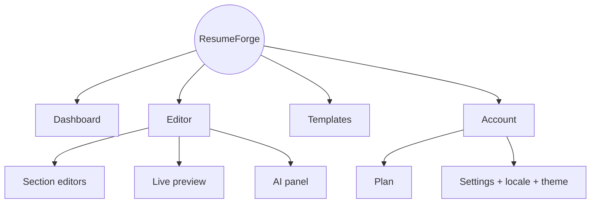

# ResumeForge — UI/UX Design System

> An implementable design system: IA, color, type, spacing, tokens (copy-pasteable CSS vars), component taxonomy, motion, and WCAG 2.2 AA accessibility. Dark theme is default.

## Table of Contents
1. [Information Architecture](#1-information-architecture)
2. [Brand & Mood](#2-brand--mood)
3. [Color System](#3-color-system)
4. [Typography](#4-typography)
5. [Spacing & Layout](#5-spacing--layout)
6. [Design Tokens (CSS)](#6-design-tokens-copy-pasteable-css)
7. [Component Taxonomy](#7-component-taxonomy--states)
8. [Motion](#8-motion)
9. [Accessibility (WCAG 2.2 AA)](#9-accessibility-wcag-22-aa)
10. [Checklist](#10-checklist)

---

## 1. Information Architecture



Primary nav: Dashboard · Templates · Account. The editor is a focused 3-pane workspace (sections | preview | assistant) with a collapsible assistant.

## 2. Brand & Mood
Confident, warm, precise — a "quiet power tool" with a human touch. Editorial typography meets a teal brand accent and an amber highlight for AI moments; generous whitespace on warm-neutral (not cold-blue) surfaces so the document feels like paper, not a dashboard.

## 3. Color System

**Brand (teal) scale**
| Token | Hex |
|-------|-----|
| accent-50 | #f0fdfa |
| accent-400 | #2dd4bf |
| accent-500 | #14b8a6 |
| accent-600 | #0d9488 |
| accent-700 | #0f766e |

**Highlight (amber) — AI / streaming moments**
| Token | Hex |
|-------|-----|
| highlight-300 | #fcd34d |
| highlight-400 | #fbbf24 |
| highlight-500 | #f59e0b |
| highlight-600 | #d97706 |

**Neutrals — warm stone (light) / zinc (dark)**
| Token | Light | Dark |
|-------|-------|------|
| neutral-0 (bg) | #fffdf9 | #09090b |
| neutral-100 (surface) | #faf8f4 | #18181b |
| neutral-200 (surface-2) | #f0ede4 | #27272a |
| neutral-400 (border/muted) | #d9d2c2 / #78716c | #3f3f46 / #a1a1aa |
| neutral-900 (text) | #1c1917 | #fafaf9 |

**Semantic**
| Role | Light | Dark |
|------|-------|------|
| success | #15803d | #4ade80 |
| warning | #b45309 | #fbbf24 |
| danger | #b91c1c | #f87171 |
| info | #0369a1 | #38bdf8 |

**Theme mapping & contrast**
| Surface | Light | Dark | Contrast |
|---------|-------|------|----------|
| bg | #fffdf9 | #09090b | — |
| surface | #faf8f4 | #18181b | — |
| text primary | #1c1917 on bg | #fafaf9 on bg | ≥ 15:1 |
| text muted | #57534e | #a1a1aa | ≥ 4.5:1 |
| accent text | #0f766e (accent-700) | #2dd4bf (accent-400) | ≥ 4.5:1 |
| highlight text | #92400e (on light bg) | #fbbf24 (on dark bg) | ≥ 4.5:1 |
All text/interactive pairs meet WCAG AA (≥4.5:1 body, ≥3:1 large/UI). The teal/amber pair is checked for deuteranopia/protanopia confusion — sufficient lightness + hue separation, and never used as the *only* signal (icons/text accompany color).

## 4. Typography
| Use | Family (fallbacks) | Size (rem) | Weight | Line-height |
|-----|--------------------|-----------|--------|-------------|
| Display | "Fraunces", Georgia, serif | 3.0 | 600 | 1.1 |
| H1 | "Inter", system-ui, sans-serif | 2.0 | 700 | 1.2 |
| H2 | Inter | 1.5 | 600 | 1.3 |
| Body | Inter | 1.0 | 400 | 1.6 |
| Small | Inter | 0.875 | 400 | 1.5 |
| Mono (resume/code) | "JetBrains Mono", monospace | 0.875 | 400 | 1.5 |

Type scale (1.25 ratio): 0.8 · 1.0 · 1.25 · 1.5 · 2.0 · 3.0 rem.

## 5. Spacing & Layout
- **Base unit:** 4px. Scale: 4·8·12·16·24·32·48·64.
- **Grid:** 12-col, 72rem max content, 24px gutters.
- **Breakpoints:** sm 640 · md 768 · lg 1024 · xl 1280 · 2xl 1536.
- **Editor layout:** 3-pane on ≥lg (sections 30% / preview 45% / assistant 25%); stacks/tabs on smaller.

## 6. Design Tokens (copy-pasteable CSS)

```css
:root {
  /* color */
  --rf-accent-400:#2dd4bf; --rf-accent-500:#14b8a6; --rf-accent-600:#0d9488; --rf-accent-700:#0f766e;
  --rf-highlight-300:#fcd34d; --rf-highlight-400:#fbbf24; --rf-highlight-500:#f59e0b; --rf-highlight-600:#d97706;
  --rf-success:#16a34a; --rf-warning:#d97706; --rf-danger:#dc2626; --rf-info:#0284c7;
  /* spacing */
  --rf-space-1:4px; --rf-space-2:8px; --rf-space-3:12px; --rf-space-4:16px;
  --rf-space-6:24px; --rf-space-8:32px; --rf-space-12:48px; --rf-space-16:64px;
  /* radius */
  --rf-radius-sm:6px; --rf-radius-md:10px; --rf-radius-lg:16px; --rf-radius-full:9999px;
  /* shadow */
  --rf-shadow-sm:0 1px 2px rgb(28 25 23 / .08);
  --rf-shadow-md:0 4px 12px rgb(28 25 23 / .12);
  --rf-shadow-lg:0 12px 32px rgb(28 25 23 / .24);
  /* type */
  --rf-font-sans:"Inter",system-ui,sans-serif;
  --rf-font-serif:"Fraunces",Georgia,serif;
  --rf-font-mono:"JetBrains Mono",monospace;
  /* z-index */
  --rf-z-drawer:40; --rf-z-modal:50; --rf-z-toast:60; --rf-z-cmdk:70;
  /* motion */
  --rf-dur-fast:120ms; --rf-dur-base:200ms; --rf-dur-slow:320ms;
  --rf-ease:cubic-bezier(.2,.8,.2,1);
}
/* Dark is default */
:root, [data-theme="dark"] {
  --rf-bg:#09090b; --rf-surface:#18181b; --rf-surface-2:#27272a;
  --rf-text:#fafaf9; --rf-text-muted:#a1a1aa; --rf-border:#3f3f46;
  --rf-accent:var(--rf-accent-400); --rf-highlight:var(--rf-highlight-400);
}
[data-theme="light"] {
  --rf-bg:#fffdf9; --rf-surface:#faf8f4; --rf-surface-2:#f0ede4;
  --rf-text:#1c1917; --rf-text-muted:#57534e; --rf-border:#e7e2d6;
  --rf-accent:var(--rf-accent-600); --rf-highlight:var(--rf-highlight-600);
}
```

## 7. Component Taxonomy & States

| Level | Components | Required states |
|-------|-----------|-----------------|
| Atoms | Button, Input, Badge, Avatar, Icon, Spinner, StreamingCaret | default / hover / focus-visible / active / disabled / loading |
| Molecules | FormField, ResumeCard, TemplateThumb, ScoreGauge, SuggestionBubble | + error / empty / selected |
| Organisms | SectionEditor, LivePreview, AssistantPanel, VirtualGallery, BillingCard, CommandPalette | + loading-skeleton / empty / error / streaming |
| Templates | EditorWorkspace (3-pane), DashboardGrid, AuthLayout | responsive variants |

Every interactive element defines default/hover/focus-visible/active/disabled; async ones add loading/empty/error; AI surfaces add a streaming state.

## 8. Motion
- Durations: fast 120ms (hover), base 200ms (enter/exit), slow 320ms (drawer/modal).
- Easing: `cubic-bezier(.2,.8,.2,1)`.
- Streaming text appends smoothly via rAF; caret blinks at 1s.
- **`prefers-reduced-motion: reduce`** → disable non-essential transitions, no caret blink, instant token reveal.

## 9. Accessibility (WCAG 2.2 AA)
- [ ] Contrast ≥ 4.5:1 body, ≥ 3:1 large/UI.
- [ ] Visible `:focus-visible` ring (2px accent, 2px offset) on all interactives.
- [ ] Full keyboard operability; logical tab order; Escape closes overlays.
- [ ] Semantic landmarks (`header/nav/main/aside`); one `h1` per view.
- [ ] AI streaming region `aria-live="polite"`; Stop button reachable by keyboard.
- [ ] Command palette `Ctrl/Cmd+K` with focus trap + restore.
- [ ] Form fields have labels + `aria-invalid` + inline error text.
- [ ] Respect `prefers-reduced-motion`.
- [ ] RTL support via logical properties + `dir="rtl"`.

**Keyboard map:** `Ctrl/Cmd+K` palette · `Ctrl/Cmd+Z / Shift+Z` undo/redo · `Ctrl/Cmd+Enter` send to AI · `Esc` cancel stream/close · `Ctrl/Cmd+S` save · `Ctrl/Cmd+E` export.

## 10. Checklist
- [x] IA/sitemap diagram
- [x] Color scales + light/dark + contrast notes
- [x] Type scale + families
- [x] Token block as CSS custom properties
- [x] Component taxonomy with states
- [x] WCAG 2.2 AA checklist + keyboard map

## Next deliverable
→ [06-Delivery-Plan.md](06-Delivery-Plan.md)

