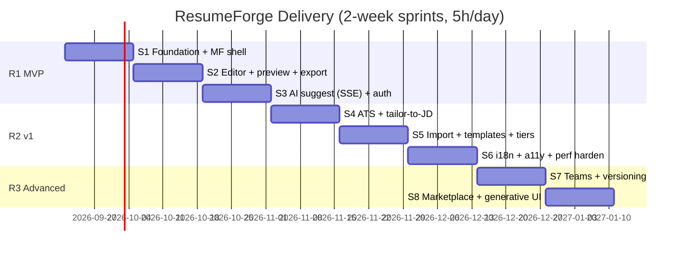
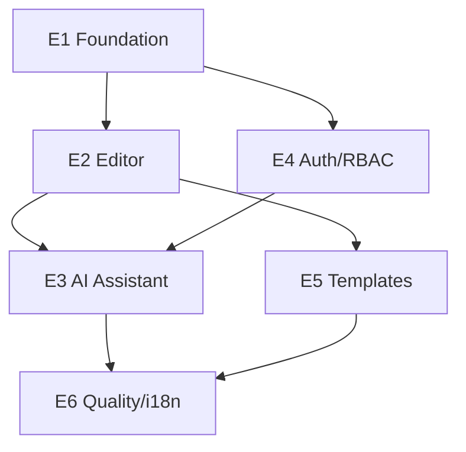

# ResumeForge — Delivery Plan (Agile)

> Sprint plan for a solo senior dev at **5 focused hours/day** (~50 hrs/2-week sprint). Epics → Features → Stories (INVEST, Given/When/Then) → Tasks (≤5h) with one fully-worked LLD.

## Table of Contents
1. [Release Plan & Timeline](#1-release-plan--timeline)
2. [Epics](#2-epics)
3. [Sprint Breakdown](#3-sprint-breakdown)
4. [Worked Example: Epic → Feature → Story → Tasks → LLD](#4-worked-example-epic--feature--story--tasks--lld)
5. [Definition of Ready / Done](#5-definition-of-ready--done)
6. [Dependency & Sequencing](#6-dependency--sequencing)
7. [Checklist](#7-checklist)

---

## 1. Release Plan & Timeline



## 2. Epics
| ID | Epic | Outcome |
|----|------|---------|
| E1 | Platform foundation | Monorepo, MF shell + remotes, CI, design tokens |
| E2 | Resume editor | Document model, section editors, live preview, export |
| E3 | AI assistant | Streaming suggest, tailor-to-JD, ATS analysis, tool-calls |
| E4 | Accounts & billing | OIDC auth, RBAC tiers, billing, feature flags |
| E5 | Templates | Gallery, theme engine, marketplace |
| E6 | Quality & reach | Testing ≥90%, a11y, perf budgets, i18n |

## 3. Sprint Breakdown

| Sprint | Focus | Key stories |
|--------|-------|-------------|
| **S1** | Foundation | Turborepo+pnpm, Rspack MF shell+remotes, tokens/UI lib, CI matrix, MSW BFF mocks |
| **S2** | Editor | Zustand doc store + undo/redo, section editors (RHF+Zod), live preview, PDF export |
| **S3** | AI + Auth | SSE client hook, streaming suggestion UI + Stop, Accept→patch, OIDC/PKCE login, session guard |
| **S4** | ATS + Tailor | ATS score gauge + report, tailor-to-JD flow, keyword coverage viz |
| **S5** | Import + Templates + Tiers | PDF/DOCX import parse, virtual gallery + theme engine, plan gating + upgrade modal |
| **S6** | Reach | i18n (5 locales + RTL), a11y pass (axe), CWV budgets + Lighthouse CI |
| **S7** | Teams | Sharing/seats, resume versioning/history, brand templates |
| **S8** | Advanced AI | Generative-UI typed tool-calls, template marketplace, offline draft |

Each story carries its own unit + E2E test tasks so coverage stays ≥90%.

## 4. Worked Example: Epic → Feature → Story → Tasks → LLD

**Epic E3 — AI Assistant**
**Feature E3.F1 — Streaming resume suggestions**

**Story E3.F1.S1 — Stream an "improve section" suggestion**
> **Given** an authenticated user under their AI limit viewing a section,
> **When** they click "Improve with AI",
> **Then** tokens stream into the assistant panel with a live caret and a Stop button, and on completion an "Accept" action appears.

- Story points: 5 · INVEST-compliant · Day plan: 1 day (5h).

**Tasks (each ≤5h):**
| # | Task | Est |
|---|------|-----|
| T1 | `useSSE` hook: `fetch`+`ReadableStream`, parse `delta`/`toolCall`/`done`, `AbortController` | 3h |
| T2 | `AssistantPanel` streaming UI: `aria-live` region, caret, Stop, rAF flush | 3h |
| T3 | Accept flow: validate `ResumePatch` (Zod) → `applyPatch` to Zustand (undoable) | 2h |
| T4 | Limit guard: block + upgrade modal when over quota | 2h |
| T5 | Unit tests (hook + panel + patch) with MSW SSE mock | 3h |
| T6 | E2E (Playwright): request → stream → stop → accept | 2h |

**LLD — `useSSE` + AssistantPanel**
```ts
// contract
type SSEEvent =
  | { type: 'delta'; text: string }
  | { type: 'toolCall'; patch: ResumePatch }
  | { type: 'error'; message: string }
  | { type: 'done' };

interface UseSSE {
  start: (body: SuggestRequest) => void;
  stop: () => void;               // aborts, preserves partial text
  text: string;                    // accumulated tokens
  patch?: ResumePatch;             // typed tool-call result
  status: 'idle' | 'streaming' | 'done' | 'error';
}

function useSSE(url: string): UseSSE { /* fetch + reader.read() loop + rAF buffer */ }
```
```ts
// AssistantPanel props
interface AssistantPanelProps {
  docId: string;
  section: SectionId;
  onAccept: (patch: ResumePatch) => void; // -> editor store applyPatch
}
```
- **State:** local `useSSE` state; editor doc via shared Zustand (`applyPatch`, `undo`).
- **API:** `POST /ai/suggest` (SSE).
- **Test list:** streams tokens in order · Stop preserves partial · invalid patch rejected · over-limit blocks stream · a11y: region announced, Stop keyboard-focusable.

## 5. Definition of Ready / Done
**Ready:** story has AC (G/W/T), design tokens/components referenced, contract types exist in `@resumeforge/contracts`, no blocking dep.
**Done:** code + unit + E2E pass, coverage ≥90% for touched files, a11y (axe) clean, lint/type clean, docs/changelog updated, feature flag wired, reviewed & merged via CI.

## 6. Dependency & Sequencing



## 7. Checklist
- [x] Sprints sized for 5h/day (~50h/sprint)
- [x] Epic→Feature→Story→Task hierarchy
- [x] Tasks ≤ 5h each
- [x] One fully worked LLD with test list
- [x] Gantt + dependency diagrams
- [x] DoR / DoD defined

## Next deliverable
→ [07-Security-Auth.md](07-Security-Auth.md)

