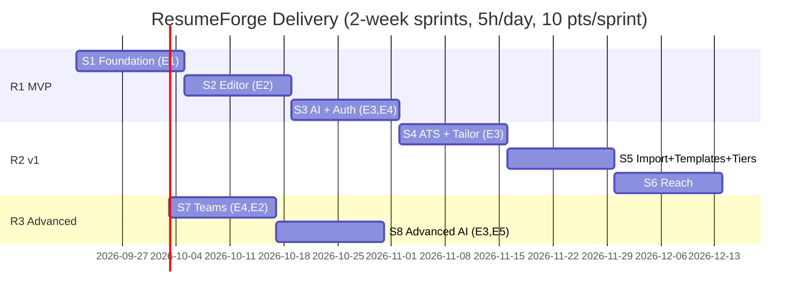
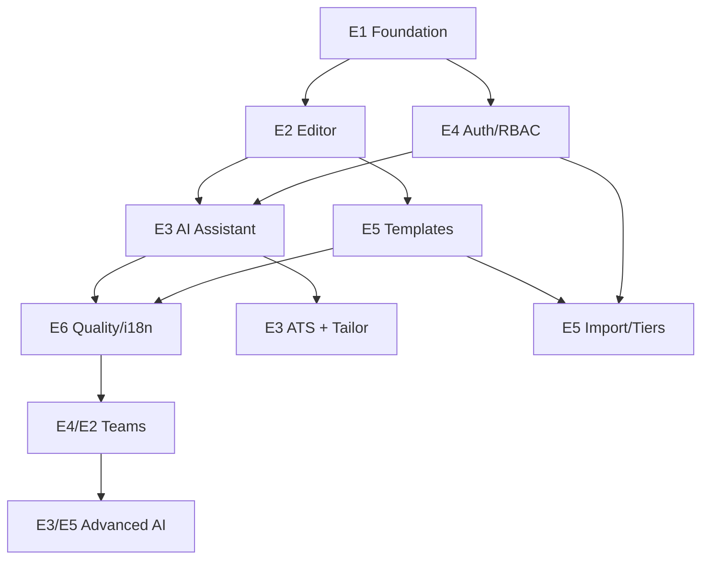

# ResumeForge — Delivery Plan (Agile)

> A hand-off-ready delivery plan for a solo senior dev at **5 focused hours/day** (~50 hrs / 2-week sprint, ≈10 story points/sprint at ~5h/point). Full **Epic → Feature → Story → Task** hierarchy for **every sprint** — INVEST stories, Given/When/Then acceptance criteria, hour-and-day-costed tasks, and a flat backlog export table so this can be dropped straight into Jira/Azure DevOps (TFS) and picked up by anyone.

## Table of Contents
1. [How to Use This Plan](#1-how-to-use-this-plan)
2. [Release Plan & Timeline](#2-release-plan--timeline)
3. [Epics](#3-epics)
4. [Sprint 1 — Foundation (E1)](#sprint-1--foundation-e1)
5. [Sprint 2 — Editor (E2)](#sprint-2--editor-e2)
6. [Sprint 3 — AI + Auth (E3, E4)](#sprint-3--ai--auth-e3-e4)
7. [Sprint 4 — ATS + Tailor (E3)](#sprint-4--ats--tailor-e3)
8. [Sprint 5 — Import + Templates + Tiers (E5, E4)](#sprint-5--import--templates--tiers-e5-e4)
9. [Sprint 6 — Reach: i18n, a11y, Performance (E6)](#sprint-6--reach-i18n-a11y-performance-e6)
10. [Sprint 7 — Teams (E4, E2)](#sprint-7--teams-e4-e2)
11. [Sprint 8 — Advanced AI (E3, E5)](#sprint-8--advanced-ai-e3-e5)
12. [LLDs (one per epic)](#12-llds-one-per-epic)
13. [Definition of Ready / Done](#13-definition-of-ready--done)
14. [Dependency & Sequencing](#14-dependency--sequencing)
15. [Backlog Export (Jira/TFS-ready CSV table)](#15-backlog-export-jiratfs-ready-csv-table)
16. [Checklist](#16-checklist)

---

## 1. How to Use This Plan

**ID scheme** (mirrors Jira Epic/Story/Sub-task and TFS Epic/Feature/PBI/Task):

| Level | ID pattern | Example | Jira equivalent | TFS equivalent |
|-------|-----------|---------|------------------|-----------------|
| Epic | `E<n>` | `E3` | Epic | Epic |
| Feature | `E<n>.F<n>` | `E3.F1` | (Epic-level label) | Feature |
| Story | `RF-<3-digit>` | `RF-301` | Story | Product Backlog Item |
| Task | `RF-<story>.T<n>` | `RF-301.T1` | Sub-task | Task |

**Numbering:** the story's hundreds digit = epic number (e.g. `RF-3xx` = Epic 3 stories), so anyone can tell which epic a ticket belongs to at a glance.

**How to import:** copy the [flat backlog table](#15-backlog-export-jiratfs-ready-csv-table) into a `.csv` and bulk-import as Stories; each story's task table becomes its sub-tasks/checklist.

**Estimating convention:** 1 story point ≈ 5 focused hours ≈ 1 day. Sprint capacity = 10 points / 50 hours / 10 working days. Every **task ≤ 5h** (one sitting); every **story bundles its own test tasks** so coverage never lags behind features.

**Story card template used below:**
```
### RF-XXX — <Title>                                    [Epic Ex.Fy · N pts]
As a <role>, I want <capability>, so that <benefit>.

Acceptance Criteria (Given/When/Then):
- Given ... When ... Then ...

Depends on: <story IDs or "none">
Tasks (≤5h each):
| Task ID     | Task                          | Hours | Day |
|-------------|--------------------------------|------:|:---:|
| RF-XXX.T1   | ...                             | 3h    | D1  |

Definition of Done: see §13.
```

---

## 2. Release Plan & Timeline



**Sprint capacity model** (applies to every sprint below): 10 working days × 5h = 50h ≈ 10 points. Day columns in task tables (`D1`–`D10`) assume this cadence; slide dates to your own calendar.

---

## 3. Epics

| ID | Epic | Outcome | Features |
|----|------|---------|----------|
| E1 | Platform foundation | Monorepo, MF shell + remotes, CI, design tokens | F1 Monorepo & tooling · F2 MF shell/remotes · F3 Design system bootstrap |
| E2 | Resume editor | Document model, section editors, live preview, export | F1 Document model & store · F2 Section editors · F3 Live preview · F4 Export |
| E3 | AI assistant | Streaming suggest, tailor-to-JD, ATS analysis, tool-calls | F1 Streaming suggestions · F2 ATS analysis · F3 Tailor-to-JD · F4 Generative UI |
| E4 | Accounts & billing | OIDC auth, RBAC tiers, billing, feature flags | F1 Auth · F2 Plan/RBAC · F3 Billing · F4 Teams |
| E5 | Templates | Gallery, theme engine, marketplace | F1 Gallery · F2 Theme engine · F3 Marketplace |
| E6 | Quality & reach | Testing ≥90%, a11y, perf budgets, i18n | F1 i18n/RTL · F2 Accessibility · F3 Performance |

---

## Sprint 1 — Foundation (E1)

**Sprint goal:** a working Rspack Module-Federation shell + one remote is running locally and in CI, with the shared design-token library wired in. **Capacity:** 10 pts / 50h.

| Story | Title | Pts |
|-------|-------|----:|
| RF-101 | Monorepo & tooling bootstrap | 3 |
| RF-102 | Module Federation shell + remote skeleton | 5 |
| RF-103 | Shared design tokens & UI primitives | 2 |

### RF-101 — Monorepo & tooling bootstrap                     [E1.F1 · 3 pts]
As a developer, I want a working pnpm+Turborepo monorepo with lint/format/test wired, so that every subsequent story has a consistent, CI-checked foundation.

**AC:**
- Given a clean checkout, When I run `pnpm install && pnpm build`, Then all workspace packages build with zero errors.
- Given a PR is opened, When CI runs, Then lint + typecheck + unit tests execute and block merge on failure.

Depends on: none
| Task ID | Task | Hours | Day |
|---------|------|------:|:---:|
| RF-101.T1 | `pnpm-workspace.yaml` + `turbo.json` + root `package.json` scripts | 2h | D1 |
| RF-101.T2 | Shared `tsconfig.base.json`, ESLint flat config, Prettier | 3h | D1 |
| RF-101.T3 | `packages/contracts` + `packages/ui` + `packages/config` scaffolds | 3h | D2 |
| RF-101.T4 | GitHub Actions CI matrix (lint/typecheck/test per package) | 3h | D2 |
| RF-101.T5 | Husky + lint-staged + commitlint (Conventional Commits) | 2h | D3 |
| RF-101.T6 | Unit test harness smoke test (Vitest config + 1 passing test per package) | 2h | D3 |

### RF-102 — Module Federation shell + remote skeleton         [E1.F2 · 5 pts]
As a developer, I want a shell host that dynamically loads a lazy-federated remote, so that future features can ship as independently deployable micro-frontends.

**AC:**
- Given the shell and `editor` remote are running, When I navigate to `/editor/demo`, Then the remote's placeholder component renders inside the shell layout.
- Given the `editor` remote fails to load, When the route is visited, Then an error-boundary fallback renders instead of a blank/crashed page.
- Given react/router/query are declared shared singletons, When both apps run together, Then only one copy of each loads (verified via bundle analyzer).

Depends on: RF-101
| Task ID | Task | Hours | Day |
|---------|------|------:|:---:|
| RF-102.T1 | `apps/shell` Rspack config + dev server + base layout/router | 4h | D4 |
| RF-102.T2 | `apps/editor` Rspack config + `ModuleFederationPlugin` (`exposes`) | 3h | D4 |
| RF-102.T3 | Shell `remotes` config + shared singleton versions (react/router/query) | 3h | D5 |
| RF-102.T4 | `React.lazy` + `Suspense` + per-remote error boundary in shell | 3h | D5 |
| RF-102.T5 | Bundle-analyzer check: no duplicate React/ReactDOM in output | 2h | D6 |
| RF-102.T6 | Integration test: shell renders remote; error boundary test (remote import rejected) | 4h | D6 |
| RF-102.T7 | Contract check script: remote `exposes` match shell's expected module map | 3h | D7 |

### RF-103 — Shared design tokens & UI primitives                [E1.F3 · 2 pts]
As a developer, I want the design tokens and base primitives (button, input, card, badge) published as a shared package, so that every remote looks and behaves consistently from day one.

**AC:**
- Given `packages/ui` is installed in a remote, When a component imports `tokens.css`, Then dark theme renders by default and light theme via `data-theme="light"`.
- Given a `<Button variant="primary">`, When rendered, Then it meets WCAG AA contrast and shows a visible focus ring on keyboard focus.

Depends on: RF-101
| Task ID | Task | Hours | Day |
|---------|------|------:|:---:|
| RF-103.T1 | Port token CSS vars from `05-UIUX-Design.md` into `packages/ui/tokens.css` | 3h | D8 |
| RF-103.T2 | `Button`, `Input`, `Card`, `Badge` primitives (Radix + Tailwind) | 4h | D8–D9 |
| RF-103.T3 | Storybook (or a static preview page) for the primitives | 2h | D9 |
| RF-103.T4 | axe unit tests for each primitive (default/hover/focus/disabled) | 3h | D10 |

**Sprint 1 total:** 10 pts / 50h.

---

## Sprint 2 — Editor (E2)

**Sprint goal:** a user can create a resume, edit its sections, see a live preview, and export a PDF. **Capacity:** 10 pts / 50h.

| Story | Title | Pts |
|-------|-------|----:|
| RF-201 | Resume document model + Zustand store (undo/redo) | 3 |
| RF-202 | Section editors (summary/experience/skills) with RHF+Zod | 3 |
| RF-203 | Live preview pane synced to the store | 2 |
| RF-204 | PDF export | 2 |

### RF-201 — Resume document model + Zustand store (undo/redo)   [E2.F1 · 3 pts]
As a developer, I want a typed `ResumeDoc` model and an undoable Zustand store, so that all editor features share one consistent, patchable source of truth.

**AC:**
- Given a loaded `ResumeDoc`, When `applyPatch` is called with a valid `ResumePatch`, Then the store updates and the change is undoable via `undo()`.
- Given an invalid patch (fails Zod parse), When `applyPatch` is called, Then the store is unchanged and an error is surfaced.

Depends on: RF-101, RF-103
| Task ID | Task | Hours | Day |
|---------|------|------:|:---:|
| RF-201.T1 | `ResumeDoc`/`ResumePatch` Zod schemas in `packages/contracts` | 3h | D1 |
| RF-201.T2 | `resumeStore.ts` (Zustand) with `past`/`future` undo/redo stacks | 4h | D1–D2 |
| RF-201.T3 | `applyPatch` reducer (JSON-pointer based replace/insert/remove) | 3h | D2 |
| RF-201.T4 | Unit tests: apply/undo/redo, invalid-patch rejection, redo-cleared-on-new-patch | 3h | D3 |
| RF-201.T5 | Seed/factory helper (`resumeFactory()`) for tests + storybook | 2h | D3 |

### RF-202 — Section editors (summary/experience/skills)          [E2.F2 · 3 pts]
As a job seeker, I want to edit my summary, experience, and skills in structured forms, so that my resume data stays valid and well-formatted.

**AC:**
- Given the summary field is empty, When I try to save, Then a validation error shows inline and the field is marked `aria-invalid`.
- Given I add an experience entry, When I fill required fields and blur, Then the entry is patched into the store without a full-page save action.

Depends on: RF-201
| Task ID | Task | Hours | Day |
|---------|------|------:|:---:|
| RF-202.T1 | `SummaryEditor` (RHF + Zod, debounced patch on change) | 3h | D4 |
| RF-202.T2 | `ExperienceEditor` (repeatable field array, add/remove/reorder) | 4h | D4–D5 |
| RF-202.T3 | `SkillsEditor` (tag input) | 2h | D5 |
| RF-202.T4 | Wire all three editors to `applyPatch`; shared `rf-field` styling | 2h | D6 |
| RF-202.T5 | Component tests (RTL): validation errors, add/remove experience row | 4h | D6 |

### RF-203 — Live preview pane synced to the store                [E2.F3 · 2 pts]
As a job seeker, I want to see my resume rendered as I type, so that I always know what the exported document will look like.

**AC:**
- Given I edit the summary field, When the debounce window elapses (~120ms), Then the preview pane updates without noticeable jank (no dropped frames on a mid-tier laptop).
- Given the document is empty, When I open the editor, Then the preview shows friendly placeholder text, not a blank page.

Depends on: RF-201, RF-202
| Task ID | Task | Hours | Day |
|---------|------|------:|:---:|
| RF-203.T1 | `LivePreview` component subscribed to `resumeStore` (memoized) | 3h | D7 |
| RF-203.T2 | Debounce store→preview updates (~120ms) to avoid layout thrash | 2h | D7 |
| RF-203.T3 | Empty/placeholder state + skeleton while doc loads | 2h | D8 |
| RF-203.T4 | Integration test: typing in summary reflects in preview within debounce window | 3h | D8 |

### RF-204 — PDF export                                          [E2.F4 · 2 pts]
As a job seeker, I want to export my resume as a PDF, so that I can submit it to job applications.

**AC:**
- Given a completed resume, When I click "Export PDF", Then a vector PDF downloads matching the on-screen preview layout.
- Given the export is in progress, When it takes longer than 300ms, Then a loading state is shown on the export button.

Depends on: RF-203
| Task ID | Task | Hours | Day |
|---------|------|------:|:---:|
| RF-204.T1 | `@react-pdf/renderer` document template mapped from `ResumeDoc` | 4h | D9 |
| RF-204.T2 | Export button + loading/disabled state + error toast on failure | 2h | D9 |
| RF-204.T3 | E2E (Playwright): create resume → export → file downloaded | 4h | D10 |

**Sprint 2 total:** 10 pts / 50h.

---

## Sprint 3 — AI + Auth (E3, E4)

**Sprint goal:** a logged-in user can stream an AI suggestion and accept it into their resume. **Capacity:** 10 pts / 50h.

| Story | Title | Pts |
|-------|-------|----:|
| RF-301 | `useSSE` streaming hook + BFF mock contract | 3 |
| RF-302 | AssistantPanel streaming UI + Accept flow | 3 |
| RF-303 | OIDC/PKCE login via BFF + session guard | 3 |
| RF-304 | AI quota limit guard + upgrade modal | 1 |

### RF-301 — `useSSE` streaming hook + BFF mock contract          [E3.F1 · 3 pts]
As a developer, I want a reusable SSE-streaming hook against the documented BFF contract, so that any AI feature can stream tokens with cancellation.

**AC:**
- Given a `/ai/suggest` MSW mock emits `delta`/`toolCall`/`done` events, When `start()` is called, Then `text` accumulates in order and `status` transitions idle→streaming→done.
- Given `stop()` is called mid-stream, When the fetch aborts, Then `text` retains the partial content and `status` becomes `done`.

Depends on: RF-201 (for `ResumePatch` type)
| Task ID | Task | Hours | Day |
|---------|------|------:|:---:|
| RF-301.T1 | `SSEEvent` types + `parseSSE` frame parser (`event:`/`data:` parsing) | 3h | D1 |
| RF-301.T2 | `useSSE` hook: `fetch` + `ReadableStream` + `AbortController` + rAF flush buffer | 3h | D1 |
| RF-301.T3 | MSW SSE handler factory (scripted token arrays) for tests/dev | 3h | D2 |
| RF-301.T4 | Unit tests: token order, stop-preserves-partial, error event handling | 3h | D2 |

### RF-302 — AssistantPanel streaming UI + Accept flow            [E3.F1 · 3 pts]
As a job seeker, I want to ask the AI to improve a section and accept the result, so that my resume improves with one click.

**AC:**
- Given I click "Improve with AI", When tokens stream in, Then they render with a live caret in an `aria-live="polite"` region and a Stop button is available.
- Given streaming finishes, When a valid `ResumePatch` tool-call was returned, Then an "Accept" button appears; accepting applies the patch (undoable) to the editor store.

Depends on: RF-301, RF-201
| Task ID | Task | Hours | Day |
|---------|------|------:|:---:|
| RF-302.T1 | `AssistantPanel` UI: Improve/Stop/Accept buttons + streaming text region | 3h | D3 |
| RF-302.T2 | Accept handler: Zod-validate `ResumePatch` → `applyPatch` on store | 2h | D3 |
| RF-302.T3 | Caret + reduced-motion handling; keyboard-focusable Stop | 2h | D4 |
| RF-302.T4 | Component tests (RTL + MSW): full stream→stop→accept happy/edge paths | 4h | D4 |
| RF-302.T5 | E2E (Playwright): request → stream → stop → accept → preview updates | 4h | D5 |

### RF-303 — OIDC/PKCE login via BFF + session guard              [E4.F1 · 3 pts]
As a user, I want to sign in securely, so that my resumes and plan are tied to my account.

**AC:**
- Given I click "Log in", When I complete the IdP flow, Then the BFF sets an httpOnly session cookie and I land on `/dashboard` authenticated.
- Given I am not authenticated, When I visit a protected route, Then I am redirected to `/login`.
- Given my session expires, When I make an API call, Then the BFF silently refreshes or I'm prompted to re-authenticate — never a silent data loss.

Depends on: RF-101
| Task ID | Task | Hours | Day |
|---------|------|------:|:---:|
| RF-303.T1 | BFF `/auth/login`, `/auth/callback`, `/auth/logout` (PKCE, session cookie) [mocked for FE dev] | 4h | D6 |
| RF-303.T2 | `useSession()` hook + `/me` fetch + `RequireAuth` route guard | 3h | D6 |
| RF-303.T3 | Login screen wiring (redirect flow) + logout action | 2h | D7 |
| RF-303.T4 | CSRF header wiring on state-changing requests | 2h | D7 |
| RF-303.T5 | Integration tests: guarded route redirects; authenticated session hydrates `/me` | 4h | D8 |

### RF-304 — AI quota limit guard + upgrade modal                 [E4.F2 · 1 pt]
As a Free-tier user, I want to see an upgrade prompt when I hit my daily AI limit, so that I understand why the assistant stopped and how to unlock more.

**AC:**
- Given a Free user has used 10 AI actions today, When they click "Improve with AI", Then the request is blocked client-side (no stream starts) and an upgrade modal appears.
- Given the BFF also returns `429` for the same condition, When it happens without a client-side block (stale cache), Then the same upgrade modal renders from the error event.

Depends on: RF-302, RF-303
| Task ID | Task | Hours | Day |
|---------|------|------:|:---:|
| RF-304.T1 | `RequirePlan`/quota check hook reading `/me` plan + usage | 2h | D9 |
| RF-304.T2 | Upgrade modal component + wiring on client-block and `429` paths | 2h | D9 |
| RF-304.T3 | Tests: over-limit blocks stream; `429` triggers same modal | 1h | D10 |

**Sprint 3 total:** 10 pts / 50h.

---

## Sprint 4 — ATS + Tailor (E3)

**Sprint goal:** a user gets a live ATS score with a gap report, and can tailor their resume to a pasted job description. **Capacity:** 10 pts / 50h.

| Story | Title | Pts |
|-------|-------|----:|
| RF-401 | ATS scoring engine (BFF endpoint + client contract) | 3 |
| RF-402 | ATS score gauge + keyword report UI | 2 |
| RF-403 | Tailor-to-JD streaming flow | 3 |
| RF-404 | Cover letter generator | 2 |

### RF-401 — ATS scoring engine (BFF endpoint + client contract)  [E3.F2 · 3 pts]
As a job seeker, I want an ATS score computed for my resume, so that I know how likely it is to pass automated filters.

**AC:**
- Given a `ResumeDoc`, When `/ats/analyze` streams, Then it emits progressive `atsScore` events culminating in a final score (0–100) and a list of missing keywords.
- Given the score is advisory, When displayed, Then a "not a guarantee" disclaimer is always visible near the score.

Depends on: RF-201, RF-301
| Task ID | Task | Hours | Day |
|---------|------|------:|:---:|
| RF-401.T1 | `AssistantResult`/`atsScore` event contract in `packages/contracts` | 2h | D1 |
| RF-401.T2 | MSW mock for `/ats/analyze` streaming score + keyword gaps | 3h | D1 |
| RF-401.T3 | `useAtsScore` hook (wraps `useSSE`, exposes `score`, `missing[]`) | 3h | D2 |
| RF-401.T4 | Unit tests: progressive score updates, final value, disclaimer render | 3h | D2 |
| RF-401.T5 | Recompute trigger: score refreshes after any accepted patch | 4h | D3 |

### RF-402 — ATS score gauge + keyword report UI                  [E3.F2 · 2 pts]
As a job seeker, I want a visual score gauge and a keyword gap list, so that I can quickly see what to fix.

**AC:**
- Given a score of 82, When the gauge renders, Then it visually fills to 82% with the numeric value in the center and an accessible label (`aria-label="ATS score 82"`).
- Given missing keywords exist, When the report renders, Then each is listed with a one-click "ask AI to add" affordance.

Depends on: RF-401
| Task ID | Task | Hours | Day |
|---------|------|------:|:---:|
| RF-402.T1 | `ScoreGauge` component (conic-gradient, accessible label) | 2h | D4 |
| RF-402.T2 | `KeywordReport` list + "ask AI to add" action → triggers RF-302 flow | 3h | D4 |
| RF-402.T3 | Recharts keyword-coverage bar chart | 2h | D5 |
| RF-402.T4 | Component + a11y tests (axe) for gauge and report | 3h | D5 |

### RF-403 — Tailor-to-JD streaming flow                          [E3.F3 · 3 pts]
As a job seeker, I want to paste a job description and have the AI tailor my resume to it, so that I don't manually keyword-match every application.

**AC:**
- Given I paste a job description and click "Tailor", When the AI streams, Then multiple patches arrive and are previewed before I accept them individually or all at once.
- Given the JD field is empty, When I click "Tailor", Then the action is disabled with inline guidance.

Depends on: RF-302, RF-401
| Task ID | Task | Hours | Day |
|---------|------|------:|:---:|
| RF-403.T1 | JD textarea + validation (non-empty, max length) | 2h | D6 |
| RF-403.T2 | `/ai/tailor` streaming wiring (reuses `useSSE`) + multi-patch preview list | 4h | D6–D7 |
| RF-403.T3 | "Accept all" / "accept individually" controls, each undoable | 3h | D7 |
| RF-403.T4 | Component tests: multi-patch stream, partial accept, accept-all | 4h | D8 |
| RF-403.T5 | E2E: paste JD → stream → accept → ATS score increases | 2h | D8 |

### RF-404 — Cover letter generator                               [E3.F1 · 2 pts]
As a job seeker, I want a cover letter generated from my resume and the job description, so that I have a complete application package.

**AC:**
- Given a resume and JD are available, When I click "Generate cover letter", Then a streamed draft appears in an editable text area.
- Given the draft is generated, When I click "Copy" or "Export", Then the letter is copied to clipboard or exported alongside the resume.

Depends on: RF-301, RF-403
| Task ID | Task | Hours | Day |
|---------|------|------:|:---:|
| RF-404.T1 | `/ai/cover-letter` streaming wiring + editable draft textarea | 3h | D9 |
| RF-404.T2 | Copy-to-clipboard + export-alongside-resume actions | 2h | D9 |
| RF-404.T3 | Tests: stream renders draft; copy/export actions fire | 2h | D10 |

**Sprint 4 total:** 10 pts / 50h.

---

## Sprint 5 — Import + Templates + Tiers (E5, E4)

**Sprint goal:** a user can import an existing resume, choose from a virtualized template gallery, and plan limits are enforced. **Capacity:** 10 pts / 50h.

| Story | Title | Pts |
|-------|-------|----:|
| RF-501 | PDF/DOCX import & parse | 3 |
| RF-502 | Template gallery with virtualization | 3 |
| RF-503 | Theme engine (template rendering variants) | 2 |
| RF-504 | Plan gating (RBAC) + upgrade modal wiring | 2 |

### RF-501 — PDF/DOCX import & parse                              [E5.F1 · 3 pts]
As a job seeker, I want to upload my existing resume, so that I don't have to retype everything from scratch.

**AC:**
- Given I drop a PDF/DOCX on the dashboard dropzone, When parsing completes, Then a best-effort `ResumeDoc` is created and opened in the editor.
- Given the file can't be parsed cleanly, When this happens, Then the user sees "Couldn't parse fully — please review" and lands in the editor with whatever was extracted (never a hard failure).

Depends on: RF-201
| Task ID | Task | Hours | Day |
|---------|------|------:|:---:|
| RF-501.T1 | Dropzone UI + file-type/size validation | 2h | D1 |
| RF-501.T2 | `pdfjs-dist` text extraction → heuristic section splitter | 4h | D1–D2 |
| RF-501.T3 | `mammoth` DOCX extraction → same section splitter | 3h | D2 |
| RF-501.T4 | Run parsing in a Web Worker to keep the main thread responsive | 3h | D3 |
| RF-501.T5 | Tests: sample PDF/DOCX fixtures parse to expected sections; malformed file → graceful fallback | 3h | D3 |

### RF-502 — Template gallery with virtualization                 [E5.F1 · 3 pts]
As a job seeker, I want to browse resume templates smoothly even with many options, so that choosing a look doesn't feel slow.

**AC:**
- Given 50+ templates, When I scroll the gallery, Then only visible rows are rendered (windowed) and scroll stays at 60fps.
- Given I select a template, When I confirm, Then the editor opens with that template applied to my current document.

Depends on: RF-103
| Task ID | Task | Hours | Day |
|---------|------|------:|:---:|
| RF-502.T1 | `TemplateGallery` with `@tanstack/react-virtual` | 4h | D4 |
| RF-502.T2 | Template thumbnail cards + selection → editor handoff | 3h | D4–D5 |
| RF-502.T3 | Keyboard navigation (arrow keys) across the virtualized grid | 2h | D5 |
| RF-502.T4 | Perf test: scroll profiling shows no dropped frames with 100 items | 3h | D6 |

### RF-503 — Theme engine (template rendering variants)           [E5.F2 · 2 pts]
As a job seeker, I want each template to render my same data differently, so that I can pick a look without re-entering content.

**AC:**
- Given the same `ResumeDoc`, When I switch templates, Then the preview and PDF export both reflect the new layout without data loss.
- Given a template defines a color/typography variant, When applied, Then it stays within the AA-contrast token set.

Depends on: RF-502, RF-203
| Task ID | Task | Hours | Day |
|---------|------|------:|:---:|
| RF-503.T1 | `renderTemplate(doc, templateId)` registry + 3 initial template renderers | 4h | D7 |
| RF-503.T2 | Wire template switch into `LivePreview` and PDF export | 3h | D7–D8 |
| RF-503.T3 | Tests: switching templates preserves doc data; contrast check per template | 3h | D8 |

### RF-504 — Plan gating (RBAC) + upgrade modal wiring             [E4.F2 · 2 pts]
As a business, I want Free/Pro/Teams limits enforced in the UI, so that upgrade paths are clear and revenue-driving features are protected.

**AC:**
- Given a Free user has 1 resume already, When they click "+ New resume", Then they see the upgrade modal instead of a new blank editor.
- Given a Pro-only template is selected by a Free user, When selected, Then an inline "Pro" badge and upgrade CTA show instead of applying it.

Depends on: RF-303, RF-304, RF-502
| Task ID | Task | Hours | Day |
|---------|------|------:|:---:|
| RF-504.T1 | `RequirePlan` gating on "new resume", exports, and Pro templates | 3h | D9 |
| RF-504.T2 | Server-side enforcement stub (BFF returns `403` for over-limit actions) | 2h | D9 |
| RF-504.T3 | Tests: gated actions show upgrade modal; server 403 handled gracefully | 3h | D10 |

**Sprint 5 total:** 10 pts / 50h.

---

## Sprint 6 — Reach: i18n, a11y, Performance (E6)

**Sprint goal:** the app ships in 5 locales (incl. Arabic RTL), passes an accessibility audit, and meets Core Web Vitals budgets in CI. **Capacity:** 10 pts / 50h.

| Story | Title | Pts |
|-------|-------|----:|
| RF-601 | i18next + ICU setup with 5 locale catalogs | 3 |
| RF-602 | RTL support + Arabic locale QA | 2 |
| RF-603 | Accessibility pass (axe fixes, keyboard map, focus management) | 3 |
| RF-604 | Performance hardening (budgets + Lighthouse CI gate) | 2 |

### RF-601 — i18next + ICU setup with 5 locale catalogs           [E6.F1 · 3 pts]
As a non-English-speaking user, I want the app in my language, so that I can use it comfortably.

**AC:**
- Given the shell initializes i18next as a shared singleton, When any remote lazy-loads its namespace, Then translated strings render with no flash of untranslated content.
- Given a key is missing in a non-English locale, When rendered, Then it falls back to English and is flagged in a CI report (not silently blank).

Depends on: RF-102
| Task ID | Task | Hours | Day |
|---------|------|------:|:---:|
| RF-601.T1 | i18next+ICU init in shell (singleton) + `LanguageDetector` | 3h | D1 |
| RF-601.T2 | Per-remote namespace files (`common`, `editor`, `assistant`, `templates`, `account`) | 4h | D1–D2 |
| RF-601.T3 | `i18next-parser` extraction script wired into CI | 2h | D2 |
| RF-601.T4 | Seed es/fr/de/ar catalogs (machine-translated placeholders, flagged for review) | 3h | D3 |
| RF-601.T5 | Missing-key CI check (fails build if shipped locale has gaps) | 3h | D3 |

### RF-602 — RTL support + Arabic locale QA                       [E6.F1 · 2 pts]
As an Arabic-speaking user, I want the layout mirrored correctly, so that the app feels native, not translated-and-broken.

**AC:**
- Given locale is `ar`, When any page renders, Then `dir="rtl"` is set and all spacing/icons use logical properties (no visually-reversed UI).
- Given the editor's 3-pane layout, When in RTL, Then pane order and text alignment are mirrored correctly.

Depends on: RF-601
| Task ID | Task | Hours | Day |
|---------|------|------:|:---:|
| RF-602.T1 | Audit + convert remaining physical CSS properties to logical (`margin-inline-*` etc.) | 4h | D4 |
| RF-602.T2 | `dir`/`lang` wiring on locale change + editor 3-pane RTL verification | 3h | D4–D5 |
| RF-602.T3 | Visual regression snapshot: editor + dashboard in `ar` | 3h | D5 |

### RF-603 — Accessibility pass (axe fixes, keyboard map, focus)  [E6.F2 · 3 pts]
As a keyboard/screen-reader user, I want every core flow operable without a mouse, so that I'm not excluded from using the product.

**AC:**
- Given any key screen (dashboard, editor, templates, account), When scanned with axe, Then there are zero critical/serious violations.
- Given the command palette or a modal is open, When I press Tab repeatedly, Then focus stays trapped inside until closed, and returns to the trigger on close.

Depends on: RF-103, RF-302
| Task ID | Task | Hours | Day |
|---------|------|------:|:---:|
| RF-603.T1 | axe scan sweep across all screens; triage + fix list | 3h | D6 |
| RF-603.T2 | Focus-trap utility applied to command palette + all modals | 3h | D6–D7 |
| RF-603.T3 | Full keyboard map verification (Ctrl/Cmd+K, Z/Shift+Z, Enter, Esc, S, E) | 2h | D7 |
| RF-603.T4 | `aria-live` correctness pass on streaming regions | 2h | D8 |
| RF-603.T5 | CI gate: `@axe-core/playwright` scan fails build on new violations | 3h | D8 |

### RF-604 — Performance hardening (budgets + Lighthouse CI gate) [E6.F3 · 2 pts]
As a user on a mid-tier device, I want the app to load and respond fast, so that I don't abandon the task.

**AC:**
- Given the CI pipeline runs on a PR, When Lighthouse CI executes, Then it fails the build if p75 LCP/INP/CLS budgets from `09-Performance.md` are exceeded.
- Given the shell and editor remote bundles, When built, Then `size-limit` enforces the per-route byte budgets.

Depends on: RF-102, RF-502
| Task ID | Task | Hours | Day |
|---------|------|------:|:---:|
| RF-604.T1 | `size-limit` config per remote wired into CI | 2h | D9 |
| RF-604.T2 | Lighthouse CI config + budget assertions (mobile profile) | 3h | D9 |
| RF-604.T3 | Fix any regressions found (code-split heavy libs, `modulepreload` next remote) | 3h | D10 |
| RF-604.T4 | `web-vitals` RUM wiring confirmed sending to analytics endpoint | 2h | D10 |

**Sprint 6 total:** 10 pts / 50h.

---

## Sprint 7 — Teams (E4, E2)

**Sprint goal:** Teams-tier customers can share resumes, see version history, and use brand templates. **Capacity:** 10 pts / 50h.

| Story | Title | Pts |
|-------|-------|----:|
| RF-701 | Sharing & seats (Teams plan) | 3 |
| RF-702 | Resume versioning / history | 3 |
| RF-703 | Brand templates (Teams-only upload) | 2 |
| RF-704 | Billing portal integration | 2 |

### RF-701 — Sharing & seats (Teams plan)                         [E4.F4 · 3 pts]
As a Teams admin, I want to invite teammates and share resumes, so that our team can collaborate on candidate documents.

**AC:**
- Given I'm a Teams admin, When I invite a teammate by email, Then they receive access scoped to the team's shared resumes only.
- Given a shared resume, When a teammate opens it, Then they see the same document state (no divergent copies).

Depends on: RF-303, RF-504
| Task ID | Task | Hours | Day |
|---------|------|------:|:---:|
| RF-701.T1 | Seat invite UI + pending/accepted states | 3h | D1 |
| RF-701.T2 | Shared-resume access model wiring (BFF contract stub + client) | 4h | D1–D2 |
| RF-701.T3 | Role badges (admin/member) in team member list | 2h | D2 |
| RF-701.T4 | Tests: invite flow, shared resume visible to invited member only | 3h | D3 |

### RF-702 — Resume versioning / history                          [E2.F1 · 3 pts]
As a user, I want to see and restore previous versions of my resume, so that I can recover from an unwanted change.

**AC:**
- Given I've made several accepted AI patches, When I open "Version history", Then I see a chronological list of snapshots with timestamps.
- Given I select an older version, When I click "Restore", Then the document reverts (itself undoable) without losing the history log.

Depends on: RF-201
| Task ID | Task | Hours | Day |
|---------|------|------:|:---:|
| RF-702.T1 | Snapshot-on-significant-change logic (debounced, not every keystroke) | 3h | D4 |
| RF-702.T2 | `VersionHistory` panel UI (timeline list + preview thumbnail) | 4h | D4–D5 |
| RF-702.T3 | Restore action (pushes current state to history, then applies snapshot) | 2h | D5 |
| RF-702.T4 | Tests: snapshot cadence, restore correctness, restore-is-itself-undoable | 3h | D6 |

### RF-703 — Brand templates (Teams-only upload)                  [E5.F3 · 2 pts]
As a Teams admin, I want to upload a branded template, so that all our team's resumes share a consistent look.

**AC:**
- Given I'm a Teams admin, When I upload a template definition, Then it appears in the gallery for team members only, tagged "Brand".
- Given a non-admin team member, When browsing templates, Then they cannot upload but can use brand templates.

Depends on: RF-502, RF-701
| Task ID | Task | Hours | Day |
|---------|------|------:|:---:|
| RF-703.T1 | Template upload form (admin-only) + validation against template schema | 3h | D7 |
| RF-703.T2 | "Brand" badge + team-scoped visibility in gallery | 2h | D7 |
| RF-703.T3 | Tests: admin can upload, member cannot; visibility scoping | 2h | D8 |

### RF-704 — Billing portal integration                           [E4.F3 · 2 pts]
As a user, I want to manage my subscription and payment method, so that I can upgrade, downgrade, or update billing details myself.

**AC:**
- Given I click "Manage billing" in Account, When I confirm, Then I'm redirected to the billing portal (BFF-brokered) and back to `/account` afterward.
- Given my plan changes in the portal, When I return, Then the app reflects the new plan/RBAC within one refresh.

Depends on: RF-504
| Task ID | Task | Hours | Day |
|---------|------|------:|:---:|
| RF-704.T1 | "Manage billing" action + BFF redirect/return handling | 3h | D9 |
| RF-704.T2 | Plan-change webhook → `/me` cache invalidation | 2h | D9 |
| RF-704.T3 | Tests: redirect/return flow, plan refresh after change | 2h | D10 |

**Sprint 7 total:** 10 pts / 50h.

---

## Sprint 8 — Advanced AI (E3, E5)

**Sprint goal:** batched generative-UI patches, a template marketplace, and offline draft support ship; the release is hardened for GA. **Capacity:** 10 pts / 50h.

| Story | Title | Pts |
|-------|-------|----:|
| RF-801 | Generative-UI: batched multi-patch tool-calls | 3 |
| RF-802 | Template marketplace (browse/install 3rd-party templates) | 3 |
| RF-803 | Offline draft (local persistence + sync) | 2 |
| RF-804 | Release hardening: bug bash + docs | 2 |

### RF-801 — Generative-UI: batched multi-patch tool-calls        [E3.F4 · 3 pts]
As a job seeker, I want the AI to propose several coordinated changes at once (e.g. rewrite summary + reorder skills), so that bigger improvements aren't one tedious patch at a time.

**AC:**
- Given the AI returns a batch of patches, When streamed, Then they're grouped as one reviewable set with "accept all / accept none / accept individually".
- Given any patch in a batch fails Zod validation, When applying, Then only the invalid one is rejected and logged — the rest still apply.

Depends on: RF-302, RF-403
| Task ID | Task | Hours | Day |
|---------|------|------:|:---:|
| RF-801.T1 | Extend `AssistantResult` schema to `patches: ResumePatch[]` batches | 2h | D1 |
| RF-801.T2 | Batch review UI (grouped diff-style list) | 4h | D1–D2 |
| RF-801.T3 | Partial-failure handling (per-patch validation + reporting) | 3h | D2 |
| RF-801.T4 | Tests: batch accept-all/none/individual, partial failure isolation | 4h | D3 |

### RF-802 — Template marketplace (browse/install 3rd-party)      [E5.F3 · 3 pts]
As a job seeker, I want to browse and install community/marketplace templates, so that I have more design choice beyond the built-ins.

**AC:**
- Given the marketplace tab, When I browse, Then templates load paginated/virtualized with preview thumbnails.
- Given I install a marketplace template, When applied, Then it behaves identically to a built-in template (same render contract).

Depends on: RF-502, RF-503
| Task ID | Task | Hours | Day |
|---------|------|------:|:---:|
| RF-802.T1 | Marketplace tab + paginated/virtualized listing | 4h | D4 |
| RF-802.T2 | Install flow (adds to user's template registry, respects render contract) | 3h | D4–D5 |
| RF-802.T3 | Tests: browse, install, apply installed template | 3h | D5 |

### RF-803 — Offline draft (local persistence + sync)             [E2.F1 · 2 pts]
As a user with a flaky connection, I want my in-progress edits saved locally, so that I don't lose work if the network drops.

**AC:**
- Given the network is offline, When I keep editing, Then changes persist to local storage/IndexedDB and a "working offline" indicator shows.
- Given connectivity returns, When sync runs, Then local changes merge with the server without silently overwriting newer server data (conflict surfaced to the user if detected).

Depends on: RF-201
| Task ID | Task | Hours | Day |
|---------|------|------:|:---:|
| RF-803.T1 | IndexedDB persistence layer for the editor store | 3h | D6 |
| RF-803.T2 | Online/offline detection + "working offline" banner | 2h | D6 |
| RF-803.T3 | Sync-on-reconnect + basic conflict detection (version mismatch prompt) | 3h | D7 |
| RF-803.T4 | Tests: offline edit persists, reconnect syncs, conflict prompt appears | 2h | D7 |

### RF-804 — Release hardening: bug bash + docs                  [E1–E6 · 2 pts]
As the team, we want a final hardening pass, so that the GA release is stable and well-documented.

**AC:**
- Given the full test suite, When run in CI, Then coverage is ≥90% across all remotes and there are zero known P1 bugs.
- Given a new developer clones the repo, When they follow `12-Starter-Template.md`, Then they reach a running app with no undocumented steps.

Depends on: all prior sprints
| Task ID | Task | Hours | Day |
|---------|------|------:|:---:|
| RF-804.T1 | Full regression pass across all 5 screens + locales; log/triage bugs | 4h | D8 |
| RF-804.T2 | Fix P1/P2 bugs found during bash | 4h | D8–D9 |
| RF-804.T3 | Refresh README/starter-template steps against the final repo state | 2h | D9 |
| RF-804.T4 | Final coverage + Lighthouse + a11y CI gate check across all remotes | 2h | D10 |

**Sprint 8 total:** 10 pts / 50h.

---

## 12. LLDs (one per epic)

### LLD — E1 Foundation: Module Federation shell wiring (RF-102)
```ts
// apps/shell/rspack.config.ts (host) — see 03-Architecture.md §3 for the full config
// apps/shell/src/app/router.tsx
const EditorApp = React.lazy(() => import('editor/EditorApp'));
export const router = createBrowserRouter([
  { path: '/:locale?', element: <Layout />, children: [
    { path: 'editor/:id', element: <RemoteBoundary><EditorApp/></RemoteBoundary> },
  ]},
]);
function RemoteBoundary({ children }: { children: ReactNode }) {
  return <ErrorBoundary FallbackComponent={RemoteLoadError}><Suspense fallback={<Skeleton/>}>{children}</Suspense></ErrorBoundary>;
}
```
- **State:** none beyond router; remote failures are local to the boundary.
- **Test list:** shell renders remote successfully · remote import rejection shows `RemoteLoadError` · shared singleton versions match across builds.

### LLD — E2 Editor: `resumeStore` + patch reducer (RF-201)
```ts
interface EditorState {
  doc: ResumeDoc; past: ResumeDoc[]; future: ResumeDoc[];
  applyPatch: (p: ResumePatch) => void; undo: () => void; redo: () => void;
}
export const useResumeStore = create<EditorState>((set, get) => ({
  doc: seedDoc, past: [], future: [],
  applyPatch: (p) => { const parsed = ResumePatch.safeParse(p); if (!parsed.success) return;
    set((s) => ({ past: [...s.past, s.doc], future: [], doc: reduce(s.doc, parsed.data) })); },
  undo: () => set((s) => s.past.length ? { doc: s.past.at(-1)!, past: s.past.slice(0, -1), future: [s.doc, ...s.future] } : s),
  redo: () => set((s) => s.future.length ? { doc: s.future[0]!, future: s.future.slice(1), past: [...s.past, s.doc] } : s),
}));
```
- **State:** client (Zustand), no server duplication.
- **API:** none directly; persisted via `PATCH /resumes/:id` from a debounced subscriber.
- **Test list:** valid patch applies + undoable · invalid patch no-ops · redo clears on new patch after undo.

### LLD — E3 AI Assistant: `useSSE` + AssistantPanel (RF-301/RF-302)
```ts
type SSEEvent =
  | { type: 'delta'; text: string }
  | { type: 'toolCall'; patch: ResumePatch }
  | { type: 'error'; message: string }
  | { type: 'done' };

interface UseSSE {
  start: (body: SuggestRequest) => void;
  stop: () => void;               // aborts, preserves partial text
  text: string;                    // accumulated tokens
  patch?: ResumePatch;             // typed tool-call result
  status: 'idle' | 'streaming' | 'done' | 'error';
}
function useSSE(url: string): UseSSE { /* fetch + reader.read() loop + rAF buffer */ }

interface AssistantPanelProps {
  docId: string; section: SectionId;
  onAccept: (patch: ResumePatch) => void; // -> editor store applyPatch
}
```
- **State:** local `useSSE` state; editor doc via shared Zustand (`applyPatch`, `undo`).
- **API:** `POST /ai/suggest` (SSE).
- **Test list:** streams tokens in order · Stop preserves partial · invalid patch rejected · over-limit blocks stream · a11y: region announced, Stop keyboard-focusable.

### LLD — E4 Accounts: session guard + plan gating (RF-303/RF-504)
```ts
function useSession() {
  return useQuery({ queryKey: ['me'], queryFn: () => api.get<Me>('/me'), staleTime: 60_000 });
}
function RequireAuth({ children }: { children: ReactNode }) {
  const { data, isLoading } = useSession();
  if (isLoading) return <Skeleton/>;
  return data ? <>{children}</> : <Navigate to="/login" replace/>;
}
function RequirePlan({ tier, children }: { tier: Plan; children: ReactNode }) {
  const { data } = useSession();
  return data && atLeast(data.plan, tier) ? <>{children}</> : <UpgradePrompt required={tier}/>;
}
```
- **State:** server state via TanStack Query (`/me`), no client duplication of plan/roles.
- **API:** `GET /me`; `403` from any gated endpoint is a defense-in-depth backstop.
- **Test list:** unauthenticated redirect · authenticated passthrough · under-plan shows `UpgradePrompt` · server `403` handled without crash.

### LLD — E5 Templates: virtualized gallery + render contract (RF-502/RF-503)
```ts
interface TemplateRenderer { id: string; render: (doc: ResumeDoc) => ReactNode; }
const registry = new Map<string, TemplateRenderer>();
function TemplateGallery({ templates }: { templates: TemplateMeta[] }) {
  const rowVirtualizer = useVirtualizer({ count: templates.length, getScrollElement: () => parentRef.current, estimateSize: () => 220 });
  // render only rowVirtualizer.getVirtualItems()
}
```
- **State:** local scroll/selection state; template registry is a module-level map.
- **API:** `GET /templates`.
- **Test list:** only visible rows rendered at scale · keyboard nav across grid · switching templates preserves `ResumeDoc` data.

### LLD — E6 Quality: i18n resolution + axe CI gate (RF-601/RF-603)
```ts
i18n.use(ICU).use(LanguageDetector).use(initReactI18next).init({
  fallbackLng: 'en', supportedLngs: ['en','es','fr','de','ar'], ns: ['common'], defaultNS: 'common',
});
// CI: fail build if any shipped locale has missing keys vs. `en`
```
```ts
// axe CI gate (Playwright)
test('dashboard has no serious/critical a11y violations', async ({ page }) => {
  await page.goto('/dashboard');
  const results = await new AxeBuilder({ page }).analyze();
  expect(results.violations.filter(v => ['serious','critical'].includes(v.impact ?? ''))).toHaveLength(0);
});
```
- **State:** i18next singleton in shell; no per-remote duplication.
- **Test list:** missing-key CI check fails build · axe violations gate merges · RTL snapshot for `ar` locale.

---

## 13. Definition of Ready / Done
**Ready:** story has AC (G/W/T), design tokens/components referenced, contract types exist in `@resumeforge/contracts`, no blocking dependency unresolved, tasks sized ≤5h.
**Done:** code + unit + E2E pass, coverage ≥90% for touched files, a11y (axe) clean, lint/type clean, docs/changelog updated, feature flag wired (if applicable), reviewed & merged via CI.

---

## 14. Dependency & Sequencing



Story-level dependency chain by sprint: **RF-1xx → RF-2xx → RF-3xx → RF-4xx → RF-5xx → RF-6xx → RF-7xx → RF-8xx.** Each story above lists its explicit `Depends on:` so work can be re-sequenced (e.g. pulling RF-303 auth earlier) without breaking the plan.

---

## 15. Backlog Export (Jira/TFS-ready CSV table)

Copy this table to a `.csv` for bulk import (columns: `ID, Epic, Feature, Title, Points, Sprint, Priority, Depends On`).

| ID | Epic | Feature | Title | Pts | Sprint | Priority | Depends On |
|----|------|---------|-------|----:|--------|----------|------------|
| RF-101 | E1 | F1 | Monorepo & tooling bootstrap | 3 | S1 | P0 | — |
| RF-102 | E1 | F2 | Module Federation shell + remote skeleton | 5 | S1 | P0 | RF-101 |
| RF-103 | E1 | F3 | Shared design tokens & UI primitives | 2 | S1 | P1 | RF-101 |
| RF-201 | E2 | F1 | Resume document model + Zustand store | 3 | S2 | P0 | RF-101, RF-103 |
| RF-202 | E2 | F2 | Section editors (RHF+Zod) | 3 | S2 | P0 | RF-201 |
| RF-203 | E2 | F3 | Live preview pane | 2 | S2 | P0 | RF-201, RF-202 |
| RF-204 | E2 | F4 | PDF export | 2 | S2 | P1 | RF-203 |
| RF-301 | E3 | F1 | `useSSE` streaming hook + BFF mock | 3 | S3 | P0 | RF-201 |
| RF-302 | E3 | F1 | AssistantPanel streaming UI + Accept | 3 | S3 | P0 | RF-301, RF-201 |
| RF-303 | E4 | F1 | OIDC/PKCE login + session guard | 3 | S3 | P0 | RF-101 |
| RF-304 | E4 | F2 | AI quota limit guard + upgrade modal | 1 | S3 | P1 | RF-302, RF-303 |
| RF-401 | E3 | F2 | ATS scoring engine | 3 | S4 | P0 | RF-201, RF-301 |
| RF-402 | E3 | F2 | ATS score gauge + keyword report | 2 | S4 | P0 | RF-401 |
| RF-403 | E3 | F3 | Tailor-to-JD streaming flow | 3 | S4 | P0 | RF-302, RF-401 |
| RF-404 | E3 | F1 | Cover letter generator | 2 | S4 | P2 | RF-301, RF-403 |
| RF-501 | E5 | F1 | PDF/DOCX import & parse | 3 | S5 | P1 | RF-201 |
| RF-502 | E5 | F1 | Template gallery with virtualization | 3 | S5 | P0 | RF-103 |
| RF-503 | E5 | F2 | Theme engine | 2 | S5 | P1 | RF-502, RF-203 |
| RF-504 | E4 | F2 | Plan gating (RBAC) + upgrade modal | 2 | S5 | P0 | RF-303, RF-304, RF-502 |
| RF-601 | E6 | F1 | i18next + ICU setup, 5 locales | 3 | S6 | P1 | RF-102 |
| RF-602 | E6 | F1 | RTL support + Arabic QA | 2 | S6 | P1 | RF-601 |
| RF-603 | E6 | F2 | Accessibility pass | 3 | S6 | P0 | RF-103, RF-302 |
| RF-604 | E6 | F3 | Performance hardening + LHCI gate | 2 | S6 | P0 | RF-102, RF-502 |
| RF-701 | E4 | F4 | Sharing & seats (Teams) | 3 | S7 | P2 | RF-303, RF-504 |
| RF-702 | E2 | F1 | Resume versioning / history | 3 | S7 | P1 | RF-201 |
| RF-703 | E5 | F3 | Brand templates (Teams upload) | 2 | S7 | P2 | RF-502, RF-701 |
| RF-704 | E4 | F3 | Billing portal integration | 2 | S7 | P1 | RF-504 |
| RF-801 | E3 | F4 | Generative-UI batched patches | 3 | S8 | P2 | RF-302, RF-403 |
| RF-802 | E5 | F3 | Template marketplace | 3 | S8 | P2 | RF-502, RF-503 |
| RF-803 | E2 | F1 | Offline draft (local persistence + sync) | 2 | S8 | P2 | RF-201 |
| RF-804 | — | — | Release hardening: bug bash + docs | 2 | S8 | P0 | all prior |

**Totals:** 31 stories · 80 story points · ~400 hours across 8 sprints (matches 8 × 50h capacity).

---

## 16. Checklist
- [x] Sprints sized for 5h/day (~50h / 10 pts per sprint)
- [x] Full Epic → Feature → Story → Task hierarchy for **every** sprint (not just one example)
- [x] Every story has Given/When/Then AC, story points, and explicit dependencies
- [x] Tasks ≤ 5h each, mapped to a day (D1–D10) within its sprint
- [x] One LLD per epic (6 total)
- [x] Gantt + dependency diagrams
- [x] DoR / DoD defined
- [x] Flat backlog export table ready for Jira/Azure DevOps (TFS) import

## Next deliverable
→ [07-Security-Auth.md](07-Security-Auth.md)

