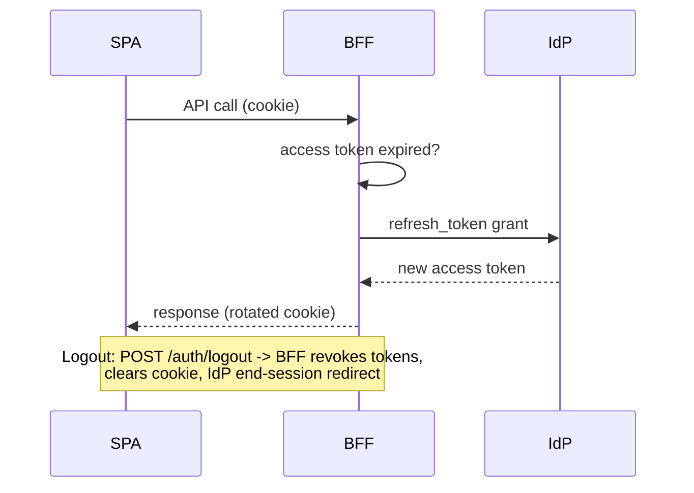

# ResumeForge — Security & Authentication

> Production security posture for a micro-frontend SPA + BFF: OIDC/PKCE via BFF, httpOnly cookie sessions, RBAC by plan, OWASP frontend mitigations, CSP, and MFE-specific supply-chain controls.

## Table of Contents
1. [Auth Model](#1-auth-model)
2. [Auth Flows](#2-auth-flows-sequence-diagrams)
3. [Token Storage](#3-token-storage)
4. [Authorization (RBAC by plan)](#4-authorization-rbac-by-plan)
5. [OWASP Top 10 — Frontend Lens](#5-owasp-top-10--frontend-lens)
6. [Content Security Policy](#6-content-security-policy)
7. [Secrets & Config](#7-secrets--config)
8. [Dependency & Supply-Chain](#8-dependency--supply-chain-mfe-specific)
9. [Abuse Protection](#9-abuse-protection)
10. [Checklist](#10-checklist)

---

## 1. Auth Model
**OIDC / OAuth2 Authorization Code + PKCE, brokered by the BFF (BFF-token-handler pattern).** The SPA holds **no tokens**; the BFF exchanges the code, stores tokens server-side, and issues an httpOnly, Secure, SameSite session cookie. Rationale: micro-frontends share one origin/session cleanly, tokens never touch JS (XSS-resistant), and remotes stay stateless auth-wise.

## 2. Auth Flows (sequence diagrams)

**Login (Auth Code + PKCE via BFF)**
```mermaid
sequenceDiagram
    actor U as User
    participant S as Shell SPA
    participant B as BFF
    participant I as OIDC Provider
    U->>S: Click "Sign in"
    S->>B: GET /auth/login
    B->>B: create PKCE verifier + state (server session)
    B-->>U: 302 to IdP authorize (code_challenge)
    U->>I: Authenticate + consent
    I-->>B: 302 /auth/callback?code&state
    B->>I: POST /token (code + verifier)
    I-->>B: access + refresh + id token
    B-->>S: Set-Cookie session (httpOnly, Secure, SameSite=Lax); redirect /dashboard
    S->>B: GET /me (cookie)
    B-->>S: { user, roles, plan }
```

**Silent refresh & logout**


MFA is delegated to the IdP (TOTP/WebAuthn); the SPA only reacts to IdP step-up prompts.

## 3. Token Storage
| Option | Verdict |
|--------|---------|
| httpOnly Secure cookie (session id / BFF-held tokens) | **Chosen** — not readable by JS, CSRF handled below |
| localStorage / memory access token | Rejected — XSS-exfiltratable |

CSRF mitigations for cookie auth: `SameSite=Lax`, plus a **double-submit CSRF token** header on state-changing requests, and origin/`Sec-Fetch-Site` checks at the BFF.

## 4. Authorization (RBAC by plan)
- Roles/plan come from `/me`; a `<RequirePlan tier="pro">` guard and route loaders gate UI.
- **Defense in depth:** every gated action is *also* enforced at the BFF/API — client gating is UX only.
- Feature flags derive from plan (templates, AI actions, export formats).
```tsx
function RequirePlan({ tier, children }: { tier: Plan; children: ReactNode }) {
  const { plan } = useSession();
  return atLeast(plan, tier) ? <>{children}</> : <UpgradePrompt required={tier} />;
}
```

## 5. OWASP Top 10 — Frontend Lens
| Risk | Mitigation |
|------|-----------|
| A01 Broken Access Control | Server-side authz on every endpoint; client guards non-authoritative; deny-by-default routes |
| A02 Cryptographic Failures | HTTPS/HSTS everywhere; tokens server-side; no sensitive data in localStorage |
| A03 Injection / **XSS** | React auto-escaping; **no `dangerouslySetInnerHTML`** on AI/user content; sanitize any rich text (DOMPurify); strict CSP |
| A04 Insecure Design | Threat-modeled AI patches (validated via Zod before apply) |
| A05 Security Misconfig | Locked CSP/headers, no source maps in prod public bucket |
| A06 Vulnerable Components | `pnpm audit`, Dependabot, pinned lockfile, SRI on remotes |
| A07 Auth Failures | OIDC/PKCE, IdP MFA, short access-token TTL + rotation |
| A08 Integrity Failures | **SRI + version-pinned `remoteEntry.js`**; signed remote manifest |
| A09 Logging Failures | Sentry + BFF audit logs with correlation ids (no PII/tokens logged) |
| A10 SSRF | BFF allow-lists LLM/IdP hosts; frontend never proxies arbitrary URLs |

## 6. Content Security Policy
Served by the BFF/edge (report-only first, then enforce):
```http
Content-Security-Policy:
  default-src 'self';
  script-src 'self' https://cdn.resumeforge.app;
  style-src 'self' 'unsafe-inline';
  img-src 'self' data: https://cdn.resumeforge.app;
  font-src 'self' https://cdn.resumeforge.app;
  connect-src 'self' https://api.resumeforge.app https://bff.resumeforge.app;
  frame-ancestors 'none';
  object-src 'none';
  base-uri 'self';
  form-action 'self';
  upgrade-insecure-requests;
  report-to csp-endpoint;
```
Because remotes load from `cdn.resumeforge.app`, that host is explicitly allow-listed in `script-src`/`connect-src` — no wildcard. Additional headers: `Strict-Transport-Security`, `X-Content-Type-Options: nosniff`, `Referrer-Policy: strict-origin-when-cross-origin`, `Permissions-Policy` (camera/mic off).

## 7. Secrets & Config
- No secrets in any bundle. LLM/IdP secrets live only in the BFF env.
- Public runtime config injected via `/config` (or `window.__RF_CONFIG__`) — non-sensitive only.
- `.env` is git-ignored; CI uses encrypted secrets; prod uses a secrets manager.

## 8. Dependency & Supply-Chain (MFE-specific)
- **Remote integrity:** `remoteEntry.js` is version-pinned/hashed; a signed manifest + SRI prevents a compromised CDN from injecting code.
- Shared singletons pinned to exact ranges to prevent hostile version substitution.
- `pnpm audit` + Dependabot in CI; lockfile committed; provenance/attestations checked.

## 9. Abuse Protection
- BFF rate-limits AI endpoints per user + IP (token-bucket); enforces plan quotas.
- Bot/DDoS protection + WAF at the edge; CAPTCHA on signup if abuse detected.
- Upload scanning (size/type/AV) before parsing; parse in a sandboxed worker.
- PII redaction before any LLM call; output moderation on responses.

## 10. Checklist
- [x] Auth model chosen (OIDC/PKCE via BFF) with rationale
- [x] ≥1 auth sequence diagram (+ refresh/logout)
- [x] Token storage tradeoff documented
- [x] RBAC + defense-in-depth
- [x] OWASP Top 10 mitigations table
- [x] Concrete CSP + security headers
- [x] MFE remote integrity (SRI/pinning)

## Next deliverable
→ [08-Testing-Strategy.md](08-Testing-Strategy.md)

