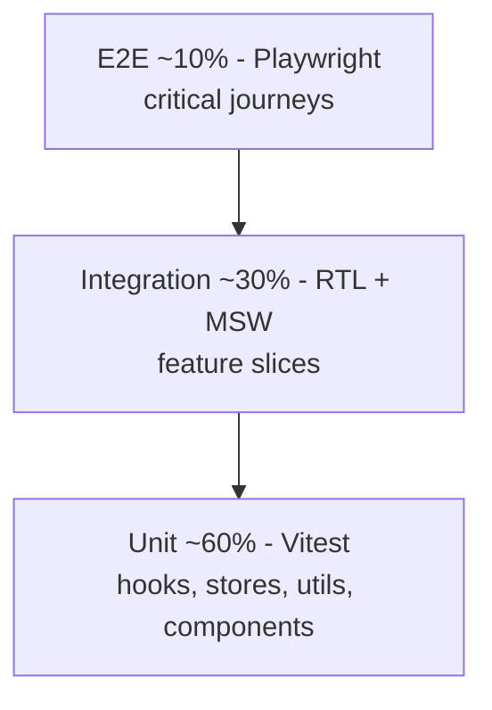

# ResumeForge — Testing Strategy

> A strategy that guarantees **≥ 90% coverage** with meaningful tests across a Module-Federation monorepo: pyramid, tooling (Vitest + Testing Library + Playwright + MSW), coverage gates, deterministic streaming tests, and CI wiring.

## Table of Contents
1. [Test Pyramid](#1-test-pyramid)
2. [Tooling](#2-tooling)
3. [What to Test Where](#3-what-to-test-where)
4. [Coverage Strategy & Config](#4-coverage-strategy--config-90)
5. [Test Data & Fixtures](#5-test-data--fixtures)
6. [Accessibility Tests](#6-accessibility-tests)
7. [Streaming / AI Tests](#7-streaming--ai-tests-deterministic)
8. [CI Gates](#8-ci-gates)
9. [Example Tests](#9-example-tests)
10. [Checklist](#10-checklist)

---

## 1. Test Pyramid

Micro-frontends add a thin layer: **contract tests** verify each remote's exposed module + shared-singleton versions match the shell's expectations.

## 2. Tooling
| Layer | Tool | Why |
|-------|------|-----|
| Unit/Integration | **Vitest** + Testing Library + user-event | Fast, ESM-native, jsdom |
| Network mocking | **MSW v2** (incl. SSE) | One mock layer for tests + dev BFF parity |
| E2E | **Playwright** | Cross-browser critical journeys |
| a11y | `vitest-axe`, `@axe-core/playwright` | Automated WCAG checks |
| Coverage | Vitest V8 coverage + Codecov | Threshold gate |
| Contract (MFE) | Custom `@module-federation` shared-version check | Prevent remote drift |

## 3. What to Test Where
| Kind | Targets |
|------|---------|
| Unit | Zustand editor store (applyPatch/undo/redo), `useSSE` parser, Zod schemas, ATS scoring util, formatters |
| Integration | SectionEditor (RHF+Zod) + preview, AssistantPanel + MSW SSE, import parse flow, plan-gating modal |
| E2E | Login → create → edit → AI suggest → accept → export; tailor-to-JD; free-limit upgrade |
| Contract | Each remote exposes declared modules; shared react/query/i18n singleton versions align |

## 4. Coverage Strategy & Config (≥90%)
Reach 90% by testing behavior, not trivia: cover branches in the store, SSE parser, schema validation, and gating logic (highest bug-risk). Exclude generated/config files.

```ts
// vitest.config.ts (shared preset)
import { defineConfig } from 'vitest/config';
export default defineConfig({
  test: {
    environment: 'jsdom',
    setupFiles: ['./test/setup.ts'], // MSW server + axe + fake timers
    coverage: {
      provider: 'v8',
      reporter: ['text', 'lcov'],
      thresholds: { lines: 90, branches: 90, functions: 90, statements: 90 },
      exclude: ['**/*.config.*', '**/rspack.*', '**/*.d.ts', '**/bootstrap.tsx', '**/mocks/**'],
    },
  },
});
```

## 5. Test Data & Fixtures
- **Factories** for `ResumeDoc`, `ExperienceItem`, `Suggestion` (e.g., via a tiny builder or fishery).
- **Deterministic dates:** `vi.setSystemTime(new Date('2026-01-01'))`.
- **MSW handlers** mirror the [BFF contract](03-Architecture.md#9-api--bff-contract-typed) so tests and dev use identical shapes.
- Seeded PRNG for any randomized template ordering.

## 6. Accessibility Tests
- Unit: `expect(await axe(container)).toHaveNoViolations()` on every organism.
- E2E: `@axe-core/playwright` scan on each key screen; assert focus trap in command palette and `aria-live` on the streaming region.

## 7. Streaming / AI Tests (deterministic)
Mock SSE with MSW returning a controlled `ReadableStream` that emits scripted events; use fake timers to flush the rAF buffer. Assert token order, Stop preserves partial text, and invalid `ResumePatch` is rejected before apply.

## 8. CI Gates
- `turbo run test` per remote (parallel) + merged coverage; **build fails < 90%**.
- Playwright shard across workers; retries=2; **flaky tests quarantined** (tagged `@flaky`, tracked, not silently skipped).
- Contract check + `pnpm audit` + axe gate must pass to merge.

## 9. Example Tests

**Component (SectionEditor + preview)**
```tsx
test('edits summary and reflects in live preview', async () => {
  render(<EditorWorkspace doc={resumeFactory()} />);
  await userEvent.type(screen.getByLabelText(/summary/i), 'Senior FE engineer');
  expect(screen.getByTestId('preview')).toHaveTextContent('Senior FE engineer');
});
```

**Hook (`useSSE`)**
```ts
test('streams tokens in order and stop preserves partial', async () => {
  server.use(sseHandler(['Hel', 'lo', ' world'])); // MSW scripted SSE
  const { result } = renderHook(() => useSSE('/ai/suggest'));
  act(() => result.current.start({ docId: '1', section: 'summary' }));
  await waitFor(() => expect(result.current.text).toBe('Hello'));
  act(() => result.current.stop());
  expect(result.current.status).toBe('done');
  expect(result.current.text).toBe('Hello'); // partial retained
});
```

**E2E (Playwright)**
```ts
test('user tailors resume to a job description and exports', async ({ page }) => {
  await login(page);
  await page.goto('/editor/demo');
  await page.getByRole('button', { name: 'Assistant' }).click();
  await page.getByLabel('Job description').fill('React, TypeScript, micro-frontends');
  await page.getByRole('button', { name: 'Tailor' }).click();
  await expect(page.getByTestId('stream')).toContainText(/React/);
  await page.getByRole('button', { name: 'Accept' }).click();
  await page.getByRole('button', { name: 'Export PDF' }).click();
  await expect(page.getByText('Export ready')).toBeVisible();
});
```

## 10. Checklist
- [x] Pyramid defined (60/30/10 + contract layer)
- [x] Coverage thresholds ≥ 90% in config
- [x] Example component + hook + E2E tests
- [x] Deterministic streaming/AI tests
- [x] a11y (axe) in unit + E2E
- [x] CI gate fails under threshold + flaky policy

## Next deliverable
→ [09-Performance.md](09-Performance.md)

