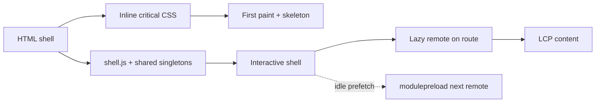

# ResumeForge — Performance Plan

> Core Web Vitals budget and levers for a Module-Federation SPA where multiple remotes load at runtime. Targets at p75.

## Table of Contents
1. [Targets](#1-targets)
2. [Byte Budget per Route](#2-byte-budget-per-route)
3. [Levers](#3-levers)
4. [Module-Federation-specific Perf](#4-module-federation-specific-perf)
5. [Rendering & Streaming](#5-rendering--streaming)
6. [Runtime Performance](#6-runtime-performance)
7. [Measurement](#7-measurement)
8. [CI Gate](#8-ci-gate)
9. [Critical Rendering Path](#9-critical-rendering-path)
10. [Checklist](#10-checklist)

---

## 1. Targets
| Metric | Target (p75) |
|--------|--------------|
| LCP | ≤ 2.5s |
| INP | ≤ 200ms |
| CLS | ≤ 0.1 |
| TTFB | ≤ 0.8s |
| Total JS (shell first load) | ≤ 170KB gz |

## 2. Byte Budget per Route
| Route | JS (gz) | CSS (gz) | Images | Notes |
|-------|--------:|---------:|-------:|-------|
| `/` landing | ≤ 120KB | ≤ 20KB | hero ≤ 100KB | shell only, remotes prefetched |
| `/dashboard` | ≤ 160KB | ≤ 24KB | thumbs lazy | + editor list chunk |
| `/editor/:id` | ≤ 220KB | ≤ 28KB | — | editor remote lazy; PDF lib async |
| `/templates` | ≤ 180KB | ≤ 24KB | virtualized | gallery windowed |

## 3. Levers
- **Route-level lazy remotes** via `React.lazy` + `Suspense` — a remote's JS loads only when its route is hit.
- `<link rel="modulepreload">` for the likely-next remote (editor from dashboard).
- **Code-split heavy libs:** `@react-pdf/renderer`, `pdfjs-dist`, `recharts` dynamically imported on demand.
- Critical CSS inlined for shell; tokens via CSS vars (no runtime CSS-in-JS cost).
- **Font strategy:** `font-display: swap`, preload Inter subset, self-host to avoid third-party RTT.
- **Image strategy:** AVIF/WebP, responsive `srcset`, explicit width/height to protect CLS, lazy-load below fold.
- Compression: Brotli on all text assets; long-cache hashed assets.

## 4. Module-Federation-specific Perf
- **Shared singletons** (react, react-dom, router, query, i18n) loaded once — prevents duplicate framework downloads across remotes.
- Remote `remoteEntry.js` is tiny; actual chunks stream on demand.
- Prefetch remote entries during idle (`requestIdleCallback`).
- Guard against duplicate Tailwind/CSS across remotes via a shared preset + build dedupe.

## 5. Rendering & Streaming
- No SSR (SPA), so LCP is protected by a fast static shell + skeletons and prefetch.
- AI content **streams** into an already-painted layout — it never blocks LCP; reserved space prevents CLS.

## 6. Runtime Performance
- **Virtualization** (TanStack Virtual) for template gallery + long resume lists.
- Memoize preview render; debounce editor→preview updates (~120ms).
- Batch streaming tokens on `requestAnimationFrame` to avoid long tasks / layout thrash.
- Keep INP low: offload resume parsing (pdfjs/mammoth) to a **Web Worker**.

## 7. Measurement
- `web-vitals` → analytics endpoint (RUM, p75 dashboards, per-route).
- Sentry performance traces for slow interactions.
- Lighthouse CI on PRs (mobile profile).

## 8. CI Gate
```yaml
# .github/workflows/perf.yml (excerpt)
- run: pnpm build
- run: npx size-limit          # per-route JS budgets
- run: npx lhci autorun        # LCP/INP/CLS assertions, fail on regression
```
```js
// size-limit config
module.exports = [
  { name: 'shell', path: 'apps/shell/dist/**/*.js', limit: '170 KB' },
  { name: 'editor remote', path: 'apps/editor/dist/**/*.js', limit: '90 KB' },
];
```

## 9. Critical Rendering Path


## 10. Checklist
- [x] CWV targets (LCP/INP/CLS) set at p75
- [x] Per-route byte budgets
- [x] Levers incl. MF shared singletons + lazy remotes
- [x] Critical-rendering-path diagram
- [x] CI gate (size-limit + Lighthouse CI)

## Next deliverable
→ [10-Internationalization.md](10-Internationalization.md)

