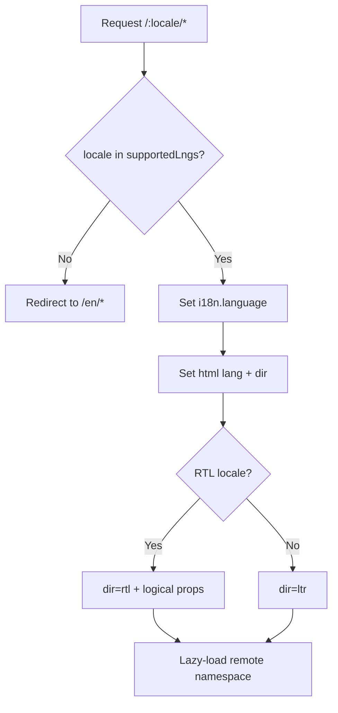

# ResumeForge — Internationalization (i18n)

> Multi-language strategy for a micro-frontend app: i18next setup with per-remote namespaces, ICU messages, locale routing, RTL, `Intl` formatting, and translation workflow.

## Table of Contents
1. [Library & Setup](#1-library--setup)
2. [Message Strategy & Namespaces](#2-message-strategy--namespaces-per-remote)
3. [ICU Plurals & Gender](#3-icu-plurals--gender)
4. [Locale Routing](#4-locale-routing)
5. [RTL Support](#5-rtl-support)
6. [Intl Formatting](#6-intl-formatting)
7. [Translation Workflow](#7-translation-workflow)
8. [Testing i18n](#8-testing-i18n)
9. [Locale Resolution Diagram](#9-locale-resolution-diagram)
10. [Checklist](#10-checklist)

---

## 1. Library & Setup
**i18next + react-i18next + i18next-icu**, initialized in the **shell** as a shared singleton so all remotes reuse one instance. Initial locales: `en, es, fr, de, ar` (ar = RTL).
```ts
import i18n from 'i18next';
import { initReactI18next } from 'react-i18next';
import ICU from 'i18next-icu';
import LanguageDetector from 'i18next-browser-languagedetector';

i18n.use(ICU).use(LanguageDetector).use(initReactI18next).init({
  fallbackLng: 'en',
  supportedLngs: ['en','es','fr','de','ar'],
  ns: ['common'], defaultNS: 'common',
  interpolation: { escapeValue: false },
  detection: { order: ['path','cookie','navigator'] },
});
```

## 2. Message Strategy & Namespaces (per remote)
- One namespace per remote: `common`, `editor`, `assistant`, `templates`, `account`.
- Each remote lazy-loads its namespace on mount (`i18n.loadNamespaces('editor')`) so translations code-split with the remote.
- Keys are semantic + nested: `editor.section.summary.label`.

## 3. ICU Plurals & Gender
```json
{
  "ats.keywordsMissing": "{count, plural, =0 {All keywords matched} one {# keyword missing} other {# keywords missing}}",
  "suggest.applied": "{n, plural, one {# change applied} other {# changes applied}}"
}
```

## 4. Locale Routing
- **Path-prefix** strategy: `/en/editor/:id`, `/ar/editor/:id`. React Router root uses a `:locale` param; a guard validates against `supportedLngs` and sets `i18n.language` + `<html lang dir>`.
- Locale persisted in a cookie; `<link rel="alternate" hreflang>` emitted for SEO on public pages.

## 5. RTL Support
- Set `document.documentElement.dir = isRTL(locale) ? 'rtl' : 'ltr'`.
- Use **CSS logical properties** (`margin-inline-start`, `padding-inline`, `inset-inline`) everywhere — no hard-coded left/right.
- Tailwind logical utilities + `[dir=rtl]` overrides for icons/chevrons. The KB/resume preview has a verified Arabic RTL layout.

## 6. Intl Formatting
Use native `Intl` (no ad-hoc formatting):
```ts
const date = new Intl.DateTimeFormat(locale, { dateStyle: 'medium' }).format(d);
const price = new Intl.NumberFormat(locale, { style: 'currency', currency }).format(amount);
const rel = new Intl.RelativeTimeFormat(locale, { numeric: 'auto' }).format(-2, 'day');
```

## 7. Translation Workflow
- Extraction via `i18next-parser` on CI → JSON catalogs per namespace/locale.
- Sync to a TMS (e.g., Lokalise/Crowdin); `en` is the source of truth.
- Missing keys fall back to `en` and are flagged; PR fails if source keys are untranslated for release locales.

## 8. Testing i18n
- **Pseudo-localization** locale (`en-XA`) to catch truncation/hardcoded strings.
- Missing-key detector in CI (fail on absent keys for shipped locales).
- Snapshot RTL layout of the editor preview; unit-test `Intl` formatters per locale.

## 9. Locale Resolution Diagram


## 10. Checklist
- [x] i18next + ICU singleton in shell
- [x] Per-remote namespaces (code-split)
- [x] ICU plurals/gender examples
- [x] Path-prefix locale routing
- [x] RTL via logical properties + Arabic
- [x] `Intl` date/number/currency
- [x] Extraction/TMS workflow + pseudo-loc testing

## Next deliverable
→ [11-Coding-Standards.md](11-Coding-Standards.md)

