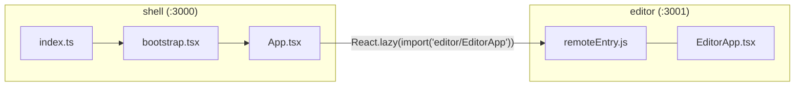

# ResumeForge — Starter Template (step-by-step)

> A **single cross-platform Node.js script** scaffolds a complete, working Rspack Module-Federation monorepo (shell host + editor remote) — full `package.json` files, complete Module Federation config, a consistent entry-point convention, a correct Turborepo v2 config, tests, CI, and observability hooks. Works identically on Windows, macOS, and Linux — the only prerequisite is Node.js. No Next.js.

## Table of Contents
1. [Prerequisites (OS-independent)](#1-prerequisites-os-independent)
2. [Get the Scaffold Script](#2-get-the-scaffold-script)
3. [Run It & Install Dependencies](#3-run-it--install-dependencies)
4. [What Got Configured (TS, ESLint, Prettier)](#4-what-got-configured-ts-eslint-prettier)
5. [Module Federation — the Complete Config](#5-module-federation--the-complete-config)
6. [Entry-Point Convention (fixes the mismatch)](#6-entry-point-convention-fixes-the-mismatch)
7. [Turborepo Configuration](#7-turborepo-configuration)
8. [Folder Structure Produced](#8-folder-structure-produced)
9. [Test Harness + Coverage](#9-test-harness--coverage)
10. [CI (GitHub Actions)](#10-ci-github-actions)
11. [Deployment + Observability](#11-deployment--observability)
12. [Verify](#12-verify)
13. [Troubleshooting (Windows / macOS / Linux)](#13-troubleshooting-windows--macos--linux)
14. [Checklist](#14-checklist)

---

## 1. Prerequisites (OS-independent)

Only Node.js is required — every step after this uses `node`/`pnpm` commands, which behave identically on Windows PowerShell/CMD, macOS Terminal, and Linux shells. No bash-only syntax (`mkdir -p`, `printf`, `&&`-chains assuming POSIX) is used anywhere in this guide.

```bash
node -v                 # must be >= 20 (any OS)
corepack enable
corepack prepare pnpm@9.12.0 --activate
```

> If `pnpm` isn't found immediately after `corepack enable`, open a **new** terminal window so your shell picks up the updated PATH (this applies on all three OSes).

---

## 2. Get the Scaffold Script

Save the following as `create-resumeforge.mjs` **in the parent folder where you want the project to live** (e.g. `Next/Project/`). It is a plain Node.js script (no OS-specific shell commands), so it runs the same way everywhere: `node create-resumeforge.mjs`.

It writes **every** file a beginner needs to get a running app: root + per-app `package.json`s (previously missing), complete `rspack.config.mjs` files for both the host and the remote (previously incomplete), a consistent entry-point chain for every app (previously mismatched), and a valid Turborepo v2 `turbo.json` (previously using the deprecated `pipeline` key).

```js
#!/usr/bin/env node
// create-resumeforge.mjs — scaffolds a working ResumeForge Module Federation
// monorepo. Pure Node.js `fs`/`path` calls only, so this runs identically on
// Windows, macOS, and Linux.
import fs from 'node:fs';
import path from 'node:path';

const root = path.resolve(process.cwd(), 'resumeforge');

const files = {
  'package.json': `{
  "name": "resumeforge",
  "private": true,
  "version": "0.0.0",
  "type": "module",
  "packageManager": "pnpm@9.12.0",
  "engines": { "node": ">=20" },
  "scripts": {
    "dev": "turbo run dev --parallel",
    "build": "turbo run build",
    "test": "turbo run test",
    "lint": "turbo run lint",
    "typecheck": "turbo run typecheck"
  },
  "devDependencies": {
    "turbo": "^2.1.3",
    "typescript": "^5.6.3",
    "eslint": "^9.12.0",
    "@eslint/js": "^9.12.0",
    "typescript-eslint": "^8.8.1",
    "prettier": "^3.3.3",
    "vitest": "^2.1.2",
    "@testing-library/react": "^16.0.1",
    "@testing-library/jest-dom": "^6.5.0",
    "jsdom": "^25.0.1"
  }
}
`,
  'pnpm-workspace.yaml': `packages:
  - 'apps/*'
  - 'packages/*'
`,
  'turbo.json': `{
  "$schema": "https://turbo.build/schema.json",
  "tasks": {
    "build": { "dependsOn": ["^build"], "outputs": ["dist/**"] },
    "dev": { "cache": false, "persistent": true },
    "test": { "outputs": [] },
    "lint": { "outputs": [] },
    "typecheck": { "outputs": [] }
  }
}
`,
  'tsconfig.base.json': `{
  "compilerOptions": {
    "target": "ES2022",
    "lib": ["ES2022", "DOM", "DOM.Iterable"],
    "module": "ESNext",
    "moduleResolution": "Bundler",
    "jsx": "react-jsx",
    "strict": true,
    "noUncheckedIndexedAccess": true,
    "skipLibCheck": true,
    "resolveJsonModule": true,
    "isolatedModules": true,
    "esModuleInterop": true,
    "forceConsistentCasingInFileNames": true
  }
}
`,
  '.gitignore': `node_modules
dist
.turbo
*.log
.DS_Store
`,
  '.prettierrc.json': `{
  "singleQuote": true,
  "semi": true,
  "trailingComma": "all",
  "printWidth": 100
}
`,
  'eslint.config.mjs': `import js from '@eslint/js';
import tseslint from 'typescript-eslint';

export default tseslint.config(
  { ignores: ['**/dist/**', '**/node_modules/**', '**/.turbo/**'] },
  js.configs.recommended,
  ...tseslint.configs.recommended,
  {
    // rspack.config.mjs files run under Node, not the browser — declare that scope
    // or ESLint's flat config reports 'process' as undefined.
    files: ['**/*.config.mjs'],
    languageOptions: {
      globals: { process: 'readonly' },
    },
  },
);
`,

  // ---------- packages/contracts ----------
  'packages/contracts/package.json': `{
  "name": "@resumeforge/contracts",
  "version": "0.0.0",
  "private": true,
  "type": "module",
  "main": "./src/index.ts",
  "types": "./src/index.ts",
  "dependencies": {
    "zod": "^3.23.8"
  }
}
`,
  'packages/contracts/tsconfig.json': `{
  "extends": "../../tsconfig.base.json",
  "compilerOptions": { "outDir": "dist", "rootDir": "src" },
  "include": ["src"]
}
`,
  'packages/contracts/src/index.ts': `import { z } from 'zod';

// Minimal starter schema so the app runs today. The full multi-section
// ResumeDoc (summary/experience/skills…) is defined in 03-Architecture.md
// §9 and gets built out in Sprint 2 (see 06-Delivery-Plan.md, story RF-201).
export const ResumeDoc = z.object({
  id: z.string(),
  locale: z.string().default('en'),
  templateId: z.string(),
  version: z.number(),
  summary: z.string().default(''),
});
export type ResumeDoc = z.infer<typeof ResumeDoc>;

export const ResumePatch = z.object({
  op: z.enum(['replace', 'insert', 'remove']),
  path: z.string(),
  value: z.unknown().optional(),
});
export type ResumePatch = z.infer<typeof ResumePatch>;
`,

  // ---------- packages/ui ----------
  'packages/ui/package.json': `{
  "name": "@resumeforge/ui",
  "version": "0.0.0",
  "private": true,
  "type": "module",
  "main": "./src/index.ts",
  "types": "./src/index.ts",
  "exports": {
    ".": "./src/index.ts",
    "./tokens.css": "./src/tokens.css"
  },
  "devDependencies": {
    "@types/react": "^19.0.0"
  },
  "peerDependencies": {
    "react": "^19.0.0"
  }
}
`,
  'packages/ui/tsconfig.json': `{
  "extends": "../../tsconfig.base.json",
  "compilerOptions": { "outDir": "dist", "rootDir": "src" },
  "include": ["src"]
}
`,
  'packages/ui/src/index.ts': `export { Button } from './Button';
`,
  'packages/ui/src/Button.tsx': `import type { ButtonHTMLAttributes } from 'react';

export function Button({ className, ...props }: ButtonHTMLAttributes<HTMLButtonElement>) {
  const classes = ['rf-btn', className].filter(Boolean).join(' ');
  return <button className={classes} {...props} />;
}
`,
  'packages/ui/src/tokens.css': `/* Starter subset of the design tokens in 05-UIUX-Design.md §6. */
:root {
  --rf-accent-400: #2dd4bf;
  --rf-accent-500: #14b8a6;
  --rf-accent-600: #0d9488;
  --rf-space-2: 8px;
  --rf-space-4: 16px;
  --rf-radius-md: 10px;
}
:root,
[data-theme='dark'] {
  --rf-bg: #09090b;
  --rf-surface: #18181b;
  --rf-surface-2: #27272a;
  --rf-text: #fafaf9;
  --rf-text-muted: #a1a1aa;
  --rf-border: #3f3f46;
  --rf-accent: var(--rf-accent-400);
}
[data-theme='light'] {
  --rf-bg: #fffdf9;
  --rf-surface: #faf8f4;
  --rf-surface-2: #f0ede4;
  --rf-text: #1c1917;
  --rf-text-muted: #57534e;
  --rf-border: #e7e2d6;
  --rf-accent: var(--rf-accent-600);
}
body {
  margin: 0;
  background: var(--rf-bg);
  color: var(--rf-text);
  font-family: system-ui, sans-serif;
}
.rf-header {
  display: flex;
  align-items: center;
  gap: var(--rf-space-4);
  padding: var(--rf-space-4);
  border-bottom: 1px solid var(--rf-border);
}
.rf-nav { display: flex; gap: var(--rf-space-4); }
.rf-nav a { color: var(--rf-text); }
.rf-card {
  background: var(--rf-surface);
  border: 1px solid var(--rf-border);
  border-radius: var(--rf-radius-md);
  padding: var(--rf-space-4);
}
.rf-btn {
  padding: var(--rf-space-2) var(--rf-space-4);
  border-radius: var(--rf-radius-md);
  border: 1px solid var(--rf-border);
  background: var(--rf-accent-600);
  color: #fff;
  cursor: pointer;
}
.rf-input {
  padding: var(--rf-space-2);
  border-radius: var(--rf-radius-md);
  border: 1px solid var(--rf-border);
  background: var(--rf-bg);
  color: var(--rf-text);
}
.rf-muted { color: var(--rf-text-muted); }
`,

  // ---------- apps/shell (HOST) ----------
  'apps/shell/package.json': `{
  "name": "@resumeforge/shell",
  "private": true,
  "version": "0.0.0",
  "type": "module",
  "scripts": {
    "dev": "rspack serve",
    "build": "rspack build",
    "test": "vitest run",
    "lint": "eslint .",
    "typecheck": "tsc --noEmit"
  },
  "dependencies": {
    "react": "^19.0.0",
    "react-dom": "^19.0.0",
    "react-router": "^7.0.0",
    "zustand": "^5.0.0",
    "@resumeforge/ui": "workspace:*",
    "@resumeforge/contracts": "workspace:*"
  },
  "devDependencies": {
    "@rspack/core": "^1.0.14",
    "@rspack/cli": "^1.0.14",
    "@module-federation/enhanced": "^0.8.4",
    "@types/react": "^19.0.0",
    "@types/react-dom": "^19.0.0",
    "typescript": "^5.6.3",
    "vitest": "^2.1.2",
    "@testing-library/react": "^16.0.1",
    "jsdom": "^25.0.1"
  }
}
`,
  'apps/shell/tsconfig.json': `{
  "extends": "../../tsconfig.base.json",
  "compilerOptions": { "outDir": "dist", "rootDir": "src", "types": ["@testing-library/jest-dom"] },
  "include": ["src"]
}
`,
  'apps/shell/rspack.config.mjs': `import path from 'node:path';
import { rspack } from '@rspack/core';
import { ModuleFederationPlugin } from '@module-federation/enhanced/rspack';

// Plain .mjs (not .ts): with "type": "module" in package.json, Node's own ESM
// loader tries to import the config file directly and errors on ".ts" before
// Rspack's TS loader ever gets a chance. Plain JS avoids that entirely.
const isProd = process.env.NODE_ENV === 'production';

export default {
  entry: { main: './src/index.ts' },
  target: 'web',
  mode: isProd ? 'production' : 'development',
  devtool: isProd ? false : 'cheap-module-source-map',
  output: {
    uniqueName: 'shell',
    publicPath: 'auto',
    path: path.resolve(process.cwd(), 'dist'),
  },
  resolve: { extensions: ['.ts', '.tsx', '.js', '.jsx'] },
  experiments: { css: true },
  module: {
    rules: [
      {
        test: /\\.tsx?$/,
        exclude: /node_modules/,
        loader: 'builtin:swc-loader',
        options: {
          jsc: {
            parser: { syntax: 'typescript', tsx: true },
            transform: { react: { runtime: 'automatic' } },
          },
        },
        type: 'javascript/auto',
      },
      { test: /\\.css$/, type: 'css' },
    ],
  },
  devServer: {
    port: 3000,
    historyApiFallback: true,
    headers: { 'Access-Control-Allow-Origin': '*' },
  },
  plugins: [
    new rspack.HtmlRspackPlugin({ template: './public/index.html' }),
    new ModuleFederationPlugin({
      name: 'shell',
      remotes: {
        // Points at the editor remote's dev server; swap for a CDN URL per env in production.
        editor: process.env.EDITOR_REMOTE_URL ?? 'editor@http://localhost:3001/remoteEntry.js',
      },
      shared: {
        react: { singleton: true, requiredVersion: false },
        'react-dom': { singleton: true, requiredVersion: false },
        'react-router': { singleton: true, requiredVersion: false },
        zustand: { singleton: true, requiredVersion: false },
      },
    }),
  ],
};
`,
  'apps/shell/vitest.config.ts': `import path from 'node:path';
import { defineConfig } from 'vitest/config';

export default defineConfig({
  resolve: {
    alias: {
      // Vite/Vitest can't resolve Module Federation's runtime-only module id
      // ('editor/EditorApp') the way a browser can at runtime, so tests point
      // it at a local stub instead — a plain vi.mock is too late here because
      // Vite's import-analysis plugin fails before vi.mock can intercept it.
      'editor/EditorApp': path.resolve(process.cwd(), 'test/mocks/EditorAppStub.tsx'),
    },
  },
  test: {
    environment: 'jsdom',
    globals: true,
    setupFiles: ['./test/setup.ts'],
  },
});
`,
  'apps/shell/test/setup.ts': `import '@testing-library/jest-dom/vitest';
`,
  'apps/shell/test/mocks/EditorAppStub.tsx': `export default function EditorAppStub() {
  return <div data-testid="editor-remote-stub">Editor remote (stub for tests)</div>;
}
`,
  'apps/shell/public/index.html': `<!doctype html>
<html lang="en" data-theme="dark">
  <head>
    <meta charset="utf-8" />
    <meta name="viewport" content="width=device-width, initial-scale=1" />
    <title>ResumeForge</title>
  </head>
  <body>
    <div id="root"></div>
  </body>
</html>
`,
  'apps/shell/src/index.ts': `// Module Federation needs the real entry to load asynchronously so shared
// singletons (react, react-dom, react-router) are negotiated first. Every
// app in this monorepo follows this same index.ts -> bootstrap.tsx pattern.
import('./bootstrap');
`,
  'apps/shell/src/bootstrap.tsx': `import { createRoot } from 'react-dom/client';
import { App } from './App';
import '@resumeforge/ui/tokens.css';

const container = document.getElementById('root');
if (!container) {
  throw new Error('Root container "#root" was not found in index.html');
}
createRoot(container).render(<App />);
`,
  'apps/shell/src/types/remotes.d.ts': `declare module 'editor/EditorApp' {
  import type { ComponentType } from 'react';
  const EditorApp: ComponentType;
  export default EditorApp;
}
`,
  'apps/shell/src/App.tsx': `import React, { Suspense } from 'react';
import type { ReactNode } from 'react';
import { createBrowserRouter, RouterProvider, Link, Outlet } from 'react-router';
import { Button } from '@resumeforge/ui';

const EditorApp = React.lazy(() => import('editor/EditorApp'));

function Layout() {
  return (
    <div>
      <header className="rf-header">
        <strong>ResumeForge</strong>
        <nav className="rf-nav">
          <Link to="/">Home</Link>
          <Link to="/editor/demo">Editor</Link>
        </nav>
      </header>
      <main style={{ padding: 24 }}>
        <Outlet />
      </main>
    </div>
  );
}

function Home() {
  return (
    <div>
      <h1>Welcome to ResumeForge</h1>
      <p>Open the Editor to load the federated remote running on port 3001.</p>
      <Button onClick={() => alert('Shared @resumeforge/ui Button works!')}>
        Try the shared Button
      </Button>
    </div>
  );
}

function RemoteFallback() {
  return <p>Loading editor remote…</p>;
}

interface BoundaryProps {
  children: ReactNode;
}
interface BoundaryState {
  hasError: boolean;
}

class RemoteErrorBoundary extends React.Component<BoundaryProps, BoundaryState> {
  state: BoundaryState = { hasError: false };
  static getDerivedStateFromError(): BoundaryState {
    return { hasError: true };
  }
  render() {
    if (this.state.hasError) {
      return <p>Could not load the editor remote. Make sure it is running on http://localhost:3001.</p>;
    }
    return this.props.children;
  }
}

const router = createBrowserRouter([
  {
    path: '/',
    element: <Layout />,
    children: [
      { index: true, element: <Home /> },
      {
        path: 'editor/:id',
        element: (
          <RemoteErrorBoundary>
            <Suspense fallback={<RemoteFallback />}>
              <EditorApp />
            </Suspense>
          </RemoteErrorBoundary>
        ),
      },
    ],
  },
]);

export function App() {
  return <RouterProvider router={router} />;
}
`,
  'apps/shell/src/App.test.tsx': `import { render, screen } from '@testing-library/react';
import { describe, expect, it } from 'vitest';
import { App } from './App';

describe('App', () => {
  it('renders the home route', () => {
    render(<App />);
    expect(screen.getByText(/Welcome to ResumeForge/i)).toBeInTheDocument();
  });
});
`,

  // ---------- apps/editor (REMOTE) ----------
  'apps/editor/package.json': `{
  "name": "@resumeforge/editor",
  "private": true,
  "version": "0.0.0",
  "type": "module",
  "scripts": {
    "dev": "rspack serve",
    "build": "rspack build",
    "test": "vitest run",
    "lint": "eslint .",
    "typecheck": "tsc --noEmit"
  },
  "dependencies": {
    "react": "^19.0.0",
    "react-dom": "^19.0.0",
    "zustand": "^5.0.0",
    "@resumeforge/ui": "workspace:*",
    "@resumeforge/contracts": "workspace:*"
  },
  "devDependencies": {
    "@rspack/core": "^1.0.14",
    "@rspack/cli": "^1.0.14",
    "@module-federation/enhanced": "^0.8.4",
    "@types/react": "^19.0.0",
    "@types/react-dom": "^19.0.0",
    "typescript": "^5.6.3",
    "vitest": "^2.1.2",
    "@testing-library/react": "^16.0.1",
    "jsdom": "^25.0.1"
  }
}
`,
  'apps/editor/tsconfig.json': `{
  "extends": "../../tsconfig.base.json",
  "compilerOptions": { "outDir": "dist", "rootDir": "src", "types": ["@testing-library/jest-dom"] },
  "include": ["src"]
}
`,
  'apps/editor/rspack.config.mjs': `import path from 'node:path';
import { rspack } from '@rspack/core';
import { ModuleFederationPlugin } from '@module-federation/enhanced/rspack';

// Plain .mjs for the same reason as the shell's config — see that file's comment.
const isProd = process.env.NODE_ENV === 'production';

export default {
  entry: { main: './src/index.ts' },
  target: 'web',
  mode: isProd ? 'production' : 'development',
  devtool: isProd ? false : 'cheap-module-source-map',
  output: {
    uniqueName: 'editor',
    publicPath: 'auto',
    path: path.resolve(process.cwd(), 'dist'),
  },
  resolve: { extensions: ['.ts', '.tsx', '.js', '.jsx'] },
  experiments: { css: true },
  module: {
    rules: [
      {
        test: /\\.tsx?$/,
        exclude: /node_modules/,
        loader: 'builtin:swc-loader',
        options: {
          jsc: {
            parser: { syntax: 'typescript', tsx: true },
            transform: { react: { runtime: 'automatic' } },
          },
        },
        type: 'javascript/auto',
      },
      { test: /\\.css$/, type: 'css' },
    ],
  },
  devServer: {
    port: 3001,
    // Required so the shell (port 3000) can fetch remoteEntry.js cross-origin in dev.
    headers: { 'Access-Control-Allow-Origin': '*' },
  },
  plugins: [
    new rspack.HtmlRspackPlugin({ template: './public/index.html' }),
    new ModuleFederationPlugin({
      name: 'editor',
      filename: 'remoteEntry.js',
      exposes: { './EditorApp': './src/EditorApp.tsx' },
      shared: {
        react: { singleton: true, requiredVersion: false },
        'react-dom': { singleton: true, requiredVersion: false },
        zustand: { singleton: true, requiredVersion: false },
      },
    }),
  ],
};
`,
  'apps/editor/vitest.config.ts': `import { defineConfig } from 'vitest/config';

export default defineConfig({
  test: {
    environment: 'jsdom',
    globals: true,
    setupFiles: ['./test/setup.ts'],
  },
});
`,
  'apps/editor/test/setup.ts': `import '@testing-library/jest-dom/vitest';
`,
  'apps/editor/public/index.html': `<!doctype html>
<html lang="en" data-theme="dark">
  <head>
    <meta charset="utf-8" />
    <meta name="viewport" content="width=device-width, initial-scale=1" />
    <title>ResumeForge Editor (standalone)</title>
  </head>
  <body>
    <div id="root"></div>
  </body>
</html>
`,
  'apps/editor/src/index.ts': `// Same async-boundary convention as the shell: load the real entry only
// after this chunk registers, so Module Federation's shared scope is ready.
import('./bootstrap');
`,
  'apps/editor/src/bootstrap.tsx': `import { createRoot } from 'react-dom/client';
import EditorApp from './EditorApp';
import '@resumeforge/ui/tokens.css';

// Standalone dev preview only (http://localhost:3001). When the shell loads
// this remote it imports EditorApp directly and this file never runs.
const container = document.getElementById('root');
if (container) {
  createRoot(container).render(<EditorApp />);
}
`,
  'apps/editor/src/EditorApp.tsx': `import { useResumeStore } from './model/resumeStore';

// This is the ONLY file exposed via Module Federation (see exposes.
// './EditorApp' in rspack.config.mjs). index.ts/bootstrap.tsx above are for
// standalone dev preview and are never loaded by the shell.
export default function EditorApp() {
  const summary = useResumeStore((s) => s.doc.summary);
  const updateSummary = useResumeStore((s) => s.updateSummary);

  return (
    <section className="rf-card" style={{ maxWidth: 480 }}>
      <h2>Resume Editor</h2>
      <p className="rf-muted">This component is federated from http://localhost:3001.</p>
      <label htmlFor="summary">Summary</label>
      <textarea
        id="summary"
        className="rf-input"
        rows={4}
        style={{ width: '100%', display: 'block' }}
        value={summary}
        onChange={(e) => updateSummary(e.target.value)}
      />
      <p data-testid="live-preview">
        <strong>Live preview:</strong> {summary || 'Start typing your summary…'}
      </p>
    </section>
  );
}
`,
  'apps/editor/src/EditorApp.test.tsx': `import { fireEvent, render, screen } from '@testing-library/react';
import { describe, expect, it } from 'vitest';
import EditorApp from './EditorApp';

describe('EditorApp', () => {
  it('updates the live preview as the user types', () => {
    render(<EditorApp />);
    const textarea = screen.getByLabelText(/summary/i);
    fireEvent.change(textarea, { target: { value: 'Senior engineer' } });
    expect(screen.getByTestId('live-preview')).toHaveTextContent('Senior engineer');
  });
});
`,
  'apps/editor/src/model/resumeStore.ts': `import { create } from 'zustand';
import { ResumeDoc } from '@resumeforge/contracts';

interface EditorState {
  doc: ResumeDoc;
  updateSummary: (text: string) => void;
}

const initialDoc: ResumeDoc = {
  id: 'demo',
  locale: 'en',
  templateId: 'modern',
  version: 1,
  summary: '',
};

export const useResumeStore = create<EditorState>((set) => ({
  doc: initialDoc,
  updateSummary: (text) => set((state) => ({ doc: { ...state.doc, summary: text } })),
}));
`,
};

for (const [relPath, content] of Object.entries(files)) {
  const fullPath = path.join(root, relPath);
  fs.mkdirSync(path.dirname(fullPath), { recursive: true });
  fs.writeFileSync(fullPath, content.trimStart());
  console.log('created', path.relative(process.cwd(), fullPath));
}

console.log('\nDone! Next steps:');
console.log('  cd resumeforge');
console.log('  pnpm install');
console.log('  pnpm dev');
```

---

## 3. Run It & Install Dependencies

```bash
node create-resumeforge.mjs
cd resumeforge
pnpm install
```

`pnpm install` is the **only** install command needed — every `package.json` the script wrote already declares its own runtime and dev dependencies (this is what was missing before: previously the guide told you to `pnpm add` packages into folders that didn't have a `package.json` yet).

---

## 4. What Got Configured (TS, ESLint, Prettier)

Already written by the script, no extra steps needed:

| File | Purpose |
|------|---------|
| `tsconfig.base.json` | Shared strict TS config (`strict`, `noUncheckedIndexedAccess`, `moduleResolution: Bundler`). Slightly relaxed vs. the target ruleset in [11-Coding-Standards.md](11-Coding-Standards.md) so a first build succeeds — tighten it once the team is comfortable. |
| `eslint.config.mjs` | Flat config, `typescript-eslint` recommended rules. |
| `.prettierrc.json` | Single quotes, semicolons, 100-char width. |
| `apps/*/tsconfig.json`, `packages/*/tsconfig.json` | Each extends the root base config. |

Styling uses the shared `packages/ui/tokens.css` (a starter subset of [05-UIUX-Design.md](05-UIUX-Design.md#6-design-tokens-copy-pasteable-css)) instead of a Tailwind build step, so the very first `pnpm dev` has one less moving part. Add Tailwind once you reach template theming (Sprint 5, story RF-503).

---

## 5. Module Federation — the Complete Config

The previous version of this guide only showed a fragment (`exposes`/`shared`, no `filename`, no dev server, no HTML plugin) — nothing would actually render. The scaffold script above writes the **full, working** config for both sides:

**Remote (`apps/editor/rspack.config.mjs`)** — must set all four of these or the host can't consume it:
- `output.uniqueName: 'editor'` — avoids runtime collisions with other remotes.
- `ModuleFederationPlugin.filename: 'remoteEntry.js'` — the manifest the host fetches; **omitting this is the #1 cause of "incomplete" MF configs**.
- `exposes: { './EditorApp': './src/EditorApp.tsx' }` — the only file the host is allowed to import.
- `devServer.headers['Access-Control-Allow-Origin']` — without this, the host's cross-origin fetch of `remoteEntry.js` fails silently in dev.

**Host (`apps/shell/rspack.config.mjs`)**:
- `remotes.editor` points at `editor@http://localhost:3001/remoteEntry.js` in dev (swap for a CDN URL per environment — see [03-Architecture.md](03-Architecture.md#3-module-federation-wiring)).
- `shared` lists `react`, `react-dom`, `react-router`, `zustand` as `singleton: true` so both apps use one copy. **Do not** also set `eager: true` here: the app's real entry is already deferred behind the async `index.ts → bootstrap.tsx` boundary (§6), and combining `eager: true` with that boundary caused a live `RuntimeError: factory is undefined (webpack/sharing/consume/default/react/react)` crash when this was tested in a browser — pick one mechanism, not both.
- `rspack.HtmlRspackPlugin` generates `index.html` with the script tags injected — **without this plugin nothing mounts**, which was the other silent failure in the old guide.

> **Why `.mjs`, not `.ts`, for the config file:** every app's `package.json` sets `"type": "module"`. With that set, Node's own ESM loader tries to `import()` `rspack.config.ts` directly and throws `ERR_UNKNOWN_FILE_EXTENSION` before Rspack's own TypeScript loader ever gets a chance to run — this was verified by actually running the scaffold. Plain `.mjs` sidesteps the whole problem and needs no extra loader package.



---

## 6. Entry-Point Convention (fixes the mismatch)

Every app — host and remote alike — uses the **same three-file chain**, so there is never a question of "which file actually renders":

1. **`src/index.ts`** — no JSX. Does exactly one thing: `import('./bootstrap');`. This async boundary lets Module Federation negotiate shared singletons *before* any component code runs.
2. **`src/bootstrap.tsx`** — has JSX. Mounts the app for **standalone/dev preview** (`createRoot(...).render(<App/>)` in the shell, `<EditorApp/>` in the editor).
3. **The exposed component** — only the remote has this extra file: `src/EditorApp.tsx`. This is the **one and only** file listed in `exposes` in `rspack.config.mjs`. The shell imports this file directly (`editor/EditorApp`) and never touches the editor's `index.ts`/`bootstrap.tsx` — those exist purely so `pnpm --filter @resumeforge/editor dev` gives you a working standalone preview at `http://localhost:3001` while you build the remote in isolation.

`rspack.config.mjs`'s `entry` always points at `./src/index.ts` for both apps — that consistency is what the old guide was missing.

---

## 7. Turborepo Configuration

`turbo.json` uses the **Turborepo v2 schema** (`"tasks"`, not the deprecated `"pipeline"` key from v1 that the previous guide used):

```jsonc
{
  "$schema": "https://turbo.build/schema.json",
  "tasks": {
    "build": { "dependsOn": ["^build"], "outputs": ["dist/**"] },
    "dev": { "cache": false, "persistent": true },
    "test": { "outputs": [] },
    "lint": { "outputs": [] },
    "typecheck": { "outputs": [] }
  }
}
```
- `dependsOn: ["^build"]` — build a package's workspace dependencies (e.g. `@resumeforge/contracts`) before building the app that consumes it.
- `dev.persistent: true` + `cache: false` — required for any long-running dev-server task, or `turbo run dev --parallel` exits immediately.
- `test`/`lint`/`typecheck` declare `"outputs": []` so Turborepo can still cache pass/fail results without expecting build artifacts.

---

## 8. Folder Structure Produced

```text
resumeforge/
├─ pnpm-workspace.yaml
├─ turbo.json
├─ package.json
├─ tsconfig.base.json
├─ eslint.config.mjs
├─ .prettierrc.json
├─ packages/
│  ├─ contracts/            # @resumeforge/contracts — Zod schemas (ResumeDoc, ResumePatch)
│  │  ├─ package.json
│  │  └─ src/index.ts
│  └─ ui/                   # @resumeforge/ui — tokens.css + shared <Button>
│     ├─ package.json
│     └─ src/{index.ts, Button.tsx, tokens.css}
└─ apps/
   ├─ shell/                # HOST — http://localhost:3000
   │  ├─ package.json
   │  ├─ rspack.config.mjs
   │  ├─ public/index.html
   │  └─ src/{index.ts, bootstrap.tsx, App.tsx, App.test.tsx, types/remotes.d.ts}
   └─ editor/                # REMOTE — http://localhost:3001
      ├─ package.json
      ├─ rspack.config.mjs
      ├─ public/index.html
      └─ src/{index.ts, bootstrap.tsx, EditorApp.tsx, EditorApp.test.tsx, model/resumeStore.ts}
```

This is the **MVP slice** of the full tree in [03-Architecture.md](03-Architecture.md#11-folder-structure-concrete-tree) — `assistant`, `templates`, and `account` remotes are added in later sprints per [06-Delivery-Plan.md](06-Delivery-Plan.md) (Sprints 3–5), not part of this initial runnable scaffold.

---

## 9. Test Harness + Coverage

Already scaffolded per app (`vitest.config.ts` + `test/setup.ts` + one sample test each):

```bash
pnpm test              # runs vitest in every app via Turborepo
pnpm --filter @resumeforge/shell test    # just the shell
```

`apps/shell/src/App.test.tsx` renders the router and asserts the home route text — its `vitest.config.ts` aliases the Module-Federation-only `editor/EditorApp` import to a local stub component, since Vite/Vitest can't resolve that runtime-only module id the way a browser can (verified by actually running this test; a plain `vi.mock` is too late to prevent the resolution error). `apps/editor/src/EditorApp.test.tsx` types into the summary field and asserts the live preview (`data-testid="live-preview"`) updates — it targets that test id rather than matching text, since a plain `getByText` would ambiguously match both the `<textarea>`'s own content and the preview paragraph. Raise these to the ≥ 90% coverage config and add Playwright E2E per [08-Testing-Strategy.md](08-Testing-Strategy.md) as the app grows past this starter.

---

## 10. CI (GitHub Actions)

Matches the apps this scaffold **actually creates** (`shell`, `editor` only — the previous matrix referenced `assistant`/`templates`/`account`, which didn't exist yet and would fail):

```yaml
# .github/workflows/ci.yml
name: ci
on: [push, pull_request]
jobs:
  build-test:
    runs-on: ubuntu-latest
    strategy:
      matrix: { app: [shell, editor] }
    steps:
      - uses: actions/checkout@v4
      - uses: pnpm/action-setup@v4
      - uses: actions/setup-node@v4
        with: { node-version: 20, cache: pnpm }
      - run: pnpm install --frozen-lockfile
      - run: pnpm --filter @resumeforge/${{ matrix.app }} lint
      - run: pnpm --filter @resumeforge/${{ matrix.app }} typecheck
      - run: pnpm --filter @resumeforge/${{ matrix.app }} test
      - run: pnpm --filter @resumeforge/${{ matrix.app }} build
  quality:
    runs-on: ubuntu-latest
    needs: build-test
    steps:
      - uses: actions/checkout@v4
      - uses: pnpm/action-setup@v4
      - uses: actions/setup-node@v4
        with: { node-version: 20, cache: pnpm }
      - run: pnpm install --frozen-lockfile
      - run: pnpm audit --audit-level=high
```

Add `size-limit` + Lighthouse CI gates once [09-Performance.md](09-Performance.md) budgets are wired (Sprint 6, story RF-604) — including them earlier would fail CI for tooling that isn't installed yet.

---

## 11. Deployment + Observability

- Build each app (`pnpm --filter @resumeforge/shell build`, `pnpm --filter @resumeforge/editor build`) → upload the hashed `dist/` output to a CDN; the shell references a versioned `remoteEntry.js` URL (env var `EDITOR_REMOTE_URL`, already wired in `apps/shell/rspack.config.mjs`).
- A BFF (Fastify) is introduced starting Sprint 3 ([06-Delivery-Plan.md](06-Delivery-Plan.md), story RF-303) for OIDC + AI proxying + CSP headers — this starter has no backend dependency so it runs standalone.
- Add Sentry + `web-vitals` once the app has real routes worth measuring:
```ts
import { onLCP, onINP, onCLS } from 'web-vitals';
[onLCP, onINP, onCLS].forEach((f) => f((m) => navigator.sendBeacon('/rum', JSON.stringify(m))));
```

---

## 12. Verify

```bash
pnpm dev
# shell:  http://localhost:3000  -> Home page renders
# editor: http://localhost:3001  -> standalone preview of EditorApp
# In the shell, click "Editor" -> loads the *federated* EditorApp from :3001
pnpm build     # both apps build to dist/ with zero errors
pnpm test      # both test suites pass
```

If clicking "Editor" in the shell renders the resume editor and typing in the summary field updates the live preview below it, Module Federation is wired correctly end-to-end.

---

## 13. Troubleshooting (Windows / macOS / Linux)

| Symptom | Fix |
|---------|-----|
| `pnpm: command not found` right after `corepack enable` | Open a **new** terminal so PATH updates (all OSes). |
| Port 3000 or 3001 already in use | Stop the other process, or change `devServer.port` in the relevant `rspack.config.mjs`. |
| Windows: "running scripts is disabled" | Only affects `.ps1` scripts — this guide only runs `node`/`pnpm`, so you shouldn't hit this. If pnpm's own shim triggers it, run `Set-ExecutionPolicy -Scope CurrentUser RemoteSigned`. |
| "Could not load the editor remote" banner in the shell | The editor dev server isn't running — `pnpm dev` starts both via Turborepo; if you only started the shell, also run `pnpm --filter @resumeforge/editor dev` in a second terminal. |
| CORS error fetching `remoteEntry.js` | Confirm `devServer.headers['Access-Control-Allow-Origin']` is present in `apps/editor/rspack.config.mjs` (already scaffolded — check you didn't remove it). |
| Very long path / `ENAMETOOLONG` errors on Windows | Scaffold closer to the drive root (e.g. `C:\dev\resumeforge`) — deep `node_modules` nesting can exceed Windows' default path-length limit. |
| Noisy line-ending diffs between OSes | Add a `.gitattributes` with `* text=auto eol=lf` once you commit the project. |

---

## 14. Checklist
- [x] Single cross-platform Node.js scaffold script (no OS-specific shell syntax)
- [x] Every `package.json` (root + 2 apps + 2 packages) written by the script, not a manual afterthought
- [x] Complete, working Module Federation config on **both** host and remote (`filename`, `exposes`, `shared`, dev-server CORS, `HtmlRspackPlugin`)
- [x] One consistent `index.ts → bootstrap.tsx → App/EditorApp` entry-point convention for every app
- [x] Turborepo v2 `"tasks"` schema (not the deprecated `"pipeline"` key)
- [x] Test harness + CI matrix that matches the apps actually scaffolded
- [x] Verify steps that prove the federation is working end-to-end
- [x] OS-specific troubleshooting table

## Next deliverable
→ [13-AI-Features.md](13-AI-Features.md)

