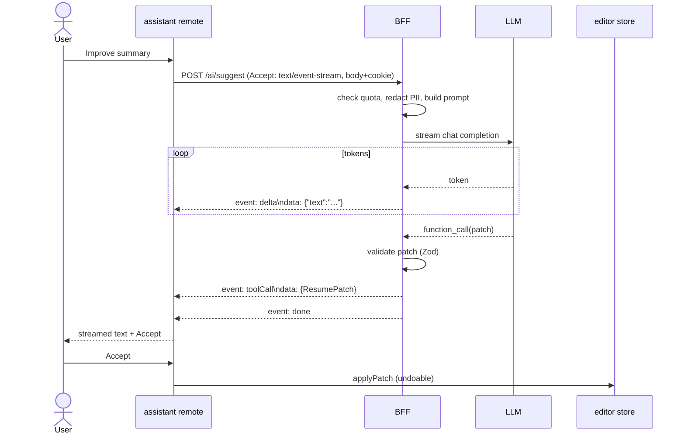

# ResumeForge — AI Features (Streaming + Generative UI)

> The AI assistant surface: SSE streaming contract, client `fetch` streaming with cancellation, token-by-token UI, typed generative-UI tool-calls (Zod), and guardrails.

## Table of Contents
1. [AI Surfaces](#1-ai-surfaces)
2. [Streaming Sequence](#2-streaming-sequence)
3. [SSE Endpoint Contract](#3-sse-endpoint-contract)
4. [Client Streaming Code](#4-client-streaming-code-fetch--readablestream)
5. [Token-by-Token UI + Cancellation](#5-token-by-token-ui--cancellation)
6. [Generative UI (typed tool-calls)](#6-generative-ui-typed-tool-calls)
7. [Guardrails](#7-guardrails)
8. [Error & Retry](#8-error--retry)
9. [Checklist](#9-checklist)

---

## 1. AI Surfaces
| Surface | Action | Output |
|---------|--------|--------|
| Improve section | Rewrite a summary/bullet | streamed text + `ResumePatch` tool-call |
| Tailor to JD | Match resume to pasted job description | streamed patches + keyword report |
| ATS analysis | Score + gaps | progressive `atsScore` + report |
| Cover letter | Generate from resume + JD | streamed document |

All run through the **BFF** (holds LLM key, redacts PII, enforces quotas) — never the browser directly.

## 2. Streaming Sequence


## 3. SSE Endpoint Contract
`POST /ai/suggest` → `Content-Type: text/event-stream`. Named events:
```
event: delta
data: {"text":"Senior "}

event: toolCall
data: {"op":"replace","path":"/sections/0/text","value":"Senior FE engineer…"}

event: atsScore
data: {"score":82,"missing":["GraphQL"]}

event: error
data: {"message":"rate_limited","retryAfter":30}

event: done
data: {}
```
Request body: `{ docId, section, context, jobDescription? }`. Auth via httpOnly cookie + CSRF header.

## 4. Client Streaming Code (`fetch` + ReadableStream)
`EventSource` can't send POST bodies/cookies or abort cleanly, so we stream over `fetch`:
```ts
export async function streamSuggest(
  body: SuggestRequest,
  onEvent: (e: SSEEvent) => void,
  signal: AbortSignal,
) {
  const res = await fetch('/ai/suggest', {
    method: 'POST',
    headers: { 'Content-Type': 'application/json', 'X-CSRF-Token': getCsrf() },
    body: JSON.stringify(body),
    signal,
  });
  if (!res.ok || !res.body) throw new Error('stream_failed');

  const reader = res.body.pipeThrough(new TextDecoderStream()).getReader();
  let buffer = '';
  for (;;) {
    const { value, done } = await reader.read();
    if (done) break;
    buffer += value;
    const frames = buffer.split('\n\n');
    buffer = frames.pop() ?? '';
    for (const frame of frames) {
      const type = /event: (.*)/.exec(frame)?.[1] ?? 'delta';
      const data = /data: (.*)/.exec(frame)?.[1];
      if (data) onEvent(parseSSE(type, JSON.parse(data))); // validates via Zod
    }
  }
}
```

## 5. Token-by-Token UI + Cancellation
```tsx
function AssistantPanel({ docId, section, onAccept }: AssistantPanelProps) {
  const { text, patch, status, start, stop } = useSSE('/ai/suggest');
  return (
    <section aria-label="AI assistant">
      <button onClick={() => start({ docId, section })} disabled={status === 'streaming'}>
        Improve with AI
      </button>
      {status === 'streaming' && <button onClick={stop}>Stop</button>}
      <div aria-live="polite" data-testid="stream">
        {text}{status === 'streaming' && <span className="rf-caret" aria-hidden />}
      </div>
      {status === 'done' && patch && (
        <button onClick={() => onAccept(patch)}>Accept</button>
      )}
    </section>
  );
}
```
`stop()` calls `AbortController.abort()`; accumulated `text` is preserved so the user can still Accept the partial result. Tokens are flushed on `requestAnimationFrame` to avoid jank. Respects `prefers-reduced-motion` (no caret blink, instant reveal).

## 6. Generative UI (typed tool-calls)
The LLM returns structured actions validated before they touch the document — the UI is *generated* from typed data, not free HTML:
```ts
export const ResumePatch = z.object({
  op: z.enum(['replace', 'insert', 'remove']),
  path: z.string(),            // JSON pointer into ResumeDoc
  value: z.unknown().optional(),
});
export const AssistantResult = z.object({
  message: z.string(),
  patches: z.array(ResumePatch),
  ats: z.object({ score: z.number(), missing: z.array(z.string()) }).optional(),
});

function apply(raw: unknown) {
  const result = AssistantResult.parse(raw);          // reject malformed AI output
  result.patches.forEach((p) => useResumeStore.getState().applyPatch(p)); // undoable
}
```

## 7. Guardrails
| Guardrail | Implementation |
|-----------|----------------|
| Rate limiting | BFF token-bucket per user+IP; plan quotas; `429` → upgrade modal |
| PII redaction | Strip emails/phones/addresses before sending to LLM; re-insert client-side |
| Output moderation | BFF moderation pass; block unsafe content, show fallback |
| Schema validation | All tool-calls parsed with Zod; invalid → discard, log, no apply |
| Undo | Every applied patch is undoable via editor history |
| Cost control | Small model for cheap actions; cache identical requests; cap max tokens |
| Prompt-injection defense | Treat resume/JD text as **data, not instructions**; system prompt isolates roles; never execute embedded instructions from user content |

## 8. Error & Retry
- `error` event → toast + keep partial text; offer Retry (idempotent, new request id).
- Network drop mid-stream → auto-resume disabled (avoid duplicate patches); user retries manually.
- `429` with `retryAfter` → disable button + countdown.

## 9. Checklist
- [x] AI surfaces defined
- [x] Streaming sequence diagram
- [x] SSE contract (named events)
- [x] Client `fetch`+ReadableStream code with abort
- [x] Token UI + Stop preserves partial + a11y
- [x] Generative UI via Zod-validated tool-calls
- [x] Guardrails incl. prompt-injection + PII + moderation

## Back to index
→ [00-INDEX.md](00-INDEX.md)

