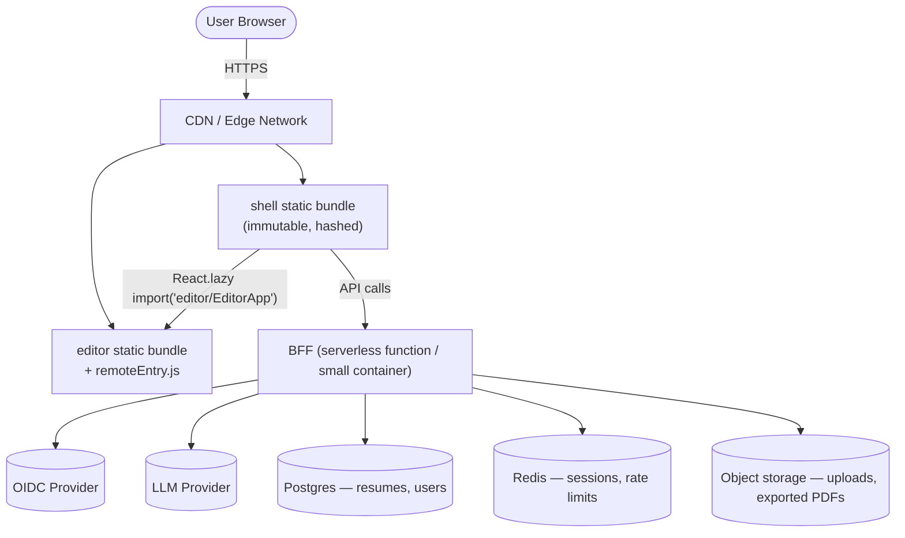
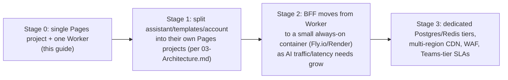

# ResumeForge — Production Deployment Guide

> Industry-standard, cost-optimized steps to take the `frontend-webapp` Module-Federation micro-frontend app from local dev to a live, secure, independently-deployable production system.

## Table of Contents
1. [Goals & Principles](#1-goals--principles)
2. [Target Production Architecture](#2-target-production-architecture)
3. [Hosting Options Compared (Cost-Optimized)](#3-hosting-options-compared-cost-optimized)
4. [Recommended Path: Cloudflare (Lowest Cost)](#4-recommended-path-cloudflare-lowest-cost)
5. [Step-by-Step Deployment](#5-step-by-step-deployment)
6. [CI/CD Pipeline (Independent Per-Remote Deploys)](#6-cicd-pipeline-independent-per-remote-deploys)
7. [Module Federation in Production](#7-module-federation-in-production)
8. [BFF, Secrets & Sessions](#8-bff-secrets--sessions)
9. [Security Hardening](#9-security-hardening)
10. [Observability](#10-observability)
11. [Cost Estimate](#11-cost-estimate)
12. [Rollback Strategy](#12-rollback-strategy)
13. [Scaling Path](#13-scaling-path)
14. [Checklist](#14-checklist)

---

## 1. Goals & Principles

- **Independent deploys** — the `editor` remote ships without rebuilding/redeploying the `shell`, and vice versa (the whole reason this project uses Module Federation).
- **Static-first, serverless-second** — every app (`shell`, `editor`, future remotes) builds to static files; the only server-side component is the BFF (auth + AI proxy). Static hosting is the cheapest, fastest, and most reliable tier available.
- **Pay-for-what-you-use** — no always-on VM/container for the frontend; only the BFF needs compute, and it should scale to zero when idle.
- **No secrets in the browser** — OIDC client secrets, LLM API keys, and session data live only in the BFF, never in a static bundle (see [07-Security-Auth.md](07-Security-Auth.md)).
- **Safe rollback** — every deploy is versioned and instantly revertible without a rebuild.

---

## 2. Target Production Architecture



- **CDN layer**: serves `shell` and `editor` (and future `assistant`/`templates`/`account` remotes) as static, immutable, hashed assets — no server compute per request.
- **BFF layer**: the only dynamic compute; stateless, horizontally scalable, holds all secrets.
- **Data layer**: managed Postgres + Redis + object storage — all pay-as-you-go managed services, no servers to patch.

---

## 3. Hosting Options Compared (Cost-Optimized)

| Option | Frontend (static) | BFF (compute) | Free tier | Best for |
|---|---|---|---|---|
| **Cloudflare Pages + Workers** | Pages (unlimited static requests, free) | Workers (100k req/day free, then $5/mo for 10M) | Generous | **Recommended** — cheapest at small/medium scale, global edge by default |
| **Vercel** | Static hosting free tier | Serverless Functions | Free hobby tier, paid for teams | Fastest DX; costs rise quickly at scale/team plans |
| **Netlify** | Static hosting free tier | Netlify Functions (AWS Lambda under the hood) | Free tier generous | Similar to Vercel; good CI integration |
| **AWS S3 + CloudFront + Lambda** | S3 (near-free storage) + CloudFront (pay per GB) | Lambda (pay per invocation) | AWS free tier (12 mo) | Best if already on AWS / need fine-grained IAM |
| **Azure Static Web Apps** | Free tier (100GB bandwidth/mo) | Managed Functions (Azure Functions) | Free tier | Best if already on Azure / enterprise SSO needs |
| **Self-hosted VM/container (Fly.io, Railway, Render)** | Not recommended for static assets (no CDN benefit) | Good for BFF only | Free/low tiers exist | Only for the BFF, not the static remotes |

**Verdict for ResumeForge:** use a CDN/edge platform (**Cloudflare Pages** is the reference choice below) for `shell`/`editor`/future remotes, and a **serverless function** (Cloudflare Workers, or AWS Lambda/Vercel Functions) for the BFF. This avoids paying for idle server time — the single biggest cost lever for a frontend-heavy app with bursty traffic.

---

## 4. Recommended Path: Cloudflare (Lowest Cost)

- **Cloudflare Pages** — one Pages project **per remote** (`resumeforge-shell`, `resumeforge-editor`, …), each with its own build command and deploy history. Free tier: unlimited requests/bandwidth, 500 builds/month.
- **Cloudflare Workers** — hosts the BFF (Fastify doesn't run natively on Workers; use a Workers-compatible framework like **Hono** for the BFF, or run Fastify on a tiny always-warm container on **Fly.io** for ~$2–5/mo if you need full Node.js APIs). Either choice keeps the BFF stateless and cheap.
- **Cloudflare R2** — object storage for uploaded resumes / exported PDFs (S3-compatible, **zero egress fees** — a major cost win vs. S3).
- **Managed Postgres** — Neon or Supabase free/low tiers (serverless Postgres, scales to zero, pay only for compute-seconds used).
- **Managed Redis** — Upstash (serverless Redis, pay-per-request, free tier covers session/rate-limit needs at this scale).

This combination has **$0 fixed monthly cost** at low traffic and scales smoothly (pay-per-use) as usage grows — no server to provision, patch, or pay for while idle.

---

## 5. Step-by-Step Deployment

### 5.1 One-time setup
1. Create a Cloudflare account (or your chosen provider) and connect it to your Git repo (GitHub).
2. For each remote (`shell`, `editor`, …), create a separate Pages project pointing at the same repo, with:
   - **Root directory**: `Next/Project/ResumeForge/frontend-webapp/apps/<app-name>`
   - **Build command**: `pnpm install --frozen-lockfile && pnpm --filter @resumeforge/<app-name> build`
   - **Build output directory**: `dist`
   - **Environment variable**: `NODE_ENV=production`
3. Set each Pages project's **production branch** to `main` and enable **preview deployments** for pull requests (free, automatic).
4. Reserve a custom domain (e.g. `resumeforge.app`) and subdomains: `app.resumeforge.app` (shell), `editor.resumeforge.app` (editor remote), `api.resumeforge.app` (BFF).

### 5.2 Wire the shell to the deployed remote
In `apps/shell/rspack.config.mjs`, the `remotes.editor` URL already reads from an environment variable:
```js
editor: process.env.EDITOR_REMOTE_URL ?? 'editor@http://localhost:3001/remoteEntry.js',
```
Set `EDITOR_REMOTE_URL=editor@https://editor.resumeforge.app/remoteEntry.js` as a **build-time environment variable** on the shell's Pages project. Rebuild the shell whenever you want it to point at a new editor version (see §7 for a manifest-based alternative that avoids rebuilding the shell at all).

### 5.3 Deploy the BFF
1. Push the BFF code (see [07-Security-Auth.md](07-Security-Auth.md) for its responsibilities) to its own deploy target (Cloudflare Workers via `wrangler deploy`, or a small Fly.io app).
2. Set BFF secrets via the platform's secret manager (never in `.env` files committed to git): OIDC client secret, LLM API key, DB/Redis connection strings, session-cookie signing key.
3. Point `api.resumeforge.app` at the BFF via a DNS CNAME/Worker route.

### 5.4 First deploy
```bash
git push origin main
```
Each Pages project auto-builds and deploys independently on push (or via the CI pipeline in §6). Verify:
- `https://app.resumeforge.app` loads the shell.
- Clicking "Editor" loads the federated remote from `https://editor.resumeforge.app/remoteEntry.js` with no CORS/console errors.
- `https://api.resumeforge.app/me` responds (BFF is reachable).

---

## 6. CI/CD Pipeline (Independent Per-Remote Deploys)

Extend the CI matrix from [12-Starter-Template.md](12-Starter-Template.md) with a deploy job **per app**, gated on its own tests passing — this is what makes deploys independent, not just the runtime architecture:

```yaml
# .github/workflows/deploy.yml
name: deploy
on:
  push:
    branches: [main]
jobs:
  deploy-shell:
    if: contains(github.event.head_commit.modified, 'apps/shell/') || contains(github.event.head_commit.modified, 'packages/')
    runs-on: ubuntu-latest
    steps:
      - uses: actions/checkout@v4
      - uses: pnpm/action-setup@v4
      - uses: actions/setup-node@v4
        with: { node-version: 20, cache: pnpm }
      - run: pnpm install --frozen-lockfile
      - run: pnpm --filter @resumeforge/shell test typecheck lint build
      - uses: cloudflare/pages-action@v1
        with:
          apiToken: ${{ secrets.CF_API_TOKEN }}
          accountId: ${{ secrets.CF_ACCOUNT_ID }}
          projectName: resumeforge-shell
          directory: apps/shell/dist
  deploy-editor:
    if: contains(github.event.head_commit.modified, 'apps/editor/') || contains(github.event.head_commit.modified, 'packages/')
    runs-on: ubuntu-latest
    steps:
      - uses: actions/checkout@v4
      - uses: pnpm/action-setup@v4
      - uses: actions/setup-node@v4
        with: { node-version: 20, cache: pnpm }
      - run: pnpm install --frozen-lockfile
      - run: pnpm --filter @resumeforge/editor test typecheck lint build
      - uses: cloudflare/pages-action@v1
        with:
          apiToken: ${{ secrets.CF_API_TOKEN }}
          accountId: ${{ secrets.CF_ACCOUNT_ID }}
          projectName: resumeforge-editor
          directory: apps/editor/dist
```

- Each job only runs (and deploys) when files relevant to it changed — a PDF-export fix in `editor` ships without touching `shell` at all.
- Pull requests get automatic preview URLs from Cloudflare Pages, so reviewers can click through changes before merge — no extra cost.

---

## 7. Module Federation in Production

- **Hashed, immutable filenames** for all chunks except `remoteEntry.js` itself (rspack does this by default in production mode) — enables aggressive CDN caching (`Cache-Control: public, max-age=31536000, immutable`) for everything except the entry manifest.
- **`remoteEntry.js` itself must NOT be cached long** (`Cache-Control: no-cache` or a short max-age) — it's the pointer that lets the shell discover the editor's *current* hashed chunks. This is what allows the editor to deploy a new version without the shell needing a rebuild.
- **Manifest-based remotes (recommended over hardcoding a URL):** use `@module-federation/enhanced`'s **dynamic remotes** to load the remote's URL from a small JSON manifest fetched at runtime, instead of baking `EDITOR_REMOTE_URL` into the shell's build. This means promoting a new editor version is a config change, not a shell rebuild+redeploy.
- **Canary/rollback:** keep the last 2–3 versions of the editor's build available at versioned paths (e.g. `/v2026-09-24/remoteEntry.js`); the manifest points at the "current" version, and rollback is just repointing the manifest — instant, no rebuild.
- **Subresource Integrity (SRI):** since remotes are fetched cross-origin, consider pinning a hash for `remoteEntry.js` at the CDN/edge level, or at minimum enforce HTTPS + a strict CSP `script-src` allow-list (see §9) so only your own domains can serve federated code.

---

## 8. BFF, Secrets & Sessions

- **Never** put OIDC client secrets, LLM API keys, or DB credentials in any static bundle or `NEXT_PUBLIC_`/`VITE_`-style client env var — they belong only in the BFF's server-side secret store.
- Use the hosting platform's built-in secrets manager (Cloudflare Workers secrets / Fly.io secrets / AWS Secrets Manager) — not a `.env` file committed to git.
- Session cookies: httpOnly, `Secure`, `SameSite=Lax`, signed with a rotated secret stored the same way.
- Rate-limit AI endpoints at the BFF (per user + IP) using the Redis instance — this is also your main cost-control lever against runaway LLM spend.

---

## 9. Security Hardening

Carried forward and made concrete for production from [07-Security-Auth.md](07-Security-Auth.md):

| Control | Production setting |
|---|---|
| HTTPS | Enforced everywhere (CDN + BFF); HTTP requests redirect to HTTPS |
| HSTS | `Strict-Transport-Security: max-age=63072000; includeSubDomains; preload` |
| CSP | `script-src 'self' https://editor.resumeforge.app https://*.resumeforge.app;` — explicit allow-list of your own remote domains only, no wildcards |
| Cookies | httpOnly, Secure, SameSite=Lax, rotated signing secret |
| Dependency audit | `pnpm audit --audit-level=high` in CI, blocking merge |
| Secrets scanning | Enable GitHub secret scanning / push protection on the repo |

---

## 10. Observability

- **Errors**: Sentry free tier (5k events/month) wired into both `shell` and `editor` bundles, and the BFF.
- **Core Web Vitals (RUM)**: the `web-vitals` wiring from [12-Starter-Template.md](12-Starter-Template.md#11-deployment--observability) sends `onLCP/onINP/onCLS` to a cheap endpoint (a Worker writing to Cloudflare Analytics Engine, or a free-tier logging service) — no need for a paid APM at this stage.
- **Uptime**: a free uptime monitor (e.g. UptimeRobot free tier) pinging `app.resumeforge.app` and `api.resumeforge.app/health`.
- **Lighthouse CI**: run in the CI pipeline (per [09-Performance.md](09-Performance.md)) so performance regressions are caught before merge, not after users complain.

---

## 11. Cost Estimate

Rough monthly cost at **low-to-medium traffic** (a few thousand users/month), using the Cloudflare-centric stack in §4:

| Item | Cost |
|---|---|
| Cloudflare Pages (shell + editor + future remotes) | $0 (free tier covers unlimited static requests) |
| Cloudflare Workers (BFF) | $0–$5/mo (free tier: 100k req/day) |
| Neon/Supabase Postgres | $0 (free tier) → ~$19/mo once past free-tier compute |
| Upstash Redis | $0 (free tier covers session/rate-limit volume at this scale) |
| Cloudflare R2 (uploads/exports) | ~$0.015/GB stored, **$0 egress** |
| Domain registration | ~$10–15/year |
| Sentry | $0 (free tier) |
| **Total** | **~$0–10/month** until meaningful scale, then low double digits |

Compare to a always-on VM/container approach (e.g. a $20+/mo VM running 24/7 for a mostly-idle frontend) — the serverless/static-first approach only starts costing meaningfully once you have real, sustained traffic, which is exactly when you can afford it.

---

## 12. Rollback Strategy

- **Static remotes**: Cloudflare Pages (and Vercel/Netlify) keep every previous deployment; rollback is a one-click "promote to production" on a prior deployment — no rebuild, seconds to take effect.
- **Federated remote versions**: per §7, keep the manifest pointing at a versioned path; rollback = repoint the manifest to the previous version's URL.
- **BFF**: deploy behind the platform's built-in versioning (Workers deployments, or blue/green on Fly.io/Render); keep the previous version warm for instant rollback.
- **Database migrations**: always write migrations as backward-compatible (additive) where possible, so a frontend rollback never requires a matching DB rollback.

---

## 13. Scaling Path



Start at Stage 0 (this guide). Only move to the next stage when the previous one's free/low tier is genuinely being exceeded — don't over-provision ahead of real traffic.

---

## 14. Checklist
- [ ] Each remote (`shell`, `editor`, …) deploys to its own static hosting project, independently
- [ ] BFF deployed separately, holds all secrets, never exposed to the client bundle
- [ ] `remoteEntry.js` served with short/no cache; hashed chunks served with long immutable cache
- [ ] CI deploys only the app(s) whose files changed (independent deploys, not a monolithic pipeline)
- [ ] HTTPS + HSTS + CSP allow-listing only your own domains
- [ ] Secrets stored in the platform's secret manager, never committed to git
- [ ] Sentry + web-vitals + uptime monitoring wired up
- [ ] Rollback path tested at least once before first real launch
- [ ] Monthly cost tracked against the estimate in §11; move to the next scaling stage only when needed

## Related deliverables
← [00-INDEX.md](00-INDEX.md) · [03-Architecture.md](03-Architecture.md#10-deployment--observability) · [07-Security-Auth.md](07-Security-Auth.md) · [09-Performance.md](09-Performance.md) · [12-Starter-Template.md](12-Starter-Template.md)
